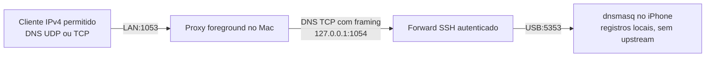

# DNS local — plano da issue #7

## Contexto

#6 concluiu SSH/HTTP pela LAN, mas os forwards OpenSSH transportam TCP; DNS também precisa de UDP. O telefone continua sem saída geral para internet. O próximo serviço atenderá nomes locais; não mudará automaticamente o DNS do Mac, Windows, Android ou roteador. O primeiro piloto físico passou por USB e LAN com sockets diretos do Windows. Recuperação DNS em outro boot foi comprovada; compatibilidade do nslookup segue pendente; os testes físicos continuam curtos.

**Estado atual:** #7 encerrada em 2026-10-01 após os dois boots, restore, consultas UDP/TCP e limpeza dos processos próprios. [Evidência física](evidence/dns-physical-check.json). Porta 53/configuração dos clientes (#19), nslookup (#20), alimentação (#2) e estabilidade (#8) permanecem pendentes. As seções de implementação e pilotos abaixo conservam os checkpoints históricos; frases como “ainda pendente” descrevem aquela rodada, não um servidor ativo ou uma reabertura da #7.

## Decisões

### D1. dnsmasq do Ubuntu, inicialmente sem recursão externa

- **Decisão:** obter `dnsmasq-base` ARM64 do repositório Ubuntu 24.04 assinado, extrair executável/bibliotecas em pacote isolado e guardar o runtime e configuração em `/srv/data/dns`, dentro do escopo de snapshots. Usar a versão corrigida de `noble-security`; a versão 2.91 em `noble-updates` aparece atualmente com rollout de 0%, portanto não será forçada.
- **Por quê:** serviço conhecido, com origem verificável e sem necessidade de instalar um gerenciador de pacotes no telefone. Os arquivos sobreviverão por backup/restore no Mac. Não depende de acesso externo no Linux.
- **Alternativas:** compilar upstream (mais cadeia de build/proveniência); resolvedor próprio (protocolo e segurança desnecessários); encaminhar consultas públicas (exige saída de internet e política separada).
- **Reverter:** baixo, parar somente o processo DNS próprio e recuperar snapshot/configuração anteriores. Imagem/NAND e contas remotas preservadas.
- **Status:** instalado em RAM e recuperado por snapshot em segundo boot físico.

### D2. Rede explícita e clientes permitidos

- **Decisão:** DNS no iPhone somente em `172.16.42.1:5353` UDP/TCP, sem DHCP/TFTP/RA, sem upstream e sem ler resolv.conf/hosts globais. Registros privados explícitos em `home.arpa`; `iphone-usb.home.arpa` aponta para o enlace USB. Um alias LAN usará IP de serviço informado pelo operador, sem dados pessoais no Git.
- **Por quê:** nomes úteis e comportamento previsível para a fase sem internet. DNS não carrega portas HTTP/SSH; clientes ainda usarão as portas encaminhadas documentadas.
- **Alternativas:** porta 53 no Mac (exige privilégios/conflitos/configuração global); somente DNS/TCP (não cobre clientes UDP); wildcard ou recursão pública (amplia exposição).
- **Reverter:** baixo, encerrar launcher/forward. Configurar o DNS global de clientes fica fora desta entrega; consultas explícitas não alteram suas configurações.
- **Status:** em curso.

### D3. Transporte UDP da LAN por TCP autenticado

- **Decisão:** proxy foreground no Mac em IPv4 privado e porta não privilegiada explícitos, com allowlist de IPv4 individuais obrigatória. Transportar mensagens DNS por conexão TCP com framing DNS através de forward SSH loopback dedicado até o telefone. Atender UDP e TCP de clientes permitidos, com tamanho/timeout/concorrência limitados, sem encaminhamento genérico.
- **Por quê:** atende clientes DNS reais sem regras PF/NAT ou daemon instalado no Mac. Allowlist também vale no protocolo TCP; o servidor de destino não fará recursão externa.
- **Alternativas:** roteamento/Internet Sharing (mudança global); proxy UDP sem allowlist (exposição ampla); só `ssh -L` (não entrega UDP).
- **Reverter:** baixo, Ctrl+C remove somente listeners/processo filhos deste proxy.
- **Status:** implementação, provas isoladas e consultas físicas Mac/Windows por sockets concluídas; nslookup pendente.

### D4. Manifesto privado do build selecionado

- **Decisão:** o instalador lerá por padrão `runtime/dns-provenance.json`, gerado pela receita autenticada e copiado separadamente do bundle; `install --manifest CAMINHO` permitirá selecionar explicitamente outro manifesto local validado. A evidência pública continuará imutável e não será fallback automático. O instalador nunca derivará o hash esperado do manifesto interno do pacote recebido.
- **Por quê:** tar/gzip de um novo build pode ter outro hash, mesmo usando inputs autenticados iguais. Prender o instalador ao hash histórico impede reprodução; confiar no próprio pacote apagaria a proteção de integridade.
- **Alternativas:** trocar o JSON público a cada build (mistura histórico e seleção local); tornar o build idêntico byte a byte (não resolve diferenças de bibliotecas/atualizações); aceitar o manifesto interno (confiança circular).
- **Reverter:** baixo; preservar bundle/manifesto anteriores e selecionar o par antigo explicitamente. Nenhuma alteração no telefone é necessária para esta correção.
- **Onde:** `scripts/host/dns.py`, receita em `scripts/build/build-dns-runtime.py`, testes de instalação/mutações e documentação.
- **Status:** aplicada e verificada; novo bundle autenticado instalado/restaurado em fixture SSH, sete mutações recusadas. Não conclui a reprodução integral da imagem nem os gates físicos das #12/#7.

## Arquivos e fases

Cada fase terá no máximo cinco arquivos e será verificada antes da seguinte.

1. Pacote/configuração do telefone: fonte de build em `scripts/build`, launcher em `phone/dns`, teste de servidor real na VM e este documento. Extrair somente executável/dependências necessários; nenhuma chave real nos fixtures. Launcher validará configuração e identidade do processo, iniciará/parará somente sua instância e manterá dados persistíveis em `/srv/data/dns`. Usar conta sem privilégios criada somente no telefone em RAM, se necessária para o drop de privilégios.
2. Instalação/operação pelo Mac: helper `scripts/host`, case CLI no wrapper, testes e documentação. Transferência por SSH estrito com hash verificado; portas e PID/logs do serviço explícitos. Restore recupera arquivos, não processos; início do DNS após restore será explícito.
3. Proxy LAN: transporte DNS isolado, CLI e testes locais/VM reais. Allowlist, bind específico, framing/tamanhos/timeout, upstream inválido, porta ocupada e cleanup devem ser observáveis. Testes críticos terão mutações executadas após baseline verde.
4. Dois boots físicos curtos: validar DNS UDP/TCP pelo Mac e Windows, snapshot, retorno ao iOS e novo boot/restore/configuração/serviço. Revogar fixtures temporários e registrar reversão/limites antes de encerrar #7.

## Tarefas

- [x] Conferir repositórios/keyrings, versão e hash do pacote oficial e dependências; preparar bundle isolado.
- [x] Validar configuração/local-only e consultas positivas/negativas UDP/TCP com dnsmasq real na VM isolada.
- [x] Implementar transferência/launcher e recuperação de configuração pelo snapshot existente; prova isolada na VM, ainda sem novo boot físico.
- [x] Implementar proxy LAN com allowlist e gates/mutações; prova isolada com servidor e SSH reais.
- [x] Validar consultas físicas USB/LAN e recuperação em novo boot.
- [x] Limpar fixtures/processos próprios, salvar evidência sanitizada, atualizar issues e versionar sem dados pessoais; snapshot verificado e retorno ao iOS confirmado após o segundo boot.

## Verificação

Pyflakes/Flake8 fatal, sintaxe Bash/ShellCheck, AST Python, diff/privacidade; não há typechecker configurado. Usar o `dig` já existente na VM/Mac e OpenSSH real; Windows tem nslookup nativo. Testar consultas negativas fora da zona e ausência de encaminhamento externo, respostas UDP/TCP, rejeição de clientes fora da allowlist, falha de startup/porta ocupada e fechamento de sockets. Gates físicos não serão substituídos pela VM.

## Fontes primárias

- [Manual dnsmasq](https://thekelleys.org.uk/dnsmasq/docs/dnsmasq-man.html): bind, teste de configuração, arquivos locais e desativação de upstream.
- [Pacotes oficiais Ubuntu](https://packages.ubuntu.com/en/dnsmasq-base): versões publicadas; conferir índices assinados reais da VM na execução.
- [RFC 8375](https://www.rfc-editor.org/rfc/rfc8375.html): uso residencial de `home.arpa`.
- [Microsoft nslookup](https://learn.microsoft.com/windows-server/administration/windows-commands/nslookup) e [porta de consulta](https://learn.microsoft.com/en-us/windows-server/administration/windows-commands/nslookup-set-port).

#2/#8 seguem abertas; disponibilidade curta e ausência de aviso de calor não comprovam carga/estabilidade prolongadas.

## Pacote e primeiro gate concluídos

Os índices APT da VM falharam duas vezes ao resolver o domínio Ubuntu. HTTPS também foi intermitente; a consulta DNS direta recuperou endereços públicos. O download final usou HTTPS com `--resolve` para um desses endereços, conservando validação TLS do hostname. Nenhum resolver, source list, keyring ou pacote instalado foi alterado. A verificação ocorreu depois na VM com seu keyring Ubuntu existente: assinatura válida pelo fingerprint `F6ECB3762474EDA9D21B7022871920D1991BC93C`, release `noble-security` de 2026-09-30, hash/tamanho de `main/binary-arm64/Packages.xz` conferidos, então hash/tamanho do `.deb` da entrada `dnsmasq-base` ARM64. Não foi usado índice APT antigo como prova de autenticidade do download novo.

Selecionado `dnsmasq-base` 2.90-2ubuntu0.4. O `.deb` foi extraído com `dpkg-deb -x`, sem scripts de instalação. Executável e 22 bibliotecas existentes da VM foram copiados como arquivos regulares em bundle de 4.614.005 bytes, SHA-256 `8ccb8f30a1a179b02825bda6040bb51a807b4abbcda24f925028481d5c48e72e`. A origem do executável é autenticada pelo índice assinado; as bibliotecas vêm do ambiente Ubuntu existente e seus hashes são registrados, sem alegar uma auditoria completa da VM. [Proveniência](evidence/dns-provenance.json). Cópias com release adulterado e pacote com byte modificado foram recusadas antes de output.

`scripts/build/build-dns-runtime.py INPUTS OUTPUT` espera `InRelease`, `Packages.xz` e `dnsmasq.deb` no diretório de entrada. Valida assinatura, origem/suite, índice e pacote antes de extrair/usar `ldd`; recusa biblioteca ausente e output existente. O bundle não contém identidade SSH ou informação pessoal. `COPYRIGHT` do Ubuntu/dnsmasq é incluído. O pacote permanece privado em `runtime/`; um clone precisa obter e validar seus próprios inputs. Builds não são declarados idênticos byte a byte.

`phone/dns/manage-dns.sh` usa a daemonização nativa do dnsmasq, sem depender de `nohup`, indisponível no BusyBox desta imagem. A configuração é fixa e local-only; registros ficam em `/srv/data/dns/hosts`. A conta `nobody` UID/GID 65534 é criada apenas no telefone em RAM após verificar conflitos de ambas as identidades. O estado em `/run/iphone-dns/state` contém PID e ticks de início; parar exige executável e ticks correspondentes. Registros/PID/logs nunca entram em configuração global do Mac. O usuário do daemon observado na VM foi 65534; ele não permaneceu root.

O teste real em chroot e namespaces de rede/mount aprovou consultas positivas/negativas UDP/TCP, zero pacotes no upstream sintético, bind do kernel somente USB IPv4, nenhum listener IPv6, início idempotente, recusa de PID antigo/executável alheio, porta ocupada sem listener parcial e encerramento da instância. Cinco mutações rejeitadas após baseline verde: bind wildcard, usuário root, recursão externa, ticks de PID ignorados e executável alheio aceito. No Mac há um skip VM explícito, não prova do aparelho. Pyflakes/Flake8 fatal, ShellCheck/sintaxe e diff-check passaram; nenhum typechecker configurado.

O fixture inicial precisou de `/dev/urandom`, que já existe no devtmpfs do telefone; em seguida revelou a ausência real do applet `nohup`, corrigida no launcher pela daemonização nativa. Resultados desses dois gates falhos não foram aceitos como validação. Após os testes/mutações, zero processos dnsmasq e zero diretórios de fixture próprios na VM. Instalação/operação pelo Mac, proxy LAN, persistência após boot e provas físicas ainda estão pendentes.

### Reprodução dos testes de servidor

Copiar para uma árvore nova na VM dedicada, conservando caminhos relativos: `phone/dns/manage-dns.sh`, `tests/test_dns_server_vm.py` e `tests/run_dns_server_mutations.py`. O bundle autenticado pode ficar fora da árvore de fontes:

```sh
sudo env IPHONE_DNS_VM_TESTS=1 IPHONE_DNS_BUNDLE=/CAMINHO/iphone6s-dns-runtime.tar.gz python3 -m unittest discover -s /CAMINHO/ARVORE/tests -p test_dns_server_vm.py -v
sudo env IPHONE_DNS_VM_TESTS=1 IPHONE_DNS_BUNDLE=/CAMINHO/iphone6s-dns-runtime.tar.gz python3 /CAMINHO/ARVORE/tests/run_dns_server_mutations.py
```

Somente namespace VM root explicitamente autorizado; não execute o fixture com privilégios no Mac/servidores reais. Bibliotecas/executáveis já disponíveis: BusyBox estático, loader ARM64, Python, dig, ip, mount, chroot e unshare. O fixture monta proc somente em seu namespace, usa endereços sintéticos e remove seus processos/arquivos. O runner recusa baseline falha/skips antes de interpretar rejeições de mutantes.

## Instalador e persistência: gate isolado concluído

`scripts/host/iphone-linux.sh dns` oferece `install [--manifest CAMINHO]`, `record NOME IPv4`, `start`, `stop` e `status`. Exige o enlace USB/SSH já disponível, sem solicitar configuração de rede para argumentos inválidos. `install` lê o manifesto privado do build, confere hash/tamanho e escopo regular do bundle antes do SSH, transmite por stdin ao destino com host key estrita, verifica o hash novamente antes de extrair, recusa pais symlink e qualquer diretório DNS preexistente. Staging/archive/lock próprios são removidos; arquivos de outros serviços não são apagados.

Registros aceitam somente nomes válidos em `home.arpa` e endereços RFC1918 explícitos. O arquivo é substituído por rename dentro de `/srv/data/dns`; carregar a alteração exige parar/iniciar DNS. O runtime, launcher e hosts entram no snapshot de `/srv/data`, mas PID/logs em `/run` e a conta de runtime não são restaurados. Após restore, `dns start` recria a conta sem privilégios e inicia uma nova instância.

O fixture real de SSH aprovou: bundle com byte de header gzip alterado recusado antes do destino; preservação de configuração existente; recusa de pai symlink; instalação sem resíduos; registro servido por DNS/TCP; backup; remoção dos arquivos/conta apenas do fixture; restore; início explícito; mesmo registro novamente servido; identidade SSH preservada e nenhum estado de processo restaurado. Baseline de dois testes verde e cinco mutações rejeitadas: dados existentes, pai symlink, identidade do bundle, domínio e endereço fora do escopo.

No desenvolvimento, o fixture faltava os applets gzip e depois Bash necessários ao snapshot existente; ele foi alinhado às dependências da imagem. Um runner com namespace de rede redundante excedeu o timeout e não foi aceito como evidência. O runner final conserva o isolamento interno do teste de SSH e isola separadamente os casos de argumentos inválidos; captura diagnósticos e encerra seu grupo próprio em timeout. Gate final aprovado, sem rerodar as provas anteriores do servidor que não mudaram.

### Uso preparado para o próximo teste físico

Com Linux/SSH já disponíveis e o par privado `runtime/iphone6s-dns-runtime.tar.gz` + `runtime/dns-provenance.json` produzido pelo build autenticado presente:

```sh
scripts/host/iphone-linux.sh dns install
scripts/host/iphone-linux.sh dns record iphone-lan.home.arpa IPv4_PRIVADO_DO_MAC
scripts/host/iphone-linux.sh dns start
scripts/host/iphone-linux.sh dns status
dig @172.16.42.1 -p 5353 iphone-usb.home.arpa
dig +tcp @172.16.42.1 -p 5353 iphone-usb.home.arpa
scripts/host/iphone-linux.sh backup
```

Antes de encerrar o boot, salvar snapshot e executar `dns stop`. Em outro boot com `boot --restore ID`, executar `dns start` e repetir a consulta. Não usar `install` sobre arquivos restaurados. Nenhum desses passos foi ainda aprovado no telefone real; o proxy LAN passou somente nos gates isolados.

Reproduzir o gate copiando `scripts/host/*.py`, `phone/dns/manage-dns.sh`, `docs/evidence/dns-provenance.json`, `tests/test_lan.py`, `tests/test_dns_install.py` e `tests/run_dns_install_mutations.py`, conservando a árvore relativa:

```sh
sudo env IPHONE_DNS_VM_TESTS=1 IPHONE_DNS_BUNDLE=/CAMINHO/iphone6s-dns-runtime.tar.gz IPHONE_DNS_MANIFEST=/CAMINHO/dns-provenance.json python3 /CAMINHO/ARVORE/tests/run_dns_install_mutations.py
```

O fixture usa também Dropbear, ssh-keygen, OpenSSH e Bash existentes na VM. No Mac: teste de argumentos passou e o gate VM é skip explícito. Pyflakes/Flake8 fatal, sintaxe Bash/ShellCheck e diff passaram; nenhum typechecker configurado. O pacote continua sem ser enviado ao telefone. #7 permanece aberta.

## Proxy LAN: implementação e gate isolado concluídos



`dns lan` exige `--bind IPv4_DO_MAC` e uma ou mais opções `--allow IPv4_DO_CLIENTE`. Não aceita wildcard/público/interface USB; `127.0.0.1` é permitido para testes locais. `--port` padrão 1053 e `--tunnel-port` padrão 1054 precisam ser distintas e não privilegiadas. O túnel usa a chave/pin SSH existentes, sem agent forwarding, ControlMaster ou configuração SSH global. O comando remoto confirma prontidão somente após a criação do forward; isso evita tratar um listener alheio na porta do túnel como prova de sucesso. A conexão remota termina com EOF/encerramento do filho SSH próprio.

O proxy limita mensagens a 4096 bytes, aplica deadlines absolutos de três segundos à leitura de frames e às consultas ao upstream, usa oito workers/slots compartilhados entre UDP e TCP e recusa pedidos excedentes. TCP tem até 16 pedidos por conexão e timeout de leitura/envio; não é um resolvedor recursivo nem um proxy arbitrário. Replies exigem framing completo, mesmo ID e flag de resposta. Clientes fora da allowlist têm UDP descartado/TCP fechado. Logs temporários não contêm chaves e são removidos ao sair. Ctrl+C/SIGTERM encerra o processo próprio; falha de startup/túnel não deixa listeners servindo.

Na VM, baseline final de três testes passou com dnsmasq/Dropbear/OpenSSH reais: respostas UDP/TCP de cliente permitido; NXDOMAIN externo; nenhum resultado para cliente negado em ambos os protocolos; bind do kernel somente no endereço escolhido; oito conexões incompletas saturam capacidade e a consulta excedente é descartada, não enfileirada; queda do filho SSH fecha portas; porta LAN/túnel ocupada preserva listener alheio e recusa startup; arquivo de confiança vazio/chave errada recusa startup. Teste de wire com sockets reais recusa ID errado, pedido no lugar de reply, reply grande e frame incompleto, aceitando uma resposta válida.

O runner aprovou baseline e rejeitou oito mutações: allowlist UDP, allowlist TCP, bind wildcard, capacidade bloqueante, falha de forward ignorada, confiança SSH desativada, ID ignorado e tamanho de reply ignorado. No Mac os dois testes de argumentos/wire passaram; VM é skip explícito. Pyflakes/Flake8 fatal e diff passaram; nenhum typechecker configurado. O fixture remanescente do timeout anterior foi identificado por identidade sintética e ausência de montagem, então removido. Zero dnsmasq e zero fixtures transitórios próprios ao final; a árvore de fontes/bundle da VM fica preservada para reprodução até terminar a etapa.

### Operação e cliente Windows

Deixar este comando foreground aberto no Mac, após `dns start` no telefone:

```sh
scripts/host/iphone-linux.sh dns lan --bind IPv4_DO_MAC --allow IPv4_DO_WINDOWS
```

Para consultar também pelo próprio Mac, incluir `--allow IPv4_DO_MAC` e direcionar `dig` a esse IPv4/porta 1053. Cada allowlist é de IP individual; não permite sub-redes inteiras. Por enquanto a lista dura somente neste comando, não modifica firewall ou roteador.

No Windows, usar nslookup nativo em modo interativo:

```text
nslookup
set port=1053
set timeout=2
set retry=1
server IPv4_DO_MAC
set novc
iphone-usb.home.arpa
iphone-lan.home.arpa
set vc
iphone-usb.home.arpa
iphone-lan.home.arpa
exit
```

O helper público `scripts/host/dns-check-windows.ps1` executa consultas A/IN por UDP e TCP diretamente em sockets .NET. Copie também `scripts/host/dns_windows.cs` para a mesma pasta. A fonte C# é compilada por `Add-Type`, sem pacote externo ou mudança de ExecutionPolicy; se uma versão diferente já estiver carregada, abra uma sessão PowerShell nova. O alvo/endereço esperado devem ser IPv4 RFC1918 canônicos e o nome deve pertencer a `home.arpa`.

Cada consulta tem ID aleatório, prazo total de 3 s, limite de 4.096 bytes e porta explícita 1024–65535 (default 1053). O cliente valida todas as seções, limites, nomes comprimidos, ID/flags/pergunta e a resposta A esperada; tipos não suportados, aliases na resposta, truncamento e registros conflitantes são recusados. Sem cache, recursão, fallback ou resolvedor implícito. Sucesso produz `IPHONE_DNS_UDP_OK` e `IPHONE_DNS_TCP_OK` separadamente. Os exemplos nslookup acima são a receita histórica de diagnóstico: o cliente nativo falhou também em fixture Windows local e não é mais usado pelo helper.

No Windows real, parser/compilação, 61 casos e 18 mutações passaram; o comando público passou nas duas portas de fixture LAN e recusou sete entradas inválidas. Isso não substitui o teste contra o iPhone após novo boot/restore, que continua #20. [Contrato, procedimento e limites](DNS-WINDOWS.md):

```powershell
.\dns-check-windows.ps1 -ServerAddress IPv4_DO_MAC
.\dns-check-windows.ps1 -ServerAddress IPv4_DO_MAC -Name iphone-lan.home.arpa -ExpectedAddress IPv4_DO_MAC
```

Reproduzir os testes em clone local no Windows, a partir da raiz do repositório:

```powershell
.\iphone-linux-tools\tests\test_dns_windows.ps1 -RunMutations
```

O runner verifica a assinatura Microsoft do PowerShell usado para seus filhos, aplica mutações somente em memória e distingue asserção de erro de compilação/infraestrutura. Não alterar ExecutionPolicy para contornar um bloqueio local. O CI usa runner Windows isolado; não prova o proxy LAN ou o hardware.

`set vc` seleciona TCP; `set novc` volta ao modo normal UDP. [Documentação Microsoft](https://learn.microsoft.com/en-us/windows-server/administration/windows-commands/nslookup-set-vc). O valor do registro USB não cria uma rota no Windows; `iphone-lan.home.arpa` deve apontar para o IP do Mac e os serviços ainda precisam do forward SSH/HTTP e de suas portas explícitas. Não mudar DNS global do cliente para este serviço em 1053: clientes comuns usam porta 53 e esta fase não oferece recursão pública. O uso como DNS padrão requer outra etapa documentada, sem risco de interromper a resolução atual.

### Reprodução do gate de proxy

Copiar `scripts/host/*.py`, `phone/dns/manage-dns.sh`, `tests/test_lan.py`, `tests/test_dns_lan.py` e `tests/run_dns_lan_mutations.py`, mantendo caminhos relativos; usar o bundle privado autenticado já produzido:

```sh
sudo env IPHONE_DNS_VM_TESTS=1 IPHONE_DNS_BUNDLE=/CAMINHO/iphone6s-dns-runtime.tar.gz python3 /CAMINHO/ARVORE/tests/run_dns_lan_mutations.py
```

Não requer instalação de ferramentas novas. Provas físicas USB/LAN/Windows e restauração em novo boot continuam pendentes. O preflight Windows encontrou nslookup nativo assinado e um IPv4 LAN único; nenhuma consulta física ainda foi feita. O wrapper passou sintaxe Bash/ShellCheck e diff após incluir o uso do proxy no help.

## Reprodução do par DNS e seleção privada

A receita também produz `OUTPUT/dns-provenance.json` com modo 0600. Obter esse arquivo diretamente do build autenticado, separadamente do pacote; o JSON interno ao tar não é fonte confiável de hash esperado. O manifesto público inicial permanece como evidência histórica. O arquivo externo privado é a seleção atual, e o instalador recusa sua ausência mesmo que a evidência pública exista. `--manifest CAMINHO` seleciona outro manifesto validado para o bundle já colocado em `runtime/iphone6s-dns-runtime.tar.gz`.

Para um clone limpo, depois de construir o par e transferi-lo a um diretório privado, executar dentro de `iphone-linux-tools`; o subshell recusa sobrescrever um par existente:

```sh
(
    set -eu
    mkdir -p runtime
    test ! -e runtime/iphone6s-dns-runtime.tar.gz
    test ! -e runtime/dns-provenance.json
    install -m 600 /CAMINHO/BUILD/iphone6s-dns-runtime.tar.gz runtime/iphone6s-dns-runtime.tar.gz
    install -m 600 /CAMINHO/BUILD/dns-provenance.json runtime/dns-provenance.json
)
```

Em uma atualização, preservar o par anterior em diretório privado separado antes de trocar os arquivos selecionados. Não substituir o manifesto público para fazer um pacote divergente passar. Um snapshot restaura os arquivos DNS do telefone e `dns start` inicia a instância restaurada; não exige reinstalar o bundle pelo Mac.

Foi reconstruído o bundle em diretório novo da mesma VM, repetindo gpgv/index/package checks: 4.613.949 bytes, SHA-256 `9dc590eff5cc2001117021115b0e82d0127982b18a4aa33671a91a6dd70d04fe`. Todos os hashes do executável/bibliotecas, índice, pacote e dados de origem são iguais aos do build anterior; somente a identidade do arquivo tar/gzip mudou. [Novo relatório](evidence/dns-rebuild-provenance.json). Ambos os pares privados foram preservados; o par original continua selecionado no Mac para o próximo teste físico.

O gate de instalação foi executado com o pacote novo e seu manifesto externo: dois testes passaram; sete mutações recusadas após baseline verde, incluindo fallback histórico e seleção de manifesto ignorada. O fluxo SSH/DNS/snapshot/restore real ocorreu em namespaces sintéticos. No Mac, a verificação do par original pelo helper atualizado passou sem SSH; teste de argumentos passou com skip VM explícito. Uma tentativa Multipass não conectou e não executou o gate; banner SSH reconfirmado, transferência concluída e somente esse gate repetido com sucesso. Zero dnsmasq/fixtures transitórios próprios ao final. A transferência do pacote novo ao Mac teve hash/tamanho conferidos.

### Fechamento desta correção

- **Arquivos/plano:** helper, receita, teste e runner atualizados; D4 aplicada. Evidência pública histórica preservada, nova evidência de rebuild adicionada.
- **Mudança de uso:** instalação agora exige manifesto local do build; o default é privado, sem fallback público. `--manifest` é opcional para selecionar outro arquivo validado.
- **Testes:** 2 VM passaram; 7 mutações recusadas. Mac: 1 teste passou/1 skip explícito, par original verificado sem rede. Provas anteriores de servidor/proxy reutilizadas porque seus caminhos/dependências não mudaram.
- **Tipagem/lint:** nenhum typechecker configurado; Pyflakes/Flake8 fatal e diff passaram.
- **Banco/dependências:** sem banco, pacote instalado ou serviço global; dados privados continuam ignorados.
- **Desempenho:** apenas seleção local do manifesto; limites/processos do DNS inalterados.
- **Próximos passos:** dois boots físicos na #7; proveniência restante e VM nova de clone limpo na #12. Esta reconstrução usou a VM existente e não prova reconstrução integral/independente do sistema.

## Primeiro piloto físico — 2026-09-30 / 2026-10-01 UTC

Candidata com perfil privado, kernel 7.0.12 e páginas de 16 kB. O instalador verificou o bundle autenticado selecionado e seu hash no destino. dnsmasq 2.90 iniciou em RAM com UID/GID reais 65534. `dig` pelo Mac aprovou a resposta A de `iphone-usb.home.arpa` em UDP/TCP na porta USB 5353; consulta UDP de domínio externo retornou NXDOMAIN.

O proxy original versionado publicou somente no IPv4 LAN escolhido e porta 1053, com allowlist dos dois clientes de teste. Mac aprovou UDP/TCP através dele. Windows independente também recebeu respostas DNS reais pelos dois protocolos com UdpClient/TcpClient .NET, verificando ID, flag de resposta, status, quantidade de respostas e endereço A. O envio de comandos pelo Herdr foi apenas o canal de controle; as consultas atravessaram a LAN.

O helper baseado em nslookup falhou por timeout/erro não especificado, tanto com parâmetros quanto em modo interativo. A conectividade TCP funcionou, e a cópia privada instrumentada do proxy recebeu consultas dos sockets diretos, mas não as consultas nslookup tentadas. Não foi determinada a causa: não atribuir a falha a firewall, malware ou incompatibilidade do DNS sem nova evidência. Pendência registrada na [issue #20](https://github.com/djalmajr/iphone6s-linux/issues/20). Repetição dos sockets com o proxy original sem instrumentação passou.

Foi salvo e validado um snapshot privado com 41 entradas, contendo runtime, launcher e hosts DNS. O daemon próprio foi parado e ambos os listeners temporários do Mac removidos antes do reboot. Isso comprova backup, não recuperação DNS em novo boot. O próximo piloto deverá usar `boot --restore ID`, executar `dns start` explicitamente e repetir UDP/TCP; não reinstalar sobre o diretório restaurado. #7 permanece aberta.

**Verificação desta rodada:** provas físicas acima; gates locais/VM e mutações anteriores reutilizados porque nenhum script público foi alterado. JSON sanitizado validado e diff-check executado. Nenhum typechecker configurado. Sem novos pacotes no Mac, alteração do DNS global, conta remota ou NAND. [Evidência](evidence/dns-physical-check.json).

O retorno ao iOS desta rodada não foi confirmado: o pedido normal manteve Linux, e o pedido direto seguinte encerrou o enlace sem enumeração iOS. O snapshot DNS está salvo; recuperação física foi solicitada. [#21](https://github.com/djalmajr/iphone6s-linux/issues/21) conserva essa pendência separada das consultas DNS aprovadas. A posterior correção SC2015 do launcher na CI apenas tornou dois checks explícitos; não foi aplicada à cópia antiga no snapshot físico.

Atualização: fallback físico concluído; iOS desbloqueado informado pelo operador e confirmado por ProductType no Mac. Bateria posterior 93%/carregamento ativo. Os dados DNS permaneceram no snapshot privado validado. A recuperação automática permanece pendente na #21; o próximo piloto será curto, com restore/start/consultas e retorno físico coordenado.

## Segundo boot físico: restore DNS comprovado

O wrapper `boot --restore ID` da candidata terminou com saída 0 e aplicou automaticamente o snapshot DNS validado. Antes de iniciar o daemon: autorização e chave de host SSH preservadas, arquivo hosts/launcher/executável DNS iguais byte a byte aos do snapshot, estado de processo em `/run` ausente. Não houve reinstalação DNS. Brilho reduzido para 256/2047 conforme a preferência do operador.

`dns start` iniciou explicitamente a instância restaurada. `dig` aprovou UDP/TCP diretamente pelo USB e pelo proxy LAN; domínio externo retornou NXDOMAIN. Windows independente repetiu UdpClient/TcpClient e recebeu o endereço A esperado com o proxy original. O helper nslookup permanece na #20; configuração de clientes/porta 53, na #19.

Daemon próprio parado, listeners Mac encerrados, snapshot final de 41 entradas salvo/verificado e sync concluído às 00:41:09 UTC, uptime 217,10 s naquele instante. A sessão continuou aguardando retorno; às 00:58:24 UTC, novo sync e `reboot -f` foram solicitados no uptime 1252,53 s (20 min 52 s). Às 00:59:03 UTC, o gadget Linux estava ausente e ProductType iOS foi confirmado; bateria 99% e carga ativa às 00:59:21 UTC. A intervenção manual ainda não foi esclarecida pelo operador: não atribuir causalidade exclusiva ao comando. #7 cumpriu seus critérios de DNS/restauração; recuperação automática permanece na #21 e estabilidade prolongada na #8.

### Diagnóstico Windows usado nesta prova

A prova usou sockets .NET em PowerShell com consulta DNS fixa (A de `iphone-usb.home.arpa`), timeout de 3 s e framing TCP limitado a 4096 bytes. Verificou ID, QR, RCODE, uma resposta e os quatro bytes finais do A esperado. É um diagnóstico da resposta simples observada, não um parser DNS geral ou resolvedor do sistema; nomes comprimidos, outras seções/tipos e validação completa pertencem à #20. Fonte sanitizada abaixo: substituir somente `IPv4_PRIVADO_DO_MAC` pelo IP permitido no launcher e executar em um bloco/script completo, sem colar linha a linha no painel.

```powershell
& {
$ErrorActionPreference='Stop'
[byte[]]$q=@(79,49,1,0,0,1,0,0,0,0,0,0,10,105,112,104,111,110,101,45,117,115,98,4,104,111,109,101,4,97,114,112,97,0,0,1,0,1)
function Confirm-Reply([byte[]]$r) {
 if ($r.Length -lt 16 -or $r[0] -ne $q[0] -or $r[1] -ne $q[1] -or ($r[2] -band 128) -eq 0 -or ($r[3] -band 15) -ne 0 -or $r[7] -ne 1) { throw 'Invalid DNS response' }
 if ([BitConverter]::ToString($r[($r.Length-4)..($r.Length-1)]) -ne 'AC-10-2A-01') { throw 'Unexpected A address' }
}
$u=New-Object Net.Sockets.UdpClient
try { $u.Client.ReceiveTimeout=3000; $u.Connect('IPv4_PRIVADO_DO_MAC',1053); [void]$u.Send($q,$q.Length); $peer=New-Object Net.IPEndPoint([Net.IPAddress]::Any,0); [byte[]]$r=$u.Receive([ref]$peer); Confirm-Reply $r; Write-Output 'IPHONE_RAW_DNS_UDP_OK' } finally { $u.Dispose() }
$t=New-Object Net.Sockets.TcpClient
try { $t.ReceiveTimeout=3000; $t.SendTimeout=3000; $task=$t.ConnectAsync('IPv4_PRIVADO_DO_MAC',1053); if (-not $task.Wait(3000)) { throw 'Connect timeout' }; $s=$t.GetStream(); [byte[]]$frame=@(0,$q.Length)+$q; $s.Write($frame,0,$frame.Length); $a=$s.ReadByte();$b=$s.ReadByte();if ($a -lt 0 -or $b -lt 0) { throw 'Missing frame' };$len=256*$a+$b;if ($len -lt 12 -or $len -gt 4096) { throw 'Bad length' };[byte[]]$r=New-Object byte[] $len;$n=0;while ($n -lt $len) {$got=$s.Read($r,$n,$len-$n);if ($got -le 0) {throw 'Truncated frame'};$n+=$got};Confirm-Reply $r;Write-Output 'IPHONE_RAW_DNS_TCP_OK' } finally {$t.Dispose()}
}
```

## Namespace do bundle — correção #24

O manifesto selecionado precisa ter uma lista de bibliotecas com records e nomes string únicos. Cada nome é um basename ASCII de 1 a 255 caracteres, começa por letra, número ou `_`, e usa somente letras, números, `_`, `.`, `+` e `-`. Caminhos absolutos, subdiretórios, `.`/`..`, aliases, espaços e controles são recusados antes do SSH. O conjunto do tar continua restrito aos três arquivos fixos e às bibliotecas declaradas, todos regulares e sem bits especiais, com hash/tamanho conferidos.

Isso preserva os dois bundles existentes com 22 bibliotecas e `install --manifest CAMINHO`. Não normaliza nomes inválidos nem aceita automaticamente hashes internos. Baseline sintético/CLI de seis testes e dez mutações passou no Mac; na VM dedicada passaram as seis regressões novas, instalação/restore real e sete mutações existentes. Os dados de teste e as identidades eram sintéticos. A reprodução da falha não extraiu arquivos e não demonstra escape no tar do telefone.

Reprodução local, sem dispositivo ou extração:

```sh
python3 -m unittest discover -s iphone-linux-tools/tests -p test_dns_bundle.py -v
python3 iphone-linux-tools/tests/run_dns_bundle_mutations.py
```

A instalação/restore na VM usa a receita isolada já documentada acima e o par bundle/manifesto do build selecionado. Não execute fixtures privilegiados no Mac. [Evidência e limites](evidence/dns-bundle-scope.json); validação completa do manifesto/descompressão, concorrência e instalação transacional permanecem fora desta correção.

## Contrato de aceitação dos testes — correção #27

`run_dns_server_mutations.py` exige baseline com um teste realmente executado e aprovado. Para cada mutação, só publica `Rejected` quando a fixture termina com falha de asserção da regra correspondente; ERROR, skip, sucesso, ausência de FAIL ou motivo de outra regra abortam. Mensagens da fixture são parte desse contrato. A primeira reprodução sintética mostrou que o runner antigo aceitava um erro de dependência; não demonstrou falha dos resultados físicos anteriores.

Oito regressões do CLI e onze mutações do verificador passaram no Mac, usando resultados de processos externos sintéticos em cópias descartáveis. Revalidação real na VM dedicada, sem mounts/chaves do projeto, aprovou baseline e cinco mutações do servidor com as asserções esperadas; bundle padrão conferido antes do uso. Fixture removido e VM parada, sem pacote novo. [Evidência e limites](evidence/review-proof-gates.json). Reprodução local, sem namespace privilegiado:

```sh
python3 -m unittest discover -s iphone-linux-tools/tests -p test_dns_mutation_gate.py -v
python3 iphone-linux-tools/tests/run_dns_mutation_gate_mutations.py
```

A receita de VM acima continua válida; não executar esse fixture privilegiado no Mac. CI executa os testes sintéticos e as onze mutações do contrato nas duas plataformas. A revalidação da VM não comprova alimentação, estabilidade prolongada, Wi-Fi ou boot da nova cadeia no telefone.


## Preparação da porta padrão — #19

[Plano e decisões](DNS-STANDARD.md), [evidência sanitizada](evidence/dns-standard-port.json). Tabela do kernel mostrou sete endpoints TCP e sete UDP 53; lsof não privilegiado não os revelou. O IPv4 LAN já testado ainda está atribuído ao Mac e não tem bind IPv4 exato/wildcard observado. Bind UDP e TCP 53, por processo não root sem reuse/listen/tráfego, falhou com EACCES; sockets fechados e nenhum endpoint novo permaneceu no bind escolhido. IPv6 truncado não foi usado como prova de ausência de conflito.

O bootstrap e a opção explícita de proxy em 53 estão implementados e testados na VM. Nenhum listener 53 foi publicado no Mac, política NRPT aplicada ou DNS do Android/roteador alterado. Split DNS apenas nos FQDNs próprios é o caminho planejado para conservar resolução externa; integração de clientes e uso contínuo dependem de testes acompanhados e #2/#8. Não substituir o DNS global por este servidor não recursivo.

### Modo explícito implementado; piloto nativo pendente

Após novo boot/restore e início do DNS no telefone, confirmar o IP privado atual do Mac, allowlist e conflitos UDP/TCP53. O comando abaixo é o procedimento do piloto acompanhado, ainda sem prova física nesta porta:

```sh
python3 iphone-linux-tools/scripts/host/dns.py lan \
  --bind IPv4_PRIVADO_DO_MAC --allow IPv4_DO_CLIENTE --standard-port
```

`--standard-port` é alternativa a `--port`. Sem flag, continua 1053; `--port` aceita somente portas altas. Porta53 exige LAN privada, sem wildcard/loopback/USB dedicado, e runtime usuário normal. O proxy confirma o túnel SSH próprio antes de adquirir sockets. Somente o helper de biblioteca padrão usa `/usr/bin/sudo -n -- /usr/bin/python3 -I -S`: abre UDP/TCP53, remove grupos/GID/UID, entrega FDs via canal privado e termina. Não roda SSH ou lê perfil/chave como root. Sem autorização sudo existente, o startup falha; não pede senha por stdin nem muda sudoers. Não inicie o proxy inteiro com sudo.

UDP mantém reuse desligado. TCP usa somente reuseaddr para permitir reinício após TIME_WAIT; reuseport é recusado. Listener existente impede startup e permanece intacto. Ctrl+C ou perda do túnel encerra os sockets/SSH próprios; sem telefone, não há resposta local. Política dos clientes não é modificada pelo comando. O helper Windows atual continua limitado a portas altas: sua seleção explícita de 53 e os testes Windows/Android/NRPT pertencem ao próximo gate da #19.

Provas isoladas: Mac não root, 21 casos/15 mutações IPC; VM, 25 casos/19 mutações bootstrap, dois modos DNS/SSH e oito mutações do proxy. Conflitos UDP/TCP/forward, trust, ACL, capacidade, rebind e cleanup foram verificados na VM. [Receitas e limites](DNS-STANDARD.md). Não equivalem a privilege drop Darwin, piloto iPhone ou configuração do resolvedor dos clientes.
