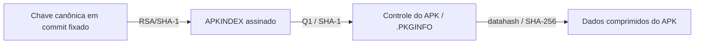

# Assinatura do pacote do kernel — #12

## Contexto

O APK preservado corresponde byte por byte a um novo download com HTTPS obrigatório em todos os saltos. Seus metadados declaram `commit = -dirty`; autenticar os conteúdos não estabelece um commit imutável nem reproduz o kernel.

## Escopo e plano

Arquivos públicos desta etapa: este documento, `docs/evidence/kernel-package-provenance.json`, `docs/evidence/kernel-index-verification.json`, o índice público assinado `docs/evidence/kernel-index-20260930.apkindex` e o link em `docs/REPRODUCAO.md`. Dados de verificação ficam privados em `runtime/apk-signature-check/`; não modificar o APK nem instalar chaves em trust stores. O índice preservado contém metadados públicos de pacotes; não contém uma imagem de boot ou identidades do aparelho.

1. Ler o formato e código canônicos do apk-tools/abuild; identificar os três streams gzip, a assinatura e `.PKGINFO`, sem instalar ou executar conteúdo do APK.
2. Conferir SHA-256 do stream de dados contra `datahash` e buscar a chave indicada em uma fonte oficial de chaves, fixando o commit da fonte.
3. Usar somente OpenSSL já disponível para verificar RSA/SHA-1 sobre o stream comprimido de controle. Caso só a chave oficial de distribuição esteja disponível, registrar o resultado dessa comparação sem presumir que ela seja a chave indicada.
4. Se a verificação passar, executar um controle negativo com cópia alterada do stream de controle; preservar o original. Se faltar a chave correta, conservar a pendência e não usar `--allow-untrusted`.
   Uma rota independente é autenticar o índice oficial com sua chave conhecida, conferir nele a identidade do stream de controle do APK e então o `datahash`. Essa rota não verifica a assinatura própria do APK; deve ser registrada separadamente, com controles negativos nos três vínculos.
5. Registrar fonte, fingerprint e resultados; manter separados integridade interna, origem HTTPS e assinatura de chave conhecida. Nenhum arquivo do pacote é aplicado ao macOS ou ao telefone.

## Tarefas

- [x] Formato/código lidos e APK dividido em três streams, sem extração no sistema.
- [x] `datahash` corresponde ao SHA-256 do terceiro stream comprimido.
- [x] Chave canônica selecionada e conferida.
- [x] Índice oficial, vínculo do controle do APK e datahash verificados; três controles negativos rejeitados.
- [x] Lacuna da assinatura própria e limite de origem do kernel documentados.

## Observação inicial

A assinatura tem 512 bytes e o nome `.SIGN.RSA.pmos@local-6a2bdb7a.rsa.pub`. O stream de controle contém somente `.PKGINFO`. No diretório de chaves do pmbootstrap, fixado em `39e9c17c1439b25f7aced54e03f19b0515cdb029`, há 20 entradas, sem próxima página; a chave nomeada no APK não está entre elas. A consulta inicial a `master` retornou 404; a API confirmou `main` como branch padrão. Isso não prova que a chave jamais tenha existido.

## Resultado da autenticação

A assinatura própria do APK não passou com `build.postmarketos.org.rsa.pub` (saída 1, `Verification Failure`); essa chave não é a indicada no nome da assinatura. A assinatura do **índice oficial**, cujo nome indica essa chave, passou (saída 0, `Verified OK`). A identidade `C:Q1P8imlSMXnsTe2Z3/v+Xj3WpjQHM=` nele confere com o stream comprimido de controle do APK. O `datahash` desse controle confere com o stream comprimido de dados.



Alterar um bit no índice foi rejeitado pelo OpenSSL; alterar o controle quebrou a identidade Q1; alterar os dados quebrou o datahash. O APK original foi preservado. Essa cadeia autentica controle e dados, **não o stream da assinatura própria do APK**. Não foi usado `--allow-untrusted`, e nenhuma chave foi instalada no sistema.

A chave canônica tem SHA-256 PEM `b70e6ffc64a652d63aee0c28cb9ecb2ca3b49d759ca7a023bcb854d08780964b`; o índice preservado tem 106.022 bytes e SHA-256 `da53e0f06b6500d3fd8ebc65cccbe6a1ab4200729b6764f5ccb94d7017d2ff28`. Verificador existente: LibreSSL 3.3.6 do macOS. [Registro completo](evidence/kernel-index-verification.json), [identidade do APK e comparação de sua assinatura](evidence/kernel-package-provenance.json).

## Transporte e reprodução

O endpoint original `master` redirecionou para `https://mirror.nura.eco/.../master/...`, que depois propôs **HTTP** para o alias `main`. A descrição anterior de TLS em todo o download foi corrigida. A rota equivalente `https://mirror.nura.eco/postmarketos/main/postmarketos/aarch64/` permitiu novo download sem downgrade, idêntico ao APK preservado. O mirror foi selecionado pelo endpoint oficial; não foi presumido a partir de um resultado de busca.

Para esta prova, use o índice preservado no repositório, não um índice futuro baixado da branch mutável. Execute na pasta `iphone-linux-tools`, com o APK local já preservado e uma pasta de verificação nova. Obtenha somente a chave pública do commit fixado:

```bash
mkdir -m 700 runtime/apk-signature-replay
curl --fail --location --proto '=https' --proto-redir '=https' \
  --output runtime/apk-signature-replay/key.pub \
  'https://gitlab.postmarketos.org/api/v4/projects/235/repository/files/pmb%2Fdata%2Fkeys%2Fbuild.postmarketos.org.rsa.pub/raw?ref=39e9c17c1439b25f7aced54e03f19b0515cdb029'
```

Esta reprodução verifica o mesmo snapshot, sem instalar ou extrair conteúdo no sistema:

```python
import base64
import hashlib
import io
from pathlib import Path
import subprocess
import tarfile
import tempfile
import zlib

def streams(raw):
    result = []
    while raw:
        decoder = zlib.decompressobj(31)
        body = decoder.decompress(raw, 67108864)
        assert decoder.eof and not decoder.unconsumed_tail
        used = len(raw) - len(decoder.unused_data)
        result.append((raw[:used], body))
        raw = decoder.unused_data
        assert len(result) <= 3
    return result

def files(body):
    with tarfile.open(fileobj=io.BytesIO(body), mode='r:', ignore_zeros=True) as archive:
        members = archive.getmembers()
        assert all(item.isfile() for item in members)
        assert len({item.name for item in members}) == len(members)
        return {item.name: archive.extractfile(item).read() for item in members}

def flipped(raw):
    result = bytearray(raw)
    result[len(result) // 2] ^= 1
    return result

key = Path('runtime/apk-signature-replay/key.pub')
index = Path('docs/evidence/kernel-index-20260930.apkindex').read_bytes()
apk = Path('artifacts/linux-postmarketos-apple-16k-7.0.12-r0.apk').read_bytes()
assert hashlib.sha256(key.read_bytes()).hexdigest() == 'b70e6ffc64a652d63aee0c28cb9ecb2ca3b49d759ca7a023bcb854d08780964b'
assert hashlib.sha256(index).hexdigest() == 'da53e0f06b6500d3fd8ebc65cccbe6a1ab4200729b6764f5ccb94d7017d2ff28'
assert hashlib.sha256(apk).hexdigest() == '5cedfa79ad8bdaff8fa05327624071e7b17c24f24370b11ef3b58bde2c7220b2'
idx, pkg = streams(index), streams(apk)
assert len(idx) == 2 and len(pkg) == 3
signature = files(idx[0][1])
assert list(signature) == ['.SIGN.RSA.build.postmarketos.org.rsa.pub']
with tempfile.TemporaryDirectory(dir='runtime/apk-signature-replay') as temporary:
    stage = Path(temporary)
    sig, control = stage / 'signature', stage / 'control'
    sig.write_bytes(next(iter(signature.values())))
    control.write_bytes(idx[1][0])
    command = ['/usr/bin/openssl', 'dgst', '-sha1', '-verify', str(key), '-signature', str(sig), str(control)]
    assert subprocess.run(command, capture_output=True).returncode == 0
    control.write_bytes(flipped(idx[1][0]))
    assert subprocess.run(command, capture_output=True).returncode != 0
contents = files(idx[1][1])
assert set(contents) == {'DESCRIPTION', 'APKINDEX'}
records = [dict(line.split(':', 1) for line in item.splitlines() if ':' in line) for item in contents['APKINDEX'].decode().split('\n\n')]
entries = [item for item in records if (item.get('P'), item.get('V'), item.get('A')) == ('linux-postmarketos-apple-16k', '7.0.12-r0', 'aarch64')]
assert len(entries) == 1
entry = entries[0]
identity = lambda data: 'Q1' + base64.b64encode(hashlib.sha1(data).digest()).decode()
assert len(apk) == int(entry['S']) and identity(pkg[1][0]) == entry['C']
assert identity(flipped(pkg[1][0])) != entry['C']
control = files(pkg[1][1])
assert list(control) == ['.PKGINFO']
metadata = dict(line.split(' = ', 1) for line in control['.PKGINFO'].decode().splitlines() if ' = ' in line)
assert hashlib.sha256(pkg[2][0]).hexdigest() == metadata['datahash']
assert hashlib.sha256(flipped(pkg[2][0])).hexdigest() != metadata['datahash']
print('SIGNED_INDEX_CONTENT_CHAIN_OK; 3 negative controls rejected')
```

O download do APK, se necessário, deve usar a rota HTTPS acima com `--proto '=https' --proto-redir '=https'` e conferir o SHA-256 registrado antes desta prova. Os dados em `runtime/apk-signature-replay` podem ser preservados localmente para análise. Esse procedimento é uma reprodução documental do snapshot; não substitui um verificador geral de pacotes nem comprova um build de kernel a partir de fonte imutável.

Referências primárias: [apk-tools v2.14.10](https://gitlab.alpinelinux.org/alpine/apk-tools/-/blob/v2.14.10/src/package.c), [abuild-sign](https://gitlab.alpinelinux.org/alpine/abuild/-/blob/master/abuild-sign.in), [chaves do pmbootstrap](https://gitlab.postmarketos.org/postmarketOS/pmbootstrap/-/tree/main/pmb/data/keys).
