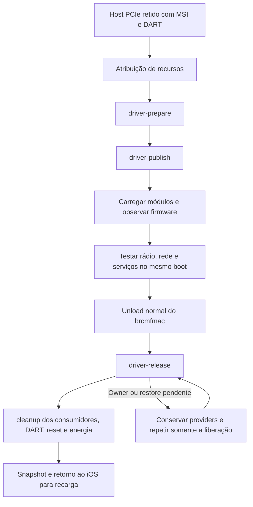

# Runtime brcmfmac no iPhone 6s N71

## Estado

A integração do caller está qualificada offline no Mac e no Ubuntu ARM64. O novo módulo ainda não foi selecionado nem carregado no iPhone. Firmware, associação Wi-Fi, IRQ entregue, tradução DMA, bateria e carga Linux continuam sem prova física nesta etapa. A [evidência completa](evidence/n71-brcmfmac-caller-qualified.json) conserva inputs, hashes, imports e gates; o [plano](../.agents/plans/n71-brcmfmac-runtime.md) registra as próximas fases.

Código: `4576d7b` conserva owners parciais e erros de publicação; `c370096` exclui MSI manual; `e088212` integra actions/getter/cleanup; `b2429a4` mantém a fixture DART isolada. Nenhum DFU, reboot, pacote ou configuração global do Mac foi necessário para esses incrementos.

## Uma sessão para várias operações

O probe continua apenas adquirindo o diagnóstico retido. `driver_runtime` inicia em `false`; ativá-lo permite actions explícitas e exige `iommu_parent`, que já depende de MSI/scan held/PME/inventory. Não prepara o driver, publica devices ou carrega firmware automaticamente.



A execução host desse fluxo ainda precisa de journal/seleção e preparação de firmware/energia. O diagrama descreve o contrato, não uma sessão física já realizada. A publicação retorna antes de comprovar firmware ou rádio; uma falha de setup assíncrono pode ocorrer depois do retorno0. O unload normal é a barreira de lifetime: callbacks de firmware retêm módulo/device; não usar unload forçado nem unbind manual durante a operação pendente.

## Actions do caller

O setter é `/sys/module/n71_pcie_diagnostic/parameters/action`. As actions operam sob `session_lock`, com pin temporário do módulo, bus vivo e quatro domínios attached/powered; reset/module owners devem continuar retidos e não pode haver put de energia pendente.

| Action | Efeito e condições |
| --- | --- |
| `driver-prepare` | Requer opt-in, sessão sem erros, DART running/device e ausência de lease MSI manual. O adapter valida recursos/IRQ/IOMMU, captura configuração, retém dois devices/PM e instala overrides próprios. |
| `driver-publish` | Mesmas condições do caller; o adapter exige preparação completa. Emite publicação uma vez. `published=1` registra intenção; não confirma binding, firmware, interface ou rádio. |
| `driver-release` | Admite erros anteriores e funciona mesmo com opt-in desligado. O adapter exige ausência de driver registrado/bound, MSI software, grants/mappings e enables estranhos; restaura por readback e só então libera overrides, PM e referências. |
| `cleanup` | Primeiro libera runtime; não avança ao MSI manual, consumidores, DART, reset ou power se houver erro/owner. Mantém a sessão para retry sem novo scan/DFU. |

Enquanto qualquer owner runtime estiver pendente, `msi-hold` e `msi-release` retornam `-EBUSY` antes do adapter, relatório ou efeito manual; essa recusa não contamina uma sessão saudável. A guarda também existe no adapter MSI para callers diferentes. `-EALREADY`/`-EBUSY` sem erro causal não substituem a primeira causa. Um retorno0 de release com owner pendente vira `-EBUSY`.

A primeira causa é conservada antes e depois das actions e antes de descartar o host: primeiro o erro já registrado na sessão; caso ausente, erro runtime sob spinlock, depois erros MSI/config/IO. Um erro de liberação posterior não apaga a causa inicial. Os paths legados sem runtime não recebem latch novo de erro apenas por executar cleanup.

## Getter separado e passivo

`/sys/module/n71_pcie_diagnostic/parameters/driver_runtime_status` publica, nesta ordem:

```text
requested ready held pending active published root endpoint pm root_override endpoint_override reads operation_error error session_error
```

| Campo | Significado |
| --- | --- |
| `requested` | Opt-in solicitado; não é ownership. |
| `ready` | Host retido disponível para observação; não é firmware ou rádio pronto. |
| `held` | Bus ainda vivo e retido. |
| `pending` | Qualquer um de active, refs, PM ou overrides permanece owned. |
| `active` | Política PCI runtime ativa. |
| `published` | Publicação emitida; histórico não conta como owner. |
| `root`, `endpoint` | Referências PCI retidas. |
| `pm` | PM usage dos dois devices retido. |
| `root_override`, `endpoint_override` | Overrides próprios ainda precisam de limpeza. |
| `reads` | Contador runtime independente do orçamento finito de scan/rollback. |
| `operation_error` | Primeira causa do contrato de configuração runtime. |
| `error` | Erro efetivo, conservando precedência da sessão. |
| `session_error` | Resultado da última tentativa de cleanup da sessão. |

A leitura usa mutex da sessão e spinlock do host; não faz IO, não emite action, não muda owners nem grava a causa na sessão. Os getters legados mantêm seus formatos. `N71_PCIE_DRIVER_RESULT` registra action, resultado e owners; também declara que não é prova de firmware ou rádio. O parser e a observação host desse formato foram qualificados; o journal de efeitos é a próxima integração.

## Reprodução offline

No checkout do projeto, sem iPhone conectado ou efeitos de hardware:

```bash
python3 -B -m unittest discover -s tests -p test_n71_pcie_diagnostic_caller.py -v
python3 -B -m unittest discover -s tests -p test_n71_pcie_brcmfmac.py -v
python3 -B -m unittest discover -s tests -p test_n71_pcie_msi_allocate.py -v
python3 -B -m unittest discover -s tests -p test_n71_dart_provider.py -v
python3 -B -m unittest discover -s tests -p test_n71_pcie_scan_host.py -v
```

Por plataforma: caller270/234, adapter30/26, MSI manual61/31, DART/provider31/17, host183/147: **575 cenários e455 mutações C**. As mutações compilam e precisam encerrar por SIGABRT/asserção; falha de compilação, timeout ou SIGSEGV não conta. Kernel/PCI/firmware/IRQ são dependências modeladas nos gates de caller; os gates de adapter/host compilam suas respectivas fontes reais, sem executar hardware.

AST e lint fatal `E9,F63,F7,F82` passaram nos dois sistemas usando wheels previamente fixadas por SHA, sem instalação no Mac/VM. Não há typechecker Python configurado. No Mac, um mutante DART excedeu5s na primeira rodada; somente o método DART foi repetido, com suas30 mutações aprovadas, conservando os outros cinco métodos. A fixture de primeira causa foi fortalecida depois que um mutante sobreviveu; somente a rodada final completa do caller comprova234 kills.

Para o build externo, usar a VM dedicada `iphone6s-kernel-20261001`, fonte958481f e build `7.2.0-iphone6s-dart-serdev-power2` existentes. Conferir antes/depois os hashes da fonte/diff, `.config`, Image e `vmlinux.symvers` da evidência. Em uma pasta temporária separada, com cwd na raiz deste projeto dentro da VM:

```bash
N71_SOURCE=/home/ubuntu/kernel-n71-binding-source-20261005
N71_BUILD=/home/ubuntu/kernel-n71-binding-build-20261005
N71_WORK=$(mktemp -d)
cp phone/kernel/n71-pcie-diagnostic.c "$N71_WORK/"
cp phone/kernel/*.h "$N71_WORK/"
printf 'obj-m += n71-pcie-diagnostic.o\n' > "$N71_WORK/Makefile"
make -C "$N71_SOURCE" O="$N71_BUILD" M="$N71_WORK" W=1 \
  KCFLAGS=-Werror KBUILD_EXTRA_SYMBOLS="$N71_BUILD/vmlinux.symvers" -j2 modules
modinfo -F vermagic "$N71_WORK/n71-pcie-diagnostic.ko"
modinfo -p "$N71_WORK/n71-pcie-diagnostic.ko"
readelf -h "$N71_WORK/n71-pcie-diagnostic.ko"
nm -u "$N71_WORK/n71-pcie-diagnostic.ko"
sha256sum "$N71_WORK/n71-pcie-diagnostic.ko"
```

Build qualificado:142.232 bytes, SHA`b4888de18e8e93f9320300350cdd646a6c583fe127e7c2adee99549a7216b136`, ELF64/AArch64 e135 imports presentes nos exports preservados. Inclui as APIs públicas `driver_find`, `__device_set_driver_override`, `pci_bus_add_devices`, `pci_disable_device`, `pci_device_is_present`. Hash/bytes do módulo copiado da VM foram conferidos no Mac. Todos os69 inputs fixados ficaram íntegros. Builds em outra pasta/toolchain podem variar no binário; conferir inputs, ABI e imports próprios, não tratar diferença de hash como prova física.

## Pendências que impedem declarar o servidor pronto

1. Collector/journal/seleção explícitos, com intenção antes do efeito, observação do firmware e unload normal antes de release.
2. Firmware/calibração privados compatíveis com chip4350/revisão8 e preparação HDQ/gauge/energia.
3. Uma sessão física agrupada para IRQ/DMA/firmware, scan/associação/DHCP/SSH por Wi-Fi e telemetria/carga; conservar serviços, snapshot e recuperação.

As issues40,9 e2 permanecem abertas. A ausência de carga Linux segue sendo um limite operacional real: esses gates não comprovam alimentação sustentada. Aguardar a candidata agrupada antes de solicitar outro DFU.

## Relatório desta fase

- **Entrega:** predicado compartilhado, exclusão MSI, caller/actions/getter/cleanup e fixtures focadas; reprodução,69 inputs e evidência pública conservados. Todas as alterações atendem à fase2b do plano; nenhum recurso físico novo foi selecionado.
- **Plano:** fase2b concluída; journal/seleção/firmware/energia e prova física pendentes. Goal amplo continua ativo.
- **Compatibilidade:** defaults e formatos legados preservados; getter/actions runtime novos exigem opt-in explícito. Kernel/config/Image/exports e perfis anteriores íntegros.
- **Verificação:**575 cenários/455 mutações por plataforma; build completo ARM64 Werror, ELF/vermagic/imports e hashes conferidos. AST/lint fatal passaram; não há typechecker Python. JSON, sete links locais/âncoras e cinco blocos Bash validados, conservando as receitas históricas.
- **Banco/dependências:** nenhum banco, pacote ou configuração global alterado. Testes usam dependências de kernel modeladas; build usa a VM/fonte/toolchain existentes.
- **Desempenho e riscos:** counters e lifetime foram qualificados offline; consumo, alimentação, rádio e throughput físicos ainda não medidos. Nenhuma validação de UI ou novo teste físico nesta fase.
- **Próximo passo:** journal e acompanhamento do firmware, seguida da preparação de energia e candidata física agrupada. Nenhuma ação necessária do operador agora.

## Observação host — fase A

Em `3dfa1cb`, o coletor inclui o getter runtime opcional e compara seleção imutável, caller, owners e primeira causa. A retomada permite reads crescentes e surgimento da causa assíncrona; conserva owners/publicação e erros existentes. O parser de resultado nativo exige a action esperada, registro completo e único no delta. Isso prepara o journal de efeitos; não autoriza alterações no histórico MSI/IOMMU legado nem comprova firmware/radio. [Plano host](../.agents/plans/n71-driver-runtime-host.md), [evidência](evidence/n71-driver-runtime-observation-qualified.json).

Reproduzir no checkout, sem hardware:

```bash
python3 -B -m unittest discover -s tests -p test_n71_driver_runtime_result.py -v
python3 -B -m unittest discover -s tests -p test_n71_iommu_result.py -v
python3 -B -m unittest discover -s tests -p test_n71_msi_allocation_result.py -v
python3 -B -m unittest discover -s tests -p test_n71_held_session.py -v
python3 -B -m unittest discover -s tests -p test_n71_resource_stage.py -v
python3 -B -m unittest discover -s tests -p test_n71_held_history.py -v
```

Mac e Ubuntu ARM64:80 testes/154 mutações por AssertionError, sendo novo protocolo8/22, IOMMU21/53, MSI7/16, held21/30, resources16/26 e histórico7/7. Shell real com sysfs temporário somente de leitura, integração com coordinator real, AST e lint fatal passaram; não há typechecker Python configurado.260 inputs finais conservados. Erro de harness por IndexError na primeira mutação de unicidade não contou; corrigido o mutante para duplicidade, a rodada final completa passou. Os69 inputs C anteriores permanecem iguais: reutilizados575/455 e o build qualificado, sem rebuild.

A CI anterior `6e1cc9c` concluiu os seis jobs verdes nos eventos [PR](https://github.com/djalmajr/iphone6s-linux/actions/runs/38039049902) e [push](https://github.com/djalmajr/iphone6s-linux/actions/runs/38039046638). Ela não cobre `3dfa1cb`; o novo head terá CI própria. Nenhum módulo/perfil/firmware selecionado, setter, reboot/DFU ou pacote/configuração global alterado. O goal amplo e as issues40/9/2 permanecem abertos; próxima fase registra intent/proof de actions e unload/release antes da seleção e da candidata física agrupada.

## Journal das actions nativas — fase B1

Em `71b8c37`, o journal held conserva a seleção runtime e um ledger de prepare/publish/release. O intent é sincronizado no arquivo e diretório antes do setter; cada tentativa usa um proof exclusivo. A completion deriva do resultado nativo e getter, com concordância action/shell/SSH exit e conservação de owners parciais/primeira causa. A recuperação de intent pendente apenas observa o mesmo boot; não reenviará o setter nem inventará SSH exit. Proof cujo hash já foi salvo reconstrói a atualização de completion interrompida. O coletor filtra stdout, portanto a action lê o log privado completo. [Evidência](evidence/n71-driver-runtime-journal-qualified.json), [plano](../.agents/plans/n71-driver-runtime-host.md#b1-journal-das-actions-nativas--contrato-fechado).

```bash
python3 -B -m unittest discover -s tests -p test_n71_driver_runtime_stage.py -v
```

O gate novo tem10 testes/15 mutações por AssertionError; com os seis gates da observação acima,90/169 por plataforma no Mac/Ubuntu ARM64.263 inputs íntegros, AST/lint fatal, journal/source loader reais e shell POSIX em filesystem temporário aprovados; não há typechecker Python. As primeiras fixtures/harness falharam e não contaram como kills; somente a matriz final passou.69 inputs C preservados permitem reutilizar575/455 e o módulo qualificado sem build/DFU.

Essa fase não chama actions automaticamente nem habilita perfil/CLI. B2 ainda deve integrar unload normal, cleanup e estado MSI/DMA/histórico com driver ativo; também deve recuperar a janela anterior ao hash de proof e checkpoint antigo/ausente. Não declarar todos os pontos de crash recuperáveis. A seleção C aguarda essas condições e a candidata firmware/energia; nenhum efeito físico novo ocorreu.

## Continuidade da associação publicada — fase B2a

Em `c8ab8ee`, a associação runtime aceita o único vetor do brcmfmac somente com publicação comprovada pelo ledger e os seis owners retidos. Boot, providers MSI/IOMMU, parâmetros imutáveis e lease MSI manual são conferidos antes de aceitar a retomada. Child pode nascer antes do vetor e continuar vivo depois de `pci_free_irq_vectors`; child observado não desaparece enquanto os consumidores seguem retidos. A causa negativa não pode ser apagada ou substituída arbitrariamente; a precedência do caller exige concordância dos snapshots. Getters sequenciais não são uma captura atômica nem prova de IRQ/DMA. [Evidência](evidence/n71-driver-runtime-continuation-qualified.json), [plano](../.agents/plans/n71-driver-runtime-host.md#b2a-continuidade-das-observações-durante-o-driver--contrato-fechado).

```bash
python3 -B -m unittest discover -s tests -p test_n71_driver_runtime_continuation.py -v
```

Esse gate tem8 testes/17 mutações por AssertionError. Com journal10/15, resultado8/22, IOMMU21/53, MSI7/16, held21/30, resources16/26 e histórico7/7:98 testes/186 mutações por plataforma no Mac/Ubuntu ARM64.267 inputs finais conferidos, AST e lint fatal aprovados; nenhum typechecker Python configurado. A fixture inicial compartilhava um dict alterado pelo teste de publicação falha; seus kills não foram aceitos. A fixture agora clona os estados e o gate de mutações exige baseline verde. A âncora antiga de retained foi atualizada conservando a mutação. Somente a matriz final é a prova aceita.

Os69 inputs C e módulos oficiais/diagnóstico continuam íntegros, sem rebuild. Nenhum acesso ao iPhone, setter, seleção de perfil, módulo/firmware, DFU/reboot ou configuração global ocorreu. Ainda faltam execução pelo coordenador, unload normal, histórico/resources/cleanup e recuperação antes do hash ou com checkpoint ausente; depois seleção C, calibração/regdb e energia. Wi-Fi e carga Linux permanecem sem prova física.

## Candidato privado de firmware — origem verificada

A revisão oficial `31ec35bf14df835e2f9f7c8b1a8516a34f836df5` de [linux-firmware](https://kernel.googlesource.com/pub/scm/linux/kernel/git/firmware/linux-firmware/+/31ec35bf14df835e2f9f7c8b1a8516a34f836df5/brcm/) contém `brcmfmac4350-pcie.bin`. O candidato privado tem626.140 bytes, SHA256 `5691d1e0ceb70baf18efb7a0ec6cb84feb9edd2d0700c525b42930c4e7e4b845`; o blob Git foi conferido contra o índice fixado. WHENCE vincula o arquivo à licença Broadcom, também baixada e conferida pelo blob/hash da mesma revisão. [Metadados sanitizados](evidence/n71-firmware-candidate-origin.json).

Nenhum firmware foi publicado no repositório, executado ou instalado no Mac/iPhone. A falha de DNS da VM foi conservada; a leitura no Mac não alterou a rede da VM. O nome da família corresponde ao chip/revisão observados, mas isso não comprova compatibilidade N71, calibração/NVRAM ou rádio. Esses requisitos continuam pendentes antes do carregamento físico.

## Histórico das fases anteriores

As seções abaixo registram o estado nos commits de cada fase. As pendências de caller/MSI nelas descritas foram resolvidas pela fase2b acima; as receitas e evidências originais permanecem para reprodução e análise. Elas não descrevem o estado atual de ativação física.

## brcmfmac — configuração PCI runtime N71

### Estado em 2026-10-10

A política de configuração do driver está qualificada offline em `5a1c8df`:58 cenários e23 mutações compiladas por asserção, tanto no Mac quanto no Ubuntu ARM64. AST e lint fatal passaram. O probe no kernel power2 passou W=1/Werror/modpost, ELF/vermagic/imports:11.184 bytes, SHAbcb2b125. Binário/hash/bytes/ELF foram conferidos no Mac e sete inputs/fonte/config/Image/exports foram conservados. [Evidência sanitizada](evidence/n71-brcmfmac-runtime-config-qualified.json), [plano e checklist](../.agents/plans/n71-brcmfmac-runtime.md), [decisão D13](../.agents/plans/n71-funcional-goal-decisoes.md#d13-dar-ao-driver-um-modo-pci-próprio-e-usar-unload-normal-como-barreira).

Esse probe somente compila as funções reais de capture/write/restore. O scan/caller ainda não chama a política e não houve seleção, carga, firmware ou DFU no aparelho. Interface, entrega IRQ, tradução DMA, scan/associação Wi-Fi, gauge e carregamento continuam sem prova física. O primeiro teste da fixture falhou porque a simulação de drift ocorria depois do capture; corrigida a leitura, ambos os gates passaram. Nenhum kill da rodada com baseline falho foi contado.

### Por que existe um contrato separado

O diagnóstico MSI qualificado mantém decode/MASTER desligados e detém uma alocação manual. O [brcmfmac fixado](https://github.com/HoolockLinux/linux/blob/958481f87fee0949ff6a9a4af77f7eb6dac8a149/drivers/net/wireless/broadcom/brcm80211/brcmfmac/pcie.c#L1787) chama `pci_enable_device`, `pci_set_master`, mapeia BAR0/BAR2 e aloca DMA/IRQ durante a inicialização. Ele precisa possuir sua própria alocação MSI e seu teardown. Reaproveitar a lease manual para esse probe recusaria a configuração ou produziria ownership incorreto.

O contrato novo conserva COMMAND dos dois devices, MSI, BAR0_WINDOW e Link Control. Permite somente os writes auditados: COMMAND16 sem IO, PMCSR D0 idêntico, mensagem MSI de um grant AIC, BAR0_WINDOW alinhado, mailbox1 e os dois bits ASPM de Link Control. O replay DWORD do driver vira WORD para preservar STATUS W1C. Os dois writes idênticos da mailbox são eventos e continuam produzindo duas escritas. Após uma falha, a primeira causa permanece registrada enquanto os writes permitidos de teardown ainda podem ocorrer.

Restore exige driver PCI não registrado/não bound, MSI software desligado e grants/mappings zerados. Verifica identidade, desabilita MSI/decode/MASTER, restaura os baselines e confere todos antes de liberar o owner. Erro/drift conserva ownership para retry. Essa política não intercepta writes indiretos via MMIO e não altera a API de free IRQ do driver; em falha de hardware não comprova stop-before-free. O futuro caller precisa conservar bus/providers/energia até restore verificado e registrar o erro efetivo.

### Firmware assíncrono e release

O [loader fixado](https://github.com/HoolockLinux/linux/blob/958481f87fee0949ff6a9a4af77f7eb6dac8a149/drivers/base/firmware_loader/main.c#L1147) conserva referências ao módulo e device até depois do callback. O brcmfmac passa `THIS_MODULE` nas chamadas assíncronas. O [unload normal](https://github.com/HoolockLinux/linux/blob/958481f87fee0949ff6a9a4af77f7eb6dac8a149/kernel/module/main.c#L772) recusa referências ativas e termina o remove antes de retornar. Usar essa barreira; não forçar rmmod nem emitir unbind manual com firmware pendente.

Probe0 ou insmod0 não comprova firmware pronto: o callback pode falhar, disparar remove ou ainda estar em execução. O journal deverá acompanhar registro/binding, erro do modo, módulos, interface/IRQ/DART e depois rádio. A aquisição inicial de associação sem DMA mantém seu histórico próprio. A identificação física existente já confirmou chip4350/revisão8 e seleciona a família `brcmfmac4350-pcie`; compatibilidade da imagem e calibração da placa ainda precisam ser qualificadas.

### Reprodução offline

No checkout, executar o gate nativo sem dispositivo ou pacotes novos:

```bash
python3 -B -m unittest discover -s tests -p test_n71_brcmfmac_config.py -v
```

Para compilar o probe, usar a VM ARM64 dedicada, a fonte/build power2 preservados e conferir os hashes da evidência antes/depois. O diretório do probe deve ser novo e privado. Executar dentro da raiz `iphone-linux-tools` copiada para a VM:

```bash
umask 077
n71_probe_dir=$(mktemp -d /tmp/n71-brcmfmac-config.XXXXXX)
cp phone/kernel/n71-brcmfmac-config.h phone/kernel/n71-wlan-msi-config.h \
  phone/kernel/n71-pcie-scan-config.h phone/kernel/n71-pcie-ecam.h \
  phone/kernel/n71-pcie-contract.h "$n71_probe_dir/"
cp tests/n71_brcmfmac_config_probe.c "$n71_probe_dir/n71-brcmfmac-config-probe.c"
printf 'obj-m += n71-brcmfmac-config-probe.o\n' > "$n71_probe_dir/Makefile"
make -C /home/ubuntu/kernel-n71-binding-source-20261005 \
  O=/home/ubuntu/kernel-n71-binding-build-20261005 M="$n71_probe_dir" \
  W=1 KCFLAGS=-Werror \
  KBUILD_EXTRA_SYMBOLS=/home/ubuntu/kernel-n71-binding-build-20261005/vmlinux.symvers \
  -j2 modules
modinfo -F vermagic "$n71_probe_dir/n71-brcmfmac-config-probe.ko"
readelf -h "$n71_probe_dir/n71-brcmfmac-config-probe.ko"
nm -u "$n71_probe_dir/n71-brcmfmac-config-probe.ko"
```

Os três entrypoints reais devem existir na tabela de símbolos; os imports precisam constar no `vmlinux.symvers` preservado. O probe público é idêntico ao compilado, SHA8d3c8df7. O SHA do binário documenta o artefato qualificado naquele diretório/ambiente; não implica build binariamente reprodutível em outro caminho. Não carregar esse probe no telefone: ele não habilita o driver. Logs completos/binaries permanecem privados em `runtime/n71-brcmfmac-runtime-20261010/`, também na pasta correspondente da VM.

### Relatório da política inicial

- **Arquivos:** política nova, fixtures C/Python, probe de reprodução, plano/D13 e evidência/status/documentação.
- **Plano:** implementação e qualificação da política concluídas; scan/adapter/caller, journal/seleção, firmware/energia e sessão física pendentes.
- **Compatibilidade:** defaults, getters, módulos/perfis anteriores, kernel/config/Image/exports preservados; nenhuma ação física adicional.
- **Verificação:**58 cenários/23 mutações por plataforma; probe ARM64 real e auditado; AST/lint fatal. Gates anteriores intactos foram reutilizados. Nenhum typechecker Python configurado.
- **Banco/dependências:** nenhum banco ou pacote/configuração global instalado/alterado. Desempenho físico não medido.
- **CI anterior:** head6a9ed79 aprovado em [PR](https://github.com/djalmajr/iphone6s-linux/actions/runs/38030989085) e [push](https://github.com/djalmajr/iphone6s-linux/actions/runs/38030986233), três jobs por evento. Essa prova não é a CI da nova política.
- **Próxima tarefa:** ligar a política ao modo runtime retido e impedir cleanup enquanto driver/firmware possuírem os consumidores. Depois journal e candidata de Wi-Fi/energia para uma sessão física agrupada. Issues9/2/40 e goal continuam abertos.

Não há ação necessária do operador nesta fase. Pedir somente DFU quando a candidata/monitor estiverem prontos; confirmação de tela após retorno ao iOS só será solicitada se alguma ação dependente a exigir. Uma transição não observada permanece fora da prova física.

### Host retido e adapter — fase2a

Em662e162, o host guarda configuração e referências do modo brcmfmac. `.enable_device` recusa o default e aceita somente as referências próprias com energia/recursos/DART retidos. Writes ECAM passam pela política runtime e os reads usam contador próprio, preservando o orçamento de scan/rollback. Consumer removal recusa modo ativo ou referências ainda pendentes. O adapter oferece prepare/publish/release separados; essas funções ainda não foram ligadas a actions/opt-in/getter do caller nem à seleção física. Exclusão no adaptador MSI manual também deve entrar antes da ativação. [Evidência](evidence/n71-brcmfmac-host-adapter-qualified.json), [checklist](../.agents/plans/n71-brcmfmac-runtime.md).

Prepare verifica bus/recursos/MSI/DART/topologia/DMA32 e ausência de driver/overrides anteriores. Retém root/endpoint e PM usage com `pm_runtime_get_noresume`, aplica os overrides pela API pública7.2 e conserva referências/configuração se houver falha parcial. Publish emite `pci_bus_add_devices` uma única vez; a flag indica intenção emitida. `pci_device_is_present` verifica resposta ao config; não comprova registration/binding/firmware completos. Não usar pci_dev_is_added/priv_flags internos.

Release exige driver PCI ausente, MSI software desligado, grants/mapcounts zerados e enable_cnt0/1. Após balancear enables PCI, restore/readback precedem a limpeza dos overrides próprios, PM put e PCI put. Override divergente ou write/readback falho conserva ownership para retry; não liberar DART/reset/clock nessa falha. A API void pci_disable_device não devolve o erro de escrita; a prova é o readback final, com a primeira causa registrada separadamente.

#### Reprodução e provas

```bash
python3 -B -m unittest discover -s tests -p test_n71_pcie_brcmfmac.py -v
python3 -B -m unittest discover -s tests -p test_n71_pcie_scan_host.py -v
```

Novo gate24 cenários/23 mutações e gate legado183/147 por plataforma, total207/170. Fixture usa adapter e callbacks ECAM reais; PCI/driver/PM/IOMMU são dependências modeladas. O gate legado usa scan completo e adapter de recursos reais. Mac retomou somente os dois métodos com âncoras afetadas, conservando os quatro restantes; Ubuntu ARM64 passou os seis métodos completos. AST/lint fatal passaram; nenhum typechecker Python configurado.

Para reproduzir o build na mesma fonte/build power2, copiar os arquivos C/H de `phone/kernel` para uma pasta nova privada. Compilar o diagnóstico completo e um probe com este conteúdo, que força prepare/publish/release no contexto/layout real:

```c
// SPDX-License-Identifier: GPL-2.0-only
#include "n71-pcie-diagnostic.c"
#include "n71-pcie-brcmfmac.h"
int n71_probe_prepare(struct pci_host_bridge *, struct n71_scan_host *);
int n71_probe_publish(struct pci_host_bridge *, struct n71_scan_host *);
int n71_probe_release(struct pci_host_bridge *, struct n71_scan_host *);
int n71_probe_prepare(struct pci_host_bridge *bridge, struct n71_scan_host *host)
{ return n71_pcie_brcmfmac_prepare(bridge, host); }
int n71_probe_publish(struct pci_host_bridge *bridge, struct n71_scan_host *host)
{ return n71_pcie_brcmfmac_publish(bridge, host); }
int n71_probe_release(struct pci_host_bridge *bridge, struct n71_scan_host *host)
{ return n71_pcie_brcmfmac_release(bridge, host); }
```

Salvar como `n71-brcmfmac-host-probe.c` e usar Makefile com `obj-m += n71-pcie-diagnostic.o n71-brcmfmac-host-probe.o`. Aplicar o comando make da reprodução anterior, com W=1/KCFLAGS=-Werror/exports preservados, sem MODPOST_WARN. Diagnóstico completo129.416 bytes/SHA2c743b7d e127 imports; probe137.368 bytes/SHAb7340c49 e135 imports, incluindo `driver_find`, `__device_set_driver_override`, `pci_bus_add_devices`, `pci_disable_device` e `pci_device_is_present`. Ambos passaram ELF/vermagic/hash/bytes e auditoria no Mac;63 inputs/fonte/config/Image/exports conservados. Os hashes identificam os builds qualificados, não uma promessa de reprodução binária em outro caminho. Logs/módulos ficam privados em `runtime/n71-brcmfmac-adapter-20261010/` e na VM correspondente.

O primeiro baseline falhou por device estrangeiro sem bus na fixture; a guarda agora verifica referência antes de acessar bus. A fixture passou a modelar pci_disable_device sem retorno de erro e testar retenção por readback no restore. Duas âncoras antigas ficaram ambíguas/ausentes; ficaram específicas novamente, sem remover testes. Lint VM encontrou pasta scripts ausente no staging; só esse diretório/lint/auditoria final foram retomados. SIGSEGV, falha de âncora e E902 não contaram como kills. Os gates/build anteriores aprovados foram preservados.

#### Relatório e próxima tarefa

- **Arquivos:** scan/adapter/fixtures/plano em662e162; esta reprodução, evidência, STATUS e D14 registram a qualificação.
- **Plano:** fase2a concluída; caller/opt-in/actions/getter/cleanup e exclusão MSI ainda pendentes. Depois journal/seleção/firmware/calibração/energia e sessão física agrupada.
- **Compatibilidade:** defaults e perfis físicos anteriores intactos; nenhum módulo, firmware ou DFU no aparelho. PM usage e hardware ainda não foram provados fisicamente.
- **Testes/tipos/lint:**207/170 por plataforma, build real de dois módulos com Werror/modpost/ELF/vermagic/imports; AST/lint fatal, sem typechecker Python. Nenhuma dependência/banco/configuração global alterada, desempenho físico não medido.
- **CI anterior c7240a1:** [PR](https://github.com/djalmajr/iphone6s-linux/actions/runs/38034484984) com três jobs verdes; [push](https://github.com/djalmajr/iphone6s-linux/actions/runs/38034481962) com Windows/Ubuntu verdes e Mac cancelado. Não transformar cancelamento em sucesso nem repetir gates só por haver um segundo evento. CI desta publicação continua separada.
- **Próxima tarefa:** integrar o caller e bloquear lease MSI manual durante runtime antes de preparar journal/seleção. Wi-Fi/IRQ/DMA/firmware, gauge/carga, goal e issues9/2/40 permanecem abertos. Nenhuma ação necessária do operador nesta fase.
