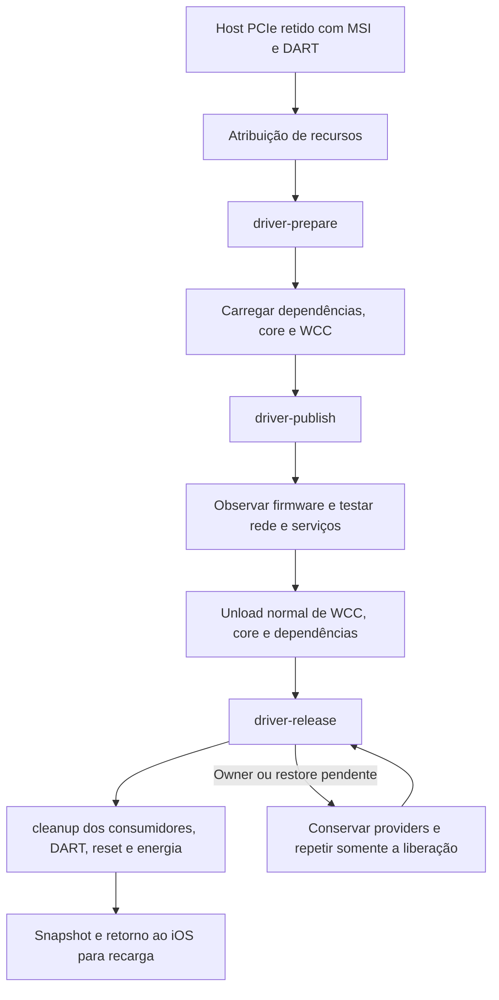

# Runtime brcmfmac no iPhone 6s N71

## Estado

A integração do caller está qualificada offline no Mac e no Ubuntu ARM64. O novo módulo ainda não foi selecionado nem carregado no iPhone. Firmware, associação Wi-Fi, IRQ entregue, tradução DMA, bateria e carga Linux continuam sem prova física nesta etapa. A [evidência completa](evidence/n71-brcmfmac-caller-qualified.json) conserva inputs, hashes, imports e gates; o [plano](../.agents/plans/n71-brcmfmac-runtime.md) registra as próximas fases.

Código: `4576d7b` conserva owners parciais e erros de publicação; `c370096` exclui MSI manual; `e088212` integra actions/getter/cleanup; `b2429a4` mantém a fixture DART isolada. Nenhum DFU, reboot, pacote ou configuração global do Mac foi necessário para esses incrementos.

## Regdb e calibração em cache — preparação C6

Dados `regulatory.db`/`.p7s` da versão2026.09.03 foram extraídos de arquivos regulares específicos do tar oficial, com limites de download/tamanho e SHA do arquivo conferido contra sha256sums.asc. A assinatura PGP externa não foi verificada. A assinatura CMS dos dados foi verificada na VM usando exclusivamente o certificado `wens.hex` da fonte do kernel; `-nointern` recusou confiar em certificados transportados na assinatura. Alterar um byte do banco produziu recusa.

```bash
# Na VM, converter o DER obtido de net/wireless/certs/wens.hex para PEM.
openssl x509 -inform DER -in kernel-wens-private.der -out kernel-wens-private.pem
openssl cms -verify -binary -inform DER -in regulatory.db.p7s \
  -content regulatory.db -certfile kernel-wens-private.pem \
  -nointern -noverify -out verified-output-private
```

`-noverify` desativa a validação da cadeia X.509; a assinatura continua sendo verificada contra o certificado explicitamente fixado do kernel. Comparar o output aos bytes originais e exigir falha com banco alterado. Dados/scripts/logs ficam privados em `runtime/n71-regdb-candidate-20261010/`; não houve instalação no Mac. [Origem oficial](https://www.kernel.org/pub/software/network/wireless-regdb/), [evidência](evidence/n71-regdb-calibration-source-audit.json).

A captura Pongo já existente foi examinada localmente, sem telefone: quatro propriedades binárias WLAN foram conservadas privadamente, incluindo `wifi-calibration-msf` de1024 bytes. `rx-calibration-temp` é escalar renderizado e não foi reconstruído. O [kboot fixado](https://github.com/HoolockLinux/m1n1/blob/d5a10ac52a6468484854419a6c5130f1d62073eb/src/kboot.c#L1028) transfere msf para `brcm,cal-blob`; of.c lê essa propriedade e common.c a envia por calload. O loader espera `/arm-io/wlan`/wifi0, mas o N71 capturado tem `/arm-io/uart4/wlan`, sem a propriedade de antena esperada. Essas diferenças permanecem abertas antes de compor/publicar DT e carregar o rádio. Isso é contrato estático, sem aceitação física da calibração ou associação.

### Extrator reproduzível — C6a

Em `e482f86`, properties_capture centraliza a leitura bounded/hierarquia/framing/duplicatas dos dados Pongo. O parser antigo de tunables mantém os mesmos registros e JSON. A CLI nova usa private_path e aceita somente a propriedade WLAN N71 e1024 bytes; output precisa ser novo sob runtime. Blob e provenance com hashes ficam privados700/600. A umask é restaurada inclusive após falha real de escrita. Stdout contém somente marcador genérico; nenhum firmware, DT, loader ou rádio é alterado.

```bash
python3 -B scripts/research/n71_wifi_calibration.py \
  --input "$TASK_PRIVATE_PONGO_CAPTURE" --output-dir "$TASK_NEW_CALIBRATION_DIR"
python3 -B -m unittest discover -s tests -p test_n71_wifi_calibration.py -v
python3 -B -m unittest discover -s tests -p test_n71_runtime_tunables.py -v
```

A fonte deve ser a captura completa já existente do próprio aparelho, privada e regular; não está no GitHub. O output novo contém calibration-private.bin e provenance-private.json. Não o reutilizar numa segunda execução. Regdb/firmware continuam separados.

14 testes/14 mutações AssertionError por plataforma; quatro inputs públicos íntegros, AST/lint fatal. Nove testes novos incluem baseline funcional seguido das mutações; cinco testes existentes preservados. CLI real no Mac extraiu o candidato da captura, verificou modos/bytes e conservou source e JSON de tunables anterior idêntico. O primeiro contraexemplo do prompt ainda era recusado pelo framing de outra linha; foi reduzido a corpo completo sem prompt antes de aceitar o kill. Os ensaios que sobreviveram não contaram como prova. Logs privados em runtime/n71-calibration-final-20261010 e runtime/n71-regdb-candidate-20261010; [evidência sanitizada](evidence/n71-calibration-extraction-qualified.json). Rota DT/antena/aceitação firmware e energia permanecem pendentes; nenhum typechecker Python ou prova de Wi-Fi/carga física.

## CLI explícita — fase C5

`637ba88` acrescenta entrypoint/helper próprios. Profile fica selecionado somente durante a operação; ambiente/umask retornam ao estado anterior inclusive em erro. Profile/source/output ficam em pastas privadas diretamente sob runtime; efeitos exigem output novo.

```bash
python3 -B scripts/host/n71-runtime-session.py \
  --profile runtime/n71-runtime-composed-profile-20261010/deployment.json \
  --action acquire --check
python3 -B -m unittest discover -s tests -p test_n71_driver_runtime_cli.py -v
```

Acquire não recebe source; assign/start/observe/stop exigem `--source` da operação anterior no mesmo boot e `--output-dir` novo. Assign conserva host; start exige assignment saudável; observe/stop aceitam também origem pré-assignment C3. Nenhuma ação reinicia o telefone automaticamente. A sequência física aguarda firmware/energia; não executá-la agora.

Qualificação:7 testes/20 mutações AssertionError por plataforma,381 inputs, AST/lint fatal. CLI/Session/seletores reais; handlers/identidade/kernel sintéticos nos contratos. Journal/load_source reais preservam origem e recusam hash alterado. Handlers anteriores reutilizados com377 inputs e69 C iguais. --check real no Mac validou kernel/identidades/sete módulos, manteve13 arquivos privados intactos e não criou output/SSH/USB. Logs privados em `runtime/n71-runtime-cli-final-20261010/`; [evidência](evidence/n71-runtime-cli-qualified.json). Não há typechecker Python. Firmware/regdb/calibração, IRQ/DMA, associação e bateria/carga ainda sem prova física.

## Composição privada runtime/WCC — fase C4

Em `c5de5df`, o compositor aceita `--pcie-driver-runtime` e `--wcc-dir`, exigindo explicitamente ASPM off, held/resource/IOMMU power2 e REG_ON antes de ler identidades. O helper seleciona somente os cinco WCC de C1 e verifica proteção privada, arquivos regulares sem links, bytes/SHA e ELF relocatable64/AArch64/vermagic único. O caller e REG_ON são verificados pelos registros C1; nenhum vendor alternativo é copiado.

O perfil contém os dois diagnósticos e cinco WCC em arquivos privados, com pcie_driver_runtime=true e manifest completo na provenance. Initramfs não ganha autoload e nenhum módulo é executado. Defaults conservam campos/arquivos anteriores. `64f49ad` evita imprimir o ambiente em uma asserção que falhe.

### Reprodução e limites

```bash
python3 -B -m unittest discover -s tests -p test_n71_driver_runtime_compose.py -v
python3 -B scripts/build/compose-n71-diagnostic.py \
  --source-profile "$TASK_SOURCE_PROFILE" \
  --kernel-dir "$TASK_KERNEL_DIR" --kernel-patchset n71-dart-serdev-power-v2 \
  --diagnostic-dir "$TASK_DIAGNOSTIC_DIR" \
  --module "$TASK_CALLER" --module-sha256 "$TASK_CALLER_SHA256" \
  --reg-on-module "$TASK_REG_ON" --wcc-dir "$TASK_WCC_DIR" \
  --pcie-aspm-off --pcie-scan-hold --pcie-resource-capable \
  --pcie-iommu-parent --pcie-driver-runtime --output-dir "$TASK_NEW_PROFILE"
```

WCC_DIR contém os cinco nomes planos: rfkill.ko, cfg80211.ko, brcmutil.ko, brcmfmac.ko e brcmfmac-wcc.ko. NEW_PROFILE deve ser novo, diretamente sob runtime. Usar a fonte baseline com layout preservado e o DTB de diagnóstico antes de acrescentar a referência DART, conforme o compositor anterior. Arquivos, payloads e identidades ficam privados; não enviá-los ao repositório.

#### Preparação dos inputs reais

1. Validar o perfil anterior com `device_profile.verify()` sob uma seleção temporária de IPHONE_LINUX_PROFILE e restaurar a variável em finally. Validar o diretório de kernel com `KERNEL.kernel_inputs(..., BINDING_BUNDLE)` e `n71_iommu_build.kernel_image(...)`. Não usar um Image ou release diferente.
2. Criar uma pasta source nova com modo 0700. Copiar somente initramfs.gz, client_ed25519 e known_hosts do perfil validado, em arquivos 0600. Construir payload.bin exatamente como `loader + KERNEL.BOOTARGS + kernel['s8000-n71.dtb'] + kernel['Image.gz'] + initramfs`. A deployment.json usa os mesmos oito campos da API device_profile: format=1, nomes relativos de payload/initramfs/client_key/known_hosts, SHA de payload e initramfs e host_key_alias preservado. Validar esse perfil pela mesma API; nunca imprimir/publicar as identidades.
3. No payload anterior com ASPM off, localizar o FDT após `len(loader + composer.bootargs(True))`; conferir magic 0xd00dfeed e totalsize big-endian limitado a 4 MiB. Parsear somente esse FDT. Retirar a propriedade phandle do nó DART somente se ela igualar as células do dart_phandle registrado na provenance anterior. Serializar com `DIAGNOSTIC.serialize_dtb` e validar contra o DTB baseline por `composer.validate_dtb`. Salvar diagnostic-private.dtb e provenance-private.json com seu SHA, em uma pasta nova privada. O compositor volta a acrescentar a referência DART validada.
4. Obter os cinco registros WCC pela seleção C1 e copiar somente seus nomes planos do build aceito para WCC_DIR. Manter caller e REG_ON nos arquivos cujo bytes/SHA/ABI correspondem à seleção. A origem aceita com oito módulos não autoriza copiar rfkill-gpio/BCA/CYW.
5. Executar a composição acima para uma saída nova e validá-la novamente com device_profile e o seletor C4. Conferir os 13 arquivos, sete módulos, modos 0700/0600, provenance e ausência de autoload. Comparar os bytes de initramfs/identidades e payload com a origem anterior; no teste real desta fase todos foram iguais.

Esses passos foram executados pelos scripts privados `runtime/n71-runtime-compose-20261010/prepare-production-private.py` e `compose-production-private.py`. Somente fontes e evidência sanitizada são versionadas; inputs, DTB, payload, chaves e logs reais permanecem privados. Reproduzir a fonte baseline é uma preparação de arquivos locais, sem boot ou alteração do perfil ativo.

Novo gate **7 testes/15 mutações por AssertionError**. Seis gates afetados **30 testes/39 mutações por plataforma Mac/Ubuntu ARM64**, 377 inputs íntegros, AST/lint fatal; sem typechecker Python. Seletores, metadata, arquivos e compositor reais; kernel/identidades são dependências sintéticas na fixture de perfil completo. A composição de produção no Mac usou todas as validações reais e criou **13 arquivos privados, sete módulos/1.371.040 bytes**. O payload resultante é **idêntico byte a byte ao perfil anterior qualificado**; initramfs, identidades SSH, inputs e ambiente foram preservados. [Evidência sanitizada](evidence/n71-runtime-composition-qualified.json).

Scripts/manifests/logs em `runtime/n71-runtime-compose-final-20261010/` e VM equivalente; preparação/candidata real em `runtime/n71-runtime-compose-production-20261010/` e `runtime/n71-runtime-composed-profile-20261010/`. Preparação reconstituiu a fonte baseline com o kernel qualificado, preservando initramfs/identidades, e retirou somente a referência DART do DTB de diagnóstico para o compositor acrescentá-la novamente. Nenhum input original foi alterado.

Falhas iniciais eram de fixture: diretório lido como arquivo, alias /var não resolvido e campo baseline no nível errado. Uma mutação da provenance foi inicialmente detectada como KeyError; passou a falhar por asserção de contrato e somente a rodada válida foi aceita. Após a mudança do diagnóstico da asserção, só o gate novo/lint foi revalidado, preservando os cinco gates inalterados. 373 dos 374 inputs anteriores e 69 C são iguais; kernel/Image/exports/binários e C 575/455 foram reutilizados. Sem acesso ao telefone, SSH, DFU, reboot, firmware, instalação ou alteração global. CLI de sessão, firmware/calibração/regdb, energia e prova física continuam pendentes.

## Encerramento antes de assignment — fase C3

Em `a21afce`, uma origem adquirida pode ser observada e encerrada sem inventar assignment. Exige resource_attempted=false exato, summary None, nenhuma prova de assignment, ledgers vazios, stack fresco ausente e mesmo boot. O checkpoint adquirido ancora o histórico; somente REG_ON_READ canônicos posteriores são admitidos. Owners nativos ou lease MSI manual continuam recusados.

Observe salva evidência sem efeitos. Stop usa cleanup/unload normais dos providers e restore/unload de REG_ON, com proofs e prefixes completos; stop já removido não repete efeitos. Start continua recusado antes de assignment com erro explícito, preservando os providers. Intenção pendente, summary/prova ausentes ou divergentes não são tratados como aquisição simples. O caso assigned anterior conserva suas verificações e a primeira causa.

### Reprodução e limites

```bash
python3 -B -m unittest discover -s tests -p test_n71_runtime_unassigned_stop.py -v
```

Novo gate **6 testes/9 mutações por AssertionError**; quatro gates diretamente afetados **33 testes/45 mutações por plataforma Mac/Ubuntu ARM64**, 374 inputs íntegros, AST/lint fatal; sem typechecker Python configurado. Journal/source/coordenador/lifetime/held/resource/IOMMU/filesystem reais; telefone/kernel sintéticos. A origem permanece byte a byte intacta após observe→stop→stop no mesmo boot. A primeira rodada coletou uma classe auxiliar com testes herdados; a classe ficou local ao setup e somente o gate corrigido foi retomado antes da matriz final. Falhas de coleta não foram contadas como prova. [Evidência sanitizada](evidence/n71-runtime-unassigned-stop-qualified.json), scripts/logs privados em `runtime/n71-runtime-unassigned-final-20261010/` e pasta correspondente na VM.

370 dos 372 inputs anteriores e os 69 inputs C permanecem iguais; kernel/Image/exports e binários não mudaram. Gates/builds C 575/455 e evidência anterior com dependências relevantes inalteradas foram reutilizados. Nenhum acesso ao iPhone, DFU, reboot, instalação ou configuração global. Próximo: compor os sete módulos no perfil privado e expor os comandos explícitos, depois firmware/calibração/regdb e energia antes do teste físico agrupado. Wi-Fi e carga Linux continuam sem prova física.

## Session e staging explícitos — fase C2

Em `3a6afb8`, Session aceita `runtime=None` ou cinco pares de registro/bytes WCC. O modo explícito exige held/resource/IOMMU power2, os registros exatos de C1 e bytes imutáveis com tamanho/SHA corretos. A instância conserva cópias próprias dos dois diagnósticos e dos cinco drivers, com manifest e journals separados. None conserva o fluxo anterior; a CLI ainda não oferece esse modo.

Preflight revalida a seleção antes do primeiro SSH. Recusa os oito módulos conhecidos ou registro brcmfmac já presentes, exigindo exit0 e um marker completo. Transfere e verifica os sete arquivos no diretório exclusivo antes de REG_ON/PCI insmod ou getter WCC. O probe recebe `driver_runtime=1` somente no modo explícito; nenhum WCC insmod, prepare ou publish ocorre nessa etapa. Hash remoto falho impede qualquer ativação.

### Reprodução e limites

```bash
python3 -B -m unittest discover -s tests -p test_n71_driver_runtime_profile.py -v
```

Novo gate: **9 testes/16 mutações por AssertionError**. Matriz dos dez gates afetados: **135 testes/149 mutações por plataforma Mac/Ubuntu ARM64**, 372 inputs íntegros, AST/lint fatal; sem typechecker Python configurado. Seletores, Session, filesystem, POSIX shell e SHA reais; kernel/SSH sintéticos. Também foi validado o construtor real com os sete binários aceitos, **1.371.040 bytes**, sem execução de módulos ou SSH. [Evidência sanitizada](evidence/n71-runtime-session-staging-qualified.json). Scripts/manifests/logs privados em `runtime/n71-runtime-profile-final-20261010/` e pasta correspondente na VM.

358 dos 360 inputs anteriores permanecem iguais; os dois consumidores alterados foram cobertos pela matriz. Os 69 inputs C, kernel/Image/exports e binários permanecem iguais; C 575/455 e builds foram reutilizados, sem recompilação. Nenhum acesso ao iPhone, DFU, reboot, instalação ou configuração global no Mac. Ainda faltam saída anterior a assignment, composição/CLI, firmware/calibração/regdb e energia antes da sessão física agrupada. Wi-Fi e carga Linux não estão comprovados.

## Seleção vinculada do caller e WCC — fase C1

Em `317c89c`, `n71_driver_runtime_build.qualified(root, request)` e `select(root, request)` recebem release e pcie_sha256 explícitos. Recusam o módulo IOMMU antigo, ABI incompatível e mistura de source/patch/config/Image/exports/gzip entre caller, WCC e kernel. Select devolve diagnostics (caller e REG_ON), drivers (cinco WCC ordenados) e kernel_outputs. Mantém os controles anteriores de assignment/IOMMU e o registro REG_ON; a identidade do caller muda para 142.232 bytes/SHA b4888de1 e recebe driver_runtime=true.

O escopo opt-in, defaults sem preparo/firmware automático, actions/getter/owners e primeira causa são revalidados. Os 69 inputs compilados usam um SHA do conjunto de nomes, paths canônicos dentro do escopo público, arquivos sem links, tamanho e SHA de conteúdo. O getter isolado ou o vermagic não basta para selecionar um conjunto misturado. Nenhum seletor legacy foi modificado.

### Reprodução e limites

`python3 -B -m unittest discover -s tests -p test_n71_driver_runtime_build.py -v` passou **9 testes/14 mutações por AssertionError** no Mac e Ubuntu ARM64. 360 inputs íntegros, AST/lint fatal; sem typechecker Python configurado. Seletores/arquivos/evidências reais e roots temporárias para recusas. Os 288 inputs anteriores e 69 inputs C permanecem iguais; coordenador 9/11, matrizes host anteriores e C 575/455 são reutilizados. Sete binários aceitos (dois diagnósticos e cinco WCC), **1.371.040 bytes**, foram revalidados privadamente por bytes/SHA/ELF64/AArch64/vermagic. Não foram carregados nem recompilados. [Evidência sanitizada](evidence/n71-runtime-selection-qualified.json), runners/logs privados em `runtime/n71-runtime-selection-final-20261010/` e pasta correspondente da VM.

O helper ainda precisa ser ligado a Session/staging, à composição e à CLI. WCC deve ser transferido e verificado antes do primeiro snapshot que lê seus arquivos; o probe só recebe driver_runtime=1 na seleção explícita. A integração deve preservar a distinção entre aquisição e assignment, sem encaminhar estados já preparados ao resume legacy que remove providers. A saída anterior a assignment também precisa de um contrato comprovado antes de expor esse fluxo. Firmware/calibração/NVRAM/regdb, energia e prova física seguem pendentes. Nenhuma ação no iPhone ou alteração global do Mac nesta fatia.

## Coordenador no mesmo boot — fase B2b3d2

Em `80538d2`, `n71_driver_runtime_session.run(session, request)` liga as operações explícitas start/observe/stop de uma origem privada qualificada. O request contém action, root, source e identity. O resultado contém action, phase, primary_error e successful. Ainda não há CLI/perfil selecionável para esse caller; não é um comando pronto para executar no telefone.

Start prepara o lifetime nativo, carrega rfkill/cfg80211/brcmutil/brcmfmac/WCC em ordem e publica. Uma publicação já comprovada apenas é observada. Observe salva checkpoint sem efeitos. Stop faz unload normal na ordem inversa, release nativa, cleanup dos providers e restore/unload de REG_ON. Estado já removido não repete efeitos. Uma carga completa que falhou pode retomar apenas o prefixo ainda ausente; busy/pending/transport conservam owners e provas, sem force/unbind/reboot automático. Assignment negativo não autoriza start e conserva sua causa após cleanup completo.

O journal novo copia somente provas/checkpoint registrados, preservando bytes completos, inclusive stderr, e verificando novamente SHA antes da cópia. Quando a recuperação cria um fork validado, usa essa origem; nunca promove órfãos. Origem inicial permanece byte a byte intacta. Erro salva diagnóstico privado e tenta checkpoint somente de leitura. Uma rodada posterior bem-sucedida move o erro anterior para previous_driver_coordinator_error.

### Reprodução e limites

`python3 -B -m unittest discover -s tests -p test_n71_driver_runtime_session.py -v` passou **9 testes/11 mutações por AssertionError** no Mac e Ubuntu ARM64, com 288 inputs íntegros, AST/lint fatal. Não há typechecker Python configurado. Os285 inputs da fase anterior permanecem idênticos; seus 53 testes/70 mutações e os gates/builds C anteriores foram reutilizados. [Evidência sanitizada](evidence/n71-runtime-coordinator-qualified.json), runners/logs privados em `runtime/n71-runtime-coordinator-final-20261010/` e pasta equivalente da VM dedicada.

Filesystem, journal, parsers, loaders, recovery e stages são reais; kernel/SSH são sintéticos. A fixture passou a reproduzir os REG_ON_READ que dão ordem às ações sem eventos nativos, e o resumo usa a causa comprovada de cleanup em vez de presumir um campo opcional. Rodadas iniciais incompletas não contaram como qualificação. Nenhuma ação no iPhone, configuração/pacote global ou rebuild ocorreu. Próximo: seleção/composição C para o caller qualificado e staging WCC, depois firmware/calibração/regdb e energia antes da sessão física agrupada. Wi-Fi, carga e goal continuam pendentes.

## Encerrar antes de prepare — fase B2b3d1

Em `a5c38c2`, uma sessão WCC explicitamente selecionada pode ser encerrada antes do primeiro efeito nativo. São necessários assignment rederivado igual ao resumo, ledgers vazios, stack fresco vazio e cleanup/unload completos do mesmo boot. Nenhum resultado nativo novo pode aparecer no snapshot ou nas provas. Assignment negativo conserva a causa; não é tratado como início bem-sucedido. Os contratos anteriores de lifetime e de cleanup permanecem obrigatórios.

Reprodução: `python3 -B -m unittest discover -s tests -p test_n71_runtime_unprepared_stop.py -v`. O novo gate tem **5 testes/4 mutações por AssertionError**; cinco gates afetados aprovaram **53 testes/70 mutações por plataforma Mac/Ubuntu ARM64**, com 285 inputs íntegros, AST/lint fatal. Não há typechecker Python configurado. Loader/recovery/journal/filesystem reais; kernel/SSH sintéticos. Fixtures negativas incompletas e uma mutação mascarada por prefixos foram corrigidas; rodadas falhas não contaram como prova. [Evidência sanitizada](evidence/n71-runtime-unprepared-stop-qualified.json), logs privados em `runtime/n71-runtime-unprepared-final-20261010/` e pasta equivalente da VM.

Gates com entradas relevantes inalteradas e os builds C são reutilizados da fase anterior. Nenhum pacote/configuração global, kernel, Image, firmware ou acesso ao iPhone mudou. Próximo: coordenador start/observe/stop e seleção da candidata; Wi-Fi e carga física continuam pendentes. Não solicitar confirmação de retorno ao iOS sem uma ação que dependa dela.

## Captura integral e origem removida — fase B2b3c

Em `78071d1`, o getter M1 fica fora do bloco condicional PCIe e observa os oito módulos mesmo após unload do diagnóstico. Os efeitos runtime/WCC imprimem e conferem boot antes de escrever ou remover módulos. O parser e o journal recebem o log privado completo, incluindo stderr, com proteção de arquivo, nome de stage canônico e limite inclusivo de 2 MiB. O caminho legacy conserva seus comandos, stdout e formato de proofs.

O loader exige hash/boot/histórico completo para os quatro proofs held runtime e carrega o contexto nativo antes de validar a causa do cleanup. Usa lifetime.removed para exigir stack comprovadamente vazio e getter fresco vazio. Recuperação com checkpoint ausente após teardown valida a observação e cria uma cópia privada, sem alterar origem/órfãos nem repetir efeitos. Host já limpo registra a observação completa em vez de reemitir cleanup. Boot inválido após unload conserva REG_ON e não registra a prova incompleta nem segue para restore.

### Reprodução e provas

```bash
python3 -B -m unittest discover -s tests -p test_n71_runtime_held_capture.py -v
python3 -B -m unittest discover -s tests -p test_n71_driver_runtime_lifetime.py -v
python3 -B -m unittest discover -s tests -p test_n71_driver_module_stage.py -v
python3 -B -m unittest discover -s tests -p test_n71_driver_runtime_recovery.py -v
```

Novo gate: **11 testes/19 mutações por AssertionError**. Nove gates afetados revalidados no Mac e Ubuntu ARM64: **123 testes/197 mutações por plataforma**, 283 inputs íntegros, AST/lint fatal; nenhum typechecker Python configurado. Seis gates com código relevante inalterado, 48/116, reutilizados da fase anterior. As 69 entradas C e oito módulos oficiais byte/SHA permanecem iguais, permitindo reuso de 575/455 e dos builds. O discovery `test_*.py` da CI inclui o novo teste. [Evidência e hashes](evidence/n71-runtime-held-capture-qualified.json).

Shell, arquivos/proteções, parsers, journal, loader e recovery são reais. Kernel/SSH são dependências sintéticas; a árvore POSIX temporária traduz os caminhos de execução e de saída para o protocolo canônico. Isso não é prova de hardware. O primeiro baseline revelou a tradução ausente, referência de fixture inválida e que read_private separa stderr; foi corrigido usando leitura integral protegida. Uma âncora duplicada foi limitada à função effect_boot, e o teste de boot de unload evita mascaramento por outro guard de cleanup. Rodadas falhas não contaram como kills; somente a final foi aceita. Logs/runners privados em `runtime/n71-runtime-held-capture-final-20261010/` e na pasta correspondente da VM dedicada.

### Relatório e próximos passos

- **Arquivos/plano:** held e novo teste; B2b3c qualificada. Não havia import morto em held antes da edição. Nenhuma API legacy, dependência, banco ou configuração global mudou.
- **Verificação:** 123/197 nas duas plataformas e AST/lint fatal; 48/116 host e 575/455 C reutilizados. Desempenho físico não medido; nenhuma ação no iPhone.
- **CI anterior 907af26:** [PR](https://github.com/djalmajr/iphone6s-linux/actions/runs/38059761266) e [push](https://github.com/djalmajr/iphone6s-linux/actions/runs/38059759198) aprovaram Mac/Windows; Ubuntu cancelou no prazo oficial de 15 minutos. #41 permanece aberta; não repetir runs nem declarar os eventos completos aprovados.
- **Próximo:** B2b3d iniciar/observar/parar o driver explicitamente, preservando fontes e journal. Fechar também a validação de stop antes da primeira preparação, pois o helper removed atual exige lifetime registrado. Depois seleção/composição C, firmware/calibração e energia antes da sessão física agrupada.

Wi-Fi, IRQ/DMA e carga ainda exigem prova física. Goal e issues40/9/2 permanecem ativos; nenhuma ação do operador necessária agora.

## Continuidade do runtime — fase B2b3b

Em `18568c5`, o helper passivo revalida boot, manifest e proofs registrados por hash, rederiva completions e ordena as janelas de intent/efeito. Recusa action não comprovada, prefixo alterado ou duas operações na mesma linha. A entrada `retained_runtime(session, text, context)` é explícita; o retained legacy conserva sua API e suas recusas.

Com publicação e stack WCC próprios comprovados, admite somente recusas ECAM canônicas vinculadas à primeira causa negativa do driver e ao endpoint/config access permitido. Conserva assignment, providers e REG_ON, sem tomar a lease MSI manual. Vetor0→1→0 e domínio child retido após free continuam sendo estados de software, sem prova de entrega IRQ, DMA, Wi-Fi ou carga.

Unload completo permite a ponte para uma release nativa registrada, inclusive preservando owners parciais numa release recusada. Host removido exige o último stack comprovadamente vazio, getter fresco vazio de todos os módulos e proofs de cleanup/unload. Seu parser passou; a ligação ao loader completo de origem removida ainda depende da próxima fatia de captura held. Ausência de getter/proof continua recusada.

### Reprodução e níveis de prova

```bash
python3 -B -m unittest discover -s tests -p test_n71_driver_runtime_lifetime.py -v
python3 -B -m unittest discover -s tests -p test_n71_driver_module_stage.py -v
python3 -B -m unittest discover -s tests -p test_n71_driver_runtime_recovery.py -v
```

Novo gate13 testes/21 mutações por AssertionError; matriz afetada160/294 por plataforma Mac/Ubuntu ARM64,281 inputs íntegros, AST/lint fatal. Após a guarda de marker duplo, somente os três gates acima foram revalidados; os11 gates restantes conservam resultados com código relevante inalterado. A [evidência](evidence/n71-driver-runtime-lifetime-qualified.json) registra manifests inicial/final e hashes dos logs. O discovery `test_*.py` do workflow existente inclui o novo gate. Nenhum typechecker Python configurado.

Loader/journal/filesystem e shell POSIX de teste são reais; kernel/getters/SSH do telefone são fixtures. Recuperação de publicação, release e unload interrompidos observa o mesmo boot, conserva origem/órfão byte a byte e mantém `shell_exit=null`. O shortcut de checkpoint completo revalida o histórico assíncrono antes do loader legacy. Nenhum efeito foi executado no iPhone.

Um subprocesso de um mutante legacy held excedeu10s no Mac; esse resultado foi descartado e só o gate held repetido, com21/30 aprovados. A primeira rodada de mutations novas tinha âncora ambígua, guardas redundantes e TypeError de harness; não contou como prova. Os casos finais distinguem boot externo com host removido e providers/lease após release; a guarda de marker duplo impede outra operação no prefixo de uma linha aceita. Logs, tarballs e runners privados ficam em `runtime/n71-runtime-lifetime-final-20261010/` e na pasta correspondente `/home/ubuntu/n71-runtime-lifetime-final-20261010/` da VM dedicada; não publicar esses logs.

### Relatório desta fatia

- **Arquivos/plano:** helper/teste lifetime, ponte module-stage, recovery e entrada resource-stage; B2b3b concluída offline. Captura held e coordenador precedem seleção C.
- **Compatibilidade/dependências:** defaults, legacy, perfil e CLI conservados.69 C e oito módulos oficiais byte/SHA conferidos;575/455 e builds anteriores reutilizados, sem rebuild. Nenhuma dependência, banco ou configuração global alterada.
- **Verificação:**160/294 por plataforma, AST/lint fatal, sem typechecker Python; desempenho físico não medido.
- **CI anterior c3721d2:** [PR aprovado](https://github.com/djalmajr/iphone6s-linux/actions/runs/38055377050), [push cancelado](https://github.com/djalmajr/iphone6s-linux/actions/runs/38055374394) por prazo15m em Mac/Ubuntu. [Issue41](https://github.com/djalmajr/iphone6s-linux/issues/41#issuecomment-6098438874) permanece aberta; não confundir com a CI desta implementação. Nenhum prazo/gate alterado ou run repetido.
- **Próximo:** M1 fora do bloco PCIe, boot/log integral e loader de host removido; depois start/observe/stop, seleção/composição e firmware/energia. Goal e issues40/9/2 seguem ativos, sem prova física de Wi-Fi/carga.

Não há ação necessária do operador. Solicitar só DFU/ação física indispensável após candidata e monitor prontos; não pedir confirmação de tela de bloqueio sem ação dependente. Uma transição não observada não será declarada como prova USB/física.

## Uma sessão para várias operações

O probe continua apenas adquirindo o diagnóstico retido. `driver_runtime` inicia em `false`; ativá-lo permite actions explícitas e exige `iommu_parent`, que já depende de MSI/scan held/PME/inventory. Não prepara o driver, publica devices ou carrega firmware automaticamente.



A execução host desse fluxo ainda precisa de journal/seleção e preparação de firmware/energia. O diagrama descreve o contrato, não uma sessão física já realizada. A publicação retorna antes de comprovar firmware ou rádio; uma falha de setup assíncrono pode ocorrer depois do retorno0. O unload normal é a barreira de lifetime: callbacks de firmware retêm módulo/device; não usar unload forçado nem unbind manual durante a operação pendente.

## Actions do caller

O setter é `/sys/module/n71_pcie_diagnostic/parameters/action`. As actions operam sob `session_lock`, com pin temporário do módulo, bus vivo e quatro domínios attached/powered; reset/module owners devem continuar retidos e não pode haver put de energia pendente.

| Action | Efeito e condições |
| --- | --- |
| `driver-prepare` | Requer opt-in, sessão sem erros, DART running/device e ausência de lease MSI manual. O adapter valida recursos/IRQ/IOMMU, captura configuração, retém dois devices/PM e instala overrides próprios. |
| `driver-publish` | Mesmas condições do caller; o adapter exige preparação completa. Emite publicação uma vez. `published=1` registra intenção; não confirma binding, firmware, interface ou rádio. |
| `driver-release` | Admite erros anteriores e funciona mesmo com opt-in desligado. O adapter exige ausência de driver registrado/bound, MSI software, grants/mappings e enables estranhos; restaura por readback e só então libera overrides, PM e referências. |
| `cleanup` | Primeiro libera runtime; não avança ao MSI manual, consumidores, DART, reset ou power se houver erro/owner. Mantém a sessão para retry sem novo scan/DFU. |

Enquanto qualquer owner runtime estiver pendente, `msi-hold` e `msi-release` retornam `-EBUSY` antes do adapter, relatório ou efeito manual; essa recusa não contamina uma sessão saudável. A guarda também existe no adapter MSI para callers diferentes. `-EALREADY`/`-EBUSY` sem erro causal não substituem a primeira causa. Um retorno0 de release com owner pendente vira `-EBUSY`.

A primeira causa é conservada antes e depois das actions e antes de descartar o host: primeiro o erro já registrado na sessão; caso ausente, erro runtime sob spinlock, depois erros MSI/config/IO. Um erro de liberação posterior não apaga a causa inicial. Os paths legados sem runtime não recebem latch novo de erro apenas por executar cleanup.

## Getter separado e passivo

`/sys/module/n71_pcie_diagnostic/parameters/driver_runtime_status` publica, nesta ordem:

```text
requested ready held pending active published root endpoint pm root_override endpoint_override reads operation_error error session_error
```

| Campo | Significado |
| --- | --- |
| `requested` | Opt-in solicitado; não é ownership. |
| `ready` | Host retido disponível para observação; não é firmware ou rádio pronto. |
| `held` | Bus ainda vivo e retido. |
| `pending` | Qualquer um de active, refs, PM ou overrides permanece owned. |
| `active` | Política PCI runtime ativa. |
| `published` | Publicação emitida; histórico não conta como owner. |
| `root`, `endpoint` | Referências PCI retidas. |
| `pm` | PM usage dos dois devices retido. |
| `root_override`, `endpoint_override` | Overrides próprios ainda precisam de limpeza. |
| `reads` | Contador runtime independente do orçamento finito de scan/rollback. |
| `operation_error` | Primeira causa do contrato de configuração runtime. |
| `error` | Erro efetivo, conservando precedência da sessão. |
| `session_error` | Resultado da última tentativa de cleanup da sessão. |

A leitura usa mutex da sessão e spinlock do host; não faz IO, não emite action, não muda owners nem grava a causa na sessão. Os getters legados mantêm seus formatos. `N71_PCIE_DRIVER_RESULT` registra action, resultado e owners; também declara que não é prova de firmware ou rádio. O parser e a observação host desse formato foram qualificados; o journal de efeitos é a próxima integração.

## Reprodução offline

No checkout do projeto, sem iPhone conectado ou efeitos de hardware:

```bash
python3 -B -m unittest discover -s tests -p test_n71_pcie_diagnostic_caller.py -v
python3 -B -m unittest discover -s tests -p test_n71_pcie_brcmfmac.py -v
python3 -B -m unittest discover -s tests -p test_n71_pcie_msi_allocate.py -v
python3 -B -m unittest discover -s tests -p test_n71_dart_provider.py -v
python3 -B -m unittest discover -s tests -p test_n71_pcie_scan_host.py -v
```

Por plataforma: caller270/234, adapter30/26, MSI manual61/31, DART/provider31/17, host183/147: **575 cenários e455 mutações C**. As mutações compilam e precisam encerrar por SIGABRT/asserção; falha de compilação, timeout ou SIGSEGV não conta. Kernel/PCI/firmware/IRQ são dependências modeladas nos gates de caller; os gates de adapter/host compilam suas respectivas fontes reais, sem executar hardware.

AST e lint fatal `E9,F63,F7,F82` passaram nos dois sistemas usando wheels previamente fixadas por SHA, sem instalação no Mac/VM. Não há typechecker Python configurado. No Mac, um mutante DART excedeu5s na primeira rodada; somente o método DART foi repetido, com suas30 mutações aprovadas, conservando os outros cinco métodos. A fixture de primeira causa foi fortalecida depois que um mutante sobreviveu; somente a rodada final completa do caller comprova234 kills.

Para o build externo, usar a VM dedicada `iphone6s-kernel-20261001`, fonte958481f e build `7.2.0-iphone6s-dart-serdev-power2` existentes. Conferir antes/depois os hashes da fonte/diff, `.config`, Image e `vmlinux.symvers` da evidência. Em uma pasta temporária separada, com cwd na raiz deste projeto dentro da VM:

```bash
N71_SOURCE=/home/ubuntu/kernel-n71-binding-source-20261005
N71_BUILD=/home/ubuntu/kernel-n71-binding-build-20261005
N71_WORK=$(mktemp -d)
cp phone/kernel/n71-pcie-diagnostic.c "$N71_WORK/"
cp phone/kernel/*.h "$N71_WORK/"
printf 'obj-m += n71-pcie-diagnostic.o\n' > "$N71_WORK/Makefile"
make -C "$N71_SOURCE" O="$N71_BUILD" M="$N71_WORK" W=1 \
  KCFLAGS=-Werror KBUILD_EXTRA_SYMBOLS="$N71_BUILD/vmlinux.symvers" -j2 modules
modinfo -F vermagic "$N71_WORK/n71-pcie-diagnostic.ko"
modinfo -p "$N71_WORK/n71-pcie-diagnostic.ko"
readelf -h "$N71_WORK/n71-pcie-diagnostic.ko"
nm -u "$N71_WORK/n71-pcie-diagnostic.ko"
sha256sum "$N71_WORK/n71-pcie-diagnostic.ko"
```

Build qualificado:142.232 bytes, SHA`b4888de18e8e93f9320300350cdd646a6c583fe127e7c2adee99549a7216b136`, ELF64/AArch64 e135 imports presentes nos exports preservados. Inclui as APIs públicas `driver_find`, `__device_set_driver_override`, `pci_bus_add_devices`, `pci_disable_device`, `pci_device_is_present`. Hash/bytes do módulo copiado da VM foram conferidos no Mac. Todos os69 inputs fixados ficaram íntegros. Builds em outra pasta/toolchain podem variar no binário; conferir inputs, ABI e imports próprios, não tratar diferença de hash como prova física.

## Pendências que impedem declarar o servidor pronto

1. Collector/journal/seleção explícitos, com intenção antes do efeito, observação do firmware e unload normal antes de release.
2. Firmware/calibração privados compatíveis com chip4350/revisão8 e preparação HDQ/gauge/energia.
3. Uma sessão física agrupada para IRQ/DMA/firmware, scan/associação/DHCP/SSH por Wi-Fi e telemetria/carga; conservar serviços, snapshot e recuperação.

As issues40,9 e2 permanecem abertas. A ausência de carga Linux segue sendo um limite operacional real: esses gates não comprovam alimentação sustentada. Aguardar a candidata agrupada antes de solicitar outro DFU.

## Relatório desta fase

- **Entrega:** predicado compartilhado, exclusão MSI, caller/actions/getter/cleanup e fixtures focadas; reprodução,69 inputs e evidência pública conservados. Todas as alterações atendem à fase2b do plano; nenhum recurso físico novo foi selecionado.
- **Plano:** fase2b concluída; journal/seleção/firmware/energia e prova física pendentes. Goal amplo continua ativo.
- **Compatibilidade:** defaults e formatos legados preservados; getter/actions runtime novos exigem opt-in explícito. Kernel/config/Image/exports e perfis anteriores íntegros.
- **Verificação:**575 cenários/455 mutações por plataforma; build completo ARM64 Werror, ELF/vermagic/imports e hashes conferidos. AST/lint fatal passaram; não há typechecker Python. JSON, sete links locais/âncoras e cinco blocos Bash validados, conservando as receitas históricas.
- **Banco/dependências:** nenhum banco, pacote ou configuração global alterado. Testes usam dependências de kernel modeladas; build usa a VM/fonte/toolchain existentes.
- **Desempenho e riscos:** counters e lifetime foram qualificados offline; consumo, alimentação, rádio e throughput físicos ainda não medidos. Nenhuma validação de UI ou novo teste físico nesta fase.
- **Próximo passo:** journal e acompanhamento do firmware, seguida da preparação de energia e candidata física agrupada. Nenhuma ação necessária do operador agora.

## Observação host — fase A

Em `3dfa1cb`, o coletor inclui o getter runtime opcional e compara seleção imutável, caller, owners e primeira causa. A retomada permite reads crescentes e surgimento da causa assíncrona; conserva owners/publicação e erros existentes. O parser de resultado nativo exige a action esperada, registro completo e único no delta. Isso prepara o journal de efeitos; não autoriza alterações no histórico MSI/IOMMU legado nem comprova firmware/radio. [Plano host](../.agents/plans/n71-driver-runtime-host.md), [evidência](evidence/n71-driver-runtime-observation-qualified.json).

Reproduzir no checkout, sem hardware:

```bash
python3 -B -m unittest discover -s tests -p test_n71_driver_runtime_result.py -v
python3 -B -m unittest discover -s tests -p test_n71_iommu_result.py -v
python3 -B -m unittest discover -s tests -p test_n71_msi_allocation_result.py -v
python3 -B -m unittest discover -s tests -p test_n71_held_session.py -v
python3 -B -m unittest discover -s tests -p test_n71_resource_stage.py -v
python3 -B -m unittest discover -s tests -p test_n71_held_history.py -v
```

Mac e Ubuntu ARM64:80 testes/154 mutações por AssertionError, sendo novo protocolo8/22, IOMMU21/53, MSI7/16, held21/30, resources16/26 e histórico7/7. Shell real com sysfs temporário somente de leitura, integração com coordinator real, AST e lint fatal passaram; não há typechecker Python configurado.260 inputs finais conservados. Erro de harness por IndexError na primeira mutação de unicidade não contou; corrigido o mutante para duplicidade, a rodada final completa passou. Os 69 inputs C anteriores permanecem iguais: reutilizados575/455 e o build qualificado, sem rebuild.

A CI anterior `6e1cc9c` concluiu os seis jobs verdes nos eventos [PR](https://github.com/djalmajr/iphone6s-linux/actions/runs/38039049902) e [push](https://github.com/djalmajr/iphone6s-linux/actions/runs/38039046638). Ela não cobre `3dfa1cb`; o novo head terá CI própria. Nenhum módulo/perfil/firmware selecionado, setter, reboot/DFU ou pacote/configuração global alterado. O goal amplo e as issues40/9/2 permanecem abertos; próxima fase registra intent/proof de actions e unload/release antes da seleção e da candidata física agrupada.

## Journal das actions nativas — fase B1

Em `71b8c37`, o journal held conserva a seleção runtime e um ledger de prepare/publish/release. O intent é sincronizado no arquivo e diretório antes do setter; cada tentativa usa um proof exclusivo. A completion deriva do resultado nativo e getter, com concordância action/shell/SSH exit e conservação de owners parciais/primeira causa. A recuperação de intent pendente apenas observa o mesmo boot; não reenviará o setter nem inventará SSH exit. Proof cujo hash já foi salvo reconstrói a atualização de completion interrompida. O coletor filtra stdout, portanto a action lê o log privado completo. [Evidência](evidence/n71-driver-runtime-journal-qualified.json), [plano](../.agents/plans/n71-driver-runtime-host.md#b1-journal-das-actions-nativas--contrato-fechado).

```bash
python3 -B -m unittest discover -s tests -p test_n71_driver_runtime_stage.py -v
```

O gate novo tem10 testes/15 mutações por AssertionError; com os seis gates da observação acima,90/169 por plataforma no Mac/Ubuntu ARM64.263 inputs íntegros, AST/lint fatal, journal/source loader reais e shell POSIX em filesystem temporário aprovados; não há typechecker Python. As primeiras fixtures/harness falharam e não contaram como kills; somente a matriz final passou.69 inputs C preservados permitem reutilizar575/455 e o módulo qualificado sem build/DFU.

Essa fase não chama actions automaticamente nem habilita perfil/CLI. B2 ainda deve integrar unload normal, cleanup e estado MSI/DMA/histórico com driver ativo; também deve recuperar a janela anterior ao hash de proof e checkpoint antigo/ausente. Não declarar todos os pontos de crash recuperáveis. A seleção C aguarda essas condições e a candidata firmware/energia; nenhum efeito físico novo ocorreu.

## Continuidade da associação publicada — fase B2a

Em `c8ab8ee`, a associação runtime aceita o único vetor do brcmfmac somente com publicação comprovada pelo ledger e os seis owners retidos. Boot, providers MSI/IOMMU, parâmetros imutáveis e lease MSI manual são conferidos antes de aceitar a retomada. Child pode nascer antes do vetor e continuar vivo depois de `pci_free_irq_vectors`; child observado não desaparece enquanto os consumidores seguem retidos. A causa negativa não pode ser apagada ou substituída arbitrariamente; a precedência do caller exige concordância dos snapshots. Getters sequenciais não são uma captura atômica nem prova de IRQ/DMA. [Evidência](evidence/n71-driver-runtime-continuation-qualified.json), [plano](../.agents/plans/n71-driver-runtime-host.md#b2a-continuidade-das-observações-durante-o-driver--contrato-fechado).

```bash
python3 -B -m unittest discover -s tests -p test_n71_driver_runtime_continuation.py -v
```

Esse gate tem8 testes/17 mutações por AssertionError. Com journal10/15, resultado8/22, IOMMU21/53, MSI7/16, held21/30, resources16/26 e histórico7/7:98 testes/186 mutações por plataforma no Mac/Ubuntu ARM64.267 inputs finais conferidos, AST e lint fatal aprovados; nenhum typechecker Python configurado. A fixture inicial compartilhava um dict alterado pelo teste de publicação falha; seus kills não foram aceitos. A fixture agora clona os estados e o gate de mutações exige baseline verde. A âncora antiga de retained foi atualizada conservando a mutação. Somente a matriz final é a prova aceita.

Os 69 inputs C e módulos oficiais/diagnóstico continuam íntegros, sem rebuild. Nenhum acesso ao iPhone, setter, seleção de perfil, módulo/firmware, DFU/reboot ou configuração global ocorreu. Ainda faltam execução pelo coordenador, unload normal, histórico/resources/cleanup e recuperação antes do hash ou com checkpoint ausente; depois seleção C, calibração/regdb e energia. Wi-Fi e carga Linux permanecem sem prova física.

## Recuperação read-only de intent/checkpoint — fase B2b1

Em `4e4177f`, o coordenador runtime recupera a action interrompida usando uma observação completa do mesmo boot. Diretório privado, identidade, ABI, flags, hashes registrados e checkpoint existente são validados antes da leitura SSH. Checkpoint ausente ou anterior à action não exige repetir o setter. Um único resultado nativo e getter coerente produzem completion `observed`, com `shell_exit=null`; um proof registrado conserva o resultado direto já comprovado. Sem resultado nativo completo, a recuperação recusa qualquer novo efeito. [Evidência](evidence/n71-driver-runtime-recovery-qualified.json), [plano](../.agents/plans/n71-driver-runtime-host.md#b2b1-recuperação-read-only-de-checkpointintent--contrato-fechado).

A origem permanece intacta. Proof órfão sem hash registrado não autoriza uma completion nem um exit SSH: uma cópia privada e exclusiva recebe a observação nova, os proofs validados e um checkpoint completo. O loader held existente revalida a cópia e o journal seguinte grava seus próprios proofs/intents antes de efeitos. Boot, módulos, prefixo histórico e erro/owners precisam concordar; uma action extra é recusada. A janela do histórico começa no intent, mesmo quando o checkpoint já contém o resultado da action. A cópia permanece como evidência privada de recuperação.

```bash
python3 -B -m unittest discover -s tests -p test_n71_driver_runtime_recovery.py -v
```

O gate novo tem12 testes/10 mutações por AssertionError. Com os oito gates B2a,110 testes/196 mutações por plataforma em Mac/Ubuntu ARM64,270 inputs finais íntegros, AST/lint fatal. O primeiro seletor de mutação de prefixo era redundante com a validação da action; o caso passou a proteger o timestamp do checkpoint. IndexError de harness não contou como kill. O gate resource encontrou expressão duplicada na nova chamada; a composição do allowlist ficou no helper e a cobertura legacy foi preservada. A rodada final completa é a aceita. Um aviso de encerramento gRPC do CLI Multipass ocorreu depois do resultado final e exit0; os arquivos de resultados e seus hashes foram recolhidos, sem repetir os gates.

| Item do relatório | Resultado |
| --- | --- |
| Arquivos | Novo helper de recuperação, integração localizada no coordinator held e novo gate. |
| Plano | B2a/B2b1 qualificadas; unload/coordenador/resources/cleanup, seleção C e prova física pendentes. |
| Compatibilidade | Loader/defaults legacy preservados; nenhuma nova flag física habilitada. |
| Testes |110/196 por plataforma; loader/journal/filesystem e snapshot reais com dependência de telefone sintética. |
| Types/lint | AST e lint fatal aprovados; nenhum typechecker Python configurado. |
| Banco/dependências | Sem banco, pacote ou instalação; somente stdlib e helpers existentes. |
| Custo | Uma leitura SSH extra somente na recuperação necessária e cópia privada dos metadados/proofs. |
| Reuso |69 inputs C iguais:575/455 e build anteriores reutilizados, sem rebuild. |

Nenhum acesso/reboot/DFU do iPhone ocorreu na qualificação. Ainda não foram integrados os crash points de insmod/rmmod, o unload normal, causalidade resources/cleanup e seleção C. A configuração do cfg80211 compilado exige regdb assinado e usa os certificados oficiais do kernel; banco compatível, calibração N71 e energia continuam pendentes antes da sessão física. A [documentação oficial do wireless-regdb](https://wireless.docs.kernel.org/en/latest/en/developers/regulatory/wireless-regdb.html) identifica o repositório e a distribuição oficiais; nenhum banco novo foi instalado nessa etapa. Wi-Fi e carga Linux permanecem sem prova física, goal/issues40/9/2 abertos. Não é necessária ação do operador agora.

## Protocolo dos módulos WCC — fase B2b2 M1

Em `0a315b9`, o protocolo seleciona cinco módulos da evidência PCIe qualificada: rfkill, cfg80211, brcmutil, brcmfmac e brcmfmac-wcc,1.211.120 bytes. A tabela PCI da fonte fixada seleciona WCC para BCM4350. Prepare precisa ocorrer com core ausente; depois carregam-se core/vendor enquanto binding PCI ainda está bloqueado, e só então publish permite o probe. A ordem evita depender de request_module/modprobe no rootfs experimental. BCA/CYW/rfkill-gpio não são carregados. [Evidência](evidence/n71-wcc-module-protocol-qualified.json), [plano](../.agents/plans/n71-driver-runtime-host.md#b2b2-módulos-wcc-e-barreira-de-unload--contrato-fechado).

Getter read-only observa os oito nomes conhecidos, initstate/refcnt/holders, registro PCI, boot e hashes/bytes staged. Manifest, ordem, tipos, ABI e registros completos/canônicos são obrigatórios. Cada comando revalida ABI/boot/arquivos/presença e, para load, prepare completo/publicação0/causas0. Antes de unload normal, target precisa de refs0/holders vazios; WCC também exige core com somente seu holder/refcnt1. Essas leituras não são uma prova atômica nem prova física DMA; o unload permanece sujeito às recusas normais do kernel. Não há force, unbind ou autoload.

Um receipt exclusivo indexado é gravado antes de insmod/rmmod, com boot, módulo e SHA; o exit da operação é gravado depois. Receipt existente impede replay e conserva seus bytes. O parser distingue operação completa, operação desconhecida e receipt ausente; ele não fabrica exit SSH. A integração desse protocolo ao journal/coordenador é a fase M2 seguinte, ainda sem perfil/CLI habilitado.

```bash
python3 -B -m unittest discover -s tests -p test_n71_driver_modules.py -v
```

Mac/Ubuntu ARM64:9 testes novos/18 mutações por AssertionError,258 inputs finais íntegros, AST/lint fatal; POSIX shell/filesystem reais e insmod/rmmod sintéticos, sem executar ARM no Mac. Nenhum typechecker Python configurado. Reutilizados110/196 host com270 inputs iguais e575/455 C com69 iguais; esses gates não foram repetidos. Os oito artefatos oficiais tiveram bytes/SHA novamente conferidos, sem novo build/instalação. Nenhum acesso/DFU/reboot do iPhone, pacote/configuração global, mudança de banco ou dependência externa. Próximo trecho: ledger, resultado/reconciliação e hooks de snapshot/source; depois coordenador/causalidade/seleção e firmware/energia. Wi-Fi/carga continuam sem prova física.

## Journal dos módulos WCC — fase B2b2 M2

Em `4d857bf`, o journal grava e sincroniza a intenção antes de cada load/unload, registra o proof completo e deriva o resultado da operação, transporte e presença dos módulos. O manifest qualificado permanece imutável. A propriedade começa vazia, cresce em prefixo fixo e diminui em ordem inversa; uma operação recusada só permite nova tentativa depois de ter resultado comprovado. A passagem entre load antes de publish e unload depois de publish exige a action nativa comprovada e seu histórico. [Evidência](evidence/n71-wcc-module-journal-qualified.json), [plano](../.agents/plans/n71-driver-runtime-host.md#b2b2-módulos-wcc-e-barreira-de-unload--contrato-fechado).

O snapshot/loader held e a recuperação runtime agora incluem o getter de módulos e o receipt da última intenção. Um resultado direto exige exits da operação e SSH iguais. Depois de perda de transporte, uma leitura nova pode reconciliar o receipt e a presença no mesmo boot, com `shell_exit=null`. Receipt iniciado sem exit só permite completion quando a transição observada é exatamente a do target; o exit da operação permanece desconhecido. Ausência dessa transição conserva a intenção pendente e recusa replay.

Origem, hashes registrados, checkpoint existente e prefixos são conferidos antes da recuperação. Uma cópia privada exclusiva recebe a leitura nova; a origem e um proof órfão permanecem byte por byte intactos. Foram exercitadas perdas após load e após unload normal do WCC publicado, sem segundo efeito. A recuperação não promove output órfão, não presume sucesso do SSH e não admite outra propriedade mudada sem intenção.

```bash
python3 -B -m unittest discover -s tests -p test_n71_driver_module_stage.py -v
python3 -B -m unittest discover -s tests -p test_n71_driver_runtime_recovery.py -v
python3 -B -m unittest discover -s tests -p test_n71_driver_modules.py -v
```

Mac/Ubuntu ARM64:12 testes novos/16 mutações por AssertionError. A matriz afetada completa reuniu131 testes/230 mutações por plataforma,276 inputs íntegros, AST/lint fatal; nenhum typechecker Python configurado. Journal, filesystem, loader e snapshot reais, dependências kernel/SSH sintéticas. Os gates host afetados foram executados novamente;69 inputs C iguais permitem reutilizar575/455 e build anteriores. Oito módulos oficiais tiveram bytes/SHA revalidados, sem rebuild. A primeira rodada de mutações continha um IndexError de fixture e seletores redundantes; ela foi descartada, e só a matriz final verde com falhas por AssertionError foi aceita.

| Item | Resultado |
| --- | --- |
| Arquivos | Helper e teste novos; hooks localizados em held/recovery. |
| Plano | M1/M2 qualificadas; coordenador start/observe/stop, causalidade, seleção C e candidata física pendentes. |
| Compatibilidade | Caminhos legacy preservados; perfil/CLI não habilitados. |
| Banco/dependências | Sem banco, pacote ou configuração global nova. |
| Custo | Ledger/proofs privados e leitura de recuperação somente quando necessária; desempenho físico não medido. |
| CI anterior | Push `0d9bb3c` aprovado; PR com Ubuntu/Windows aprovados e Mac cancelado no gate de sessão física. Cancelamento não é aprovação. A nova implementação terá CI própria. |

Nenhum acesso, DFU ou reboot do iPhone ocorreu nesta fase. O próximo trecho integra a execução do ciclo completo no mesmo boot e o cleanup que conserva a primeira causa, antes da seleção/composição C e firmware/calibração/regdb/energia. Wi-Fi e carga Linux continuam sem prova física; goal/issues40/9/2 permanecem abertos. Nenhuma ação do operador é necessária agora.

## Primeira causa no cleanup runtime — fase B2b3a

Em `b8fdd56`, os parsers resource/IOMMU conservam a falha anterior do driver quando a release termina corretamente. A causa runtime só é admitida com seleção explícita, ledger revalidado, release nativa completa/bem-sucedida, boot e histórico correspondentes, owners vazios e getter final coerente. Uma intenção pendente, release recusada ou causa apagada/alterada recusa cleanup dos providers. [Evidência](evidence/n71-driver-runtime-cleanup-qualified.json), [plano](../.agents/plans/n71-driver-runtime-host.md#b2b3a-primeira-causa-no-cleanup-runtime--contrato-fechado).

A implementação compartilhada preserva a API legacy e a ordem causal: assignment anterior → causa comprovada na release → erro posterior do provider. `assignment_error` e `provider_operation_error` permanecem separados; `driver_primary_error` registra a causa conservada quando presente. Release0 prova liberação de ownership, sem transformar uma operação anterior falha em sucesso ou comprovar rádio/IRQ/DMA.

```bash
python3 -B -m unittest discover -s tests -p test_n71_driver_runtime_cleanup.py -v
python3 -B -m unittest discover -s tests -p test_n71_resource_result.py -v
python3 -B -m unittest discover -s tests -p test_n71_iommu_result.py -v
```

Mac/Ubuntu ARM64:6 testes novos/11 mutações por AssertionError; matriz afetada147 testes/273 mutações por plataforma,278 inputs íntegros, AST/lint fatal. Parsers e dispatch reais, dependência kernel sintética; nenhum typechecker Python configurado. A verificação de tipos booleanos ganhou um caso `False`; duas âncoras legacy mudadas pela primeira integração foram conservadas com sua cobertura original. Rodadas incompletas não contaram como qualificação.69 inputs C/build anteriores permanecem preservados, reutilizando575/455 sem recompilar.

| Item | Resultado |
| --- | --- |
| Arquivos | Helper runtime, implementação resource compartilhada, dispatch resource/IOMMU e teste novo. |
| Plano | Causalidade qualificada offline; continuidade/histórico/source e coordenador start/observe/stop pendentes. |
| Compatibilidade | API/defaults legacy e âncoras de mutação conservados; perfil/CLI fechados. |
| Banco/dependências | Sem banco, instalação ou configuração global. |
| Custo | Validação passiva de ledger/getter/histórico; desempenho físico não medido. |
| CI anterior | Head `d4cd8c6`: PR Mac/Windows success, Ubuntu cancelado; push Ubuntu/Windows success, Mac cancelado. Anotações confirmam limite15 minutos; #41 reaberta, sem rerun nem mudança de prazo. |

O collector runtime held ainda precisa imprimir a identidade de boot e conservar o log completo no cleanup, além de integrar continuidade de recursos/histórico e release ao ciclo completo. Essa integração vem antes de selecionar/carregar a candidata. Nenhum acesso, DFU ou reboot do iPhone ocorreu; firmware/calibração/regdb, energia e prova física continuam pendentes. Goal/issues40/9/2 permanecem abertos; nenhuma ação do operador necessária agora.

## Candidato privado de firmware — origem verificada

A revisão oficial `31ec35bf14df835e2f9f7c8b1a8516a34f836df5` de [linux-firmware](https://kernel.googlesource.com/pub/scm/linux/kernel/git/firmware/linux-firmware/+/31ec35bf14df835e2f9f7c8b1a8516a34f836df5/brcm/) contém `brcmfmac4350-pcie.bin`. O candidato privado tem626.140 bytes, SHA256 `5691d1e0ceb70baf18efb7a0ec6cb84feb9edd2d0700c525b42930c4e7e4b845`; o blob Git foi conferido contra o índice fixado. WHENCE vincula o arquivo à licença Broadcom, também baixada e conferida pelo blob/hash da mesma revisão. [Metadados sanitizados](evidence/n71-firmware-candidate-origin.json).

Nenhum firmware foi publicado no repositório, executado ou instalado no Mac/iPhone. A falha de DNS da VM foi conservada; a leitura no Mac não alterou a rede da VM. O nome da família corresponde ao chip/revisão observados, mas isso não comprova compatibilidade N71, calibração/NVRAM ou rádio. Esses requisitos continuam pendentes antes do carregamento físico.

## Histórico das fases anteriores

As seções abaixo registram o estado nos commits de cada fase. As pendências de caller/MSI nelas descritas foram resolvidas pela fase2b acima; as receitas e evidências originais permanecem para reprodução e análise. Elas não descrevem o estado atual de ativação física.

## brcmfmac — configuração PCI runtime N71

### Estado em 2026-10-10

A política de configuração do driver está qualificada offline em `5a1c8df`:58 cenários e23 mutações compiladas por asserção, tanto no Mac quanto no Ubuntu ARM64. AST e lint fatal passaram. O probe no kernel power2 passou W=1/Werror/modpost, ELF/vermagic/imports:11.184 bytes, SHAbcb2b125. Binário/hash/bytes/ELF foram conferidos no Mac e sete inputs/fonte/config/Image/exports foram conservados. [Evidência sanitizada](evidence/n71-brcmfmac-runtime-config-qualified.json), [plano e checklist](../.agents/plans/n71-brcmfmac-runtime.md), [decisão D13](../.agents/plans/n71-funcional-goal-decisoes.md#d13-dar-ao-driver-um-modo-pci-próprio-e-usar-unload-normal-como-barreira).

Esse probe somente compila as funções reais de capture/write/restore. O scan/caller ainda não chama a política e não houve seleção, carga, firmware ou DFU no aparelho. Interface, entrega IRQ, tradução DMA, scan/associação Wi-Fi, gauge e carregamento continuam sem prova física. O primeiro teste da fixture falhou porque a simulação de drift ocorria depois do capture; corrigida a leitura, ambos os gates passaram. Nenhum kill da rodada com baseline falho foi contado.

### Por que existe um contrato separado

O diagnóstico MSI qualificado mantém decode/MASTER desligados e detém uma alocação manual. O [brcmfmac fixado](https://github.com/HoolockLinux/linux/blob/958481f87fee0949ff6a9a4af77f7eb6dac8a149/drivers/net/wireless/broadcom/brcm80211/brcmfmac/pcie.c#L1787) chama `pci_enable_device`, `pci_set_master`, mapeia BAR0/BAR2 e aloca DMA/IRQ durante a inicialização. Ele precisa possuir sua própria alocação MSI e seu teardown. Reaproveitar a lease manual para esse probe recusaria a configuração ou produziria ownership incorreto.

O contrato novo conserva COMMAND dos dois devices, MSI, BAR0_WINDOW e Link Control. Permite somente os writes auditados: COMMAND16 sem IO, PMCSR D0 idêntico, mensagem MSI de um grant AIC, BAR0_WINDOW alinhado, mailbox1 e os dois bits ASPM de Link Control. O replay DWORD do driver vira WORD para preservar STATUS W1C. Os dois writes idênticos da mailbox são eventos e continuam produzindo duas escritas. Após uma falha, a primeira causa permanece registrada enquanto os writes permitidos de teardown ainda podem ocorrer.

Restore exige driver PCI não registrado/não bound, MSI software desligado e grants/mappings zerados. Verifica identidade, desabilita MSI/decode/MASTER, restaura os baselines e confere todos antes de liberar o owner. Erro/drift conserva ownership para retry. Essa política não intercepta writes indiretos via MMIO e não altera a API de free IRQ do driver; em falha de hardware não comprova stop-before-free. O futuro caller precisa conservar bus/providers/energia até restore verificado e registrar o erro efetivo.

### Firmware assíncrono e release

O [loader fixado](https://github.com/HoolockLinux/linux/blob/958481f87fee0949ff6a9a4af77f7eb6dac8a149/drivers/base/firmware_loader/main.c#L1147) conserva referências ao módulo e device até depois do callback. O brcmfmac passa `THIS_MODULE` nas chamadas assíncronas. O [unload normal](https://github.com/HoolockLinux/linux/blob/958481f87fee0949ff6a9a4af77f7eb6dac8a149/kernel/module/main.c#L772) recusa referências ativas e termina o remove antes de retornar. Usar essa barreira; não forçar rmmod nem emitir unbind manual com firmware pendente.

Probe0 ou insmod0 não comprova firmware pronto: o callback pode falhar, disparar remove ou ainda estar em execução. O journal deverá acompanhar registro/binding, erro do modo, módulos, interface/IRQ/DART e depois rádio. A aquisição inicial de associação sem DMA mantém seu histórico próprio. A identificação física existente já confirmou chip4350/revisão8 e seleciona a família `brcmfmac4350-pcie`; compatibilidade da imagem e calibração da placa ainda precisam ser qualificadas.

### Reprodução offline

No checkout, executar o gate nativo sem dispositivo ou pacotes novos:

```bash
python3 -B -m unittest discover -s tests -p test_n71_brcmfmac_config.py -v
```

Para compilar o probe, usar a VM ARM64 dedicada, a fonte/build power2 preservados e conferir os hashes da evidência antes/depois. O diretório do probe deve ser novo e privado. Executar dentro da raiz `iphone-linux-tools` copiada para a VM:

```bash
umask 077
n71_probe_dir=$(mktemp -d /tmp/n71-brcmfmac-config.XXXXXX)
cp phone/kernel/n71-brcmfmac-config.h phone/kernel/n71-wlan-msi-config.h \
  phone/kernel/n71-pcie-scan-config.h phone/kernel/n71-pcie-ecam.h \
  phone/kernel/n71-pcie-contract.h "$n71_probe_dir/"
cp tests/n71_brcmfmac_config_probe.c "$n71_probe_dir/n71-brcmfmac-config-probe.c"
printf 'obj-m += n71-brcmfmac-config-probe.o\n' > "$n71_probe_dir/Makefile"
make -C /home/ubuntu/kernel-n71-binding-source-20261005 \
  O=/home/ubuntu/kernel-n71-binding-build-20261005 M="$n71_probe_dir" \
  W=1 KCFLAGS=-Werror \
  KBUILD_EXTRA_SYMBOLS=/home/ubuntu/kernel-n71-binding-build-20261005/vmlinux.symvers \
  -j2 modules
modinfo -F vermagic "$n71_probe_dir/n71-brcmfmac-config-probe.ko"
readelf -h "$n71_probe_dir/n71-brcmfmac-config-probe.ko"
nm -u "$n71_probe_dir/n71-brcmfmac-config-probe.ko"
```

Os três entrypoints reais devem existir na tabela de símbolos; os imports precisam constar no `vmlinux.symvers` preservado. O probe público é idêntico ao compilado, SHA8d3c8df7. O SHA do binário documenta o artefato qualificado naquele diretório/ambiente; não implica build binariamente reprodutível em outro caminho. Não carregar esse probe no telefone: ele não habilita o driver. Logs completos/binaries permanecem privados em `runtime/n71-brcmfmac-runtime-20261010/`, também na pasta correspondente da VM.

### Relatório da política inicial

- **Arquivos:** política nova, fixtures C/Python, probe de reprodução, plano/D13 e evidência/status/documentação.
- **Plano:** implementação e qualificação da política concluídas; scan/adapter/caller, journal/seleção, firmware/energia e sessão física pendentes.
- **Compatibilidade:** defaults, getters, módulos/perfis anteriores, kernel/config/Image/exports preservados; nenhuma ação física adicional.
- **Verificação:**58 cenários/23 mutações por plataforma; probe ARM64 real e auditado; AST/lint fatal. Gates anteriores intactos foram reutilizados. Nenhum typechecker Python configurado.
- **Banco/dependências:** nenhum banco ou pacote/configuração global instalado/alterado. Desempenho físico não medido.
- **CI anterior:** head6a9ed79 aprovado em [PR](https://github.com/djalmajr/iphone6s-linux/actions/runs/38030989085) e [push](https://github.com/djalmajr/iphone6s-linux/actions/runs/38030986233), três jobs por evento. Essa prova não é a CI da nova política.
- **Próxima tarefa:** ligar a política ao modo runtime retido e impedir cleanup enquanto driver/firmware possuírem os consumidores. Depois journal e candidata de Wi-Fi/energia para uma sessão física agrupada. Issues9/2/40 e goal continuam abertos.

Não há ação necessária do operador nesta fase. Pedir somente DFU quando a candidata/monitor estiverem prontos; confirmação de tela após retorno ao iOS só será solicitada se alguma ação dependente a exigir. Uma transição não observada permanece fora da prova física.

### Host retido e adapter — fase2a

Em662e162, o host guarda configuração e referências do modo brcmfmac. `.enable_device` recusa o default e aceita somente as referências próprias com energia/recursos/DART retidos. Writes ECAM passam pela política runtime e os reads usam contador próprio, preservando o orçamento de scan/rollback. Consumer removal recusa modo ativo ou referências ainda pendentes. O adapter oferece prepare/publish/release separados; essas funções ainda não foram ligadas a actions/opt-in/getter do caller nem à seleção física. Exclusão no adaptador MSI manual também deve entrar antes da ativação. [Evidência](evidence/n71-brcmfmac-host-adapter-qualified.json), [checklist](../.agents/plans/n71-brcmfmac-runtime.md).

Prepare verifica bus/recursos/MSI/DART/topologia/DMA32 e ausência de driver/overrides anteriores. Retém root/endpoint e PM usage com `pm_runtime_get_noresume`, aplica os overrides pela API pública7.2 e conserva referências/configuração se houver falha parcial. Publish emite `pci_bus_add_devices` uma única vez; a flag indica intenção emitida. `pci_device_is_present` verifica resposta ao config; não comprova registration/binding/firmware completos. Não usar pci_dev_is_added/priv_flags internos.

Release exige driver PCI ausente, MSI software desligado, grants/mapcounts zerados e enable_cnt0/1. Após balancear enables PCI, restore/readback precedem a limpeza dos overrides próprios, PM put e PCI put. Override divergente ou write/readback falho conserva ownership para retry; não liberar DART/reset/clock nessa falha. A API void pci_disable_device não devolve o erro de escrita; a prova é o readback final, com a primeira causa registrada separadamente.

#### Reprodução e provas

```bash
python3 -B -m unittest discover -s tests -p test_n71_pcie_brcmfmac.py -v
python3 -B -m unittest discover -s tests -p test_n71_pcie_scan_host.py -v
```

Novo gate24 cenários/23 mutações e gate legado183/147 por plataforma, total207/170. Fixture usa adapter e callbacks ECAM reais; PCI/driver/PM/IOMMU são dependências modeladas. O gate legado usa scan completo e adapter de recursos reais. Mac retomou somente os dois métodos com âncoras afetadas, conservando os quatro restantes; Ubuntu ARM64 passou os seis métodos completos. AST/lint fatal passaram; nenhum typechecker Python configurado.

Para reproduzir o build na mesma fonte/build power2, copiar os arquivos C/H de `phone/kernel` para uma pasta nova privada. Compilar o diagnóstico completo e um probe com este conteúdo, que força prepare/publish/release no contexto/layout real:

```c
// SPDX-License-Identifier: GPL-2.0-only
#include "n71-pcie-diagnostic.c"
#include "n71-pcie-brcmfmac.h"
int n71_probe_prepare(struct pci_host_bridge *, struct n71_scan_host *);
int n71_probe_publish(struct pci_host_bridge *, struct n71_scan_host *);
int n71_probe_release(struct pci_host_bridge *, struct n71_scan_host *);
int n71_probe_prepare(struct pci_host_bridge *bridge, struct n71_scan_host *host)
{ return n71_pcie_brcmfmac_prepare(bridge, host); }
int n71_probe_publish(struct pci_host_bridge *bridge, struct n71_scan_host *host)
{ return n71_pcie_brcmfmac_publish(bridge, host); }
int n71_probe_release(struct pci_host_bridge *bridge, struct n71_scan_host *host)
{ return n71_pcie_brcmfmac_release(bridge, host); }
```

Salvar como `n71-brcmfmac-host-probe.c` e usar Makefile com `obj-m += n71-pcie-diagnostic.o n71-brcmfmac-host-probe.o`. Aplicar o comando make da reprodução anterior, com W=1/KCFLAGS=-Werror/exports preservados, sem MODPOST_WARN. Diagnóstico completo129.416 bytes/SHA2c743b7d e127 imports; probe137.368 bytes/SHAb7340c49 e135 imports, incluindo `driver_find`, `__device_set_driver_override`, `pci_bus_add_devices`, `pci_disable_device` e `pci_device_is_present`. Ambos passaram ELF/vermagic/hash/bytes e auditoria no Mac;63 inputs/fonte/config/Image/exports conservados. Os hashes identificam os builds qualificados, não uma promessa de reprodução binária em outro caminho. Logs/módulos ficam privados em `runtime/n71-brcmfmac-adapter-20261010/` e na VM correspondente.

O primeiro baseline falhou por device estrangeiro sem bus na fixture; a guarda agora verifica referência antes de acessar bus. A fixture passou a modelar pci_disable_device sem retorno de erro e testar retenção por readback no restore. Duas âncoras antigas ficaram ambíguas/ausentes; ficaram específicas novamente, sem remover testes. Lint VM encontrou pasta scripts ausente no staging; só esse diretório/lint/auditoria final foram retomados. SIGSEGV, falha de âncora e E902 não contaram como kills. Os gates/build anteriores aprovados foram preservados.

#### Relatório e próxima tarefa

- **Arquivos:** scan/adapter/fixtures/plano em662e162; esta reprodução, evidência, STATUS e D14 registram a qualificação.
- **Plano:** fase2a concluída; caller/opt-in/actions/getter/cleanup e exclusão MSI ainda pendentes. Depois journal/seleção/firmware/calibração/energia e sessão física agrupada.
- **Compatibilidade:** defaults e perfis físicos anteriores intactos; nenhum módulo, firmware ou DFU no aparelho. PM usage e hardware ainda não foram provados fisicamente.
- **Testes/tipos/lint:**207/170 por plataforma, build real de dois módulos com Werror/modpost/ELF/vermagic/imports; AST/lint fatal, sem typechecker Python. Nenhuma dependência/banco/configuração global alterada, desempenho físico não medido.
- **CI anterior c7240a1:** [PR](https://github.com/djalmajr/iphone6s-linux/actions/runs/38034484984) com três jobs verdes; [push](https://github.com/djalmajr/iphone6s-linux/actions/runs/38034481962) com Windows/Ubuntu verdes e Mac cancelado. Não transformar cancelamento em sucesso nem repetir gates só por haver um segundo evento. CI desta publicação continua separada.
- **Próxima tarefa:** integrar o caller e bloquear lease MSI manual durante runtime antes de preparar journal/seleção. Wi-Fi/IRQ/DMA/firmware, gauge/carga, goal e issues9/2/40 permanecem abertos. Nenhuma ação necessária do operador nesta fase.
