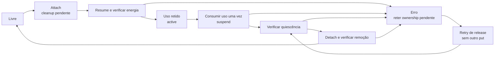

# Telemetria HDQ do N71 — implementação em curso

Pendência [#2](https://github.com/djalmajr/iphone6s-linux/issues/2).
O codec já tem gates Mac, ARM64 e contexto kernel. UART, mux compartilhado,
identificação do gauge e unidades físicas ainda não foram validados.

**Estado físico em2026-10-04:** iPhone no iOS para recarga após descarga no
Linux. Leituras locais passaram 5%→17%→51%→79% com carga ativa, sem PIN. Alimentação #2
tem prioridade; novos probes Wi-Fi estão adiados. [Registro e implementação
SN2400 sem I/O](ALIMENTACAO.md#encoder-sn2400-específico-n71--cálculo-implementado-driver-pendente).

## Referência verificável

Usamos o kernel Apple N71 como dados, obtido pelo
[procedimento fixado](N71_REFERENCIA.md). O SHA do binário decodificado foi
recalculado e coincide com o registro anterior. Dumps e disassembly continuam
privados; apenas [fatos selecionados](evidence/n71-hdq-charger-reference.json)
são publicados. Endereços de funções pertencem exclusivamente a essa versão.

`setHDQInterfaceGated` escolhe máscaras 40/60 conforme um campo de software
em object+d4. A rotina `_chargerModeGated` aceita modos 0/1 e escreve esse
campo: ele não é uma leitura de revisão do chip.

`enableEvents` altera três máscaras em cache e as escreve nos registros 1–3
do SN2400. O segundo argumento corresponde ao registro2. Habilitar eventos
limpa bits da máscara; desabilitar os repõe. Portanto, escrever 40/60 no
registro0 como suposto controle de carga não reproduz a sequência observada.
Mesmo uma futura alteração correta de máscara deve preservar o estado herdado
e tratar IRQs e outros donos. Ainda falta confirmar efeitos de leitura de status.

A primitiva HDQ escreve4 no registro1d, espera bit5 com deadline de um segundo
e sleep10ms, e opcionalmente escreve6. Erro de leitura tenta escrever0; o ramo
de timeout e o erro da primeira escrita não restauram diretamente nessa
primitiva. Isso identifica operações da referência, **não** uma sequência
reversível já pronta para o nosso driver. Uma implementação deve contabilizar
escrita parcial e preservar/restaurar o estado conhecido, sem presumir que0
sempre seja o valor correto de retorno.

## Recursos e próximo desenvolvimento

A referência runtime liga o HDQ a UART5 (20a0d4000/IRQ197), GPIO2/flags102 e
ao provider tigris/SN2400 no endereço75. O nome bq27540 no ADT não identifica
por si só a revisão ou o register map da bateria instalada.

Na cadeia DTS Linux fixada, I2C1 (20a111000) está desativado e o include da
placa habilita I2C0. UART5 só existe no fragmento do projeto, desativado.
Habilitar um driver genérico não preenche os bindings e a sequência do mux.

Próximos gates, agrupados com Wi-Fi quando houver sessão física:

1. Inventário somente leitura dos nós/status e donos Linux. Sem varrer I2C,
   ler registradores de status por suposição ou transmitir no UART.
2. Confirmar pinmux GPIO2, clocks e propriedade da linha/cliente SN2400;
   implementar transação limitada e reversível, separada dos limites de carga.
3. Identificar ABI/revisão antes de interpretar tensão, corrente, temperatura
   e capacidade. RespostaFFFF não vale como prova de presença.
4. Obter leituras físicas coerentes/repetíveis e corrente líquida qualificada;
   somente então avaliar carga sustentada e operação contínua.

Atualizações de módulos e userspace devem usar SSH no mesmo boot. Alteração
indispensável de kernel/DT exige candidata separada e pode exigir novo DFU;
agregar esses deltas antes de pedir a ação física. Nenhuma nova leitura de
sensor ou escrita de carregador foi executada para preparar este documento.

## Inventário físico agrupado — 2026-10-02

A leitura do DT no Linux7.2 confirmou status disabled para I2C1 e UART5.
Não houve varredura I2C, acesso ao SN2400, transmissão UART ou gauge read.
O PMIC no I2C0 tem MFD/RTC/NVMEM ativos; isso não qualifica o carregador75 do
outro barramento. power_supply continua vazio. Esses resultados restringem a
próxima candidata; não representam falha do codec nem prova de sensor.
Ver [sessão agrupada](evidence/n71-reg-on-first-physical.json).

## GPIO2/config102 — referência confirmada, sem escrita física

O provider GPIO do N71 usa `AppleS5L8960XGPIOIC`, identificado pelo cstring,
metaclass e vtable do binário fixado. A primeira classe encontrada no kext
pertence a T8006; não foi usada para inferir o comportamento N71.

`AppleARMGPIOFunction` copia o pacote ADT e, na inicialização, chama sua
função com argumentos nulos. Para config102, o byte de modo vale2 e o byte
de polaridade vale1. A chamada escolhe a rotina de modo, sem escrever um
nível de saída como faria para modo1. O modo2 Apple não é o seletor2 Linux.

O setter N71 usa a máscara270 no registrador por pino, com stride4. Para
GPIO2, offset08: valor220 quando a propriedade `glitchless` está ausente ou
zero; valor210 quando ela é nãozero. A referência runtime coletada tem a
propriedade ausente no nó GPIO phandle1e. A escrita preserva os outros bits:
`(old & ~mask) | (value & mask)`. O caminho normal corresponde ao seletor
periférico1 e input-enable; também limpa bit4, que a rotina genérica de
pinmux Linux não inclui em sua máscara. A variante glitchless não deve ser
substituída pelo seletor normal por conveniência.

O [contrato puro](../phone/kernel/n71-hdq-pinmux.h) só calcula offset,
máscara e valor para pin2/config102 e variante conhecida. Não acessa MMIO
nem adquire a linha. Dez mutações compiladas verificam pin/config inválidos,
variante, stride, função, input-enable e bits preservados no Mac e ARM64.
O header também compilou em contexto kernel com Werror na VM isolada.

Antes do adapter físico, ainda faltam aquisição da linha compartilhada,
snapshot/readback/restore da máscara qualificada, coordenação UART/clocks
e cleanup do SN2400. Nenhum GPIO, UART ou carregador foi alterado nesta fase.

Reprodução dos testes:

```sh
python3 tests/run_n71_hdq_pinmux_mutations.py
```

Conferência privada dos trechos da referência (sem executar o firmware):

```sh
python3 - <<'PY'
import hashlib
import json
from pathlib import Path

evidence = json.loads(Path('docs/evidence/n71-hdq-charger-reference.json').read_text())
raw = Path('runtime/n71-driver-reference-20261002/kernelcache.n71.macho').read_bytes()
assert hashlib.sha256(raw).hexdigest() == evidence['decoded_kernel_sha256']
for window in evidence['gpio2_reference']['verification_windows']:
    start, size = window['file_offset'], window['size']
    assert 0 <= start < len(raw) and start + size <= len(raw)
    assert hashlib.sha256(raw[start:start + size]).hexdigest() == window['sha256']
print('N71_GPIO2_REFERENCE_WINDOWS_OK')
PY
```

Os hashes confirmam os trechos analisados; não substituem a análise das
instruções nem comprovam comportamento elétrico no aparelho.

## Redução de reinicializações — recursos já presentes

A configuração preservada7.2 inclui `CONFIG_OF_DYNAMIC=y`,
`CONFIG_OF_OVERLAY=y` e `CONFIG_CONFIGFS_FS=y`. A fonte fixada exporta
`of_overlay_fdt_apply` e `of_overlay_remove` para módulos GPL. A existência
de configfs não comprova um carregador de overlays por arquivos; não foi
encontrada uma opção `CONFIG_OF_CONFIGFS` nessa configuração.

Essas APIs oferecem um caminho a investigar para habilitar recursos no
mesmo boot, por módulo próprio e alvo estritamente qualificado. Remover
um overlay não comprova restauração elétrica: os callbacks de driver e
propriedade dos pinos/clocks ainda precisam ser delimitados. Não foi
aplicado overlay no aparelho. Manter UART5/I2C1 desativados até qualificar
cleanup, em vez de habilitar nós pela presença da API.

Na cadeia `s8000.dtsi` → `s800-0-3.dtsi` → `s800-0-3-pmgr.dtsi`,
`ps_uart5` usa reg80200 e depende de `ps_sio_p`; `ps_i2c1` usa reg801a0
com o mesmo pai. O ADT runtime declara `clock-gates=0x55` para UART5
(**85 decimal**, não55 decimal). O ID do gate não foi convertido em
offset por aritmética presumida. O papel isolado do bit4 na máscara270
também não foi classificado como direção GPIO genérica.

## Adapter serdev 8N2 — compilado, ainda sem integração

A API serdev da fonte fixada não tem operação para selecionar stop bits.
A referência N71 exige57600/8N2. O [patch](../phone/kernel/patches/0002-serdev-stop-bits.patch)
adiciona `serdev_device_set_stop_bits`, um callback de controlador e seu
registro no adapter TTY. `CSTOPB` representa dois stop bits na
[API serial documentada pelo kernel](https://www.kernel.org/doc/html/latest/driver-api/serial/driver.html).
Não há chamada automática, cliente novo ou alteração de porta no probe.

A operação aceita apenas1/2, recusa callback ausente ou TTY fechado e
propaga erro do backend. O adapter copia termios, altera somenteCSTOPB
e confere o estado aceito pelo TTY. O teste verifica os campos e caracteres
de controle explícitos, sem depender de padding da estrutura C. A confirmação
do TTY não é uma medição da forma de onda; em erro, o chamador precisa
tratar estado possivelmente alterado, sem presumir restauração automática.

Os testes compilam as funções e o registro de callback adicionados pelo
patch real, com backend TTY sintético. Mac e ARM64 passaram baseline e12
mutações compiladas por SIGABRT/asserção, incluindo callback não registrado,
contagem encaminhada incorreta, readback rejeitado e erro engolido. Checkpatch
passou com0erros/0avisos; `core.o` e `serdev-ttyport.o` compilaram comWerror
no worktree isolado. [Hashes e escopo](evidence/n71-serdev-stop-bits.json).

```sh
python3 tests/run_n71_serdev_stop_bits_mutations.py
```

A build realizada usa:

- Fonte preservada: `/home/ubuntu/kernel-n71-source-20261001`, commit958481f.
- Worktree próprio: `/home/ubuntu/kernel-n71-serdev-source-20261002`.
- Saída separada: `/home/ubuntu/kernel-n71-serdev-build-20261002`.
- Patch aplicado somente após `git apply --check`; três arquivos exatos
  alterados, hashes publicados e diff vazio na fonte preservada.
- Configuração inicial copiada de `kernel-n71-build-20261001-v2/.config`,
  seguida de `olddefconfig` e compilação dos objetos alterados.

Comando de compilação reproduzível nesse worktree:

```sh
make -C /home/ubuntu/kernel-n71-serdev-source-20261002 \
  O=/home/ubuntu/kernel-n71-serdev-build-20261002 ARCH=arm64 -j2 \
  KCFLAGS=-Werror drivers/tty/serdev/core.o drivers/tty/serdev/serdev-ttyport.o
```

Não houve link de Image, modpost ou boot deste patch. Ele ainda não integra
o helper de patchset DART nem um perfil de deployment. Como muda o layout
das operações serdev, a futura integração exige recompilar kernel e módulos
e usar identificação de kernel distinta. Não carregar esse delta como módulo
na imagem atual. A receita de [build fonte](KERNEL-SOURCE-BUILD.md) continua
como base para preparar a candidata agregada após qualificar mux/clocks e
releaseSN2400. UART5/I2C1 seguem desativados; gauge e carga sem prova física.

A [candidata DART+serdev](N71_KERNEL_BUNDLE.md) já tem aplicação de fonte e
três objetos verificados num worktree/output próprios, com identidade distinta.
Não houve Image/modpost/perfil ou boot do conjunto; o helper legado permanece
separado. Essa preparação reúne deltas para um futuro teste físico único.

## Liberação HDQ — seleção qualificada, backend pendente

O campo object+b0 da referência guarda o resultado da busca por
`function-battery_alert`, na inicialização005d674ac..005d674bc. O CString
fixado em0054f73a9 confirma o nome; não tratamos esse campo como um
ponteiro de controlador inferido. A presença do resultado também não prova
que uma função física esteja registrada no nosso Linux.

Para o pedido padrão command0/request0, o fluxo seleciona:

| Modo software | Cache+b8 | Alert presente | Status7/bit7 | Ação de referência |
| --- | --- | --- | --- | --- |
| 1 | zero | qualquer | qualquer | Sem handshake |
| 1 | nãozero | qualquer | qualquer | Handshake sem escrita final06 |
| 0 | qualquer | sim | limpo | Handshake com escrita final06 |
| 0 | qualquer | demais casos | demais casos | Escrita00 em1d |

Ao desabilitar os eventos, o fluxo usa o cache+b8 com bit40 removido
quando há resultado da busca `battery_alert`; sem esse resultado, mantém
a máscara. Essa operação usa `enableEvents` e suas máscaras em cache,
não uma escrita direta de uma constante no registrador0 do carregador.
O modo é software, não revisão física do chip.

O [seletor](../phone/kernel/n71-hdq-release-plan.h) calcula somente ação e
bits de eventos, sem callback ou acesso ao aparelho. Exige status marcado
válido, bytes limitados, modo0/1 e presença0/1; uma entrada recusada não
altera a saída. Não executa o plano, não limpa a pendência do handshake e
não afirma restauração. O adapter ainda precisa qualificar efeitos das
leituras de status, propriedade de IRQs/máscaras, mux e cleanup verificado.

```sh
python3 tests/run_n71_hdq_release_plan_mutations.py
```

O teste cobre todas as combinações de modo0/1, máscara0..255, presença0/1
e status0..255. Mac/ARM64 passaram baseline e14 mutações por asserção;
o header compilou em contexto kernel comWerror na VM isolada. Isso não
constitui prova elétrica de HDQ, bateria, carga ou restauração.

Os sete trechos analisados têm offsets/tamanhos/hashes em `release_reference`
dos [fatos selecionados](evidence/n71-hdq-charger-reference.json). Para
reproduzir a conferência, use o comando de janelas acima com
`evidence['release_reference']['verification_windows']`. O binário privado
não é publicado nem executado.

## Observador GPIO2 do bundle — sem escrita física

O provider da fonte fixada usa `REGCACHE_FLAT`: uma leitura normal de regmap
pode vir do cache. Sua operação de mux usa máscara260; a referência N71
para GPIO2 também inclui bit4, com máscara270. Não substituir essas máscaras
por uma escrita MMIO direta: ela contornaria o owner e poderia divergir do
cache. A [documentação pinctrl](https://docs.kernel.org/driver-api/pin-control.html#pin-control-interaction-with-the-gpio-subsystem) distingue aquisição
de GPIO e seleção de função periférica; GPIO solicitado não é autorização
para tomar um mux UART mantido por outro consumidor.

O [observador](../phone/kernel/n71-hdq-gpio-observe.c) é um módulo externo
com `run=1` explícito. Confere N71, caminho do provider, compatible, recurso
MMIO, driver existente e regmap32/stride4. Mantém device_lock durante duas
leituras normais e duas leituras bypassed do offset08 via API regmap. Essa
API preserva/restaura flags de cache sob o lock interno. Não chama request
GPIO, pinctrl, set direction, escreve registrador ou aciona UART/carregador.
Não reconstrói a estrutura privada do driver nem faz rebind.

O log separa os quatro resultados e compara somente a máscara270 entre
as duas amostras físicas e a leitura normal final. `stable=1` descreve
aquelas duas amostras; não mede propriedade da linha, nível elétrico, rail
ou capacidade da bateria. Unload não precisa restaurar mux, pois o módulo
não adquiriu/configurou a linha. Esse observador prepara o próximo backend,
sem substituir os gates de SN2400, UART, cleanup e identificação do gauge.

[Hashes, APIs e build](evidence/n71-hdq-gpio-observer.json): compilou com
Werror/modpost contra os exports do bundle existente, ELF relocável AArch64
e vermagic `7.2.0-iphone6s-dart-serdev1`. O hash foi recalculado no Mac;
Image e configuração foram preservados. O arquivo permanece privado em
`runtime/n71-hdq-gpio-observer-build-20261003/n71-hdq-gpio-observe.ko`.

Para reproduzir, copie as fontes públicas de `phone/kernel` para novo
diretório M na VM dedicada e execute a receita de módulos externos do
[bundle](N71_KERNEL_BUNDLE.md), com seu `vmlinux.symvers`. Não suprimir
erros de símbolos. Depois valide ELF/vermagic/hash e transfira o observador
via SSH para `/run/` no mesmo boot do bundle; confira SHA no destino antes
de `insmod /run/n71-hdq-gpio-observe.ko run=1`. Exigir log
`N71_HDQ_GPIO2` sem erro, executar `rmmod n71_hdq_gpio_observe` e conferir
o marcador `N71_HDQ_GPIO2_UNLOADED` e ausência do módulo em sysfs. Logs
completos e observações do aparelho permanecem privados.

Foi transferido e carregado no mesmo boot do teste PCIe do bundle. As quatro
leituras retornaram00072220; hardware mascarado270=220, stable1/cache-matches1.
Unload e ausência do módulo foram confirmados. [Evidência física selecionada](evidence/n71-bundle-first-physical.json).
Isso qualifica somente aquelas amostras; não demonstra owner, UART, handshake
SN2400 ou sensor. Continua sem autoload no initramfs e sem alterar os dois
módulos selecionados do experimento PCIe.

## Reprodução da aritmética SN2400 — sem barramento/driver

O [encoder](../phone/kernel/n71-sn2400-input-reference.h) distingue suspend
de código0 e recusa calibração não modelada. Seus testes são executados por:

```sh
python3 -m unittest discover -s tests -p test_n71_sn2400_input_reference.py -v
```

Mac/ARM64 passaram oito mutações reais e um oracle multiply/shift derivado
das instruções fixadas para todos os pedidos16bit. Objeto de verificação
kernel compilou comWerror, sem módulos carregados ou alteração de imagem.
Reproduzir na VM com diretório de entradas novo e `M` separado, conforme
o [procedimento do bundle](N71_KERNEL_BUNDLE.md). Não há cliente I2C ativo.

Os trechos do novo [registro de referência](evidence/n71-sn2400-input-reference.json)
podem ser conferidos sem executar firmware:

```sh
python3 - <<'PY'
import hashlib
import json
from pathlib import Path

evidence = json.loads(Path('docs/evidence/n71-sn2400-input-reference.json').read_text())
raw = Path('runtime/n71-driver-reference-20261002/kernelcache.n71.macho').read_bytes()
assert hashlib.sha256(raw).hexdigest() == evidence['decoded_kernel_sha256']
for window in evidence['verification_windows']:
    start, size = window['file_offset'], window['size']
    assert 0 <= start < len(raw) and start + size <= len(raw)
    assert hashlib.sha256(raw[start:start + size]).hexdigest() == window['sha256']
print('N71_SN2400_REFERENCE_WINDOWS_OK')
PY
```

O setter Apple usa cache/ordem e tratamento de erros que não fornecem restore
pronto. O timer seleciona modo software1/0, não qualifica watchdog de hardware.
O adapter futuro precisa coordenar controle de carga e ownership HDQ, conservar
estado físico e provar cleanup. Não enviar UART, fazer scanI2C ou programar
limites apenas porque o encoder ou a referência está presente.

## I2C1: driver existente, aquisição ainda não qualificada

`CONFIG_I2C_APPLE=y` seleciona `i2c-pasemi-core.c` e
`i2c-pasemi-platform.c`; não existe um arquivo `i2c-apple.c` nessa fonte.
O driver se chama `i2c-apple` e casa com `apple,i2c`, presente no nó S8000.
A configuração também tem I2C_CHARDEV e o GPIO provider. Isso evita depender
de instalar pacotes ou reconstruir kernel apenas para a existência do driver,
mas não valida funcionamento físico do I2C1 desativado.

Na DTS S8000 fixada, I2C1 tem base20a111000/1000, AIC207 level-high,
clkref, domínio ps_i2c1 e pinctrl114/115 seletor1. O include6s só habilita
I2C0. Esses pinos são da fonte Linux: comparar routing/mux com a referência
Apple/runtime antes de ativar, sem tratá-los como prova física.
[Hashes e fatos selecionados](evidence/n71-i2c-acquisition-reference.json).

O probe habilita clock, calcula divisor (frequência padrão100kHz), lê revisão
do controlador, escreve IMASK0 e CTL com reset de FIFO/divisor; para revisão
maior ou igual6 também seta CTL_EN. Registra o adapter com devm_i2c_add_adapter
e depois tenta IRQ; falha de requestIRQ mantém polling e ainda retorna sucesso.
Não confundir esse sucesso com IRQdelivery comprovada.

Remove é vazio. Adapter, clock, handlerIRQ e MMIO são geridos por devres, porém
não há restore explícito dos valores iniciais de CTL/IMASK nessa função.
A propriedade e a remoção do mapping AIC são um gate separado do handlerIRQ;
não presumir que devm_request_irq o destrói.
A remoção de device/overlay não é prova de restauração dos pinos, FIFO,
interrupções ou estado elétrico. Não fazer bind/rebind do I2C0 para testar.

O próximo adapter deve começar pelo inventário passivo de I2C1/owners,
child-clients, domínio/clock/IRQ e mux114/115, sem registrar controlador nem
acessar seus FIFOs. Após qualificar idle e cleanup, preparar dispositivo de
plataforma temporário com recursos do nó original para um ciclo limitado no
mesmo boot. Separar isso do cliente SN2400@75 e de qualquer leitura/escrita
do carregador; não usar varredura I2C ou probe A10 automático. Testes futuros
podem ser agrupados com o candidato PCI somente após recarga suficiente.

Não houve ativação/overlay/cliente/transmissão nesta análise; carga e gauge
permanecem pendentes. As duas fontes I2C e a DTS foram conferidas limpas
contra HEAD958481f, independentemente dos patches DART/serdev do bundle.

## Observador passivo I2C1/GPIO114/115 — preparado, sem teste no aparelho

O [módulo separado](../phone/kernel/n71-i2c-topology-observe.c) verifica N71,
I2C1 disabled, sem filhos, plataforma ou adapter encontrados. Confere recurso
20a111000/1000, IRQ bruto 0/207/4 e recurso AIC 20e100000/100000, clock fixo
declarado de 24 MHz, domínio DT 801a0/4 e pinctrl 115/114 seletor 1. Esses dados são
declarações Linux. Não mede clock/estado de energia, cria mapping IRQ, adquire clock,
registra controlador/cliente, aplica overlay ou transmite I2C.

A identidade dos nós usa lookup por caminho absoluto e comparação de ponteiro.
Na fonte OF fixada, `full_name` recebe o nome local de `fdt_get_name`; ele
não deve ser comparado diretamente a um caminho absoluto. O harness reproduz
esses nomes e recusa nós homônimos de outra hierarquia. A primeira versão
`4436af0` compilou, mas falhou por asserção contra esse contrato corrigido;
a build selecionada é a v2 do código `98bc26b`. Nenhuma delas foi carregada.

O GPIO provider existente deve corresponder ao nó/recurso 20f100000/100000,
driver `apple-gpio-pinctrl` e regmap de 32 bits/stride 4. Device lock protege o regmap devm
contra unbind durante a coleta. Para cada pino 114/115, registra cache inicial,
duas leituras hardware via `regmap_read_bypassed` e cache final; oito leituras
no total, offsets 1c8/1cc. Somente após todas passarem emite as duas linhas
GPIO e o marcador `OBSERVED`; qualquer erro impede resultado parcial de sucesso.
Não solicita/configura pinos nem escreve registradores.

`stable` e `cache-matches` comparam palavras completas de duas amostras e
cache final. Não provam dono dos pinos, idle elétrico, routing Apple, gauge
ou carga. Ausência de platform/adapter é a observação naquele instante;
não é reserva do controlador para uma operação futura. Referências/lock
são liberados antes de terminar o init. O módulo não permanece como proprietário.

[Prova de build e limites](evidence/n71-i2c-topology-observer.json): módulo
real executado em harness C de APIs de kernel, 86 casos e 15 mutações por
asserção no Mac/ARM64. Módulo externo de 15.768 bytes compilado com Werror/modpost,
ELF64LE/REL AArch64 e vermagic do bundle preservado; Image/config/exports
iguais antes/depois. As dependências externas não incluem escritas regmap,
transferências I2C, solicitação GPIO/IRQ ou habilitação de clock. **Não foi carregado
no telefone**; os testes sintéticos não validam leitura elétrica no hardware.

Reprodução dos testes, na raiz de `iphone-linux-tools`:

```sh
python3 -B tests/test_n71_i2c_topology_observe.py
```

Build na VM dedicada, com fonte/output do bundle já preservados e um novo diretório M:

```sh
umask 077
mkdir -p runtime
module_dir="$(mktemp -d "$PWD/runtime/i2c-observe-build.XXXXXX")"
cp phone/kernel/n71-i2c-topology-observe.c "$module_dir/"
cat > "$module_dir/Makefile" <<'MAKEFILE'
obj-m += n71-i2c-topology-observe.o
ccflags-y += -Werror
MAKEFILE
env LOCALVERSION= make -C /home/ubuntu/kernel-n71-bundle-source-20261002 \
  O=/home/ubuntu/kernel-n71-bundle-build-20261002 ARCH=arm64 -j2 \
  KCFLAGS=-Werror M="$module_dir" \
  KBUILD_EXTRA_SYMBOLS=/home/ubuntu/kernel-n71-bundle-build-20261002/vmlinux.symvers modules
modinfo -F vermagic "$module_dir/n71-i2c-topology-observe.ko"
sha256sum "$module_dir/n71-i2c-topology-observe.ko"
```

Conferir antes/depois os hashes preservados na prova. O aviso de `Module.symvers`
global ausente permanece: este build usa explicitamente `vmlinux.symvers`;
não suprimir erros de modpost nem habilitar `KBUILD_MODPOST_WARN`. Hash binário
pode depender do caminho M/toolchain; ELF, ABI e proveniência devem coincidir
com a build efetivamente selecionada antes de qualquer transferência.

No próximo boot necessário do bundle, transferir por SSH para `/run` e comparar
SHA no destino. Só então carregar `insmod /run/n71-i2c-topology-observe.ko run=1`,
capturar novas linhas `N71_I2C1_GPIO`/`OBSERVED` desse load, descarregar com
`rmmod n71_i2c_topology_observe` e conferir marcador `UNLOADED`, ausência em
`/sys/module/n71_i2c_topology_observe` e SSH/HTTP ainda respondendo. Não usar
linhas antigas de `dmesg` como resultado do novo load. Logs completos ficam
privados. Não pede novo DFU, autoload ou rebuild do kernel para esta coleta.

Após a observação, ainda faltam comparação física dos pinos, aquisição e
restauração do I2C1/IRQ/clocks, efeitos de leitura SN2400 e telemetria HDQ.
Somente esses gates permitirão preparar o ciclo ativo do controlador e
avaliar controle de carga. O aparelho continua no iOS recarregando nesta fase.

## I2C1: pinos Apple e ABI do descriptor confrontados

O ADT N71 fixado declara `gpio-iic_scl` como três palavras little-endian
`115, 0x10102, 0x5041` e `gpio-iic_sda` como `114, 0x10102, 0x5041`.
Os números coincidem com o grupo Linux I2C1; os descriptors têm 12 bytes.
O mesmo nó declara base relativa a arm-io `0xa111000`, tamanho `0x1000`,
IRQ 207, clock-gate 71 e clock-id 280. IDs Apple não foram convertidos em
offsets PMGR ou frequência por aritmética presumida.
[Trechos e hashes selecionados](evidence/n71-i2c-acquisition-reference.json).

Na classe `AppleS5L8940XI2CController`, o start busca as duas propriedades
pelo factory de `AppleGPIOICController`, conservando SCL em `object+0x100` e
SDA em `object+0x108`. A terceira palavra é o papel `AP`, comparado ao campo obtido
da propriedade `role`; não é um phandle ADT. A inicialização copia o pacote
e escolhe modo pelo primeiro byte da segunda palavra. Para modo 2, o byte de valor
inicial no bit 16 não seleciona uma escrita de nível; esse ramo é específico
de modo 1. O modo é encaminhado ao slot `0x5e8` do provider.

Isso qualifica a referência de número/formato/encaminhamento. Não transforma
o descriptor em medição de pull, drive, clock, idle ou ownership Linux. O
adapter ainda precisa comparar as leituras GPIO 114/115 com a máscara N71
qualificada, adquirir os pinos pelo provider e conservar estado/cache.
Não copiar a programação GPIO2 para os outros pinos só por semelhança.

O init do controlador Apple escreve CTL (`0x1c`) com divisor nos oito bits
baixos (fallback 4 para divisor menor que 2), SMSTA (`0x14`)=`0x0aa00040`,
IMASK (`0x18`)=0 e offset `0x10`=`0x80000000`. Também pode aplicar tunables
por máscara em `0x38/0x30/0x2c`; revisão maior ou igual a 6 acrescenta CTL_EN.
Offset `0x10` não recebeu aqui um nome ou
semântica inventada. Essa sequência difere do reset FIFO do driver Linux;
não deve ser reexecutada como probe de leitura ou restore presumido.

O caminho `_unjamBus` usa os dois objetos GPIO, inicia um laço com 9,
chama a função `device_reset` e reinicializa o controlador. Desabilitar o
adapter ou registrar/remover um dispositivo de plataforma não reproduz essa recuperação.
Nenhum desses pulsos, resets ou writes foi executado no aparelho nesta fase.
O próximo passo continua sendo aquisição/idle/restauração delimitados e
coleta física agrupada do observador preparado, mantendo o carregador separado.

Para reproduzir a conferência dos trechos, após decodificar as referências
pelos procedimentos existentes de [ADT](../scripts/research/apple-n71-map.py)
e [kernel](N71_REFERENCIA.md), use os arquivos privados locais:

```sh
python3 - <<'PY'
import hashlib
import json
from pathlib import Path

reference = json.loads(Path('docs/evidence/n71-i2c-acquisition-reference.json').read_text())['apple_i2c1_reference']
for filename, digest, key in (
    ('runtime/n71-reference-final3-20261002/n71-adt-private.bin', reference['adt_sha256'], 'descriptor_windows'),
    ('runtime/n71-driver-reference-20261002/kernelcache.n71.macho', reference['kernel_sha256'], 'verification_windows'),
):
    raw = Path(filename).read_bytes()
    assert hashlib.sha256(raw).hexdigest() == digest
    for window in reference[key]:
        start, size = window['file_offset'], window['size']
        assert 0 <= start < len(raw) and start + size <= len(raw)
        assert hashlib.sha256(raw[start:start + size]).hexdigest() == window['sha256']
print('APPLE_I2C1_REFERENCE_WINDOWS_OK')
PY
```

Os hashes identificam os trechos; sua semântica vem da análise das instruções
e dos metadados. Dumps/disassembly completos não são publicados nem executados.

## Observador PMGR — I2C1 e domínios pais

O [módulo separado](../phone/kernel/n71-pmgr-power-observe.c), código
`80b3fe0`, limita-se ao PMGR `20e000000/8c000` e à cadeia
`i2c1@801a0 → sio_p@80158 → sio_busif@80150`. Confere caminhos, recursos,
compatible, labels, relações phandle e ausência de clock/reset no parent.
Não aciona domínio, clock, reset, controlador ou cliente I2C.

Antes de obter o syscon map, exige o domain já ligado ao driver
`apple-pmgr-pwrstate`, com `of_node` correto, sob device lock. Na fonte
fixada desse driver, seu probe só chega ao sucesso depois de obter o map
do mesmo parent. Esse binding sob lock qualifica a precondição nesta build;
`syscon_node_to_regmap` é uma API get-or-create no caso geral e não deve
ser chamada como lookup passivo sem esses gates. Não copia structs privados
do driver, registra provider ou acessa uma região MMIO alternativa.

São duas leituras `regmap_read_bypassed` por domain, seis no total. Um lock
por vez protege a conferência de binding; referências/locks são liberados
em todos os caminhos. As três linhas `N71_PMGR domain=...` e o marcador
`N71_PMGR_OBSERVED` só são emitidos depois de todas as leituras passarem.
`stable` compara palavras completas. A cadeia é amostrada sequencialmente:
não é um snapshot atômico, reserva de ownership ou prova de idle do I2C.

No driver Linux fixado, alvo ocupa bits 3:0, estado real bits 7:4,
auto-enable bit 28 e reset bit 31; os valores de estado usados são ativo
`f`, clock-gated `4` e power-gated `0`. Isso explica a referência do software;
as amostras não medem frequência, tensão, percentual ou corrente de bateria.
Mesmo um estado ativo não comprova controlador/SN2400 funcional ou carga.

[Prova selecionada](evidence/n71-pmgr-power-observer.json): módulo real
executado em harness C, 88 cenários/16 mutações compiladas por asserção no
Mac e ARM64; build externo Werror/modpost, 11.672 bytes, ELF64 LE/REL AArch64
e ABI do bundle. Image/config/exports e fontes selecionadas preservados.
Imports diretos não incluem escrita regmap, IRQ, DMA, clock/reset ou ioremap.
O gate syscon descrito acima continua obrigatório apesar desse audit.
**Nenhum load físico foi realizado.**

Reproduzir os gates na raiz de `iphone-linux-tools`:

```sh
python3 -B tests/test_n71_pmgr_power_observe.py
```

Build isolado na VM dedicada, com source/output do bundle preservados:

```sh
umask 077
mkdir -p runtime
module_dir="$(mktemp -d "$PWD/runtime/pmgr-observe-build.XXXXXX")"
cp phone/kernel/n71-pmgr-power-observe.c phone/kernel/n71-pmgr-access.h "$module_dir/"
cat > "$module_dir/Makefile" <<'MAKEFILE'
obj-m += n71-pmgr-power-observe.o
ccflags-y += -Werror
MAKEFILE
env LOCALVERSION= make -C /home/ubuntu/kernel-n71-bundle-source-20261002 \
  O=/home/ubuntu/kernel-n71-bundle-build-20261002 ARCH=arm64 -j2 \
  KCFLAGS=-Werror M="$module_dir" \
  KBUILD_EXTRA_SYMBOLS=/home/ubuntu/kernel-n71-bundle-build-20261002/vmlinux.symvers modules
modinfo -F vermagic "$module_dir/n71-pmgr-power-observe.ko"
sha256sum "$module_dir/n71-pmgr-power-observe.ko"
```

O aviso de `Module.symvers` global ausente é conhecido; são usados os exports
preservados, sem suprimir erros modpost. Conferir hashes antes/depois e ABI.
O caminho M/toolchain pode mudar o hash binário; selecionar a prova daquela build.

Na próxima sessão física necessária, coletar no mesmo boot do bundle junto
do [observador I2C1/GPIO](#observador-passivo-i2c1gpio114115--preparado-sem-teste-no-aparelho).
Transferir o módulo PMGR para `/run` por SSH e conferir SHA no destino antes
de `insmod /run/n71-pmgr-power-observe.ko run=1`. Guardar somente linhas desse
load, remover com `rmmod n71_pmgr_power_observe`, conferir `N71_PMGR_UNLOADED`,
ausência em `/sys/module/n71_pmgr_power_observe` e SSH/HTTP preservados.
Não usar dmesg antigo como prova do load atual nem pedir DFU por módulo.
Salvar snapshot e retornar ao iOS ao concluir a coleta curta, pois carga
sustentada Linux continua sem comprovação. Nenhum usuário precisa operar o console.

## Erros dos callbacks PMGR — correção preparada

A [patch separada](../phone/kernel/patches/0004-apple-pmgr-errors.patch),
código `301a61f`, propaga os erros de `apple_pmgr_ps_set`, assert/deassert,
reset e status. A primeira escrita falha encerra a mudança de estado;
um poll falho encerra antes de auto-enable; o erro da escrita de auto-enable
chega ao caller. Reset interrompe a sequência no primeiro update falho,
liberando o lock; reset completo não espera nem deasserta após assert falho.
Status devolve erro de leitura, em vez de relatar reset inativo.

Palavras, máscaras e ordem de sucesso são preservadas. Erro após efeito
parcial **não** restaura hardware; cleanup continua obrigação do caller.
Na patch004 isolada, `apple_pmgr_ps_is_active` e o probe ainda descartam
erros. A [patch005 abaixo](#erros-iniciais-do-probe-pmgr--correção-preparada)
propaga esses erros iniciais. Cleanup após registro e restauração de efeitos
parciais continuam pendentes; as patches não qualificam aquisição ativa
I2C1 ou uso do carregador.
[Integração pendente #36](https://github.com/djalmajr/iphone6s-linux/issues/36).

[Prova selecionada](evidence/n71-pmgr-errors.json): 492 casos por baseline
Mac/ARM64, 14 mutações compiladas detectadas por SIGABRT/asserção e fonte
original também detectada. O harness compila as funções reais da patch,
incluindo falhas sintéticas com efeitos parciais, palavras/ordem/locks e
limites do poll. Não é teste de transições físicas ou de corrente da bateria.

O arquivo inteiro compilou Werror como **objeto embutido** ARM64 de 11.328
bytes, sem `-DMODULE`, com initcall e sem `__this_module`. Modpost externo
falhou: o driver embutido não declara MODULE_LICENSE e
`of_phandle_iterator_args` não é exportado pelo bundle preservado.
Os erros ficaram registrados sem supressão. Não acrescentar exports/licença
para fabricar um módulo nem carregar um provider duplicado.
Full link/Image e teste físico permanecem pendentes.

### Reprodução do objeto embutido na VM

Executar a partir da raiz do clone público na VM dedicada, com o source
958481f e output do bundle já preparados. Não altera a fonte do bundle.
Conferir antes/depois `.config`, Image e vmlinux.symvers pelos digests da prova.
O hash do objeto pode depender do caminho/toolchain; selecionar o artefato
produzido naquela execução. Não exige pacote novo no Mac ou DFU.

```bash
set -euo pipefail
umask 077
repo_dir="$PWD/iphone-linux-tools"
kernel_src=/home/ubuntu/kernel-n71-bundle-source-20261002
kernel_out=/home/ubuntu/kernel-n71-bundle-build-20261002
provider=drivers/pmdomain/apple/pmgr-pwrstate.c
patch_dir="$repo_dir/phone/kernel/patches"
test "$(git -C "$kernel_src" rev-parse HEAD)" = 958481f87fee0949ff6a9a4af77f7eb6dac8a149
python3 "$repo_dir/tests/test_n71_pmgr_errors.py"
python3 "$repo_dir/tests/test_n71_pmgr_probe.py"
python3 "$repo_dir/tests/test_n71_pmgr_provider_failure.py"
sha256sum "$kernel_out/.config" "$kernel_out/arch/arm64/boot/Image" "$kernel_out/vmlinux.symvers"
task_dir=$(mktemp -d /home/ubuntu/n71-pmgr-errors-check.XXXXXX)
mkdir -p "$task_dir/$(dirname "$provider")" "$task_dir/builtin-object"
cp "$kernel_src/$provider" "$task_dir/$provider"
printf '%s  %s\n' 4b0adc3013e2fabe9ca1cb8228f8f6b7934af4b667f7f0f893b675102d8710df "$task_dir/$provider" | sha256sum -c -
git -C "$task_dir" apply --check "$patch_dir/0004-apple-pmgr-errors.patch"
git -C "$task_dir" apply "$patch_dir/0004-apple-pmgr-errors.patch"
printf '%s  %s\n' cc65bad1b788c4fa1d6e374b236f1b27c840797b727a600035294f17b71433e9 "$task_dir/$provider" | sha256sum -c -
git -C "$task_dir" apply --check "$patch_dir/0005-apple-pmgr-probe-errors.patch"
git -C "$task_dir" apply "$patch_dir/0005-apple-pmgr-probe-errors.patch"
printf '%s  %s\n' 7ad9c93264edbf3e42400ff7d654e0c143db68f4500b196a8ae6ee260e43b5a4 "$task_dir/$provider" | sha256sum -c -
git -C "$task_dir" apply --check "$patch_dir/0006-apple-pmgr-provider-cleanup.patch"
git -C "$task_dir" apply "$patch_dir/0006-apple-pmgr-provider-cleanup.patch"
printf '%s  %s\n' ec4841316d8c3a8dad7ac44d93edac0209c581b4e4c0d2fb9dcfb89853754414 "$task_dir/$provider" | sha256sum -c -
cp "$task_dir/$provider" "$task_dir/builtin-object/pmgr-pwrstate.c"
printf 'obj-y += pmgr-pwrstate.o\n' > "$task_dir/builtin-object/Makefile"
env LOCALVERSION= make -C "$kernel_src" O="$kernel_out" ARCH=arm64 -j2 \
  KCFLAGS=-Werror M="$task_dir/builtin-object" pmgr-pwrstate.o
file "$task_dir/builtin-object/pmgr-pwrstate.o"
sha256sum "$task_dir/builtin-object/pmgr-pwrstate.o"
sha256sum "$kernel_out/.config" "$kernel_out/arch/arm64/boot/Image" "$kernel_out/vmlinux.symvers"
```

Conferir a primeira linha de `.pmgr-pwrstate.o.cmd`: sem `-DMODULE`.
`nm` deve mostrar initcall e não `__this_module`. Conservar inputs/logs privados
com hashes; não publicar objetos, dumps ou chaves. A integração futura deve
agrupar GPIO/PMGR/DART necessários numa candidata separada, preservando rollback.
A observação passiva dos pinos/PMGR continua possível no bundle atual por SSH,
com os dois módulos preparados no mesmo boot curto; nenhum `insmod` desta patch.

## Erros iniciais do probe PMGR — correção preparada

A [patch005](../phone/kernel/patches/0005-apple-pmgr-probe-errors.patch),
código `21a786c`, aplica após004. O helper de estado passa a devolver erro
e só escreve o bool de saída após leitura válida. Probe propaga falhas de
min-state, leitura de estado, power-on de domínio always-on e auto-PM antes
de registrar genpd/provider/reset. Propriedade min-state ausente ou fora do
limite mantém a semântica anterior; máscaras/flags e sucesso são preservados.

[Prova selecionada](evidence/n71-pmgr-probe-errors.json): 3.138 cenários,
12 mutações compiladas detectadas por SIGABRT/asserção e predecessor004
detectado no Mac/ARM64. Fixture compila funções reais, verificando domínio
publicado/ausente, palavra final, primeiro erro e bool preservado na falha.
Fonte completa004+005 compilou obj-y/Werror, objeto ARM64 de 11.424 bytes,
sem MODULE; config/Image/exports preservados. Callbacks111 conferidos byte
a byte iguais, com seus gates reutilizados. A receita acima reproduz agora
as três patches004+005+006 numa cópia, sem alterar o provider funcional.

**Ainda pendente:** cleanup depois de registrar genpd/provider, validação
do iterator e efeitos parciais; link completo da imagem e qualificação física.
Na fonte genpd fixada, remover um domínio pode retornar EBUSY por provider,
filhos ou dispositivos. A patch005 isolada não remove o domínio quando
add_provider falha; a patch006 abaixo corrige esse caminho. Não presumir
que um retorno de erro restaura hardware ou
reserva ownership. [Issue #36](https://github.com/djalmajr/iphone6s-linux/issues/36).
Nenhuma aquisição ativa I2C1, operação do carregador ou leitura gauge foi feita.

## Falha de publicação do provider PMGR — cleanup preparado

A [patch006](../phone/kernel/patches/0006-apple-pmgr-provider-cleanup.patch),
código `f728099`, aplica depois de004+005. Se add_provider falhar, remove
o domínio já inicializado e preserva o primeiro erro, sem chamar del_provider.
Na fonte genpd fixada, has_provider só é marcado após sucesso completo;
apagar um provider alheio nessa falha seria incorreto. Os erros posteriores
mantêm a ordem existente: del_provider antes de remover o domínio.

[Prova selecionada](evidence/n71-pmgr-provider-cleanup.json): 3.258 casos,
incluindo120 novos cenários de falha de publicação, seis mutações compiladas
e predecessor005 detectados por asserção no Mac/ARM64. As funções reais da
patch são compiladas; a fixture controla somente dependências Kernel API.
Confere domínio ausente, provider alheio preservado, primeiro erro e efeitos
das escritas anteriores preservados. Compilação falha nunca conta como kill.

Fonte completa004+005+006 compilou obj-y ARM64/Werror, objeto11.424 bytes
com initcall e sem MODULE; config/Image/exports preservados. Os gates dos
callbacks anteriores foram reutilizados sem alteração dessas funções.
A receita acima reproduz a sequência completa, sem módulo duplicado.

A correção é limitada à falha antes de publicar o provider. Concorrência e
cleanup pós-publicação, remoção recusada, iterator e rollback de efeitos
parciais seguem pendentes. O [Image completo e os módulos da ABI power](N71_KERNEL_BUNDLE.md#image-completo-da-candidata-gpiopmgr--2026-10-04)
já passaram os gates de build/composição; boot físico, ownership/idle I2C1,
carregador e corrente líquida continuam sem prova. [Issue #36](https://github.com/djalmajr/iphone6s-linux/issues/36).
Nenhum DFU ou reboot do iPhone foi feito nesta entrega.

## Coleta agrupada de energia na ABI power — verificada

O [registro de preparação](evidence/n71-power-session-gate.json) seleciona
o perfil base `7.2.0-iphone6s-dart-serdev-power1` e os dois observadores
recompilados. Esse perfil conserva o DTB original, com PCIe, I2C1 e UART5
desativados. Nenhum módulo é carregado automaticamente.

A cópia privada do coletor anterior mudou somente seis constantes:
release, perfil, dois caminhos de módulo e seus dois hashes. O corpo foi
conferido byte a byte após desfazer essas substituições. Três fixtures
externas de transporte passaram: sucesso, marcador de observação ausente
e ring dmesg rotacionado. Cada comando gerado passou bash-n; falhas recusam
a conclusão e removem os arquivos de staging. As fixtures simulam SSH e
não são observações do telefone. A primeira execução dos testes usou um
namespace compartilhado e falhou na contagem de resultados; o runner novo
isola cada cenário e conserva as tentativas anteriores.

O perfil real, os dois módulos e o snapshot local de44 entradas foram
validados no Mac, sem USB. O fluxo físico preparado é:

1. Ler a bateria no iOS imediatamente antes do boot; manter o cabo USB-A
   traseiro e usar o perfil base explícito, restaurando o snapshot validado.
2. Fazer um único DFU manual. Conferir kernel/placa/boot_id, SSH e HTTP.
3. Transferir ambos os módulos por SSH para uma pasta própria sob `/run`,
   verificando os hashes local/remoto e ausência de loads anteriores.
4. Carregar e descarregar os observadores, um de cada vez, com `run=1`.
   Exigir linhas novas OBSERVED/UNLOADED, mesmo boot e SSH/HTTP após cada um.
   A coleta tem prazo de120s; não altera pins, PMGR, I2C ou carregador.
5. Conferir ausência dos módulos e staging, salvar snapshot e retornar ao
   iOS no mesmo boot, com alvo de até cinco minutos para a sessão inteira.

Os scripts privados são `runtime/n71-power-session-20261004/collect-passive-power-v2-private.py`
e `power-v2-preflight-private.json`; contêm caminhos/seleção da instalação
local e permanecem fora do repositório público. Para reproduzir o procedimento
em outra instalação, use os dois fontes públicos de observação e os gates
de build acima, selecionando os hashes realmente produzidos nessa instalação.
A chave SSH fica no Mac e os logs/resultados permanecem privados até sanitização.

Em2026-10-05UTC (2026-10-04 no horário local), um DFU manual concluiu esse
fluxo: wrapper0, restore44 entradas, SSH/HTTP/Herdr e ambos os observadores
com load/unload aprovados. Mesmo boot e serviços foram conferidos antes e
depois de cada módulo; a pasta própria foi removida. O snapshot final,
sync e retorno ao iOS por software passaram, sem intervenção no console.

GPIO114/115: cached-before, duas leituras de hardware e cached-after
foram `00076221`, com stable/cache-matches=1 nos dois pinos. O controlador
continua disabled, sem filhos, platform device ou adapter. PMGR: I2C1
`00000200`, sio_p `000000ff` e sio_busif `1400024f`, cada um repetido sem
diferença. São amostras sequenciais, sem reserva da cadeia ou prova de
idle elétrico. Nenhum pin, domínio, controlador ou carregador foi ativado.

As preparações históricas acima referem-se aos artefatos de ABI anterior;
os hashes efetivamente carregados estão no registro da sessão power1.
OBSERVED não habilita carga: aquisição/restauração I2C1, semântica dos
registradores SN2400 e medição da corrente líquida continuam gates separados.

## Lifecycle runtime PM I2C1 — sequência testada, backend pendente

`phone/kernel/n71-i2c-power-lifecycle.h` organiza ownership, uso runtime PM
e cleanup. [Fontes e provas selecionadas](evidence/n71-i2c-power-lifecycle.json).
É um contrato por callbacks: não registra dispositivo, ativa domínio ou
controlador, programa pinctrl ou acessa I2C/SN2400.

O backend deverá validar N71/recursos/owner/idle antes de criar um consumidor
virtual com `dev_pm_domain_attach_by_id`. A fonte fixada desse caminho faz
attach sem power_on e habilita runtime PM. Não criar um platform device
I2C que possa acionar automaticamente o driver do controlador.

Na ABI conferida, `pm_runtime_resume_and_get` retorna0 com uma referência
ou erro sem essa referência. A sequência marca cleanup antes do resume e
exige verificação de energia antes de expor active. Um erro pode deixar
efeitos físicos mesmo sem referência de uso; cleanup continua obrigatório.

`pm_runtime_put_sync_suspend` consome a referência inclusive em erro;
o retry usa suspend sem novo put. Retorno1 de suspend significa sucesso.
Quiescência precisa ser verificada antes de detach. Detach é void, pode
falhar e enfileira poweroff: o backend deve manter referência própria ao
objeto até conferir que ele realmente deixou o domínio. Nunca tomar o
retorno da chamada como prova de remoção ou liberação elétrica.



O erro de aquisição permanece primário; `cleanup_error` expõe a falha de
liberação separadamente. Ownership pendente recusa nova aquisição. O caller
deve serializar operações e reter objeto/module enquanto isso persistir.
As fixtures provam esse contrato; não prometem que repetir suspend recuperará
um genpd com erro físico. Não mascarar esse erro alterando manualmente o
estado de runtime PM para conseguir descarregar o módulo.

```sh
python3 iphone-linux-tools/tests/run_n71_i2c_power_lifecycle_mutations.py
```

Doze cenários/13 mutações compiladas passaram no Mac/ARM64, com kills somente
por SIGABRT/asserção. Objeto do header inteiro __KERNEL__/Werror compilou
na ABI power; Image/config/exports/inputs/fontes ficaram intactos. O runner
está no CI Ubuntu/macOS. A compilação não é um backend genpd executado;
acesso ao controlador, registro SN2400, HDQ/gauge e carga continuam pendentes.


## Acesso PMGR compartilhado — qualificado sem ativação

O código `152e07b` extraiu para `phone/kernel/n71-pmgr-access.h` as validações
usadas pelo observador. [Evidência selecionada](evidence/n71-pmgr-access.json).
O observador mantém seis leituras bypassed e publica resultados somente
após sucesso completo. Não ganha ativação, ownership genpd ou escrita.

O caller conserva referências OF, começa com um handle vazio e desbloqueia
na mesma tarefa. Caminhos e índice são validados antes de usar metadata.
Provider bound e mapa são conferidos sob device_lock; a referência própria
mantém o device enquanto o lock protege seus recursos. O mapa só vale até
unlock, que limpa ambos os campos e pode ser repetido. Handle aberto recusa
reentrada. Não manter esses locks entre callbacks de tarefas diferentes.

Gates Mac/ARM64:97 cenários/22 mutações compiladas por SIGABRT/asserção,
com reentrada, índice/caminhos, mapa/ref inválidos e três providers distintos.
O módulo externo power1 passou W=1/Werror/modpost/ELF/vermagic. Aviso de
Module.symvers global ausente preservado; vmlinux.symvers real fornecido,
sem suprimir erros modpost. Image/config/exports e inputs ficaram intactos.
Nenhum novo load físico: a prova da sessão anterior mantém seus próprios
módulos/hashes e não se transfere automaticamente para este rebuild.

Reprodução nativa na raiz do projeto:

```sh
python3 -m unittest discover -s tests -p test_n71_pmgr_power_observe.py -v
```

Build isolado na VM com o Image power1 já preparado:

```sh
umask 077
module_dir="$(mktemp -d "$PWD/runtime/pmgr-access-build.XXXXXX")"
cp phone/kernel/n71-pmgr-power-observe.c phone/kernel/n71-pmgr-access.h "$module_dir/"
printf 'obj-m += n71-pmgr-power-observe.o\n' > "$module_dir/Makefile"
make -C /home/ubuntu/kernel-n71-power-source-20261004 \
  O=/home/ubuntu/kernel-n71-power-build-20261004 M="$module_dir" \
  W=1 KCFLAGS=-Werror \
  KBUILD_EXTRA_SYMBOLS=/home/ubuntu/kernel-n71-power-build-20261004/vmlinux.symvers modules
modinfo -F vermagic "$module_dir/n71-pmgr-power-observe.ko"
sha256sum "$module_dir/n71-pmgr-power-observe.ko"
```

O caminho M/toolchain pode mudar o hash binário. Conferir inputs e
Image/config/exports antes/depois; não escolher um `.ko` só pela release.
Esse helper será usado pelo backend genpd em construção. Runtime PM
suspenso não equivale por si só a energia elétrica desligada; erros fatais
podem impedir novas chamadas. [Referência do kernel](https://docs.kernel.org/power/runtime_pm.html).
Carga, corrente líquida, HDQ, SN2400 e Wi-Fi continuam sem prova funcional.


## Backend genpd I2C1 — compilado, proteção de binding pendente no Image

`phone/kernel/n71-i2c-genpd.h`, código `1cdfa72`, implementa callbacks reais
para o lifecycle125. [Hashes/gates/limites](evidence/n71-i2c-genpd.json).
O caller cria e conserva um consumidor root, mantém referências OF e
serializa operações. Não criar um platform device I2C para isso.
Antes de attach, o backend exige N71/providers qualificados, consumidor
root no I2C1 disabled, sem filhos/controller/adapter, recurso correto e
power-domain único para a leaf. Cada callback qualifica e trava os três
providers na mesma ordem, liberando os locks antes de retornar.

Attach usa a API genpd sem power_on e conserva referência própria ao
virtual device. Resume exige estado/uso coerente, depois verifica duas
amostras bypassed de cada domínio: target active e actual active ou auto-PM,
sem RESET/DEV_DISABLE. Release exige runtime suspended/uso zero, leaf
powergate sem auto-PM e detach realmente concluído com domínio removido e
device unregistered. Pais compartilhados não são forçados a desligar.

A fonte genpd fixada ignora o retorno de power_off em runtime suspend.
Portanto retorno0 não substitui a leitura de hardware: o teste de suspend
bem-sucedido com leaf ligada retém cleanup e referência, sem detach. Retry
não decrementa o uso outra vez nem inventa um runtime status. Após falha de
detach, só o estado realmente suspended com disable_depth1 causado pela
própria tentativa admite retry sem nova chamada PM desabilitada.
Quando perde a qualificação dos providers, put_noidle consome o uso sem
callbacks de hardware e mantém o domínio para cleanup posterior.

### Binding do provider precisa durar todo o ownership

O provider006 fixado não tem remove e permitia bind/unbind manual.
Get_device mantém o device, mas não conserva devm/driver depois de unbind.
Os locks do helper127 só excluem unbind durante cada callback.
A [patch007](../phone/kernel/patches/0007-apple-pmgr-no-manual-bind.patch)
marca suppress_bind_attrs desde o registro do driver. O backend recusa
qualquer um dos três providers sem essa proteção antes de attach.
Providers serão builtin no Image dedicado; driver_unregister arbitrário
por outro código kernel fica fora do contrato. Não chamar isso de proteção
contra todas as formas possíveis de remoção ou de recuperação garantida.

Patch007 aplicou em cópia exata do provider006 e o arquivo completo passou
obj-y/Werror. O backend inteiro compilou/linkou num gate externo, com ELF
AArch64/vermagic power1 conferidos. Esse gate não tem entrada operacional
ou sysfs control e não foi carregado no iPhone. Power1 existente continua
intacto e deliberadamente não passa o novo guard. Próxima integração cria
power2 separado com007; a ausência de bind/unbind precisa ser observada
fisicamente antes de qualquer ciclo de domínio/controlador/charger.

### Reproduzir sem usar o aparelho

Na raiz de `iphone-linux-tools`:

```sh
python3 -m unittest discover -s tests -p test_n71_i2c_genpd.py -v
```

87 cenários/20 mutações compiladas morreram somente por SIGABRT/asserção
Mac/ARM64. Fixtures de APIs kernel não são execução de genpd físico; a
qualificação PMGR real é coberta separadamente pelo gate127. Fontes,
Image/config/exports e inputs preservados, logs transferidos com SHA.

Para compilar o provider007 em cópia isolada na VM, mantendo power1:

```sh
umask 077
mkdir -p runtime
repo_dir="$PWD"
task_dir="$(mktemp -d "$PWD/runtime/pmgr-binding-build.XXXXXX")"
provider=drivers/pmdomain/apple/pmgr-pwrstate.c
mkdir -p "$task_dir/source/$(dirname "$provider")" "$task_dir/object"
cp "/home/ubuntu/kernel-n71-power-source-20261004/$provider" "$task_dir/source/$provider"
printf '%s  %s\n' ec4841316d8c3a8dad7ac44d93edac0209c581b4e4c0d2fb9dcfb89853754414 "$task_dir/source/$provider" | sha256sum -c -
git -C "$task_dir/source" apply --check "$repo_dir/phone/kernel/patches/0007-apple-pmgr-no-manual-bind.patch"
git -C "$task_dir/source" apply "$repo_dir/phone/kernel/patches/0007-apple-pmgr-no-manual-bind.patch"
printf '%s  %s\n' 0d84693ae4f5a24df9f8c9499ecd0f8f6725566223428dfe7af686cf7a21f5b2 "$task_dir/source/$provider" | sha256sum -c -
cp "$task_dir/source/$provider" "$task_dir/object/pmgr-pwrstate.c"
printf 'obj-y += pmgr-pwrstate.o\n' > "$task_dir/object/Makefile"
make -C /home/ubuntu/kernel-n71-power-source-20261004 \
  O=/home/ubuntu/kernel-n71-power-build-20261004 M="$task_dir/object" \
  W=1 KCFLAGS=-Werror pmgr-pwrstate.o
```

Compilar e linkar os callbacks num gate C sem registrar driver:

```sh
module_dir="$task_dir/backend"
mkdir -p "$module_dir"
cp phone/kernel/n71-i2c-genpd.h phone/kernel/n71-i2c-power-lifecycle.h \
  phone/kernel/n71-pmgr-access.h "$module_dir/"
cat > "$module_dir/n71-i2c-genpd-gate.c" <<'SOURCE'
#include <linux/module.h>
#include "n71-i2c-genpd.h"
int n71_genpd_kernel_gate(struct n71_i2c_genpd *backend, struct n71_i2c_power_state *state);
int n71_genpd_kernel_gate(struct n71_i2c_genpd *backend, struct n71_i2c_power_state *state)
{
 struct n71_i2c_power_io io = n71_i2c_genpd_io(backend);
 return state->attached ? n71_i2c_power_release(&io, state) : n71_i2c_power_acquire(&io, state);
}
MODULE_LICENSE("GPL");
SOURCE
printf 'obj-m += n71-i2c-genpd-gate.o\n' > "$module_dir/Makefile"
make -C /home/ubuntu/kernel-n71-power-source-20261004 \
  O=/home/ubuntu/kernel-n71-power-build-20261004 M="$module_dir" \
  W=1 KCFLAGS=-Werror \
  KBUILD_EXTRA_SYMBOLS=/home/ubuntu/kernel-n71-power-build-20261004/vmlinux.symvers modules
modinfo -F vermagic "$module_dir/n71-i2c-genpd-gate.ko"
sha256sum "$module_dir/n71-i2c-genpd-gate.ko"
```

Não usar seu `.ko` como módulo de diagnóstico operacional nem carregá-lo.
O caminho de build/toolchain pode mudar o hash binário; conferir a prova
selecionada e preservar o Image/config/exports antes/depois.
HDQ, acesso SN2400, telemetria/corrente líquida, carga e Wi-Fi seguem abertos.


## Caller genpd operacional power2 — preparado em2026-10-05

`phone/kernel/n71-i2c-power-diagnostic.c` implementa o caller do backend qualificado. A inicialização conserva um root consumer e referências OF, valida o controlador disabled/sem adapter, os três providers protegidos e duas amostras de quiescência do leaf. Não ativa energia nessa etapa. `action=cycle` faz attach/resume/verificação ativa e release/verificação física/detach no mesmo callback; `action=cleanup` repete somente a restauração pendente. [Código e prova selecionada](evidence/n71-binding-profile.json).

Todos os controles usam o mesmo mutex. Uma referência adicional do módulo permanece enquanto objetos ou cleanup estão pendentes; isso impede unload normal e novo cycle. Um put já consumido não é repetido. Falhas conservam erro primário e `cleanup_error`; suspend com domínio ainda ligado não autoriza detach. Retry não garante recuperar hardware. Remoção forçada não é suportada. Parâmetros de ação anteriores à inicialização são recusados e não há autoload ou cycle no initramfs.

**Provas atuais:** caller e backend reais compilados com fixtures das APIs kernel,39 cenários/11 mutações compiladas por SIGABRT/asserção no Mac/Ubuntu ARM64. O primeiro harness reutilizava estado RPM do device já removido no segundo attach; foi corrigido para modelar a alocação de um novo device. Seis módulos passaram W=1/Werror/modpost/ELF/vermagic power2; SHA, ELF e vermagic foram recalculados no Mac. São provas de código/build, sem ciclo físico, I2C/SN2400, HDQ ou carga.

### Reprodução dos módulos

Na VM, a partir da cópia pública do projeto, use a fonte/output power2 preparados conforme o [runbook do Image](N71_KERNEL_BUNDLE.md#image-power2-e-proteção-de-binding--2026-10-05). O diretório abaixo corresponde à execução registrada e já existe; escolha outro nome ao repetir. Hashes de módulos de um build novo devem ser recalculados e vinculados à sua própria prova; não use módulos de outra release.

```sh
set -eu
umask 077
work_dir=/home/ubuntu/kernel-n71-binding-source-20261005
build_dir=/home/ubuntu/kernel-n71-binding-build-20261005
module_dir=/home/ubuntu/n71-i2c-power-control-inputs-20261005-v1/phone/kernel
test ! -e "$module_dir" && test ! -L "$module_dir"
python3 -B -m unittest discover -s tests -p test_n71_i2c_power_diagnostic.py -v
python3 scripts/build/kernel_bundle.py check "$work_dir" \
  --profile n71-dart-serdev-power-v2
mkdir -p "$module_dir"
cp phone/kernel/Makefile phone/kernel/*.c phone/kernel/*.h "$module_dir/"
sha256sum "$build_dir/.config" "$build_dir/arch/arm64/boot/Image" \
  "$build_dir/vmlinux.symvers" > "$module_dir/kernel-before.sha256"
test "$(cat "$build_dir/include/config/kernel.release")" = 7.2.0-iphone6s-dart-serdev-power2
env LOCALVERSION= make -C "$work_dir" O="$build_dir" ARCH=arm64 -j2 \
  W=1 KCFLAGS=-Werror M="$module_dir" \
  KBUILD_EXTRA_SYMBOLS="$build_dir/vmlinux.symvers" modules
for name in n71-pcie-diagnostic n71-wlan-power-diagnostic n71-hdq-gpio-observe \
            n71-i2c-topology-observe n71-pmgr-power-observe n71-i2c-power-diagnostic; do
  test "$(modinfo -F vermagic "$module_dir/$name.ko")" = \
    '7.2.0-iphone6s-dart-serdev-power2 SMP preempt mod_unload aarch64'
  readelf -h "$module_dir/$name.ko"
  sha256sum "$module_dir/$name.ko"
done
sha256sum -c "$module_dir/kernel-before.sha256"
python3 scripts/build/kernel_bundle.py check "$work_dir" \
  --profile n71-dart-serdev-power-v2
```

A execução registrada validou os campos ELF relocatable/AArch64 e preservou os37 inputs por SHA. Os seis módulos e logs ficam privadamente no Mac, em `runtime/n71-binding-module-artifacts-20261005/` e `runtime/n71-i2c-power-control-20261005/`,700/600. Nenhuma chave ou payload privado foi enviado à VM.

### Próxima sessão física: uma entrada DFU, operação pelo Mac

1. Manter USB-A → Lightning traseiro. Registrar bateria iOS imediatamente antes do boot; usar um snapshot validado e um perfil power2 explícito. Um único DFU manual; nenhum PIN ou comando no console Linux.
2. Conferir placa N71, release power2, boot_id, SSH/HTTP/Herdr/restore. Antes de carregar o caller, conferir que o driver `apple-pmgr-pwrstate` existe e **não expõe bind/unbind**. Guard do caller também exige a flag do driver em cada operação.
3. Observar GPIO114/115 e PMGR com os módulos recompilados; transferências usam pasta própria sob `/run`, hashes local/remoto e módulos inicialmente ausentes. Não misturar com módulos power1.
4. Carregar o caller com `run=1`; exigir `N71_I2C_POWER_READY`, estado pronto/limpo e ausência de attach/ativação automática. Só então enviar `cycle`, coletando estado, linhas novas de dmesg e continuidade do mesmo boot/SSH/HTTP.
5. Cleanup pendente exige diagnóstico e `cleanup`; não repetir cycle, descartar referências ou forçar rmmod. Somente estado limpo e módulo não retido permitem unload e remoção do staging. Salvar snapshot/sync e retornar ao iOS para medir bateria ao final. Um resultado negativo não vira prova de carga.

Comandos do **lado Linux, pelo SSH do Mac**, após os preflights e transferência verificada para uma pasta própria. O nome `n71_i2c_power_diagnostic` usa underscores em sysfs. Estes comandos são procedimento futuro, ainda não executado fisicamente:

```sh
set -eu
test "$(uname -r)" = 7.2.0-iphone6s-dart-serdev-power2
provider=/sys/bus/platform/drivers/apple-pmgr-pwrstate
test -d "$provider" && test ! -e "$provider/bind" && test ! -e "$provider/unbind"
# Use o caminho exato do módulo transferido e conferido por SHA:
insmod /run/SEU_STAGING/n71-i2c-power-diagnostic.ko run=1
control=/sys/module/n71_i2c_power_diagnostic/parameters
cat "$control/status"
printf 'cycle\n' > "$control/action"
cat "$control/status"
# Se a ação falhar, inspecione o estado e logs; cleanup pode ser tentado:
# printf 'cleanup\n' > "$control/action"
# Só com active=0, attached=0, cleanup_pending=0, usage_held=0,
# module_retained=0 e cleanup_error=0:
# rmmod n71_i2c_power_diagnostic
```

Ligar/desligar genpd comprova uma pré-condição do acesso I2C1. Ainda faltam aquisição/idle/restauração de pinos/controlador/clock/IRQ/adapter, identificação/register map SN2400, HDQ e medição da corrente líquida. O comando acima não liga um servidor carregando pela tomada; #2/#8/#9/#36 continuam abertas.


## Transporte da sessão power2 — preparado sem ação no telefone

Os coletores privados são `runtime/n71-power2-session-20261005/collect-passive-power2-private.py` e `collect-genpd-power2-private.py`. Selecionam o perfil diagnóstico power2 e hashes dos módulos recompilados. O passivo conserva byte a byte o corpo anterior após desfazer as constantes; três fixtures SSH passaram (sucesso, marcador ausente e ring rotacionado), com23/12/12 comandos conferidos por bash-n e remoção de staging próprio. Não foram comandos no telefone.

O coletor genpd confere placa/release/mesmo boot, SSH/HTTP, ausência de bind/unbind e de módulo prévio, transfere por SHA para diretório próprio sob `/run` e pede dois cycles. Resultado só passa com estado limpo, dois logs novos de sucesso, unload e consumer ausente. Erro permite uma tentativa de cleanup; guarda estado/logs e retém staging se o módulo não puder ser removido. O guard exige boot e status exatos com retorno explícito, inclusive no trap; não depende de set-e para essas recusas. Não usa unload forçado.

Gate local: dois comandos gerados passaram bash-n; oito contratos do resultado recusam erro, estado pendente, marcador ausente ou duplicado. Três guards de unload foram executados em filesystem Bash temporário (limpo, boot alterado e cleanup pendente); duas mutações falharam por AssertionError. São provas limitadas de geração/parser/guards, sem teste completo do transporte ativo nem hardware. A CI do código6a66ff5 terminou success em PR37258928814/push37258925978, seis jobs. [Registro consolidado](evidence/n71-binding-profile.json).

A consulta atual do Mac não detectou iPhone no IOUSB nem um único alvo iOS. O operador foi solicitado a reconectar o USB-A traseiro; nenhum monitor/recovery/DFU foi iniciado nessa preparação. Após a reconexão, registrar bateria e executar a sessão agrupada; salvar snapshot e retornar ao iOS ao final. O goal e #2/#8/#9/#36 permanecem abertos.

## Inspeção do controlador I2C1 — preparada sem reset

`186f73e` acrescenta `n71-i2c-controller-observe.h`; `14117a4` integra `action=inspect` ao caller. Após aquisição genpd verificada, o helper reserva exclusivamente20a111000/1000 e faz seis leituras: REV28, SMSTA14 e XFSTA0c, duas amostras. Desfaz mapping/reserva antes de retornar; o caller sempre tenta release genpd, inclusive em erro da inspeção, preservando o erro primário e o de cleanup separadamente. [Registro de fontes, módulos, inputs e limites](evidence/n71-i2c-controller-inspection.json).

O driver PASemi fixado lê REV no probe, SMSTA no polling e XFSTA nos diagnósticos. Seu probe também escreve IMASK18/CTL1c, reseta FIFOs e registra o adapter; por isso não é usado como inspeção. A ação nova **não lê FIFO04 nem escreve registradores**. Não cria adapter, IRQ, clock ou pinctrl. Energia genpd é ativada, portanto essa ação não é uma observação passiva do aparelho inteiro.

`complete` indica seis words capturadas; all-ones é recusado. `stable` compara as duas amostras de cada word. `idle_status` somente classifica flags SMSTA: transfer/jam/erro/RX ausentes e TX FIFO empty presente, com as três words estáveis. Não prova níveis SCL/SDA, ownership dos pinos, ausência de outros mestres, restauração CTL/IMASK ou permissão para transacionar. Instabilidade e status ocupado são registrados sem reset/retry do controlador.

### Provas e reprodução

Observador real:37 cenários/18 mutações por SIGABRT/asserção. Caller + observador + backend reais juntos:52 cenários/14 mutações. Ambos passaram macOS/Ubuntu ARM64; cada mutação compila com Werror antes de executar. Foram observadas limpeza MMIO, seis offsets permitidos, ausência de reads em init/falha genpd, erro primário e retenção em cleanup pendente. O erro GCC inicial era disposição ambígua dos ifs da fixture; foi corrigida sem mudar as asserções. Um resumo privado do wrapper herdou a contagem11; os logs nativos e JSON recalculados provam14. Erros de compilação não contam como mutações detectadas.

Na raiz da cópia pública do projeto:

```sh
set -eu
python3 -B -m unittest discover -s tests -p test_n71_i2c_controller_observe.py -v
python3 -B -m unittest discover -s tests -p test_n71_i2c_power_diagnostic.py -v
```

Build real usou a mesma fonte/output power2, sem reconstruir ou trocar o Image, em uma pasta nova de módulos. Fonte/config/Image/exports e40 inputs foram preservados; seis módulos passaram W=1/KCFLAGS-Werror/modpost/ELF relocatable AArch64/vermagic, com SHA/ELF/vermagic recalculados no Mac. Artefatos privados: `runtime/n71-controller-module-artifacts-20261005/`,700/600. O módulo anterior permanece separado para rollback. Para repetir, use o [build de módulos acima](#reprodução-dos-módulos), trocando apenas `module_dir` para uma pasta nova e rodando também os dois testes deste trecho. Recalcule hashes da sua execução; não misture módulos de outras releases.

### Próxima coleta: dois cycles e inspect no mesmo boot

O novo coletor privado `runtime/n71-power2-session-20261005/collect-controller-power2-private.py` seleciona esse módulo e o perfil diagnóstico power2 explícito. Reúne dois cycles completos e depois inspect, com estado limpo entre ações e continuidade de boot/SSH/HTTP. São três ciclos do **domínio de energia**, sem reiniciar o iPhone entre eles. O passivo GPIO/PMGR, backup/restore e essas ações cabem em uma única entrada DFU. Nenhum comando precisa ser digitado no console do telefone.

O coletor só permite inspect após os dois cycles terem retornado sucesso/estado limpo; exige SHA do módulo, placa/release/boot, bind/unbind PMGR ausentes, linhas novas de dmesg e módulo/consumer ausentes ao final. Recalcula stable/idle_status das seis words e recusa incoerência, all-ones, erro ou marcadores duplicados. Limpeza pendente conserva módulo/objetos/staging; não existe unload forçado. O guard de unload anterior está preservado byte a byte.

Gate limitado do transporte:16 contratos de resultado, dois comandos bash-n, cinco cenários Bash em filesystem temporário (sucesso, cycle recusado/pendente e inspect recusado/pendente) e duas mutações do guard mortas por AssertionError. São simulações dos comandos/estados; não verificam SSH completo, callbacks no aparelho ou MMIO físico. Nenhum privilégio do Mac, reboot ou comando no telefone foi usado nesses gates.

Comandos futuros pelo SSH do Mac, **somente** após os preflights, observadores passivos e transferência/SHA do módulo correto. Interrompa em falha: guarde status/dmesg e use cleanup limitado; nunca force a remoção. Os comandos abaixo ainda não foram executados fisicamente:

```sh
set -eu
test "$(uname -r)" = 7.2.0-iphone6s-dart-serdev-power2
provider=/sys/bus/platform/drivers/apple-pmgr-pwrstate
test -d "$provider" && test ! -e "$provider/bind" && test ! -e "$provider/unbind"
insmod /run/SEU_STAGING/n71-i2c-power-diagnostic.ko run=1
control=/sys/module/n71_i2c_power_diagnostic/parameters
clean='ready=1 active=0 attached=0 cleanup_pending=0 usage_held=0 module_retained=0 cleanup_error=0'
test "$(cat "$control/status")" = "$clean"
for index in 1 2; do
  printf 'cycle\n' > "$control/action"
  test "$(cat "$control/status")" = "$clean"
done
printf 'inspect\n' > "$control/action"
test "$(cat "$control/status")" = "$clean"
dmesg
rmmod n71_i2c_power_diagnostic
test ! -e /sys/module/n71_i2c_power_diagnostic
test ! -e /sys/devices/n71-i2c1-power
```

Antes de aceitar resultado, correlacione somente linhas frescas desse load/boot e confirme continuidade SSH/HTTP. Salve snapshot/sync e retorne ao iOS para recarga enquanto carga Linux não estiver qualificada. Ainda faltam pinos/linhas, clock/IRQ/controller reset/restauração, SN2400/HDQ/gauge e corrente líquida. #2/#8/#9/#36 e o goal permanecem abertos.
