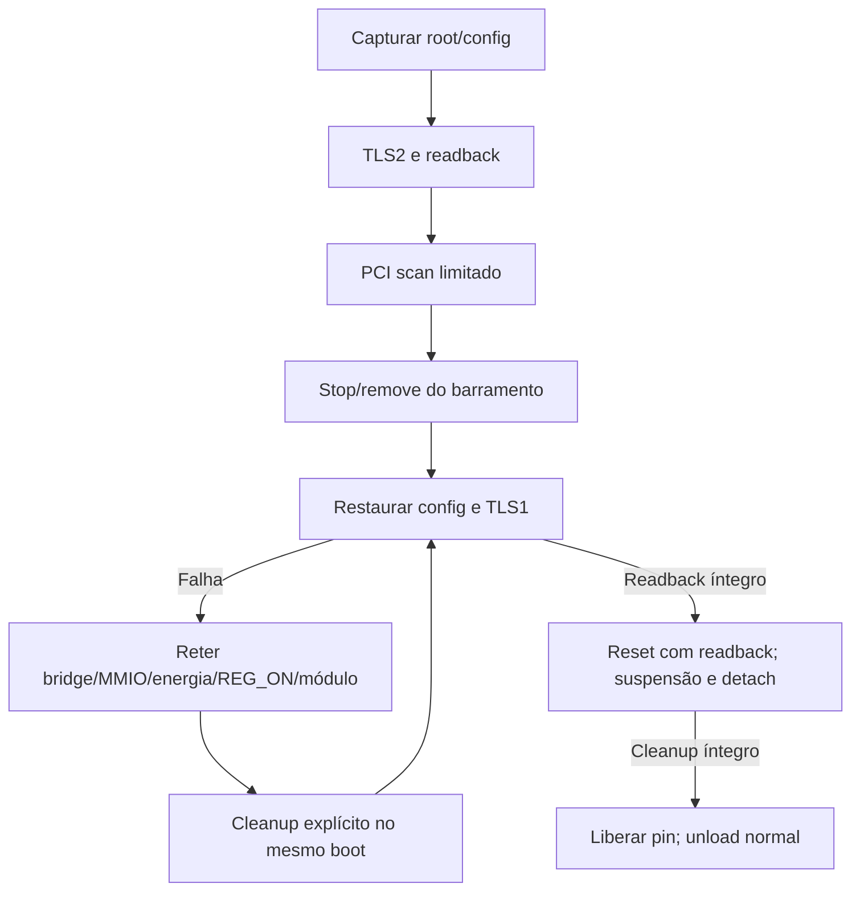

# Descoberta PCIe N71 após readback do latch

## Decisão e alcance

O último teste confirmou controle GPIO10 `80→81→80` por máscara1, com
readback e restore. O banco187/bit2 ficou0 e o gate então bloqueou PCIe.
Esses fatos permanecem em [evidência física](evidence/n71-reg-on-latch80-physical.json).

A revisão do getter Apple mostrou um pedido de mode1 antes da leitura;
nosso diagnóstico apenas leu o banco, com controle80/81 classificado como
mode2. Sem a tabela opcional, chamar o setter não garante mudança de modo.
O banco ainda não foi qualificado como monitor da saída dirigida ou do
rail. Portanto, não usar seu zero como prova de falta de alimentação,
nem trocar bits de modo para obter um número esperado.

O próximo experimento faz **uma tentativa delimitada de descoberta de
endpoint**, após readback fresco do latch. A hipótese a testar é se o
endpoint responde quando o controle qualificado está81. Não presume
rail ativo e não habilita DMA, driver de rádio, firmware ou tráfego Wi-Fi.
A prova decisiva será link válido, identidade e COMMAND com bus-master
limpo, pelo caminho já implementado; timeout continua sendo resultado
negativo, sem identificar sozinho a causa.

## Pré-condições antes de um único boot

1. Kernel, módulos, fonte, configuração, hashes e ABI selecionada conferidos.
   Para o bundle, exigir gates reais de [composição](N71_KERNEL_BUNDLE.md);
   não reutilizar módulo da ABI anterior.
2. Perfil separado, snapshot restaurável, init USB preservado e saída SSH
   com identidade estrita. Manter cabo/porta definidos pelo operador.
3. Recursos/clocks/reset/tunables específicos do N71, sem aliases de A10.
   O prefixo anterior confirmou root1004106b, sem endpoint/DMA; isso não
   comprova o comportamento do kernel novo antes de testá-lo.
4. Módulo REG_ON usa o mesmo parent/regmap simple-mfd-i2c; sem rebind,
   mudança de drive/mode, transmissão HDQ ou programação de carga.

## Sequência da sessão

1. Validar release, SSH/HTTP e restore; confirmar UART5/I2C1 desativados.
   Transferir módulos externos privadamente, conferir hash/ABI no destino.
2. Carregar observador REG_ON com `run=1`, sem argumento de ativação no
   insmod. Esta tentativa exige original80, owner exato e nenhuma pendência
   anterior. Estado diferente encerra a tentativa sem forçar configuração.
3. Fazer uma aquisição pela API já qualificada; exigir active1/pending1,
   original80 e getter `control` com `N71_REG_ON_CONTROL_READBACK value=81`.
   O getter só lê914 sob os locks existentes. Registrar o banco187 também,
   deixando explícito que é uma amostra sem qualificação elétrica.
4. Fazer uma tentativa PCIe com `run=1 enumerate=1`. O diagnóstico valida
   mapas/domínios, mantém PERST, prepara clocks/porta, libera reset e espera
   100ms antes do treinamento. Polling de link é limitado; identidade só
   é lida após predicate88/bit0 alto, e COMMAND não pode ter bus-master.
   Nenhum host PCI é registrado para um driver de rádio nessa operação.
5. Conferir `N71_PCIE_RESET_RESTORED asserted=1 readback=1` e
   `N71_PCIE_POWER_RELEASED powered=0 attached=0`. Falha de cleanup deve
   permanecer explícita; não contar apenas exit0 do insmod como prova,
   pois registro de driver não equivale a sucesso do probe.
6. Remover diagnóstico PCIe; liberar REG_ON pela API existente, exigir
   readback80/active0/pending0 antes de remover seu módulo. Não apagar
   pendência se restore falhar, nem repetir treinamento automaticamente.
7. Conferir SSH/HTTP, salvar snapshot/sync e retornar ao iOS para medição.
   Não calcular carga Linux com um baseline anterior à preparação.

Os nomes de arquivos/getters são interfaces para o coletor; o operador não
precisa ler nem digitar no console do iPhone. Só haverá DFU quando candidata
e gates estiverem prontos, agrupando as coletas que couberem nessa sessão.

## Resultados que não encerram a issue

Readback81 não mede tensão. Link/identidade não demonstram firmware, Wi-Fi,
DART/DMA ou carga sustentada. Amostra0 não será rebatizada como1. Ausência
de endpoint mantém a hipótese de alimentação, CLKREQ/PHY/reset ou outra
sequência aberta; não autoriza copiar configuração elétrica de outra placa.
A primeira execução física do bundle está registrada abaixo; a evidência histórica
da baseline permanece separada.

Os getters/registros novos compilaram Werror/modpost para a ABI baseline
em diretório exclusivo; ELF/AArch64/vermagic foram conferidos e a fonte
funcional permaneceu sem diff. Essa prova não permite carregar os mesmos
binários no bundle: o rebuild correspondente ao Image novo ainda é exigido.

## Coletor reproduzível do bundle

O rebuild e a composição real passaram nos [gates do bundle](N71_KERNEL_BUNDLE.md).
`scripts/host/n71-link-session.py` exige a ABI nova e os hashes dos módulos
registrados; não seleciona o perfil padrão nem inicia DFU. Confira primeiro
somente os arquivos locais:

```sh
python3 scripts/host/n71-link-session.py \
  --profile "$PWD/runtime/n71-bundle-diagnostic-profile-20261003/deployment.json" \
  --check
```

Depois de um boot explicitamente selecionado com snapshot restaurado e SSH/HTTP
confirmados, execute em saída nova:

```sh
python3 scripts/host/n71-link-session.py \
  --profile "$PWD/runtime/n71-bundle-diagnostic-profile-20261003/deployment.json" \
  --output-dir "$PWD/runtime/NOVA-SESSAO-N71"
```

O coletor recusa diagnóstico PCIe prévio nesse boot, módulos já carregados,
UART5/I2C1 ativos, ABI divergente e estado original diferente de80. Depois da
aquisição, exige estado ativo/pendente e controle81 fresco; repete esses testes
no aparelho imediatamente antes do único insmod PCIe. Amostra187 continua
observação, sem gate elétrico. Logs são exclusivos e privados; repetir uma
etapa não envia o comando outra vez. Não há autoload ou retry de treinamento.

Falhas e timeout SSH passam por cleanup: reset/domínios PCIe precisam de
registros positivos antes do unload; restore REG_ON precisa de readback80 e
pendência zero antes de unload. Observação recusada não escreve o controle.
O resultado privado distingue endpoint ausente, falha do experimento e cleanup
não comprovado. Exit0 com link `-110` registra um experimento negativo concluído
com restauração; não significa Wi-Fi habilitado. O script não reinicia o
aparelho: depois do cleanup, conferir serviços e usar `return_ios.py`, que
valida snapshot/sync antes do retorno. Se cleanup não passar, preservar logs
e tratar a falha antes de continuar.

Gates sintéticos, sem dispositivo ou dados privados:

```sh
python3 -m unittest discover -s tests -p test_n71_link_session.py
python3 tests/run_n71_link_session_mutations.py
```

## Primeira execução física do bundle — 2026-10-03

Uma sessão com um DFU manual confirmou a release selecionada, restore, Bash e
HTTP. Controle914 foi80→81→80 com máscara1/readbacks e pendência zero ao final.
O banco187 continuou20/bit2=0. Mesmo assim, o link passou: port88=00000005,
error0 em12 leituras; endpoint43a314e4 (vendor14e4/device43a3), COMMAND com
bus-master limpo. Isso confirma que aquela amostra0 não deve bloquear a
descoberta de endpoint. Não mede tensão nem qualifica o banco como power-good.

Reset/readback, liberação dos quatro domínios e unload foram confirmados. No
mesmo boot, GPIO2 foi observado sem escrita; serviços continuaram respondendo.
Snapshot/sync e retorno por software ao iOS passaram. Bateria iOS100→100 nesse
intervalo não mede corrente ou carga sustentada. [Fatos selecionados e hashes
dos logs privados](evidence/n71-bundle-first-physical.json).

O próximo desenvolvimento é o host PCI: recursos/BARs, IRQ e DART precisam de
contrato e cleanup antes de qualquer bus-master/rádio. A configuração atual
tem BRCMFMAC como módulo, mas BRCMFMAC_PCIE está desativado no Image. O
[conjunto externo PCIe/MSGBUF](N71_WIFI_MODULES.md) compilou para a mesma ABI,
preservando configuração e Image; não foi carregado no telefone. Identidade
PCI ainda não seleciona revisão, firmware ou calibração. Agrupar novos gates numa
candidata antes de pedir outro DFU; fazer fonte/builds/testes offline e atualizar
módulos por SSH enquanto uma sessão útil estiver ativa.

## Próxima candidata — inventário de configuração sem escrita

O PCI-ID físico 43a3 é `BRCM_PCIE_4350_DEVICE_ID` na
[fonte fixada dos IDs](https://github.com/HoolockLinux/linux/blob/958481f87fee0949ff6a9a4af77f7eb6dac8a149/drivers/net/wireless/broadcom/brcm80211/include/brcm_hw_ids.h).
O [match do driver PCIe](https://github.com/HoolockLinux/linux/blob/958481f87fee0949ff6a9a4af77f7eb6dac8a149/drivers/net/wireless/broadcom/brcm80211/brcmfmac/pcie.c)
aponta para BCM4350. A seleção de firmware ainda depende do chip e da revisão
internos, obtidos pelo driver após integrar BARs e host. O byte de revisão PCI
não substitui essa identificação. Nada foi carregado no rádio.

`n71-pcie-inventory.h` recebe somente um callback de leitura. Lê revisão,
classe, header tipo 0, seis BARs brutos, subsystem, linha/pino de IRQ e headers
convencionais PCIe/MSI/MSI-X. Não sonda BAR escrevendo FFFFFFFF, deduz tamanho
ou endereço ativo, toca MMIO de BAR ou habilita interrupção. Limita 63 leituras
de configuração, recusa ponteiros inválidos ou cíclicos, capacidades conhecidas
duplicadas e identidade/COMMAND divergentes no final. Bus-master inicial
bloqueia antes das outras leituras. A saída permanece intacta em qualquer recusa.

O adapter é explícito: `config_inventory=1` exige `run=1 enumerate=1`. Depois
do link, verifica port88 fresco antes de cada leitura. O diagnóstico mantém
reset e domínios sob sua responsabilidade e executa cleanup também em falha do
inventário. Ausência de MSI é informação, não autorização para fallback de IRQ.
[O kernel documenta](https://docs.kernel.org/PCI/pci.html#device-initialization-steps)
ativação, recursos, DMA e IRQ como passos próprios da inicialização.

[Build e gates offline](evidence/n71-pcie-config-inventory.json) passaram em
Mac e ARM64: erros em cada leitura, listas malformadas, mudanças tardias,
limite de 63 leituras e dez mutações por asserção. O módulo novo compilou com
Werror/modpost e os exports do bundle; ELF, vermagic e hash foram recalculados
no Mac. Default false; Image, perfis e módulos físicos anteriores preservados.
**O inventário foi confirmado na coleta de 2026-10-04, registrada abaixo.** O modo padrão do coletor
continua fixando o módulo físico anterior. O modo `--config-inventory` seleciona
o hash novo registrado, exige sua procedência no perfil e valida o resultado
completo: endpoint observado, COMMAND sem bus-master, seis BARs ordenados,
headers das capacidades e orçamento de leitura. Saída incompleta ou duplicada
recusa o experimento e executa o mesmo cleanup. Não habilita host, DMA ou rádio.

A candidata privada foi composta mantendo payload, initramfs, DTB e identidades
do perfil físico anterior byte a byte; só o módulo externo selecionado mudou.
O gate local não acessa USB nem SSH:

```sh
python3 scripts/host/n71-link-session.py \
  --profile "$PWD/runtime/n71-inventory-candidate-20261003/deployment.json" \
  --config-inventory --check
```

Depois do próximo boot agrupado, com serviços e restauração confirmados, usar
o mesmo comando substituindo `--check` por `--output-dir` em diretório novo.
Sem uma continuação explicitamente verificada, o coletor recusa diagnóstico prévio.
Os 14 testes do coletor e 12 mutações executadas provam os contratos sintéticos;
não representam uma coleta física do inventário.

Para reproduzir os gates sem aparelho:

```sh
python3 -m unittest discover -s tests -p test_n71_pcie_inventory.py -v
python3 tests/run_n71_pcie_inventory_mutations.py
```

O build externo segue [a receita do bundle](N71_KERNEL_BUNDLE.md), em novo M e
com `vmlinux.symvers` exato; conferir o módulo antes de transferir. Uma futura
coleta deve selecionar manifesto, perfil e coletor compatíveis, com snapshot
e restore verificados, e agrupar inventário com novos gates de host/DART/HDQ.
Não pedir DFU só para confirmar fatos já obtidos.

## Candidata de sizing pelo núcleo PCI — 2026-10-04

O novo `host_scan=1` exige run, enumerate e config_inventory. Depois do
inventário, cria bridge temporário com ECAM fixado, bus0..1 e janelas ADT
selecionadas; chama `pci_scan_root_bus_bridge` sob o lock de rescan. A fonte
fixada só permite bind depois de PCI_DEV_ALLOW_BINDING; esta operação não
chama `pci_bus_add_devices`, `pci_host_probe` ou atribuição de recursos.
Os dispositivos aparecem temporariamente em sysfs. Não há driver de rádio,
DMA, MSI configurado, BAR mapeado ou firmware nesta candidata.

`n71-pcie-scan-config.h` captura IDs/classes, COMMAND, BARs/ROM e
bridge-control antes de escrever. Exige DMA e ROM desativados, bus0/1 e reset
secundário livre. Só permite suspender/restaurar decode, sizing/restauração
de BARs/ROM com decode suspenso e MASTER_ABORT do bridge-control. COMMAND usa
writew para preservar STATUS. Requisições iguais ao valor atual são no-op;
clear de Secondary STATUS só é emulado se não há erro pendente. Outras
mudanças são recusadas, com erro persistente e limite de tentativas.

O adaptador reporta dispositivos/recursos, faz stop/remove do bus e restaura
configuração com readback antes de PERST/power/REG_ON. Erro de configuração
permanece falha mesmo se a função PCI retornar0. A restauração tem caminho
independente do erro e do orçamento de leitura; não reativa decode quando
BAR/ROM não foi restaurado. Endereços reportados pelo núcleo PCI são recursos
descobertos, sem prova de mapeamento ativo, tradução NVMMU ou acesso ao chip.

[Build inicial preservado](evidence/n71-pcie-host-scan.json): módulo35072 bytes,
SHA256 `1fe1b30800e23b47a02dbc92996ac29326c3e60953abcf04cae2493d6d38f002`,
mesma release7.2.0-iphone6s-dart-serdev1. Werror/modpost/ELF/vermagic e símbolos
PCI scan/walk/stop/remove/free passaram; fonte/Image/config/exports ficaram
iguais. O primeiro build revelou colisão com a macro ARM64 `current`, corrigida
para `observed`; a build válida foi feita em diretório novo. Logs anteriores
foram preservados. Isso ainda é prova de compilação, não sizing físico.

Na VM dedicada, reproduzir após os gates do [bundle](N71_KERNEL_BUNDLE.md),
usando M novo com cópia das fontes públicas `phone/kernel/*.c`, `*.h` e
Makefile. A execução registrada usou o caminho abaixo, que já existe:

```sh
set -eu
umask 077
work_dir=/home/ubuntu/kernel-n71-bundle-source-20261002
build_dir=/home/ubuntu/kernel-n71-bundle-build-20261002
module_dir=/home/ubuntu/n71-scan-inputs-20261004-v2/phone/kernel
python3 scripts/build/kernel_bundle.py check "$work_dir"
env LOCALVERSION= make -C "$work_dir" O="$build_dir" ARCH=arm64 -j2 \
  KCFLAGS=-Werror M="$module_dir" \
  KBUILD_EXTRA_SYMBOLS="$build_dir/vmlinux.symvers" modules
python3 scripts/build/kernel_bundle.py check "$work_dir"
```

Conferir os hashes de config/Image/exports e do módulo contra o registro
antes/depois; não instalar ou forçar símbolos. O módulo externo requer1GiB
livre; isso não altera o gate8GiB para um Image novo. Os testes do contrato
passaram no Mac e ARM64: três testes compilados, 11 cenários de lifecycle,
14 mutações de configuração e seis de lifecycle por asserção. O backend/API
PCI das fixtures é sintético; a build nativa usa headers/exports reais.

```sh
python3 -m unittest discover -s tests -p 'test_n71_pcie_scan_*.py' -v
python3 tests/run_n71_pcie_scan_mutations.py
python3 -m unittest discover -s tests -p test_n71_scan_result.py -v
python3 tests/run_n71_scan_result_mutations.py
python3 scripts/host/n71-link-session.py \
  --profile "$PWD/runtime/n71-pcie-controls-candidate-20261004/deployment.json" \
  --host-scan --check
```

Esse perfil preserva payload/DTB/initramfs/identidades do boot físico anterior
byte a byte, troca somente o módulo externo e não muda o perfil padrão. O
coletor exige proveniência/hash novos, inventário, resultado PCI único,
COMMAND sem bus-master, seis recursos BAR e cleanup comprovado. Sysfs PCI
deve estar vazio antes/depois; falha impede unload sem apagar os logs.
Para executar depois de boot/restore/SSH confirmados, substituir `--check`
por `--output-dir` novo diretamente em runtime. Não repetir no mesmo boot.
O script não reinicia o telefone. A primeira sessão física deve reunir esses
gates com serviços, snapshot e observações sem escrita dos recursos HDQ/DART.

O próximo host funcional ainda precisa de atribuição/restauração de recursos,
NVMMU/DART com identidade de stream e IRQ qualificados, depois identificação
interna do chip, firmware/calibração e testes Wi-Fi. Esse sizing temporário
nunca habilita bus-master para contornar uma dessas etapas.

## Base do host — ECAM e janelas de referência

`n71-pcie-ecam.h` preserva as coordenadas observadas: raiz bus0/devfn08 em
ECAM+8000 e endpoint bus1/devfn00 em ECAM+100000. O contrato limita a leitura
a essas duas funções, com aperture de 16 MiB e tamanhos de 1, 2 ou 4 bytes
naturalmente alinhados e contidos nos 4 KiB da função. Não registra host. O
callback recebe um DWORD alinhado; extração só publica saída após sucesso.
Clock, recurso e link continuam sob responsabilidade do futuro adapter.

[Provas e hashes](evidence/n71-pcie-ecam.json): matriz de 512 coordenadas,
limites de todos os offsets/tamanhos, nove mutações por asserção em Mac/ARM64,
UBSan no Mac e objeto kernel Werror/modpost. Sem novo I/O físico ou reboot.

```sh
python3 -m unittest discover -s tests -p test_n71_pcie_ecam.py -v
python3 tests/run_n71_pcie_ecam_mutations.py
```

A captura Pongo preservada e o ADT oficial têm os mesmos 56 bytes de `ranges`.
O formato Apple é packed little-endian flags32/pci64/cpu64/size64; não copiar
como células FDT. Duas janelas de referência:

| Flags | Base PCI | Base CPU | Tamanho |
| --- | --- | --- | --- |
| 43000000 | 620000000 | 620000000 | 1a0000000 |
| 02000000 | c0000000 | 7c0000000 | 40000000 |

Todos os valores da tabela são hexadecimais. As referências também concordam
com mapper-apcie1/reg0 e DART IRQ248. Isso não qualifica sozinho o mapeamento
Linux RID/SID, roteamento de BAR/IRQ ou DMA. Esses gates continuam obrigatórios.
A primeira tentativa de interpretar endereços como pares high/low de células
FDT produziu valores incoerentes; a leitura packed64 e comparação byte a byte
com o ADT oficial corrigiram o formato antes de qualquer escrita.

Para obter o ADT oficial, use o [leitor público](../scripts/research/apple-n71-map.py),
que fixa o download Apple e salva os dados privadamente, sem executar firmware:

```sh
python3 scripts/research/apple-n71-map.py --output-dir "$PWD/runtime/SUA-REFERENCIA"
```

Se o ADT já estiver salvo, reutilize-o sem download. Confira a janela offline
com `n71-adt-private.bin` já decodificado:

```python
import hashlib, json, struct
from pathlib import Path
e = json.loads(Path('docs/evidence/n71-pcie-ecam.json').read_text())['host_reference']
raw = Path('runtime/SUA-REFERENCIA/n71-adt-private.bin').read_bytes()
assert hashlib.sha256(raw).hexdigest() == e['official_decoded_sha256']
w = e['official_verification_window']
chunk = raw[w['offset']:w['offset'] + w['bytes']]
assert hashlib.sha256(chunk).hexdigest() == w['sha256']
assert raw[w['offset'] - 36:w['offset'] - 30] == b'ranges'
assert len(list(struct.iter_unpack('<IQQQ', chunk))) == 2
```

A captura bruta, tabelas, logs e firmware continuam privados. Não há changeset
de DT, configuração de IOMMU ou ativação de rádio nesta implementação.

## Inventário físico e sizing direto — 2026-10-04

[A primeira coleta](evidence/n71-inventory-and-scan-first-physical.json)
confirmou link, endpoint14e4:43a3, revisão PCI8, subsystem106b:10fe,
BAR0/2 do tipo64 bits, PCIe/MSI presentes e MSI-X ausente. A revisão PCI
não identifica a revisão interna usada para selecionar firmware.

O núcleo PCI tentou alterar COMMAND0→400(INTx disable) antes do sizing;
o contrato recusou e manteve o primeiro erro. Os dois dispositivos temporários
foram removidos, configuração restaurada com readback, PERST/domínios liberados,
REG_ON80 restabelecido e ambos os módulos removidos. Nenhuma escrita de probe
foi aceita; a restauração fez escritas dos valores capturados. Tamanhos de BAR
não foram comprovados nesse scan. SSH/HTTP e snapshot passaram depois dele.

O coletor `--host-scan` selecionou nesta etapa o
[build com probe INTx delimitado](evidence/n71-pcie-intx-scan-build.json),
módulo57112 bytes, SHA256
`f98869b246e582479302ddfbd1edc228adf515c09ec7e7517becfbdeab615a67`.
A única permissão nova é alternar COMMAND.bit10 mantendo os outros bits
capturados, ou com decode desligado. Novo decode e bus-master continuam
proibidos; escritas16 bits preservam STATUS W1C e a restauração é integral.
O registro anterior continua como evidência histórica da recusa.

Este build passou contratos no Mac/ARM64,16 mutações de configuração e6 de
lifecycle, Werror/modpost/ELF/vermagic e preservação de config/Image/exports.
O diretório M novo usado foi
`/home/ubuntu/n71-pcie-intx-inputs-20261004/phone/kernel`; repetir o comando
de build acima com esse caminho. Reutiliza o kernel já rodando; nenhuma nova
imagem ou DFU é necessária. A compilação ainda não comprova core scan físico.

Compor o perfil privado INTx pelo procedimento de composição de diagnósticos,
com módulo/hash desse registro, e conferir `--host-scan --check`. Para continuar
o mesmo boot, passar `--previous-clean` com o último diretório privado que
comprovou cleanup e `--output-dir` novo. Não reutilizar diretórios de logs.

[A continuação física INTx](evidence/n71-pcie-intx-scan-first-physical.json)
passou o probe COMMAND e realizou5 escritas aceitas em9 tentativas antes da
primeira recusa: root0:08/offset1c/size2/valuee0f0, medição da janela I/O da
ponte. Não é atribuição de recursos. O erro continuou latched; o core encontrou
dois dispositivos, mas o resultado completo de scan permaneceu negativo.
Bus/config foram retirados/restaurados, PCI vazio e ambos os módulos ausentes;
SSH/HTTP/snapshot passaram. Foram zero novos boots. Próxima qualificação:
probes de janelas de ponte com decode desligado e restauração explícita,
seguida dos controles de capabilities exigidos pelo core; não liberar writes
arbitrários. O histórico privado diferencia esta prova do primeiro scan.

O build usado nesta etapa do `--host-scan` foi o
[módulo de probes da ponte](evidence/n71-pcie-bridge-scan-build.json),57888 bytes,
SHA256 `82228fa73c8f7808f531571226925755b4a41cf4e1ca2d3a6a1b0051099dde89`.
Reproduzir o build com M novo
`/home/ubuntu/n71-pcie-bridge-inputs-20261004/phone/kernel` e perfil privado
`runtime/n71-pcie-bridge-candidate-20261004/deployment.json`. Contratos no
Mac/ARM64 passaram20 mutações de config/6 de lifecycle; seleção passou25
testes/16 mutações. O kernel/payload/identidades permanecem iguais.

`pci_read_bridge_windows()` na fonte fixada exige probes IO1c/word/e0f0,
prefetch24/dword/ffe0fff0 e upper28/dword/ffffffff. O contrato captura os
três campos, aceita somente original/probe com decode/master desligados e
restaura todos com readback antes de reativar o comando original. A escrita
word em1c preserva secondary STATUS1e. Uma falha deixa decode desligado.
[Referência e limites](evidence/n71-pcie-bridge-probe-reference.json).

[A continuação física](evidence/n71-pcie-bridge-scan-first-physical.json) passou
IO e upper-prefetch; o probe prefetch24 não foi solicitado pelo core neste
aparelho.9 writes foram aceitas em13 tentativas até a nova recusa: root0:08,
3e/word/value2, habilitação SERR forwarding da ponte. Isso continua um scan
negativo. Os três campos foram restaurados/readback, bus removido e
PCI/módulos ausentes. SSH/HTTP/snapshot passaram, mantendo o mesmo boot.
Próxima fatia deve confrontar capabilities/controles reais e as exigências
do core; pedidos posteriores ao primeiro erro são latched e não demonstram
que todos esses registradores precisariam ser alterados.

A candidata atual do coletor é o
[build de controls/SERR](evidence/n71-pcie-controls-scan-build.json),60528 bytes,
SHA256 `29e29fcd005fb631b2a46375b8dba12d7f03a7eb21d76fc22a7b67738aa50e0f`.
Captura somente campos conhecidos de PM/MSI/MSI-X/PCIe/AER/PTM antes do scan,
sem write pelo helper e sem ler BAR/VPD/address payload. Limites por função:
128 reads/16 capabilities/32 words, identidade/master off e output integral
somente após sucesso; não é uma prova de estabilidade dos controles.
SERR set fica limitado aos estados originais/master-abort-clear, preservando
todos os outros bits. [Permissão qualificada](evidence/n71-pcie-serr-policy-reference.json).

Gates Mac/ARM64 passaram22 mutações de config,7 de reference e6 de lifecycle;
coletor25 testes/16 mutações. Reproduzir M novo
`/home/ubuntu/n71-pcie-controls-v2-inputs-20261004/phone/kernel` e perfil
`runtime/n71-pcie-controls-candidate-20261004/deployment.json`. Kernel/payload
e identidades permanecem iguais. **Não foi carregada fisicamente:** bateria
quase descarregada e retorno ao iOS mudaram a prioridade para alimentação.
Linux não está mais online; `--previous-clean` também exige o mesmo boot,
portanto esse histórico não autoriza continuação após um futuro DFU.
Conservar o último snapshot e verificar um boot novo somente quando houver
alimentação adequada e o módulo tiver sido selecionado deliberadamente.

O próximo modo `bar_sizing=1` mede somente as seis palavras BAR do endpoint,
sem registro de dispositivos PCI. Exige inventário, recusa host_scan simultâneo,
suspende decode por COMMAND de16 bits, mede máscaras FFFFFFFF e restaura os
valores capturados antes de divulgar tamanhos. Pares64, atributos, tamanhos
potência de2 e limites das janelas selecionadas são validados. Em erro,
restauração/readback continua obrigatória; tamanhos não são publicados.
Não atribui endereços, acessa MMIO dos BARs, habilita DMA/IRQ ou carrega firmware.

[Build externo selecionado](evidence/n71-pcie-bar-sizing.json):37824 bytes,
SHA256 `11be3fc8ca8d74d80c9116f9c0133a25a2bfd39365aa3ae8aa6bf0246c73ae38`.
Compilação ARM64/Werror/modpost, ELF/ABI e preservação do kernel passaram.
Harness C no Mac e ARM64 injeta falhas em todas as leituras/escritas; seis
mutações compiladas falham por asserção. Esta evidência ainda é de build.
A seleção e continuação física serão explícitas, mantendo logs históricos.

```sh
python3 -m unittest discover -s tests -p test_n71_pcie_bar_sizing.py -v
# Na receita de módulo externo acima, usar um diretório M novo;
# a execução registrada usou /home/ubuntu/n71-bar-inputs-20261004/phone/kernel.
```

### Resultado físico e continuação no mesmo boot

[A medição direta passou](evidence/n71-bar-sizing-first-physical.json):
BAR0=32KiB(máscaraffff8004/ffffffff), BAR2=4MiB(ffc00004/ffffffff).
BAR4/5 são não implementados. Foram66 leituras,13 pedidos,10 escritas de
probe e zero recusas; restauração completa/readback, reset/domínios, REG_ON80,
unload e PCI sysfs vazio passaram. SSH/HTTP continuaram e novo snapshot foi
salvo. Esse experimento usou o boot já aberto: nenhum DFU/PIN adicional.
Ainda não atribuiu BARs, acessou chip-MMIO ou habilitou DART/DMA/rádio.

O coletor permite continuação somente com `--previous-clean` explícito:
resultado privado com cleanup sem erros e endpoint/ABI exatos, logs finais
positivos e todas as linhas N71 com timestamps iguais ao dmesg fresco, na
mesma ordem. Se a prova anterior contém boot_id, deve coincidir também.
Prova antiga sem boot_id precisa do histórico timestampado completo; nenhum
valor é acrescentado retroativamente. Módulos carregados, PCI ocupado ou
histórico divergente encerram a execução antes da aquisição de REG_ON.

As linhas antigas ficam nos logs completos e são filtradas somente na
interpretação da nova coleta. Não limpar dmesg. Módulos vão a diretório novo
exclusivo em /run, com hashes conferidos, preservando os arquivos anteriores.
Não existe retry automático: cada continuação é uma operação explícita.

```sh
python3 scripts/host/n71-link-session.py \
  --profile "$PWD/runtime/n71-bar-candidate-20261004/deployment.json" \
  --bar-sizing \
  --previous-clean "$PWD/runtime/n71-host-scan-session-20261004" --check
```

No boot correspondente já ativo, substituir --check por --output-dir em
diretório novo diretamente sob runtime. A sessão anterior precisa pertencer
a esse mesmo boot; não reutilizar a prova depois de retornar ao iOS.
Os modos host_scan e bar_sizing são mutuamente exclusivos e implicam inventário.
Antes de mudar os binários, compor perfil privado preservando payload/DTB/
initramfs e identidades; os modos antigos mantêm seus hashes registrados.

## Identificação interna pelo BAR0 — 2026-10-04

O driver brcmfmac fixado seleciona ChipCommon por configuração80 e lê chipid
no offset0 de18000000. A [referência selecionada](evidence/n71-chip-id-reference.json)
registra fontes, hashes e máscaras. O driver completo habilita bus-master ao
adquirir recursos; não é usado para essa identificação limitada antes do DART.

O modo `chip_id=1` exige inventário e sizing fresco32KiB/64-bit BAR0, sem
decode/master inicial. Reivindica32KiB em CPU7c0000000, rota ADT PCIc0000000,
e recusa região ocupada. Captura root memory-window20 e BAR0_WINDOW80; configura
BAR0c0000004/high0, bridge memory-windowc000c000(1MiB), ChipCommon18000000 e
apenas MEM-enable nos COMMAND de16 bits. Revalida COMMAND e link antes de
uma leitura32. Restaura decode/janelas/BARs/config com readback e libera o mapa.
Não toca BAR2 MMIO, core-reset, watchdog, OTP, IRQ, DMA ou firmware.

[O teste físico passou](evidence/n71-chip-id-first-physical.json):
raw17084350, **BCM4350 revisão interna8**, AXI; uma leitura MMIO e53 de config.
Sizing, restore/readback da rota e config, unmap/release, reset/domínios,
REG_ON80/unload e PCI vazio passaram. SSH/HTTP e snapshot passaram após
cleanup. Foi continuação do mesmo boot, sem DFU/PIN adicional.

[O módulo selecionado](evidence/n71-pcie-chip-id-build.json) tem42008 bytes,
SHA256 `8ade6fd83a47df5e8bbb882fdbb53cd4ef118e3a6185274549f7b4b88b717941`.
Kernel/payload/DTB/initramfs/identidades preservados. Harness C de falhas e seis
mutações passaram no Mac/ARM64; Werror/modpost/ELF/ABI passaram. A leitura de
chip-ID não demonstra EROM, BAR2/TCM, DART/DMA, IRQ, firmware ou associação Wi-Fi.

```sh
python3 scripts/host/n71-link-session.py \
  --profile "$PWD/runtime/n71-chip-candidate-20261004/deployment.json" \
  --chip-id --previous-clean "$PWD/runtime/n71-bar-session-20261004" --check
python3 -m unittest discover -s tests -p test_n71_pcie_chip_id.py -v
python3 -m unittest discover -s tests -p test_n71_chip_result.py -v
```

No boot correspondente, usar saída nova em vez de --check. `--chip-id`
exclui --bar-sizing/--host-scan, mas valida também o sizing. Cleanup é
conservador: qualquer leitura de config exige registro positivo de restore;
uma falha precoce de captura pode exigir análise antes de unload mesmo que
a captura ainda não tenha escrito. Isso mantém uma recusa segura quando
contagens não bastam para distinguir erro de captura e rota parcialmente alterada.

## DART separado — observação física no mesmo boot

O [DART S5L do bundle fixado](evidence/n71-dart-observe-build.json) tem COMMAND0,
TCRc (quatro bytes/streams), ERROR10 e16TTBRs em40–7c. Na N71, o nó DART é
**602008000**, distinto da NVMMU602004000 do recursoPCI4. O modo
`dart_observe=1` valida endereço/tamanho, compatíveis, IRQ248, status disabled,
domínio de energia e ausência de device/posse antes de mapear. Mantém os quatro
domínios PCI adquiridos; link/IDs/COMMAND sem decode/master são conferidos
antes de cada leitura e novamente ao terminar. Não ativa provider, cria IRQ,
escreve DART, invalida TLB ou limpa ERROR.

[A observação física passou](evidence/n71-dart-first-physical.json), como quarta
experiência do mesmo boot supervisionado:38 leituras/39 gates, duas amostras idênticas,
COMMAND00000f02,TCR00000000,ERROR00000100 (fault flag desativada), quatro
streams com tradução desativada e16/16TTBRs com valid-bit definido. Unmap,
release, reset/domínios, PCI vazio e REG_ON80/unload passaram. SSH, HTTP
`/cgi-bin/status` e snapshot posterior passaram. Nenhum DFU/PIN/reboot adicional.

TCR0 **não significa tabelas vazias**. Os ponteiros completos não foram
publicados. O probe/remove do driver upstream desativa streams, limpa TTBRs e
limpa ERROR; ativá-lo agora apagaria esse estado antes da qualificação de
SID/IRQ e da conservação das tabelas. Este teste confirma acesso estável aos
registros selecionados; não comprova stream routing, DMA, IRQ, rádio ou carga.

Reprodução do módulo externo na mesma VM/kernel/bundle: usar diretório `M=`
novo com Makefile e fontes atuais de `phone/kernel/`, preservar `.config`,
Image e `vmlinux.symvers` pelos hashes registrados e compilar:

```sh
env LOCALVERSION= make -C "$N71_KERNEL_SOURCE" O="$N71_KERNEL_BUILD" \
  ARCH=arm64 -j2 KCFLAGS=-Werror M="$N71_MODULE_SOURCE" \
  KBUILD_EXTRA_SYMBOLS="$N71_KERNEL_BUILD/vmlinux.symvers" modules
python3 -m unittest discover -s tests -p test_n71_dart_observe.py -v
python3 -m unittest discover -s tests -p test_n71_dart_result.py -v
python3 tests/run_n71_link_session_mutations.py
```

Os nomes de variáveis apontam, respectivamente, para a cópia de fonte do
bundle, seu build preservado e a nova pasta externa de fontes. Exige1GiB
livre para esse build de módulos, ABI7.2.0-iphone6s-dart-serdev1 e modpost fatal;
não baixar a reserva8GiB exigida para um Image completo. Werror/ELF/vermagic,
contrato e seis mutantes compilados passaram em ARM64/Mac. O módulo registrado
tem48208bytes, SHA0a91c840…e486; o coletor usa esse registro explícito.

Compor perfil com `compose-n71-diagnostic.py` conforme os perfis anteriores,
selecionando esse módulo e hash completos. Payload/DTB/initramfs/identidades
precisam permanecer idênticos. Copiar o módulo REG_ON já registrado para o
perfil privado, verificar permissões600/700 e executar primeiro:

```sh
python3 scripts/host/n71-link-session.py \
  --profile "$PWD/runtime/n71-dart-candidate-20261004/deployment.json" \
  --dart-observe --previous-clean "$PWD/runtime/n71-chip-session-20261004" --check
```

Só no boot correspondente já ativo, substituir `--check` por `--output-dir`
novo diretamente sob runtime. O modo exclui sizing/chip/core e exige
inventário. Não reutilizar histórico privado após reiniciar.

## Seleção upstream para o BCM4350 revisão8

A [tabela fixada de firmware](evidence/n71-firmware-selection.json) distingue
BCM4350/rev0–7 (máscara000000ff, `brcmfmac4350c2-pcie`) e rev8–31
(máscaraffffff00, `brcmfmac4350-pcie`). A leitura física rev8 pertence ao
segundo ramo. O nome identifica a família escolhida pelo código; não é prova
de firmware/NVRAM/calibração Apple compatíveis. Nenhum firmware foi baixado
ou carregado para essas experiências. SID/IRQ/DMA ainda precisam passar.

## Estado DART integral conservado e SID Apple qualificado

A seleção atual do modo `--dart-observe` é
[n71-dart-state-build.json](evidence/n71-dart-state-build.json): módulo48504bytes,
SHAaf2663a4…5727. A evidência anterior de48208bytes permanece histórica;
seu perfil deixa de passar a seleção corrente. O novo perfil mantém payload,
DTB, initramfs, chaves e pin; somente o módulo externo mudou.

[A coleta integral no mesmo boot passou](evidence/n71-dart-state-first-physical.json).
As16 palavras de40–7c foram guardadas nos logs privados com índices únicos
0–15. O parser confronta valid-bits e calcula SHA256 das16 palavras u32
little-endian. Valores não aparecem no terminal ou JSON público. O orçamento
permanece38 leituras/39 gates; não houve escrita DART, IRQ/provider ou DMA.
SSH/HTTP e snapshot após cleanup passaram. Sete mutantes C e seis do parser,
mais13 do coletor (incluindo exposição de ponteiros), falham por asserção.

Reproduzir com perfil novo, seleção atual e histórico anterior válido:

```sh
python3 scripts/host/n71-link-session.py \
  --profile "$PWD/runtime/n71-dart-state-candidate-20261004/deployment.json" \
  --dart-observe --previous-clean "$PWD/runtime/n71-dart-session-20261004" --check
```

O [ADT e método Apple](evidence/n71-dart-apple-stream-reference.json) associam
WLAN iommu-parent84 ao mapper-apcie1/phandle84/reg0. `_registerMapper` lê
`reg`, conserva-o no campo SID e passa o mesmo valor ao DART emw2. Isso
qualifica SID0 na referência de placa; não comprova ainda o roteamento do
requester Linux0100, isolamento DMA ou entrega de interrupção.

Apple `vm-offset` contém **dois u32 little-endian**,80000000 e08000000. O
primeiro vira offset em páginas após shift12; o segundo é janela de
randomização de128MiB. Não convertê-los em um u64 FDT nem copiar esse par
para `apple,dma-range`. O provider atual reseta TCR/TTBR/ERROR em probe/remove;
a integração deve conservar e restaurar estado integral sob posse/power,
mesmo se probe falhar. Nenhum offset RID2SID/MSI M1 foi adotado no S8000.

## Provider DART — ciclo físico reversível, sem DMA

O [módulo do ciclo](evidence/n71-dart-cycle-build.json) usa
`dart_cycle=1`, exclusivo dos demais modos e desativado por padrão. Foram
compilados Mac/ARM64 o contrato de restauração e seis mutantes, além dos sete
do observer. O módulo externo passou Werror/modpost fatal, ELF e vermagic;
57112bytes, SHAe78a3c86…74ea. Image/DTB/initramfs não foram recompilados.
O primeiro build identificou colisão com a macro kernel `current`; o nome
foi corrigido para `observed` antes do build e da prova física.

O adaptador conserva o nó disabled e cria um platform device temporário com
o mesmo nó/recursos. A IRQ248 é traduzida pelo domain AIC real, sem copiar
número virtual. Mapping anterior é conservado; só um mapping criado pelo
experimento é descartado. O recurso passa do observador ao provider e volta
ao restaurador depois de unregister. Os quatro domínios PCI permanecem
adquiridos até encerrar o ciclo. Nenhum endpoint PCI é registrado/associado
ao IOMMU e bus-master permanece desligado.

[A prova física passou no boot existente](evidence/n71-dart-cycle-first-physical.json):

- Snapshot1: COMMAND00000f02,TCR0,ERROR100,16TTBRs válidos conservados.
- Provider `apple-dart` ligado: pagesize1000,4streams, AS32→36; snapshot2
  confirma16TTBRs zerados e tradução desligada.
- Unregister/removal do novo mapping e readquisição do recurso; snapshot3
  confirma tradução desligada antes de restaurar.
- 16 escritas somente nos TTBRs; snapshot4 confirma todas as palavras iguais
  às originais, hash idêntico, validffff e COMMAND/ERROR preservados.

O observador fez152 leituras com156 gates internos, mais17 gates extras.
Essas contagens excluem as operações próprias de reset do driver em
probe/remove. O adaptador não escreve COMMAND/ERROR; qualquer mudança deles
gera resultado negativo, mesmo se os ponteiros forem restaurados. Falha
parcial do probe também executa unregister e restore; nunca há escrita de
TTBR enquanto a tradução está ativa ou a retirada do provider é incerta.

Após o ciclo passaram ausência de device/handler, reset/power/REG_ON80,
PCI vazio/unload, SSH/HTTP e snapshot. IRQhandler registrado não comprova
entrega física de interrupção; provider inicializado não comprova mapeamento
DMA, isolamento, firmware, rádio ou alimentação sustentada.

Reprodução por módulo externo: usar as fontes atuais de `phone/kernel/` e
as mesmas regras de ABI/hash/.config/Image/exports descritas acima. Compor
perfil privado novo com o módulo/hash do ciclo e o REG_ON fixado. A seleção
exige prova integral privada anterior **do mesmo boot**, recalcada a partir
dos logs e confrontada com o JSON; sem essa prova, o comando é recusado:

```sh
python3 scripts/host/n71-link-session.py \
  --profile "$PWD/runtime/n71-dart-cycle-candidate-20261004/deployment.json" \
  --dart-cycle --previous-clean "$PWD/runtime/n71-dart-state-session-20261004" --check
```

Trocar `--check` por uma nova pasta `--output-dir` sob runtime somente com
esse boot ativo. Se o telefone reiniciar, o histórico anterior deixa de ser
válido e deve ser refeita a captura completa; não basta copiar o JSON antigo.
25 testes do coletor,15 mutações e quatro mutações do parser protegem essa
seleção e o cleanup. Valores/identidades/logs permanecem privados.

## Módulos Wi-Fi para power2 — preparados sem novo Image

O builder `3ce8aaf` aceita seleção explícita de `n71-dart-serdev-power-v2` e verifica a fonte com patches001→007, a release `7.2.0-iphone6s-dart-serdev-power2` e os hashes de config/Image/exports. O perfil padrão continua `n71-dart-serdev-v1`; os módulos legados não são compatíveis com power2. [Prova sanitizada do build novo](evidence/n71-wifi-binding-modules.json); [registro legado preservado](evidence/n71-wifi-modules.json).

Preparar primeiro o kernel conforme [N71_KERNEL_BUNDLE.md](N71_KERNEL_BUNDLE.md), na VM ARM64 dedicada. Na raiz de `iphone-linux-tools`, reproduzir os contratos e compilar em uma pasta nova, pertencente ao usuário da VM:

```sh
python3 tests/test_n71_wifi_modules.py
python3 tests/run_n71_wifi_modules_mutations.py
python3 scripts/build/build-n71-wifi-modules.py \
  --profile n71-dart-serdev-power-v2 \
  --source /home/ubuntu/kernel-n71-binding-source-20261005 \
  --kernel-output /home/ubuntu/kernel-n71-binding-build-20261005 \
  --output-dir /home/ubuntu/n71-wifi-binding-module-build-REPRODUCTION
```

O diretório de saída precisa ser inexistente e separado da fonte/output do kernel. O build usa o Image existente e o export real em três pacotes externos: rfkill, cfg80211 e Broadcom. Mantém `KCFLAGS=-Werror` e modpost fatal, orçamento de1GiB para módulos e8GiB para novo Image. As macros PCIe/MSGBUF são aplicadas somente ao pacote Broadcom externo; a config do kernel permanece inalterada.

No build realizado,12 testes/17 mutações por AssertionError passaram Mac/Ubuntu ARM64. Oito arquivos `.ko` passaram ELF ARM64 e vermagic exato, SHA/tamanho e fechamento de dependências, recalculados no Mac. `brcmfmac` contém `brcmf_pcie_register` e `brcmf_proto_msgbuf_attach`; seu alias exige14e4:43a3 e classe02:80. Fonte/config/Image/exports power2 e legados permaneceram intactos. Os binários, manifests integrais e logs ficam privados em `runtime/`; somente hashes, contratos e receita são publicados.

Uma futura carga autorizada de `brcmfmac` requer rfkill → cfg80211 → brcmutil → brcmfmac; o build não executa essa carga. `rfkill-gpio` e os módulos auxiliares bca/cyw/wcc não são automaticamente carregados. A seleção dos auxiliares depende do chip/firmware reais, e não da presença de oito arquivos no build.

Nenhum firmware foi selecionado e nenhum driver foi instalado ou carregado no telefone. O alias compilado não prova endpoint PCIe funcional: identidade/classe, BARs/roteamento, entrega de IRQ, associação/isolamento DART, revisão do chip e firmware/calibração compatíveis continuam gates físicos. O Image power2 ainda não foi testado no aparelho. Esta preparação elimina a recompilação dos módulos entre etapas do próximo boot; não comprova Wi-Fi, bateria ou carga no Linux.

## Coletor de link na ABI power2 — continuação no mesmo boot

O coletor `dfad0ff` aceita os dois pares exatos de patchset/release, selecionados pela provenance de um perfil privado explicitamente passado em `--profile`. Antes de qualquer SSH, verifica payload, módulos e identidades. A release selecionada também qualifica o preflight físico, o resultado e o histórico de continuação; um histórico legado não autoriza continuar em power2. [Prova sanitizada](evidence/n71-link-binding-session.json).

Para power2, os hashes/sizes/vermagic de PCIe e REG_ON vêm do [build do perfil](evidence/n71-binding-profile.json), com Werror/modpost conferidos. O mesmo módulo PCIe compilado contém os modos existentes: descoberta, inventário, host-scan, sizing, chip-id, observação e ciclo DART. Cada modo mantém seus limites, seleção explícita, exclusividade, restauração e provas próprias; presença do parâmetro não significa êxito físico.

Primeiro reproduza a composição do [perfil diagnóstico power2](N71_KERNEL_BUNDLE.md#image-power2-e-proteção-de-binding--2026-10-05). Ele já contém PCIe. Em uma pasta nova, acrescente REG_ON da mesma ABI e build qualificado, conservando os demais arquivos:

```sh
set -eu
umask 077
source_dir="$PWD/runtime/n71-binding-diagnostic-profile-repro"
profile_dir="$PWD/runtime/n71-binding-link-profile-repro"
module_dir="$PWD/runtime/n71-binding-module-artifacts-20261005"
test ! -e "$profile_dir" && test ! -L "$profile_dir"
cp -R "$source_dir" "$profile_dir"
cp "$module_dir/n71-wlan-power-diagnostic.ko" "$profile_dir/"
chmod 700 "$profile_dir"
chmod 600 "$profile_dir"/*
IPHONE_LINUX_PROFILE="$profile_dir/deployment.json" \
  python3 scripts/host/device_profile.py check
python3 scripts/host/n71-link-session.py \
  --profile "$profile_dir/deployment.json" --config-inventory --check
```

Um novo build precisa de seus próprios hashes/provas; não substitua o hash publicado apenas para contornar uma recusa. O perfil local preparado é `runtime/n71-binding-link-profile-20261005/`. Os sete arquivos do perfil anterior foram conservados byte a byte; só o módulo REG_ON foi acrescentado. Os seis checks de seleção passaram sem USB/SSH. `--dart-cycle --check` sem histórico foi recusado, como esperado.

Na raiz de `iphone-linux-tools`, a reprodução dos contratos é:

```sh
python3 -m unittest discover -s tests -p test_n71_link_session.py -v
python3 tests/run_n71_link_session_mutations.py
```

31 testes/26 mutações por AssertionError passaram Mac/Ubuntu ARM64. Incluem CLI com arquivos reais temporários e transporte simulado, resultado/cleanup observáveis, módulos com hashes distintos, recusa de ABI/provenance cruzadas e histórico da outra release. Os checks do perfil real conferem somente inputs; nenhum comando foi enviado ao aparelho nessa preparação.

Depois do único boot power2 e da coleta de energia, iniciar um diagnóstico explícito com uma pasta de saída nova sob `runtime`. Após resultado integral e cleanup confirmado, continuar com o próximo modo usando `--previous-clean` da sessão anterior. Exemplo de continuação para inventário, apenas com histórico compatível **do boot Linux ainda ativo**:

```sh
python3 scripts/host/n71-link-session.py \
  --profile "$PWD/runtime/n71-binding-link-profile-20261005/deployment.json" \
  --config-inventory --previous-clean "$PWD/runtime/n71-power2-link-first" \
  --check
```

Para executar, substituir `--check` por uma nova `--output-dir "$PWD/runtime/n71-power2-link-inventory"`. Se reset, energia, REG_ON, ausência de PCI/módulos, logs frescos ou histórico não forem comprovados, conservar logs e interromper a próxima ação; não reiniciar automaticamente para mascarar a falha. O ciclo DART exige também a observação privada completa anterior. Reboot invalida a continuidade. Nenhum desses comandos instala firmware ou carrega os módulos Broadcom; Wi-Fi, IRQ/DMA, bateria e carga seguem pendentes de prova física.

## Primeira sessão power2 — link, chip, DART e scan agrupados

O head `70d4736` passou um boot físico power2 em2026-10-05. Depois dos observadores e ciclos I2C1, os cinco modos abaixo usaram o mesmo boot e continuidade por `--previous-clean`, sem outro DFU. [Resultado sanitizado e hashes privados](evidence/n71-power2-first-physical.json). Todos concluíram com reset/power/REG_ON restaurados e módulos temporários removidos.

| Modo | Resultado físico | Limite |
| --- | --- | --- |
| Descoberta | Link erro0/12 reads; endpoint43a314e4 | Sem rádio ou DMA |
| Chip/BARs | BCM4350rev8; BAR0=32KiB/BAR2=4MiB; uma leitura ChipCommon | BARs/rota restaurados; sem firmware |
| Observação DART | TCR0,16 words preservados, sem fault flag | Sem ativar streams/DMA |
| Ciclo DART | Provider inicializado/removido;16 words restaurados; controles preservados | Sem attachment DMA/IRQdelivery |
| Scan PCI | Negativo: erro-1,2 devices/1 endpoint,556 reads,14 attempts/10 writes/1 refusal | Barramento removido/config restaurada; nenhum driver Broadcom |

A primeira recusa do scan mudou de SERR para root0:08, offset0a0, word, valor2. A captura física read-only identifica capability PCIe em70 e Link Control2 em0a0 com valor original1. As recusas seguintes foram latched após esse primeiro erro; não comprovam que todos os pedidos posteriores precisem de novas permissões. A próxima fatia deve confrontar esse pedido com a fonte PCI fixada e implementar somente a alteração delimitada e sua restauração, com gates offline antes de um eventual load por SSH.

Logs integrais, boot UUID, tabelas DART, perfis, módulos e snapshots ficam privados. Não foram carregados rfkill/cfg80211/Broadcom ou firmware. SSH/HTTP/Herdr finais, snapshot/sync e retorno ao iOS por software passaram. O histórico desta sessão não autoriza continuar depois do retorno ao iOS: um futuro boot terá seu próprio preflight e descoberta. Wi-Fi funcional/IRQ/DMA continuam pendentes; a identificação física do chip permite preparar a seleção de firmware, sem publicar firmware ou calibração.

## Target temporário do scan — contrato separado, sem retrain

O código `a548fda` prepara `phone/kernel/n71-pcie-scan-link-target.h`, ainda sem integração ao scan ou carga no telefone. [Prova sanitizada](evidence/n71-pcie-scan-link-target.json). A fonte fixada executa `pcie_failed_link_retrain()` durante `pci_device_add()`: com link ativo e TLS1, tenta levantar o limite por `pcie_set_target_speed()`, que escreve TLS e pede retrain. Liberar apenas a primeira recusa0a0 não qualifica essa sequência. [Chamada no probe](https://github.com/HoolockLinux/linux/blob/958481f87fee0949ff6a9a4af77f7eb6dac8a149/drivers/pci/probe.c#L2743), [quirk](https://github.com/HoolockLinux/linux/blob/958481f87fee0949ff6a9a4af77f7eb6dac8a149/drivers/pci/quirks.c#L95), [alteração de velocidade](https://github.com/HoolockLinux/linux/blob/958481f87fee0949ff6a9a4af77f7eb6dac8a149/drivers/pci/pcie/bwctrl.c#L111). Trechos/hashes foram confrontados na cópia local exata da VM.

A abordagem preparada escreve temporariamente TLS2 **antes** de registrar o root no core. Com DLLLA ativo e TLS2, aquele quirk não solicita levantar TLS1. Depois do scan e da remoção dos devices/callbacks, o helper restaura TLS1. Não emula leituras nem escreve LNKCTL/retrain, status W1C ou capabilities. A permanência do link é uma condição verificada após a escrita, não uma promessa de comportamento físico ainda não observado.

O helper exige acesso exclusivo ao root N71 já qualificado pelo caller: ID/class/header/buses, decode/master off, lista de capabilities limitada/sem loops/PCIe única em70, versão2/root-port, LNKCAP max2/reporting, LNKCTL0, DLLLA/Gen1 sem training e TLS original1. LNKCAP2 aceita somente vector6 ou fallback0 qualificado pelo [core PCI](https://github.com/HoolockLinux/linux/blob/958481f87fee0949ff6a9a4af77f7eb6dac8a149/drivers/pci/pci.c#L6020). Campos/headers/vector completos precisam coincidir no snapshot fresco antes da única escrita word em0a0 e depois do readback. Esses novos guards ainda não foram medidos pelo helper no telefone.

Uma escrita que retorna erro pode ter alterado o registrador: `pending` é marcado antes dela. Prepare falho conserva a obrigação; cleanup falho também. Restore recusa owner/link desconhecidos e evita outra escrita se o original já foi restaurado numa tentativa cujo readback falhou. O handle precisa ser inicializado a zero. Captura recusa sobrescrever um handle pending/prepared; o caller deve serializar operações e conservar MMIO, energia, estado e módulo enquanto a obrigação existir. **Não integrar este helper a um caller que faz unwind/free incondicional em erro.** O módulo diagnóstico atual não ganhou essa integração ou novos parâmetros.

Reprodução dos contratos, na raiz de `iphone-linux-tools`:

```sh
python3 -B -m unittest discover -s tests -p test_n71_pcie_scan_link_target.py -v
```

Dois testes e21 mutações compiladas por SIGABRT/asserção passaram Mac/Ubuntu ARM64. O harness usa o helper real com I/O de configuração simulado; verifica word/bytes vizinhos/link, snapshots frescos, cada falha de leitura antes/depois da escrita/restauração, erro com efeito, pending retido e retry sem duplicação. Erros de compilação não contam como kills. Cópias isoladas dos cinco inputs foram conferidas por SHA nas duas plataformas.

O gate de tipos/ABI foi um módulo **somente de compilação**,6432 bytes, com função não executada que referencia capture/prepare/restore. Compilou na fonte/output power2 preservados com W=1/KCFLAGS-Werror/modpost e passou ELF AArch64/vermagic/SHA no Mac. Foram conservados os avisos de Module.symvers global ausente (vmlinux.symvers exato fornecido; erros modpost não rebaixados) e MODULE_DESCRIPTION ausente no gate. Não é o módulo operacional, não altera Image/config/exports e não pode ser usado como prova de load ou de scan corrigido.

Para reproduzir a compilação na VM ARM64, com a cópia pública e o output power2 já preparado, crie um M novo sob runtime privado:

```sh
set -eu
umask 077
mkdir -p runtime
chmod 700 runtime
module_dir="$(mktemp -d "$PWD/runtime/n71-link-target-gate.XXXXXX")"
kernel_source=/home/ubuntu/kernel-n71-binding-source-20261005
kernel_output=/home/ubuntu/kernel-n71-binding-build-20261005
sha256sum "$kernel_output/.config" "$kernel_output/arch/arm64/boot/Image" \
  "$kernel_output/vmlinux.symvers" > "$module_dir/before-private.txt"
cp phone/kernel/n71-pcie-contract.h phone/kernel/n71-pcie-ecam.h \
  phone/kernel/n71-pcie-scan-link-target.h "$module_dir/"
printf 'obj-m += n71-link-target-contract.o\n' > "$module_dir/Makefile"
cat > "$module_dir/n71-link-target-contract.c" <<'C'
#include <linux/module.h>
#include "n71-pcie-scan-link-target.h"
int n71_link_target_contract_compile(const struct n71_link_target_io *, struct n71_link_target *);
int n71_link_target_contract_compile(const struct n71_link_target_io *io, struct n71_link_target *state)
{
    int error = n71_link_target_capture(io, state);
    if (!error) error = n71_link_target_prepare(io, state);
    if (state->pending) {
        int cleanup = n71_link_target_restore(io, state);
        if (!error) error = cleanup;
    }
    return error;
}
MODULE_LICENSE("GPL");
C
make -C "$kernel_source" O="$kernel_output" M="$module_dir" \
  W=1 KCFLAGS=-Werror KBUILD_EXTRA_SYMBOLS="$kernel_output/vmlinux.symvers" modules
sha256sum "$kernel_output/.config" "$kernel_output/arch/arm64/boot/Image" \
  "$kernel_output/vmlinux.symvers" > "$module_dir/after-private.txt"
cmp "$module_dir/before-private.txt" "$module_dir/after-private.txt"
modinfo -F vermagic "$module_dir/n71-link-target-contract.ko"
sha256sum "$module_dir/n71-link-target-contract.ko"
```

Recalcule ELF/vermagic/SHA do seu gate; paths e código da translation unit mudam o hash. Nenhum install/load é parte dessa receita. A função é apenas um gate de compilação, não um caller operacional; integração real precisa de estado/lifetime e cleanup retido.

Próxima integração: explicitar o ownership e a restauração retida no caller PCIe, qualificar remoção de callbacks/dispositivos antes de restore e testar falhas reais de configuração/cleanup. Só depois compilar uma candidata operacional nova para hotload no próximo boot agrupado. Outras operações do core continuam recusadas; o helper preparado não comprova scan completo, associação DART/IRQ/DMA, firmware, Wi-Fi ou carga.

## Scan e caller integrados — cleanup sem novo boot

Os commits `e03bdc9` e `cae5955` integram o helper anterior ao módulo operacional, mantendo o kernel power2 existente. [Prova sanitizada](evidence/n71-pcie-scan-target-build.json). O scan faz prepare antes do PCI core, remove o barramento mesmo quando o core falha após registro parcial e só libera o bridge depois do readback da config e do TLS original. Config/target pendentes bloqueiam outro scan; cleanup repete apenas restauração. A política genérica de PCI não ganhou permissão para retrain, LNKCTL, rádio, IRQ ou DMA.

O caller guarda seu estado em memória devres, serializa probe/action/status, aceita só um dispositivo e suprime bind/unbind. Um pin de módulo mantém o código vivo enquanto há rollback, reset ou energia pendentes. O GPIO de reset exige leitura lógica correspondente ao valor escrito. Falha num put de runtime PM conserva a referência de attachment e a obrigação de suspensão; retry usa suspend, sem descontar novamente a referência de uso já consumida. Esse status de runtime PM não prova sozinho o estado elétrico nem carga da bateria.



O trecho REG_ON do fluxo é uma obrigação do coletor do Mac. A versão anterior a `e1a4835` não implementa essa retenção; **não carregar esta candidata usando o coletor antigo**. O módulo pode permanecer carregado e bound após falha justamente para conservar devres e permitir recuperação. `insmod` retornar0 não comprova que o scan ou o cleanup passaram. Nunca usar unload forçado, unbind manual ou desligar REG_ON enquanto o status indicar retenção.

Os parâmetros novos, lidos pelo Mac via SSH, são:

```sh
cat /sys/module/n71_pcie_diagnostic/parameters/status
printf 'cleanup\n' > /sys/module/n71_pcie_diagnostic/parameters/action
cat /sys/module/n71_pcie_diagnostic/parameters/status
```

`action` só aceita cleanup, nunca reinicia enumeração/scan. O status informa ready, retained, scan_pending, reset_pending, powered, attached, power_put_pending, primary_error e cleanup_error. Erro primário continua preservado depois de um cleanup bem-sucedido. Contagens do resultado do scan são amostradas antes do cleanup e identificadas dessa forma no log; os registros separados de restauração decidem se a limpeza passou.

Reprodução dos gates nativos, na raiz pública de `iphone-linux-tools`:

```sh
python3 -B -m unittest discover -s tests -p test_n71_pcie_scan_host.py -v
python3 -B -m unittest discover -s tests -p test_n71_pcie_diagnostic_caller.py -v
```

Scan21 cenários/13 mutações e caller67/18 passaram Mac/Ubuntu ARM64. O primeiro harness executa o scan/headers reais com PCI core/MMIO simulados; o segundo executa probe/action/cleanup e backend GPIO/MMIO reais com APIs kernel e helpers de descoberta/scan simulados. São provas complementares de contrato, não execução física integrada. Todos os mutantes contabilizados compilaram e abortaram por SIGABRT/asserção. O helper separado2/21 foi reutilizado sem alteração de seus inputs.

Para compilar os seis módulos na VM ARM64 existente, sem instalar ou gerar outro Image:

```sh
set -eu
umask 077
mkdir -p runtime
module_dir="$(mktemp -d "$PWD/runtime/n71-scan-caller.XXXXXX")"
mkdir -p "$module_dir/phone/kernel"
cp phone/kernel/Makefile phone/kernel/*.c phone/kernel/*.h "$module_dir/phone/kernel/"
kernel_source=/home/ubuntu/kernel-n71-binding-source-20261005
kernel_output=/home/ubuntu/kernel-n71-binding-build-20261005
sha256sum "$kernel_output/.config" "$kernel_output/arch/arm64/boot/Image" \
  "$kernel_output/vmlinux.symvers" > "$module_dir/before-private.txt"
LOCALVERSION= make -C "$kernel_source" O="$kernel_output" ARCH=arm64 -j2 \
  M="$module_dir/phone/kernel" W=1 KCFLAGS=-Werror \
  KBUILD_EXTRA_SYMBOLS="$kernel_output/vmlinux.symvers" modules
sha256sum "$kernel_output/.config" "$kernel_output/arch/arm64/boot/Image" \
  "$kernel_output/vmlinux.symvers" > "$module_dir/after-private.txt"
cmp "$module_dir/before-private.txt" "$module_dir/after-private.txt"
modinfo -F vermagic "$module_dir/phone/kernel/n71-pcie-diagnostic.ko"
sha256sum "$module_dir/phone/kernel/n71-pcie-diagnostic.ko"
```

O módulo PCIe qualificado tem69976 bytes/SHA `b3fc79aa86b2e291edea464851f028b4516ff7053f5cf20a48787170440096b1`; a ABI é `7.2.0-iphone6s-dart-serdev-power2 SMP preempt mod_unload aarch64`. Paths e detalhes de build podem mudar o hash de sua reprodução: conferir ELF/vermagic e registrar a nova provenance. W=1/KCFLAGS-Werror/modpost passaram; o aviso de Module.symvers global ausente foi conservado, com vmlinux.symvers exato fornecido. Nenhum erro modpost foi rebaixado. Os40 inputs e source/config/Image/exports permaneceram iguais; módulo anterior preservado.

Ainda não houve load deste código no telefone, nova medição de capabilities pelo helper, scan concluído, driver Broadcom, IRQdelivery, DMA, firmware ou Wi-Fi. Não há prova de carga Linux. O coletor e o perfil separados avançaram no checkpoint seguinte; a prova física continua pendente.

## Coletor com retenção REG_ON — candidata pronta para sessão agrupada

O commit `e1a4835` conserva REG_ON quando o cleanup PCIe não é comprovado, inclusive nos modos anteriores. Para o módulo integrado, exige seleção explícita `--host-scan --scan-link-target`, ABI power2, build qualificado e `pcie_scan_link_target: true` na provenance. Sem o flag correspondente, o perfil é recusado antes do SSH. [Prova sanitizada do coletor e perfil](evidence/n71-scan-target-session.json).

O coletor lê um status vivo único e confere release, boot UUID e ausência de bind/unbind antes da limpeza. Se houver retenção, tenta **uma** ação cleanup por SSH, sem repetir o scan. Depois exige status limpo, provas finais de config/TLS/reset/energia, ausência de devices PCI e unload normal. Só então restaura/descarrega REG_ON. Falha ou timeout conserva logs, staging e REG_ON; erro primário continua no resultado mesmo quando a limpeza posterior passa. Reboot não é usado para mascarar o resultado.

Os36 testes e45 mutações por AssertionError passaram Mac/Ubuntu ARM64, com25 inputs conferidos por SHA antes/depois. Os10 comandos gerados, incluindo retry, passaram bash-n nas duas plataformas; AST e fatal-flake8 passaram. A regressão de config restauração incompleta verifica também o efeito do cleanup sobre REG_ON, pois uma recusa do parser de sucesso por outro guard não bastava para provar esse fluxo. Transporte é simulado nesses testes. Gates C/build do checkpoint anterior foram reutilizados com inputs idênticos; nenhum módulo/Image foi recompilado nesta fatia.

O perfil privado `runtime/n71-binding-scan-target-profile-20261005/` passou o check real de payload/initramfs/identidades/módulos e conserva o perfil anterior. Contém PCIe69976 bytes e REG_ON17688 bytes; sem autoload. Para reproduzir, primeiro prepare o perfil power2 de link e compile o módulo conforme a receita anterior. Na raiz de `iphone-linux-tools`, copie para uma pasta nova e registre a seleção, usando somente o artefato correspondente ao build qualificado:

```sh
set -eu
umask 077
source_dir="$PWD/runtime/n71-binding-link-profile-repro"
profile_dir="$PWD/runtime/n71-binding-scan-target-profile-repro"
module_candidate="$module_dir/phone/kernel/n71-pcie-diagnostic.ko"
python3 - "$source_dir" "$profile_dir" "$module_candidate" <<'PY'
import hashlib, json, shutil, sys
from pathlib import Path
source, target, module = map(Path, sys.argv[1:])
record = json.loads(Path('docs/evidence/n71-pcie-scan-target-build.json').read_text())
raw = module.read_bytes()
selected = record['selected_modules']['n71-pcie-diagnostic.ko']
assert len(raw) == selected['bytes'] and hashlib.sha256(raw).hexdigest() == selected['sha256']
assert not target.exists() and not target.is_symlink()
shutil.copytree(source, target)
target.chmod(0o700)
for path in target.iterdir():
    assert path.is_file() and not path.is_symlink()
    path.chmod(0o600)
(target / 'n71-pcie-diagnostic.ko').write_bytes(raw)
path = target / 'provenance.json'
metadata = json.loads(path.read_text())
metadata.update(module_sha256=selected['sha256'], pcie_scan_link_target=True,
                physical_boot_tested=False, module_automatic_load=False,
                default_profile_changed=False, wifi_verified=False)
path.write_text(json.dumps(metadata, indent=2) + '\n')
PY
python3 scripts/host/n71-link-session.py \
  --profile "$profile_dir/deployment.json" --host-scan --scan-link-target --check
```

O hash de uma recompilação pode mudar por paths/detalhes de build. Nesse caso, preserve o resultado e qualifique seu próprio registro; não troque o hash apenas para contornar a recusa. O check acima não acessa USB/SSH. Para repetir os gates do coletor:

```sh
python3 -B -m unittest discover -s tests -p test_n71_link_session.py -v
python3 -B tests/run_n71_link_session_mutations.py
```

Depois de um único boot supervisionado do perfil e da coleta de energia, execute o scan com uma pasta nova e privada sob runtime. Exemplo da seleção preparada:

```sh
python3 scripts/host/n71-link-session.py \
  --profile "$PWD/runtime/n71-binding-scan-target-profile-20261005/deployment.json" \
  --host-scan --scan-link-target --output-dir "$PWD/runtime/n71-scan-target-first"
```

Esse comando faz uma tentativa delimitada; não habilita Broadcom, firmware, IRQ ou DMA. Se tudo passar, preserve o boot para os próximos passos qualificados via SSH. Se houver obrigação pendente, conserve os módulos/REG_ON e investigue os registros antes de outra ação. Continuar automaticamente um scan falho ou descarregar à força não faz parte da receita. Os novos guards de capability e a permanência do link após TLS2 ainda precisam de prova física; Wi-Fi e carga Linux continuam abertos.

## Sessão física do target — um boot, correção do coletor sem reiniciar

Em2026-10-05, o perfil do checkpoint anterior iniciou num único DFU com restore de44 entradas, SSH/HTTP/Herdr e kernel power2 confirmados. Foi executado **um** scan; não houve reinício intermediário nem repetição do scan. [Prova sanitizada, hashes e limites](evidence/n71-scan-target-physical.json).

| Etapa | Resultado físico |
| --- | --- |
| Link/inventário | Endpoint43a314e4, revision8, link erro0/12 reads |
| Target TLS | Prepare1→2 e restore2→1 com readback/link qualificados; sem escrita de retrain |
| PCI core | Negativo: erro-1,2 devices/1 endpoint,579 reads,14 attempts/10 writes/1 refusal; contagens antes do cleanup |
| Primeira recusa | Root0:08, offset044, word, valor8008; original PMCSR8 |
| Cleanup do driver | Bus/config/TLS/reset/power limpos, sem retenção; probe terminou com primary=-1 e status ready0 |
| Recuperação pelo Mac | Coletor corrigido verificou as provas e descarregou PCIe/REG_ON normalmente, no mesmo boot |
| Estado final | SSH/HTTP/Herdr ativos; módulos diagnósticos e devices PCI ausentes; snapshot44/sync e retorno por software ao iOS |

O coletor original conservou REG_ON corretamente diante de uma prova que não reconhecia: recusava um scan em status ready0, inclusive quando o probe negativo já tinha concluído seu cleanup. O commit `d1cee21` diferencia esse caso de um sucesso sem owner. Ready0 só aceita scan estritamente negativo, erro primário final correspondente e todas as provas de restauração/remoção limpas.37 testes/47 mutações por AssertionError passaram Mac/Ubuntu ARM64, com25 inputs/logs conferidos. Sucesso ready0, primary incoerente ou prova incompleta continuam recusados. A recuperação física usou apenas cleanup do coletor; o resultado original foi preservado e o erro do scan não virou sucesso.

A nova primeira recusa coincide com a limpeza de PME no core: `__pci_pme_active()` lê PMCSR, prepara o bit PME_STATUS8000 para limpar o status e conserva os demais campos ao desabilitar PME. A word8 observada contém NO_SOFT_RESET, conforme os [campos PMCSR](https://github.com/HoolockLinux/linux/blob/958481f87fee0949ff6a9a4af77f7eb6dac8a149/include/uapi/linux/pci_regs.h#L263) e a [função do core](https://github.com/HoolockLinux/linux/blob/958481f87fee0949ff6a9a4af77f7eb6dac8a149/drivers/pci/pci.c#L2389), confrontados na fonte local exata por SHA. A origem da chamada é uma inferência da fonte e da word solicitada, não um trace de call stack capturado no aparelho.

Esse status é W1C: escrever1 o limpa; não há restauração comum por simples escrita do valor anterior. A próxima fatia deve qualificar a operação e o lifecycle/callbacks envolvidos antes de permitir qualquer escrita. As demais recusas desta sessão foram latched depois da primeira; não são evidência de permissões independentes. Nenhuma escrita PME/W1C ou nova permissão PCI foi aplicada nesta sessão.

O orçamento declarado do gadget permaneceu500mA; power_supply continuou sem dispositivos. iOS100→90% inclui boot, retorno e intervalos iOS; carregamento estava ativo após o retorno. Não mede corrente líquida, saúde da bateria ou carga Linux. Não houve Broadcom/firmware, IRQdelivery, DMA, HDQ, SN2400 ou novo Image. iOS foi mantido para recarga enquanto a implementação continua offline. Logs, UUID, perfis, chaves e snapshot ficam privados.

CI do headd045d24 passou PR37330736713 e push37330728149; o push exigiu retry somente do job Ubuntu por timeout/backup ausente em dois testes antigos de return_ios. Os dois passaram isoladamente na VM;20 testes passaram no Mac sem alterações. A causa da intermitência continua pendente de investigação. Essa CI antecede a correção d1cee21; os gates locais/ARM64 e a recuperação física da correção estão registrados separadamente.


## PME já inativo — candidata sem escrita W1C

A correção `5bc966e` reconhece o pedido root044/word8008 somente quando PMCSR continua8: D0, PME_ENABLE e PME_STATUS já desligados. A escrita de1 em STATUS serve para limpar um evento; quando o evento já é zero, o resultado desejado já está satisfeito. O helper retorna sucesso **sem chamar o backend de escrita**, sem limpar eventos e sem alterar contadores de writes. [Proveniência, contratos e hashes](evidence/n71-pcie-pme-noop-build.json).

Antes desse retorno, a leitura confirma identidade1004106b, COMMAND sem bus-master, STATUS com lista de capabilities, primeiro pointer40, capability PM id1/version1..3 e PMCSR8 novamente. PME ativo, outro controle/D-state/enable, identidade/capability divergente, falha de leitura ou mudança na releitura continuam recusados e latched. O guard roda antes da igualdade genérica: observed8008/request8008 não pode ser apresentado como no-op e ocultar um evento ativo. Cleanup preserva o evento se ele surgir. Nenhuma permissão nova para PME do endpoint foi introduzida.

A [fonte PCI fixada](https://github.com/HoolockLinux/linux/blob/958481f87fee0949ff6a9a4af77f7eb6dac8a149/drivers/pci/pci.c#L3205) chama pci_pme_active(false) em pci_pm_init. Isso explica a forma do pedido observado; não foi capturado um trace de call stack. O registro preserva os hashes das fontes e a prova física anterior, sem reclassificar o scan negativo como sucesso.

Seis suítes consumidoras/8 testes Python compilaram os harnesses C no Mac e Ubuntu ARM64;36 mutações config morreram por SIGABRT/assertion, incluindo evento ativo pela igualdade, escopo/width, identidade/capabilities, race da releitura e escrita W1C indevida. Scan21 cenários/13 mutações passou. Caller67/18 foi reutilizado porque caller/MMIO/harness permanecem byte a byte iguais e sua fixture substitui o scan; o módulo real inteiro foi recompilado. O build ARM64 dos seis módulos passou W1/KCFLAGS-Werror/modpost/ELF/vermagic com51 inputs e kernel/fonte/config/Image/exports preservados. A primeira tentativa encontrou colisão de current com o macro do kernel; pmcsr_now corrigiu, outputv2 passou e a falha original foi preservada privadamente.

Para reproduzir na cópia de trabalho isolada e no kernel power2 já preparado, execute as seis suítes indicadas no JSON e a mutation config, depois o build de módulos:

```sh
set -e
for suite in scan_config scan_host bar_sizing chip_id control_reference scan_link_target; do
  python3 -m unittest discover -s tests -p "test_n71_pcie_${suite}.py" -v
done
python3 tests/run_n71_pcie_scan_mutations.py
make -C "$kernel_source" O="$kernel_output" ARCH=arm64 -j2 W=1 KCFLAGS=-Werror \
  M="$PWD/phone/kernel" KBUILD_EXTRA_SYMBOLS="$kernel_output/vmlinux.symvers" modules
```

kernel_source/kernel_output são os diretórios privados da fonte/outputs power2 existentes; [preparação do kernel](N71_KERNEL_BUNDLE.md). Conferir fonte, .config, Image, vmlinux.symvers, ELF/vermagic e hashes antes/depois. Os paths/builds afetam hashes; a reprodução deve registrar nova provenance em vez de esperar identidade binária de outro path.

O PCIe novo tem70424 bytes/SHA63ee7d460bf9161a2105108a98667cf5966a8b31fd02460559fadd762da25e07; REG_ON permanece17688 bytes/SHAfdf887e7572b70d09e76f770272bee5dc9ffcde799277e894ee8965007c5a8f1. Nenhum Image, payload, chave, firmware ou default foi trocado; a candidata ainda não foi carregada. A seleção/provenance do coletor precisa ser integrada explicitamente antes do próximo scan. Ele continuará delimitado e com cleanup no mesmo boot; Wi-Fi/IRQ/DMA/carga seguem pendentes.

CI do checkpoint7adc falhou em duas simulações antigas de retorno no Ubuntu e o push foi cancelado; Mac/Windows passaram. A [issue38](https://github.com/djalmajr/iphone6s-linux/issues/38) preserva as reproduções. `402943a` exige BACKUP_VERIFIED e mostra modo/eventos/erro da fixture quando o backup esperado não aparece;20 testes passaram nas duas plataformas e a recusa sintética SSH reproduziu o diagnóstico. Nenhum timeout operacional foi ampliado. Essa observabilidade ainda não determina a causa da intermitência; nova CI deverá ser vinculada ao head novo.


## Coletor PME — perfil separado e continuação no mesmo boot

O coletor `4cea1ce` exige `--scan-pme-noop` junto de `--host-scan --scan-link-target`, release power2 e flag pcie_scan_pme_noop booleano exato na provenance. Seleciona o registro PME acima, confere SHA/size/ELF/vermagic dos dois módulos e exige no-op sem write, evento ativo recusado, root-only e releitura. O target anterior continua selecionado pelas opções anteriores, com seu perfil/binário preservado. [Gates e reprodução](evidence/n71-pme-scan-session.json).

39 testes/53 mutações por AssertionError passaram Mac/Ubuntu ARM64;26 inputs/logs conferidos e dez comandos gerados passaram bash-n. Defaults/REG_ON e o mecanismo de cleanup não mudaram. O check real do perfil separado passou payload/initramfs/identidades/módulos sem SSH/USB; seis arquivos anteriores estão byte a byte iguais, apenas PCIe/provenance foram trocados. Flags físicas da sessão antiga foram mantidas em prior_profile, para não apresentar a candidata nova como testada. O build C/kernel acima foi reutilizado com inputs e binários idênticos.

Na pasta iphone-linux-tools, valide primeiro o perfil privado específico:

```sh
python3 scripts/host/n71-link-session.py \
  --profile "$PWD/runtime/n71-binding-pme-noop-profile-20261005/deployment.json" \
  --host-scan --scan-link-target --scan-pme-noop --check
```

Depois de um único boot supervisionado e restore/SSH/HTTP/Herdr confirmados, a tentativa delimitada utiliza uma pasta nova diretamente em runtime:

```sh
python3 scripts/host/n71-link-session.py \
  --profile "$PWD/runtime/n71-binding-pme-noop-profile-20261005/deployment.json" \
  --host-scan --scan-link-target --scan-pme-noop \
  --output-dir "$PWD/runtime/n71-pme-first-scan"
```

Se uma outra candidata for qualificada offline durante esse boot, conserve o Linux e passe `--previous-clean` apontando a pasta da sessão anterior **somente quando** seu cleanup/ABI/endpoint/reset/power/REG_ON e história timestamped estiverem comprovados. O coletor confere a mesma identidade de boot e remove do parsing apenas as linhas já conhecidas. Módulos pendentes, história divergente ou limpeza incompleta bloqueiam a continuação; não repetir scan ou force unload para esconder o erro. Snapshot/sync e retorno ao iOS para recarga devem respeitar o limite de alimentação.

A candidata ainda não foi carregada. Nenhum firmware, driver Broadcom, IRQ/DMA, telemetria ou carregador foi ativado por essa preparação. CI do head final será acompanhada separadamente; a issue38 de retorno sintético segue aberta. Sem instalação/configuração global no Mac e sem novo Image/payload/chaves/default.


## PME root superado — endpoint e retorno manual delimitados

A [sessão física PME](evidence/n71-pme-first-physical.json) utilizou um boot, um scan e zero reinícios intermediários. A candidata70424 bytes preservou Image/REG_ON/perfis anteriores. Restore44, SSH, HTTP, Bash e início do Herdr passaram. O root044 deixou de ser a primeira recusa; o scan avançou até o pedido endpoint1:00/04c/wordc008, sobre PMCSR4108. Isso corresponde a desativar PME_ENABLE e limpar PME_STATUS na função PCI fixada; atribuição ao call site é inferência, não trace.

O resultado permanece negativo:613 reads,33 attempts,23 writes e1 refusal. Os pedidos posteriores são latched e não são provas independentes para ampliar permissões. Bus/config/TLS/reset/power e status do probe negativo ficaram limpos; o coletor reconheceu ready0, descarregou normalmente e restaurou REG_ON80/pendência0. Serviços continuaram no mesmo boot. Nenhum driver Broadcom, firmware, IRQ/DMA, HDQ ou controle de carga foi ativado.

Snapshot44 e sync passaram. O comando de retorno recusou sucesso após90 segundos sem confirmação USB; gadget Linux/iOS/DFU ficaram ausentes. Power + Home até maçã foi necessário como fallback; operador informou iOS desbloqueado e o Mac confirmou iPhone8,1/99%/carregamento ativo. Não atribuir esse retorno ao comando sozinho. A confiabilidade do retorno automático volta à issue21; snapshot/erro original foram preservados.

GasGauge informou1465 ciclos, DesignCapacity1690 e FullChargeCapacity100. Os dois campos de capacidade não foram assumidos na mesma unidade, portanto não se calculou saúde percentual. iOS100→99 inclui boot, pedido de retorno, recuperação física e intervalos iOS; gadget500mA e power_supply vazio não comprovam carga Linux.

O helper `0098def` prepara offline o próximo contrato: validar uma PM capability48/version1..3 no endpoint, desativar somente PME_ENABLE0100 sobre4108 e restaurá-lo por máscara. PME_STATUS8000 nunca é escrito como1, D-state/outros controles atuais são preservados e owner permanece em write parcial/readback/falha de restore. Um baseline C e14 mutações compiladas por SIGABRT/assertion passaram Mac/Ubuntu ARM64, sete inputs/SHA conferidos. Esse helper ainda não está integrado no scan/caller, não foi compilado como módulo nem carregado no telefone. Integração/retention e os demais controles PCI serão reunidos antes de outro DFU.

CI c08c PR passou nos três jobs; push falhou na primeira enumeração sintética. A fixture shell d5ead remove startup Python dos comandos simulados, mantendo CLI/timeouts operacionais:20 testes/11 mutações e quatro fluxos sem Python no PATH passaram nas duas plataformas. PRd5ead passou nos três jobs; push teve Ubuntu cancelado com Mac/Windows aprovados, sem atribuir causa ao cancelamento. A issue38 permanece aberta. Nova CI do helper será registrada pelo head correspondente.
