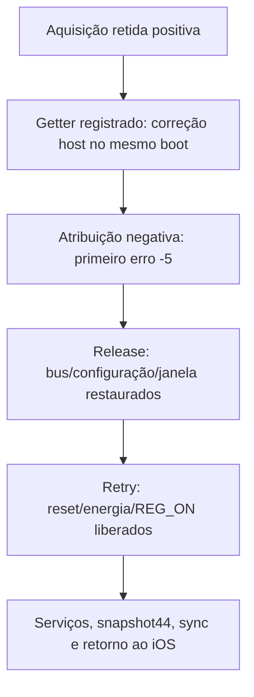

# Candidata PME e ASPM — 2026-10-05

## Estado

O helper PME, o adapter e o caller estão integrados e compilados para a ABI
`7.2.0-iphone6s-dart-serdev-power2`. O composer oferece `--pcie-aspm-off`
explicitamente. O coletor e o perfil privado real foram integrados e verificados.
Esta candidata passou uma sessão física com quatro etapas no mesmo boot,
cleanup completo e retorno automático ao iOS.
[Build e inputs](evidence/n71-pcie-pme-aspm-build.json),
[coletor e perfil](evidence/n71-pme-aspm-session.json),
[sessão física](evidence/n71-pme-aspm-physical.json).

A sessão física anterior foi a
[tentativa PME anterior](evidence/n71-pme-first-physical.json): um boot,
um scan, primeira recusa no endpoint `04c/c008` e cleanup verificado.
O retorno automático não foi confirmado; o fallback físico recuperou o iOS,
com 99% e carregamento ativo. Esse resultado não é prova desta candidata.

## Alterações

- `scan_pme_disable=1` é um parâmetro explícito do módulo diagnóstico,
  permitido somente com `run=1 enumerate=1 config_inventory=1 host_scan=1`.
  O padrão continua usando o caminho anterior.
- O helper valida identidade, capability PM e COMMAND, prepara somente
  PME_ENABLE (`4108 → 4008`) e restaura o bit por máscara. Não escreve `1`
  em PME_STATUS, não altera D-state e preserva eventos novos.
- O callback aceita o pedido exato `c008` como no-op somente depois da
  preparação comprovada, com ownership e releituras. Eventos ou divergências
  continuam recusados.
- Depois da remoção do bus, o adapter restaura config, PME e TLS nessa ordem.
  Em falha, conserva bridge, estado e os recursos do caller. `action=cleanup`
  tenta restaurar sem repetir enumeração ou scan.
- `--pcie-aspm-off` altera apenas a linha de bootargs da candidata RAM,
  além do delta DT diagnóstico já permitido. Kernel, loader, initramfs,
  identidades e perfil padrão são preservados.

## Por que agrupar com ASPM off

Na fonte PCIe fixada, `pcie_aspm=off` desativa `aspm_support_enabled` durante
o boot. `pcie_aspm_init_link_state()` retorna antes de configurar common clock,
retrain e L1SS. A remoção também retorna sem link_state. O simples
`pcie_no_aspm()` não tem o mesmo efeito nessa versão.

Os pedidos posteriores `bc/40`, `80/40`, retrain e L1SS da sessão anterior
foram latched após a primeira recusa PME. A sequência é compatível com os
caminhos da fonte, por inferência; não é um trace independente nem autorização
para liberar cada write. O parâmetro permite reunir esse obstáculo e PME numa
única candidata. Nesta sessão, a opção foi verificada antes dos módulos e o
scan PCI-core terminou sem recusas. Não houve comparação A/B no mesmo boot
para atribuir individualmente o resultado a ASPM ou PME.

ASPM off não comprova menor consumo ou carregamento sustentado. Wi-Fi, IRQ,
DMA, firmware, telemetria e carga continuam pendentes nas issues
[#9](https://github.com/djalmajr/iphone6s-linux/issues/9) e
[#2](https://github.com/djalmajr/iphone6s-linux/issues/2).

## Provas offline

| Parte | Mac e Ubuntu ARM64 |
|---|---|
| Helper PME | Baseline C e 19 mutações compiladas por SIGABRT/assertion |
| Adapter | 29 cenários; 18 mutações compiladas por SIGABRT/assertion |
| Caller | 73 cenários; 21 mutações compiladas por SIGABRT/assertion |
| Composer | 7 testes; 13 mutações por AssertionError |
| Coletor PME/ASPM | 45 testes; 81 mutações por AssertionError; 29 inputs |
| Build real na VM ARM64 | 6 módulos; Werror, modpost, ELF AArch64 e vermagic |

As quatro provas têm inputs e logs por SHA. O build usa 46 inputs e conserva
a fonte power2, `.config`, Image e `vmlinux.symvers`. O módulo PCIe tem
73.576 bytes; seu SHA está no JSON. REG_ON mantém o binário anterior.
Compilação, import e timeout não contam como morte de mutação.

## Reprodução

Use uma cópia descartável do código público e a VM Linux ARM64 dedicada.
A preparação de fonte/kernel está em [N71_KERNEL_BUNDLE.md](N71_KERNEL_BUNDLE.md).
Não envie chaves ou payloads com identidades para a VM.

Na pasta `iphone-linux-tools` da cópia:

```sh
set -e
python3 -B -m unittest discover -s tests -p test_n71_pcie_pme_control.py -v
python3 -B -m unittest discover -s tests -p test_n71_pcie_scan_host.py -v
python3 -B -m unittest discover -s tests -p test_n71_pcie_diagnostic_caller.py -v
python3 -B -m unittest discover -s tests -p test_n71_diagnostic_payload.py -v
python3 -B tests/run_n71_diagnostic_payload_mutations.py
python3 -B -m unittest discover -s tests -p test_n71_link_session.py -v
python3 -B tests/run_n71_link_session_mutations.py
```

Na VM, depois de conferir a fonte e os outputs power2 existentes:

```sh
set -e
python3 scripts/build/kernel_bundle.py check "$kernel_source" \
  --profile n71-dart-serdev-power-v2
LOCALVERSION= make -C "$kernel_source" O="$kernel_output" ARCH=arm64 \
  -j2 W=1 KCFLAGS=-Werror M="$PWD/phone/kernel" \
  KBUILD_EXTRA_SYMBOLS="$kernel_output/vmlinux.symvers" modules
modinfo -F vermagic phone/kernel/n71-pcie-diagnostic.ko
```

`kernel_source` e `kernel_output` são os diretórios da fonte e do build
dedicados. Confira novamente seus hashes e todos os inputs após o build.
Paths de build podem alterar o binário; registre a nova provenance em vez de
presumir igualdade com o SHA desta sessão.

O composer diagnóstico aceita `--pcie-aspm-off` com os argumentos de perfil,
kernel, DT e módulo já descritos em [N71_LINK_EXPERIMENT.md](N71_LINK_EXPERIMENT.md).
A saída exige uma pasta privada nova. A provenance registra o booleano e o
hash de bootargs. A composição não inicia USB, SSH ou load de módulo.

### Perfil privado real

A composição desta sessão usou o perfil base power2, o DT diagnóstico existente
e o módulo do build acima. Os argumentos podem ser reproduzidos no Mac:

```sh
python3 -B scripts/build/compose-n71-diagnostic.py \
  --source-profile "$base_profile/deployment.json" \
  --kernel-dir "$kernel_artifacts" \
  --kernel-patchset n71-dart-serdev-power-v2 \
  --diagnostic-dir "$diagnostic_dt" \
  --module "$pcie_module" --module-sha256 "$pcie_sha256" \
  --output-dir "$candidate" --pcie-aspm-off
```

Essas variáveis apontam para diretórios/artefatos privados verificados pelas
receitas anteriores. `candidate` deve ser uma pasta nova diretamente em
`runtime`. Copie o REG_ON verificado da candidata anterior para essa pasta,
como `n71-wlan-power-diagnostic.ko`, com modo 600. Na `provenance.json`,
registre booleanos JSON exatos: `pcie_scan_link_target: true`,
`pcie_scan_pme_noop: false`, `pcie_scan_pme_disable: true`; o composer já
registra `pcie_aspm_off: true` e o SHA de bootargs. Não use strings ou números.

Confira novamente os hashes da fonte e da saída e execute:

```sh
python3 -B scripts/host/n71-link-session.py \
  --profile "$candidate/deployment.json" \
  --host-scan --scan-link-target --scan-pme-disable --check
python3 -B scripts/boot/boot_tools.py palera1n-macos-arm64 pongoterm
python3 -B scripts/host/persist.py verify "$snapshot_id"
```

O perfil real passou esses checks. O payload mudou apenas pela adição de
14 bytes de bootargs em relação ao diagnóstico anterior. Loader, DT, kernel
comprimido e descomprimido, initramfs, identidades e REG_ON foram conferidos
por igualdade/hash; fonte anterior e default permaneceram intactos. Nenhum
perfil, chave, alias SSH ou snapshot é publicado no GitHub.

## Sessão física — quatro etapas sem reiniciar

O código `dd2b0da` e os módulos qualificados não mudaram antes do load.
O primeiro monitor expirou antes de transferir o payload; o segundo reutilizou
o DFU já estabelecido, sem outra sequência de botões. Houve um DFU manual,
um boot Linux, restore de44 entradas e zero reinícios intermediários.

| Etapa | Resultado físico |
|---|---|
| PCI-core com PME/ASPM | error0; dois dispositivos/um endpoint; 660 leituras,40 tentativas,23 escritas,zero recusas |
| BAR/ChipCommon direto | BAR0 de32KiB/BAR2 de4MiB; BCM4350 revisão8; uma leitura MMIO ChipCommon |
| DART passivo | 38 leituras;16 words TTBR preservadas; sem DMA |
| Provider DART temporário | error0; quatro snapshots/152 leituras;16 words restauradas; nenhuma mudança de controle; sem DMA |

Cada etapa terminou com bus removido, config/PME/TLS/reset/power e REG_ON
restaurados quando aplicáveis, módulos ausentes e sem erro de cleanup.
Boot ID e histórico de cleanup foram conferidos antes das continuações.
O provider temporário foi inicializado, mas isso não comprova entrega de IRQ,
attachment IOMMU do endpoint ou DMA.

### Reprodução da continuação por SSH

Depois de boot/restore e serviços confirmados, execute o scan com o perfil
PME/ASPM explícito:

```sh
python3 -B scripts/host/n71-link-session.py \
  --profile "$candidate/deployment.json" \
  --output-dir "$scan_result" \
  --host-scan --scan-link-target --scan-pme-disable
```

Para as três etapas seguintes foi selecionado o módulo diagnóstico anterior
qualificado, SHA `e715ad64013eb0238c9074dba9b05157d2a7153835fd4a800bd53adb0e170785`,
com REG_ON presente, através de seu perfil privado. **O payload desse perfil
anterior não foi bootado.** Kernel/DT/initramfs/identidades/REG_ON são iguais;
seus bootargs diferem somente pela opção ASPM. O payload efetivamente em
execução continuou PME/ASPM, com ASPM off já verificado. Não modifique a
metadata para fingir igualdade: confira artefatos, ABI e diferença literal,
conservando o registro privado da seleção.

```sh
set -e
python3 -B scripts/host/n71-link-session.py \
  --profile "$hot_module_profile/deployment.json" \
  --previous-clean "$scan_result" --output-dir "$chip_result" --chip-id
python3 -B scripts/host/n71-link-session.py \
  --profile "$hot_module_profile/deployment.json" \
  --previous-clean "$chip_result" --output-dir "$dart_result" --dart-observe
python3 -B scripts/host/n71-link-session.py \
  --profile "$hot_module_profile/deployment.json" \
  --previous-clean "$dart_result" --output-dir "$cycle_result" --dart-cycle
```

Os diretórios de resultado são novos e privados. Os checks `--check` com os
mesmos argumentos precedem cada execução. Continue somente com histórico
completo do mesmo boot, sem owner/cleanup pendente; uma recusa não autoriza
repetir probes ou substituir o histórico. Um perfil antigo sem REG_ON foi
recusado no check local, antes de qualquer transferência; o perfil correto
passou sem mudança de código ou reinício.

Ao final, SSH/HTTP/Bash/Herdr foram conferidos, com uptime506,59s, PCI vazio
e módulos ausentes. `return_ios.py --wait 90`, usando o perfil PME/ASPM,
salvou/verificou snapshot44 e sync, encerrou Linux e confirmou iOS pelo USB.
Não precisou de fallback físico. iOS100→100%, carregando às19:00:58UTC;
nenhuma corrente líquida foi medida no Linux, que continua com zero entradas
`power_supply` e MaxPower USB declarado de500mA. Não derivar saúde ou carga
sustentada desses dados. Logs/identidades/snapshot ficam privados; o JSON
público conserva contagens, estados e hashes.

### CI do código testado

[PR37356247973](https://github.com/djalmajr/iphone6s-linux/actions/runs/37356247973)
passou nos três jobs; Mac/Ubuntu executaram81 mutações por AssertionError do
coletor. [Push37356242967](https://github.com/djalmajr/iphone6s-linux/actions/runs/37356242967)
falhou somente no Ubuntu por timeout de10s num mutante PMGR após baseline
positiva. Causa não confirmada; timeout não contou como mutation kill.
[#38](https://github.com/djalmajr/iphone6s-linux/issues/38) permanece aberta.

## Lifecycle do bus retido — preparação offline

O adapter `b0c0933` acrescenta a API interna `n71_pcie_scan_hold()`, somente
com PME e scan completamente positivo. Bridge, bus, config/PME/TLS e callbacks
permanecem válidos entre chamadas. Os wrappers usados pelo caller daquele
checkpoint continuavam removendo o bus imediatamente. Nenhum parâmetro de
módulo, CLI ou perfil selecionava hold nessa etapa; a integração posterior
está descrita abaixo e tem prova própria.

Cleanup de bus retido faz stop/remove sob o lock de rescan antes de restaurar
config, PME e TLS e liberar o bridge. Uma falha de restore conserva owner para
retry, sem outro scan. Uma recusa de callback durante stop é conservada
inclusive depois de retry de restore; se todo o rollback passou, o bridge pode
ser liberado mesmo com essa saída negativa. Não confundir erro do experimento
com owner ainda pendente: a integração do caller precisa tratar ambos.

A fonte PCI fixada confirma o guard de binding em `pci_bus_match()` e a
liberação explícita em `pci_bus_add_device()`. O adapter não chama essa API,
`pci_host_probe()` ou atribuição de recursos, e continua negando enable_device.
`pci_remove_root_bus()` limpa `host_bridge->bus` depois de remover o bus.
Arquivos e hashes estão na [prova do lifecycle](evidence/n71-pci-held-bus.json).
Isso qualifica o contrato desta fonte, sem comprovar IRQ/DMA/driver no aparelho.

Dois testes C com45 cenários (29 anteriores e16 de hold) e26 mutações compiladas
por SIGABRT/assertion passaram no Mac e Ubuntu ARM64, com dez inputs iguais.
Cobrem callback após retorno hold, novo scan recusado, scan negativo/parcial,
stop-refusal, os três restores e link perdido no teardown; retries não repetem
scan. Timeout ou falha de compilação não contam como mutation kill.

Na cópia descartável do código público:

```sh
python3 -B -m unittest discover -s tests -p test_n71_pcie_scan_host.py -v
```

O build real usou M novo `/home/ubuntu/n71-held-bus-modules-20261005/phone/kernel`,
com os46 inputs do JSON. Somente `n71-pcie-scan.h` mudou desde o build PME/ASPM
anterior. Reproduza com a mesma receita W=1/KCFLAGS=-Werror desta página, depois
de validar o bundle power2, usando um novo diretório M. Os seis módulos passaram
modpost/ELF/vermagic; PCIe74008 bytes, REG_ON idêntico e fonte/config/Image/exports
preservados. PCIe e REG_ON copiados para o Mac tiveram hashes/ELF/vermagic
conferidos independentemente.

Não substitua módulos nos perfis físicos anteriores mantendo seus manifests:
o hash novo é distinto e não foi integrado à seleção do coletor. Caller deve
reter referências de módulo/MMIO/energia enquanto houver bus ou restore
pendente; depois virão seleção/provenance/coletor e recursos PCI/IRQ/IOMMU.
A [issue39](https://github.com/djalmajr/iphone6s-linux/issues/39) acompanha esse
desenvolvimento. Esta prova é offline; o resultado físico acima continua
pertencendo ao módulo PME/ASPM anterior. Nenhum novo DFU foi solicitado.

## Caller retido — integração e build offline

O caller `3d410c7` expõe `scan_hold`, desativado por padrão, somente com
`run=1 enumerate=1 config_inventory=1 host_scan=1 scan_pme_disable=1`.
Os guards de N71 e modos exclusivos permanecem. Depois de scan positivo,
exige bridge, bus e ownership reais antes de retornar com binding/MMIO,
referência do módulo, reset e quatro domínios de energia vivos.

O getter separado `held`, modo0400, retorna `held=1` somente enquanto o bus
estiver presente e retido pelo adapter, sob `session_lock`. Não há flag
espelhada no diagnóstico, e o formato do getter `status` permanece igual.
`scan_pending=1` indica bridge presente, não necessariamente bus ativo:
após remoção do bus, uma falha de restore pode deixar `held=0` com owner
pendente. O coletor precisa verificar os dois contratos.

`action=cleanup` remove o bus antes de config/PME/TLS, reset e energia.
Os recursos e o pin do módulo somente são liberados depois de todos os
owners terem sido encerrados. Stop refusal conserva a saída negativa;
se o bridge já foi liberado após rollback, o caller conserva reset/energia
até a próxima limpeza comprovada. Retry não enumera, não faz outro scan
e não descarta duas vezes a mesma referência de uso.

O caller real e o MMIO real, com APIs do kernel e dependência scan simuladas,
passaram73 cenários anteriores e21 de hold, com30 mutações compiladas por
SIGABRT/assertion no Mac e Ubuntu ARM64, cinco inputs idênticos/preservados.
A prova isolada do adapter45/26 foi reutilizada após conferir seus dez inputs
sem alterações. O build kernel integra os headers reais; não substitui uma
prova física dos callbacks no telefone.

Na cópia descartável do código público:

```sh
python3 -B -m unittest discover -s tests -p test_n71_pcie_diagnostic_caller.py -v
```

O build ARM64 usa a receita W=1/KCFLAGS=-Werror acima, em M novo
`/home/ubuntu/n71-held-caller-modules-20261005/phone/kernel`. Os46 inputs
diferem do build174 somente em `n71-pcie-diagnostic.c`. Os seis módulos
passaram modpost/ELF/vermagic; PCIe76.112 bytes, SHA
`b7e51d4d8ee281ace121c11dc60af04265a63c7395613fa8503af590927520b3`.
REG_ON conserva o SHA anterior. Fonte/bundle/config/Image/exports foram
conferidos antes/depois; os módulos PCIe e REG_ON copiados para o Mac também
passaram SHA/ELF/vermagic. [Inputs, logs e limites](evidence/n71-pci-held-caller.json).

Nenhum perfil funcional foi trocado e o coletor ainda não seleciona esse build
ou hold. Não use provenance antiga com o binário novo nem carregue o módulo
diretamente para contornar os checks do coletor. A próxima fatia implementa
seleção explícita, validação de hold e cleanup/REG_ON no mesmo boot.
Recursos PCI, bind, IRQ/DMA/IOMMU, firmware/radio e carga Linux continuam
pendentes. Nenhum DFU, PIN, firmware ou Image novo foi necessário.

## Parser held — aquisição e limpeza separadas

O parser `49d2158` usa o protocolo emitido pelo módulo caller acima. O scan
positivo retido retorna antes de `SCAN_RESULT`, portanto não exige ou cria
esse resumo temporário. Valida um `SCAN_HELD`, um `SESSION_HELD`, getter vivo
`held=1`, status completo, TLS/PME preparados e todos os dispositivos/BARs
antes do hold. COMMAND permanece zero e os BARs medidos permanecem sem
atribuição, com32KiB e4MiB. Binding/MMIO, pin do módulo, reset e quatro
domínios ativos precisam estar comprovados; uma falha não vira retenção válida.

O resultado inclui somente campos observados: topology/BARs, ownership e
preparações. Não declara contagens de reads/writes/refusals nem cleanup
que esse caminho ainda não emitiu. `device_resources()` compartilha a
validação existente de topologia/BAR; `restore_owned()` compartilha os
registros e a ordem de restauração PME. Os modos anteriores continuam usando
suas próprias APIs e módulos.

Cleanup held exige getter0 e caller bound sem owners pendentes, remoção única,
config→PME→TLS→reset→energia→caller final. Registros truncados, duplicados,
campos adicionais, restore fora de ordem ou retry indevidamente positivo são
recusados. Uma recusa no stop conserva o mesmo errno da primeira escrita
recusada, inclusive depois da restauração; prova de cleanup não apaga erro do
experimento. Se o hold nunca foi adquirido, a prova negativa e a limpeza PME
anterior são necessárias; ausência de owners sozinha não prova esse caminho.

Seleção local usa a prova `n71-pci-held-caller.json`, somente ABI power2,
flags booleanas exatas, Werror/modpost/ELF e módulos de nomes fixos. Os hashes
e o vermagic ainda precisam passar pelo integrador e pelo perfil privado
antes de qualquer transferência. Esta função não chama USB, SSH ou insmod.

Na cópia descartável do código público, em Mac e Ubuntu ARM64:

```sh
set -e
python3 -B -m unittest discover -s tests -p test_n71_scan_held_result.py -v
python3 -B -m unittest discover -s tests -p test_n71_scan_result.py -v
python3 -B tests/run_n71_scan_result_mutations.py
python3 -B -m unittest discover -s tests -p test_n71_link_session.py -v
python3 -B tests/run_n71_link_session_mutations.py
```

Novo parser12 testes/29 mutações por AssertionError; scan6/8 e coletor45/81
foram requalificados pela mudança compartilhada: total63 testes/118 mutações
por plataforma,34 inputs iguais e preservados, cinco logs/hash por plataforma.
Compilação/import/timeout não contam como mutation kill.
[Inputs e provas selecionadas](evidence/n71-pci-held-parser.json).

Os inputs C e46 inputs de build permaneceram intactos; suas provas anteriores
foram reutilizadas, sem outro build ou Image. CLI de aquisição/retomada,
provenance/perfil e prova física continuam pendentes. O módulo não foi
carregado no telefone, e nenhuma nova intervenção DFU/PIN/console foi pedida.
Wi-Fi, recursos PCI/IRQ/DMA/firmware e telemetria/carga continuam abertos.

CI do caller `6e26fac`: [PR37374903992](https://github.com/djalmajr/iphone6s-linux/actions/runs/37374903992)
passou nos três jobs; [push37374896899](https://github.com/djalmajr/iphone6s-linux/actions/runs/37374896899)
terminou cancelled, com Mac/Windows success e Ubuntu cancelled. Causa não
confirmada; não tratar esse cancelamento como aprovação. Essa CI antecede
o parser `49d2158`, que conserva seus próprios gates Mac/ARM64 acima.

## CLI retido — aquisição e retomada no mesmo boot

O CLI `36c7f53` seleciona o módulo caller de 76.112 bytes somente com
`--host-scan --scan-link-target --scan-pme-disable --scan-hold`.
Exige `pcie_scan_hold: true` na provenance, os opt-ins PME/ASPM anteriores
e SHA/ELF/vermagic exatos. `--check` verifica somente arquivos locais.
Naquele checkpoint, o composer/perfil correspondente ainda estava pendente;
a composição completa abaixo tem prova própria. Use uma candidata separada.

Com a candidata privada qualificada e um boot Linux já estabelecido:

```sh
python3 -B scripts/host/n71-link-session.py \
  --profile "$candidate/deployment.json" --output-dir "$held_result" \
  --host-scan --scan-link-target --scan-pme-disable --scan-hold
```

Uma aquisição positiva conserva bus, módulo, reset/energia, REG_ON e staging.
O resultado declara `held_verified=true` e `cleanup_verified=false`.
Estado de tentativa é reservado antes dos efeitos; depois, o checkpoint
privado registra histórico completo, getters e hashes. As identidades ligam
deployment, payload, initramfs e os dois módulos; esses dados não são publicados.

Para liberar os recursos posteriormente, usando saída privada nova:

```sh
python3 -B scripts/host/n71-link-session.py \
  --profile "$candidate/deployment.json" --output-dir "$released_result" \
  --host-scan --scan-link-target --scan-pme-disable --scan-hold \
  --release-held "$held_result"
```

Antes da escrita, o comando exige o mesmo boot e histórico, staged hashes,
parâmetros imutáveis reais, bind/unbind ausentes e ownership PCI/REG_ON.
Booleanos sysfs são lidos como `Y/N`, conforme a fonte kernel fixada.
Diretório PCI ausente não equivale a barramento vazio. Remoção/config/PME/TLS,
reset/energia e unload PCI precedem restore/unload REG_ON.

Em falha, o resultado conserva o erro e as provas das etapas concluídas.
Retome com `--release-held "$released_result"` e outra saída privada nova.
Cleanup já comprovado não é solicitado novamente; unload PCI concluído
permite retomar somente REG_ON, e restore REG_ON concluído permite repetir
apenas seu unload. A saída continua negativa se o stop teve erro, mesmo
quando `cleanup_verified=true`. Não há rescan ou puts duplicados nesses caminhos.

Tentativas sem checkpoint não autorizam escrita. Mudanças de boot, perfil,
histórico, módulos, parâmetros ou estado vivo recusam a retomada.
Novos coletores que alterem o histórico/estado deverão participar do protocolo
de checkpoint antes de serem agrupados; esta versão não aceita eventos
arbitrários como continuação válida. Falta de evidência não é limpeza concluída.

Na cópia descartável do código público:

```sh
set -e
python3 -B -m unittest discover -s tests -p test_n71_held_session.py -v
python3 -B -m unittest discover -s tests -p test_n71_link_session.py -v
python3 -B tests/run_n71_link_session_mutations.py
```

Mac/Ubuntu ARM64 passaram 18 testes/22 mutações novos e compatibilidade45/81:
total63/103 por plataforma, 36 inputs finais preservados e logs por SHA.
Os comandos snapshot foram executados contra sysfs sintético; 17 comandos
gerados passaram `bash -n`, AST e lint de erros fatais passaram.
A correção isolada do diretório PCI repetiu somente os gates novos;
os inputs relevantes do caminho legado permaneceram iguais.
[Prova sanitizada e inputs](evidence/n71-pci-held-session.json).

Parser e C/build anteriores foram reutilizados por hashes; nenhum módulo foi
transferido ou carregado no iPhone nesta integração. Não comprova retenção
física, recursos atribuídos, bind, entrega IRQ, DMA/IOMMU, rádio, telemetria
ou carregamento Linux. O próximo passo prepara o perfil e controles
compatíveis antes de uma sessão física agrupada.

## Perfil retido completo — composição verificada sem boot

Composer `c30a4ac` acrescenta `--pcie-scan-hold` e `--reg-on-module`.
Hold exige explicitamente `--pcie-aspm-off`, patchset power2 e o arquivo REG_ON.
REG_ON sem hold é recusado. A seleção usa a prova do caller qualificado,
com tamanho/SHA/ELF/vermagic dos dois módulos antes de criar a saída.
O padrão anterior conserva a ausência de hold e da cópia REG_ON.

Use artefatos privados já qualificados e uma pasta de saída nova:

```sh
python3 -B scripts/build/compose-n71-diagnostic.py \
  --source-profile "$base_profile/deployment.json" \
  --kernel-dir "$kernel_artifacts" \
  --kernel-patchset n71-dart-serdev-power-v2 \
  --diagnostic-dir "$diagnostic_dt" \
  --module "$pcie_module" --module-sha256 "$pcie_sha256" \
  --reg-on-module "$reg_on_module" --output-dir "$candidate" \
  --pcie-aspm-off --pcie-scan-hold
python3 -B scripts/host/n71-link-session.py \
  --profile "$candidate/deployment.json" \
  --host-scan --scan-link-target --scan-pme-disable --scan-hold --check
```

O composer copia REG_ON automaticamente e grava `pcie_scan_link_target: true`,
`pcie_scan_pme_noop: false`, `pcie_scan_pme_disable: true` e
`pcie_scan_hold: true`, além de ASPM/bootargs. Não há edição manual de
provenance, autoload ou USB. Mantém o layout/preservação DT anterior e verifica
as identidades da saída antes de declarar o perfil composto.

O perfil real desta etapa passou esses checks com PCIe de 76.112 bytes/SHA b7e51d4d
e REG_ON de 17.688 bytes/SHA fdf887e7. O payload inteiro é idêntico ao PME/ASPM
anterior, portanto loader/DT/kernel/userspace permanecem iguais; initramfs,
chave cliente e pin SSH também foram conferidos por igualdade.
Fonte/default e perfis anteriores ficaram intactos.

Ferramentas de boot e snapshot local com 44 entradas foram verificados.
O argumento de `persist.py verify` é o ID canônico do manifesto privado,
não o número 44 de entradas. Esses checks não consultam o telefone.

Na cópia descartável do código público, em Mac e Ubuntu ARM64:

```sh
set -e
python3 -B -m unittest discover -s tests -p 'test_n71_diagnostic_*.py' -v
python3 -B tests/run_n71_diagnostic_payload_mutations.py
```

13 testes/29 mutações por AssertionError: 7/13 anteriores e 6 testes/16 mutações
novos. Mutações antigas usam o contrato do payload; mutações held usam o
contrato do perfil completo, com filesystem real e dependências de
identidade/kernel sintéticas. Os 20 inputs e logs foram preservados e
conferidos por SHA; AST e lint de erros fatais passaram. Import, compilação
e timeout não contam como mutation kill.
[Prova sanitizada e inputs](evidence/n71-pci-held-profile.json).

O perfil não foi bootado e nenhum módulo foi transferido ou carregado no
iPhone. Prova de composição não comprova bus retido, atribuição de recursos,
IRQ/DMA/IOMMU, rádio, telemetria ou carregamento. Preparar os controles
compatíveis antes da sessão física agrupada.

## Política de escritas de atribuição PCI — preparação offline

Código `8c16d0a` prepara a política de configuração para o alocador PCI.
O código-fonte selecionado e `vmlinux.symvers` confirmaram exports de
`pci_bus_size_bridges`, `pci_bus_assign_resources`, `pci_get_slot` e
`pci_dev_put`. Referências públicas: [alocação de barramentos](https://github.com/torvalds/linux/blob/master/drivers/pci/setup-bus.c)
e [atualização de BARs](https://github.com/torvalds/linux/blob/master/drivers/pci/setup-res.c).
Os hashes do código-fonte realmente inspecionado estão na prova abaixo;
essas URLs são referências upstream, não substituem a versão selecionada.

A captura é somente leitura e exige BAR0 de 32 KiB/BAR2 de 4 MiB,
identidades/classes/configuração N71 e decode/bus-master desligados.
Registra os três campos adicionais que o alocador pode mudar:
MEM_BASE/LIMIT em `0x20`, PREF_LIMIT_UPPER32 em `0x2c` e
IO_BASE/LIMIT_UPPER16 em `0x30`. Captura incompleta não publica ownership;
captura repetida recusa sobrescrever estado ativo ou pendente.

Na fase explícita, aceita BARs 64-bit não prefetch alinhados na janela PCI
`c0000000–ffffffff`, upper32 zero e janela MEM dentro dessa faixa.
IO/PREF só podem ser desativados; COMMAND e BRIDGE_CONTROL são preservados.
Identidade e decode/master das duas funções são conferidos antes das escritas,
com readback, orçamento de 64 tentativas e primeiro erro conservado.
Recusa capacidades/W1C e larguras que alcançariam STATUS adjacente.

A restauração adicional exige fase encerrada e confirmação de remoção do bus
pelo adaptador. Confere identidade/decode e readback; falha conserva pending
para retry sem recaptura. BARs e as janelas anteriores ainda pertencem à
limpeza genérica do scan, que deve ocorrer depois desses campos adicionais.
O helper isolado não comprova que um bus real foi removido.

Para reproduzir a prova nativa em uma cópia descartável do código público:

```sh
python3 -B -m unittest discover -s tests -p test_n71_pcie_resource_write.py -v
```

Mac e Ubuntu ARM64 passaram 188 cenários e 25 mutações compiladas por
SIGABRT/assertion, uma prova unittest em cada plataforma. Seis inputs e os
dois logs foram preservados/conferidos por SHA; AST e lint de erros fatais
passaram. O backend de configuração é sintético, executando a política real.
Compilação, import e timeout não contam como mutation kill.
[Prova sanitizada, inputs e referências](evidence/n71-pci-resource-write.json).

A prova isolada deste checkpoint não chama o adaptador/caller/journal.
Não há PCI core, build de módulo, boot ou USB nessa prova. Reserva e
atribuição na árvore de recursos, ausência de sobreposição final, readback
de registradores opcionais no hardware, IRQ/DMA/IOMMU, rádio e energia
continuam pendentes. A próxima integração deve permitir atribuição por SSH
no mesmo boot; não pedir DFU somente para repetir o helper.

## Atribuição no bus retido — adaptador, caller e build real

O adaptador `3f09eec` reserva a janela MEM32 na árvore `iomem`, captura a
configuração e chama `pci_bus_size_bridges`/`pci_bus_assign_resources`
sob rescan lock. Exige topologia N71/BCM4350 exata e recursos inicialmente
sem parent. A política anterior cobre as escritas do alocador; ao final,
confere árvore/flags/tamanhos/alinhamento, tradução CPU→PCI, ausência de
sobreposição, BAR0/BAR2 e janela MEM por readback. IO/PREF permanecem
desativados, COMMAND/decode/master e BRIDGE_CONTROL são preservados.

Caller `3ff8769` oferece `action=assign` somente em `scan_hold=1` com bus
retido, módulo/reset e quatro domínios ativos, sem erro anterior ou power-put
pendente. Um pin temporário e o mutex da sessão cobrem a operação. A ação
não repete enumeração/scan nem encerra os owners; repetição retorna EALREADY
sem contaminar `primary_error`. Falhas reais conservam o primeiro erro e
impedem outra atribuição no mesmo bus.

O getter somente leitura `resources` informa
`ready/attempted/assigned/pending/claimed/active/error`. `assigned=1` exige
bus vivo/retido, atribuição concluída, janela na árvore iomem e ausência de
fase/erro. Um bus removido continua `assigned=0` mesmo com rollback ou
reserva pendentes. Recusas anteriores à fase e erros após liberar o bridge
continuam observáveis. Os formatos anteriores de `status` e `held` permanecem.

Cleanup recusa fase ativa, remove o bus, restaura os três campos adicionais
e a configuração genérica, depois libera a janela global somente com child
vazio. Falhas mantêm bridge/owners para retry; reset/energia/REG_ON continuam
dependendo dessa limpeza comprovada. A validação da árvore sintética não
substitui readback e restauração no iPhone.

Reprodução nativa numa cópia descartável do código público:

```sh
python3 -B -m unittest discover -s tests -p test_n71_pcie_scan_host.py -v
python3 -B -m unittest discover -s tests -p test_n71_pcie_diagnostic_caller.py -v
```

Em cada plataforma Mac/Ubuntu ARM64: adaptador64 cenários/51 mutações,
três provas unittest e12 inputs; caller121 cenários/59 mutações, uma prova
unittest e cinco inputs. Todas as mutações compilaram com Werror e falharam
por SIGABRT/assertion; compile/import/timeout não contam como kills.
O código real foi executado com dependências de kernel/PCI sintéticas,
e inputs/logs/exit foram conferidos por SHA. AST/Flake8 fatal passaram.

O build real ocorreu numa cópia exclusiva dos48 inputs públicos,
`/home/ubuntu/n71-resource-caller-modules-20261005/phone/kernel`, na VM
dedicada, usando o source/output power2 já qualificado:

```sh
make -C /home/ubuntu/kernel-n71-binding-source-20261005 \
  O=/home/ubuntu/kernel-n71-binding-build-20261005 ARCH=arm64 -j2 \
  W=1 KCFLAGS=-Werror LOCALVERSION= \
  M=/home/ubuntu/n71-resource-caller-modules-20261005/phone/kernel \
  KBUILD_EXTRA_SYMBOLS=/home/ubuntu/kernel-n71-binding-build-20261005/vmlinux.symvers \
  modules
```

Os seis módulos passaram Werror/modpost/ELF AArch64/vermagic
`7.2.0-iphone6s-dart-serdev-power2 SMP preempt mod_unload aarch64`.
PCIe84.696 bytes; REG_ON17.688 bytes/SHA anterior intacto. Fonte/config/Image
e exports foram conferidos antes/depois. `modinfo -p` confirmou os getters
e a ação, `nm -u` confirmou alocação/reserva/release vinculados. A prova
sanitizada contém os48 inputs, módulos e logs por SHA; payload/DT,
identidades, chaves e logs completos permanecem privados.
[Evidência integrada](evidence/n71-pci-resource-assignment.json).

Neste checkpoint, seleção/provenance/journal do host ainda precisavam
reconhecer esse build e registrar o checkpoint antes de `assign`. A seleção
e o checkpoint da ação posteriores estão descritos abaixo.
Nenhum módulo novo carregado, novo Image, boot ou DFU nesta etapa.
Atribuição/restauração no kernel em execução, IRQ/IOMMU, driver/firmware/radio,
Wi-Fi e telemetria/carga Linux continuam pendentes.

CI anterior `3f09eec`: [PR37394918817](https://github.com/djalmajr/iphone6s-linux/actions/runs/37394918817)
e [push37394914087](https://github.com/djalmajr/iphone6s-linux/actions/runs/37394914087)
concluíram cancelled; Mac/Windows success e Ubuntu cancelled nos dois eventos.
O log do job Ubuntu da PR não foi disponibilizado (`log not found`);
causa segue não confirmada na [issue38](https://github.com/djalmajr/iphone6s-linux/issues/38).
Esses resultados não cobrem o caller novo.

## Seleção do módulo com atribuição — candidata privada preparada

Código `d94a14e` acrescenta `--pcie-resource-capable` ao composer e
`--resource-capable` ao coletor. As flags selecionam exclusivamente o build
de atribuição acima, através do contrato `n71_resource_result`; exigem held
explícito e seus pré-requisitos power2/ASPM/REG_ON. A aquisição conserva o
bus e não executa `assign` automaticamente. Sem essas flags, o seletor held
anterior continua sendo usado.

O composer grava `pcie_resource_capable` como booleano exato. O coletor
exige correspondência exata com sua flag; ausência da chave nos perfis
antigos equivale somente a false. Tamanho/SHA/ELF/vermagic dos módulos e
ASPM no payload são conferidos antes dos efeitos. A seleção também é
propagada à Session no caminho de aquisição e no check local de retomada.

Com os módulos privados do build186 e os artefatos já qualificados:

```sh
python3 -B scripts/build/compose-n71-diagnostic.py \
  --source-profile "$base_profile/deployment.json" \
  --kernel-dir "$kernel_artifacts" \
  --kernel-patchset n71-dart-serdev-power-v2 \
  --diagnostic-dir "$diagnostic_dt" \
  --module "$pcie_module" --module-sha256 "$pcie_sha256" \
  --reg-on-module "$reg_on_module" --output-dir "$candidate" \
  --pcie-aspm-off --pcie-scan-hold --pcie-resource-capable
python3 -B scripts/host/n71-link-session.py \
  --profile "$candidate/deployment.json" \
  --host-scan --scan-link-target --scan-pme-disable --scan-hold \
  --resource-capable --check
```

A candidata real completa passou esses checks sem SSH/USB. O payload
inteiro, deployment, initramfs, identidades e REG_ON são iguais ao perfil
held anterior; PCIe84.696 bytes/SHA2dcdebc2 e provenance são novos. Os48
inputs do build real permaneceram iguais, sem recompilar kernel ou módulos.
O perfil novo e os anteriores permanecem privados.

Reprodução dos contratos host numa cópia descartável do código público:

```sh
set -e
python3 -B -m unittest discover -s tests -p 'test_n71_diagnostic_*.py' -v
python3 -B -m unittest discover -s tests -p test_n71_held_session.py -v
python3 -B -m unittest discover -s tests -p test_n71_link_session.py -v
python3 -B tests/run_n71_diagnostic_payload_mutations.py
python3 -B tests/run_n71_link_session_mutations.py
```

Mac/Ubuntu ARM64: 82 testes/144 mutações por AssertionError em cada
plataforma, com53 inputs e cinco logs por SHA. Composer16/33, held21/30 e
coletor legado45/81; seis testes/12 mutações novos. Após corrigir somente a
fixture composer, foram reutilizados held21/30 e45 testes legados, com52
inputs intactos; composer16/33 e81 mutações legadas foram executados no
pacote final. AST e Flake8 fatal passaram. Gates interrompidos não foram
contados como qualificação completa; import/compile/timeout não são kills.
[Prova sanitizada da seleção](evidence/n71-pci-resource-profile.json).

Nesse checkpoint, o journal ainda precisava incluir a ação, getter e prova
de atribuição e sua restauração; a integração está descrita abaixo.
A candidata desta seleção não foi carregada no
iPhone; Wi-Fi, IRQ/IOMMU/driver e telemetria/carga Linux continuam pendentes.

## Atribuição com journal — ação e limpeza no mesmo boot

Código `2e07258` oferece `--assign-held DIR`, exclusivo de `--release-held`.
Exige fonte privada held com `--resource-capable`, os demais opt-ins do
perfil e ausência de previous-clean. Confere perfil, boot, módulos/params,
REG_ON, histórico e getter resources antes dos efeitos; a ação não refaz
insmod, scan, reset ou ativação de REG_ON.

O journal salva `resource_attempted` antes do setter. A saída da ação,
getter e evento kernel precisam ser completos e concordar, incluindo erro,
owners e orçamento. A prova privada possui hash e acompanha o checkpoint.
Uma retomada com prova íntegra reutiliza a atribuição sem outro setter.
Flags de modo/intenção são booleanas exatas; journals antigos sem esses
campos são aceitos somente como false. Prova perdida, getter diferente,
histórico desconhecido ou restauração incoerente recusam efeitos.

No boot Linux qualificado, use diretórios novos diretamente sob runtime:

```sh
python3 -B scripts/host/n71-link-session.py \
  --profile "$candidate/deployment.json" \
  --host-scan --scan-link-target --scan-pme-disable --scan-hold \
  --resource-capable --output-dir "$held_acquisition"
python3 -B scripts/host/n71-link-session.py \
  --profile "$candidate/deployment.json" \
  --host-scan --scan-link-target --scan-pme-disable --scan-hold \
  --resource-capable --assign-held "$held_acquisition" \
  --output-dir "$held_assignment"
python3 -B scripts/host/n71-link-session.py \
  --profile "$candidate/deployment.json" \
  --host-scan --scan-link-target --scan-pme-disable --scan-hold \
  --resource-capable --assign-held "$held_assignment" \
  --output-dir "$held_reuse"
python3 -B scripts/host/n71-link-session.py \
  --profile "$candidate/deployment.json" \
  --host-scan --scan-link-target --scan-pme-disable --scan-hold \
  --resource-capable --release-held "$held_reuse" \
  --output-dir "$held_released"
```

O exemplo de reuso pressupõe atribuição positiva. Um resultado negativo
com prova completa conserva o erro e os owners; use release sobre a saída
comprovada, sem repetir assign. Cleanup confere remoção/restore extra,
configuração genérica, release da janela e PME/TLS/reset/energia antes de
PCI unload e REG_ON restore. Falha de cleanup preserva o estado para nova
invocação release no mesmo boot; etapas completas não são repetidas.
O código de saída continua negativo após liberar todos os owners quando
houve erro de atribuição ou stop; confira `cleanup_verified` separadamente.

Se transporte/saída não permitirem prova completa ou não concordarem,
a intenção fica pendente e a retomada é recusada. Não criar prova ou
checkpoint manualmente para contornar esse controle.

Reprodução host sem aparelho numa cópia descartável:

```sh
set -e
python3 -B -m unittest discover -s tests -p test_n71_resource_stage.py -v
python3 -B -m unittest discover -s tests -p test_n71_held_session.py -v
python3 -B -m unittest discover -s tests -p test_n71_link_session.py -v
python3 -B tests/run_n71_link_session_mutations.py
```

Mac/Ubuntu ARM64: 82 testes/137 mutações por AssertionError por plataforma,
55 inputs/quatro logs/exit SHA conferidos. Estágio16/26, held21/30 e
legado45/81;37 testes/56 mutações Mac já aprovados foram reutilizados com
55 inputs intactos, ARM64 executou o conjunto. Ação e snapshot rodaram em
Bash contra sysfs/arquivos privados sintéticos; testes também exercitaram
CLI real. AST/Flake8 fatal passaram; import/compile/timeout não são kills.
[Prova sanitizada do journal](evidence/n71-pci-resource-session.json).

A candidata real anterior passou o check local atualizado;48 inputs do
build real permaneceram iguais, sem recompilar módulos/kernel. Essa prova
ainda não carrega o módulo nem comprova atribuição/restauração no iPhone.
A próxima sessão física deve reunir esses controles sem reboots entre
etapas. IRQ/IOMMU/driver/firmware, Wi-Fi e telemetria/carga seguem abertos.

## Primeira atribuição física — erro preservado e cleanup retomado

A sessão power2 real fez uma aquisição retida positiva e uma atribuição,
sem reiniciar entre etapas. Restore de44 entradas e SSH/HTTP/Bash/Herdr
passaram. C/module/payload/identidades permaneciam os qualificados;
nenhum Image ou módulo foi recompilado durante a sessão.
[Prova física selecionada](evidence/n71-pci-resource-first-physical.json).

A continuação inicial encontrou uma leitura extra
`N71_REG_ON_READ error=0 value_valid=1 value=81`. O getter do módulo emite
esse registro a cada leitura; o comparador exigia histórico idêntico e
recusou antes do setter. `eba8f30` preserva o prefixo integral e admite
somente sufixo de leituras positivas completas, com value_valid1 e valor
igual ao getter vivo único. Com REG_ON ausente, exige histórico exatamente
igual. Estado/controle/módulos/ownership continuam comparados ao checkpoint.
Nenhuma linha é eliminada, reescrita ou rebased manualmente.

A fixture passou a emitir essas leituras. `71df973` corrige o caso
adversarial que esquecia uma leitura de uma tentativa recusada: o checkpoint
passa a conter o delta real antes da operação desconhecida, exercitando
o guard de operação, com recusa antes do cleanup. Mac/Ubuntu ARM64:
44 testes/63 mutações por AssertionError por plataforma,57 inputs/AST,
Flake8 fatal e diff aprovados. História7/7, held21/30 e resource16/26.
Os dois primeiros gates intactos foram reutilizados após corrigir somente
a fixture resource; import/compile/timeout não são kills.
[Regressão e inputs](evidence/n71-reg-on-held-history.json).

Reprodução host numa cópia descartável, sem aparelho:

```sh
set -e
python3 -B -m unittest discover -s tests -p test_n71_held_history.py -v
python3 -B -m unittest discover -s tests -p test_n71_held_session.py -v
python3 -B -m unittest discover -s tests -p test_n71_resource_stage.py -v
```

Após qualificação, a continuação usou a aquisição original no mesmo boot.
A ação retornou-5,9 tentativas/2 escritas e assigned0/pending1/claimed1.
A primeira recusa foi root0:08/030/dword/0000ffff. O código preservado faz
write/readback exato; o valor real pós-write não foi registrado. Não
presumir campos hardwired ou ampliar a máscara com base somente no errno.
As recusas posteriores são latched, sem prova independente para permissões.

O primeiro release removeu o bus e comprovou restore extra/genérico e
release da janela, mas reteve reset/energia pelo stop-error-5. Um retry
somente de cleanup liberou esses owners e descarregou PCIe/REG_ON,
restaurando controle80. Não repetiu scan ou assign. O resultado continuou
negativo; cleanup_verified true não transforma a atribuição em sucesso.
Não foi exercitado reuso de atribuição positiva, bind, enable ou DMA.



Os serviços, snapshot44/sync e retorno automático USB ao iOS passaram.
Uptime final26 minutos; a duração aumentou pela correção host no boot,
sem reinícios intermediários. iOS100→77% incluindo transições; recarga e
fonte externas ativas no retorno. Não é medição de corrente líquida,
saúde ou carga sustentada Linux; power_supply continuou sem entradas.
O telefone voltou ao iOS para recarga durante desenvolvimento offline.
Firmware/DT/payload/identidades/boot ID/snapshot ID/logs brutos continuam
privados. O próximo gate registra o readback real da primeira recusa
antes de alterar o contrato de escrita.

## Readback da primeira falha — candidata qualificada sem reiniciar

A falha física em 0x30 mostrou que faltava o valor retornado pela leitura
obrigatória após a escrita. A política agora conserva somente a primeira
falha que alcançou essa operação: pedido, valor anterior, valor retornado
válido e erros brutos dos callbacks. Não acrescenta I/O ou retries e não
altera permissões, orçamento ou restauração. `writes` conta somente escritas
verificadas; uma verificação negativa pode ocorrer depois de uma escrita
executada que não incrementou o contador.

`N71_PCIE_ASSIGN_READBACK` aparece uma vez antes de `RESOURCE_RESULT`.
`failed=0` exige campos zerados e não inventa uma leitura; `failed=1` exige
validade/valores/erro consistentes com a primeira recusa. Write ou read que
retornou erro não prova um valor retornado válido. Os registros brutos ficam
no checkpoint/proof e são comparados ao retomar e limpar. Build selecionado
com `assignment_readback=true` exige a linha; o build legado conserva seu
contrato. Resultado negativo continua negativo mesmo com cleanup completo.

A seleção usa o SHA concreto do arquivo no composer e da provenance no
coletor; não há outra flag CLI. O registro do build novo verifica a evidência
base, contrato, ABI/interface e REG_ON preservado. SHA desconhecido ou
metadata divergente recusam a candidata antes de transferir módulos.
[Build/contratos](evidence/n71-pci-resource-readback.json),
[integração/candidata](evidence/n71-pci-readback-profile.json),
[plano e decisões](../.agents/plans/n71-primeiro-readback-pci.md).

| Gate por plataforma Mac/Ubuntu ARM64 | Resultado |
|---|---|
| Política real em backend sintético | 194 cenários; 36 mutações compiladas/SIGABRT |
| Adaptador real com PCI API sintética | 65 cenários; 57 mutações compiladas/SIGABRT |
| Integração final composer/coletor/journal | 64 testes; 108 mutações/AssertionError; 62 inputs |
| Seletor de build e contrato anterior | 14 testes; 38 mutações/AssertionError |
| Módulos na VM dedicada | Seis módulos; Werror/modpost/ELF/vermagic; 48 inputs |

Os gates foram incrementais. Código e fixtures alterados foram
requalificados; provas de C/build intactas foram reutilizadas durante a
integração host. Compilação/importação/timeout e fixtures recusadas por um
controle diferente não contam como mutation kill. A leitura de um arquivo
deliberadamente removido pelo mutante foi substituída por uma assertion do
contrato de arquivos antes da leitura. O último anchor legado foi atualizado
e somente held21/30 repetido. AST/lint fatal/diff e hashes/exit passaram.

```sh
python3 -B -m unittest discover -s tests -p test_n71_pcie_resource_write.py -v
python3 -B -m unittest discover -s tests -p test_n71_pcie_scan_host.py -v
python3 -B -m unittest discover -s tests -p test_n71_resource_readback.py -v
python3 -B -m unittest discover -s tests -p test_n71_resource_build.py -v
python3 -B tests/run_n71_diagnostic_payload_mutations.py
python3 -B -m unittest discover -s tests -p test_n71_held_session.py -v
python3 -B -m unittest discover -s tests -p test_n71_resource_stage.py -v
```

O build real usa o source/output power2 qualificado e um diretório externo
novo, seguindo o comando `make` da reprodução anterior. PCIe: 85.096 bytes,
SHA a56fafb4; os outros cinco módulos, fontes PCI verificadas e
config/Image/exports permaneceram iguais. A candidata real separada passou
composer e --check, com oito arquivos privados, diretório 700/arquivos 600.
Deployment, payload/DT/kernel/loader, initramfs, identidades
e REG_ON são byte a byte iguais ao perfil resource anterior. Somente PCIe e
seu SHA na provenance mudaram. O perfil anterior e o default permanecem.

Comandos executados na raiz `iphone-linux-tools`; a pasta de saída deve ser
nova. Os arquivos referenciados são locais privados produzidos pelas receitas
anteriores, não downloads públicos. A seleção depende do hash completo do
módulo qualificado:

```sh
python3 -B scripts/build/compose-n71-diagnostic.py \
  --source-profile runtime/n71-binding-base-profile-20261005/deployment.json \
  --kernel-dir runtime/kernel-n71-binding-artifacts-20261005 \
  --kernel-patchset n71-dart-serdev-power-v2 \
  --diagnostic-dir runtime/n71-pcie-diagnostic-20261002 \
  --module runtime/n71-first-readback-20261006/modules/n71-pcie-diagnostic.ko \
  --module-sha256 a56fafb49ec8df0746241f45c5ff4efb1b5e01b680cfb0429f9933c09d1bd2cf \
  --pcie-aspm-off --pcie-scan-hold --pcie-resource-capable \
  --reg-on-module runtime/n71-first-readback-20261006/modules/n71-wlan-power-diagnostic.ko \
  --output-dir runtime/n71-binding-readback-profile-20261006
python3 -B scripts/host/n71-link-session.py \
  --profile runtime/n71-binding-readback-profile-20261006/deployment.json \
  --host-scan --scan-link-target --scan-pme-disable --scan-hold \
  --resource-capable --check
```

Esta rodada não executou o módulo novo no iPhone. Atribuição positiva,
registradores opcionais, IRQ/DMA/IOMMU, rádio e alimentação precisam de prova
física. O iPhone foi reconfirmado no iOS com 100%; isso não é saúde da bateria
nem carga Linux. A próxima sessão agrupa aquisição, assign/coleta, limpeza
com retry, serviços, snapshot/sync e retorno ao iOS. O readback real orientará
a correção seguinte; não presumir bits hardwired apenas pelo errno-5.

## Primeiro readback físico — uma sessão agrupada

A candidata de readback foi executada com um DFU/um boot e zero reinícios
intermediários. Aquisição retida positiva. Atribuição negativa: `error=-5`,
nove tentativas, duas escritas verificadas. Primeira falha: root 0:08,
registrador 0x30, largura quatro; pedido `0000ffff`, valor anterior `0`,
retorno válido `0`, callbacks write/read com erro bruto zero. A primeira
leitura agora é preservada pelo kernel, proof, checkpoint e cleanup.

Uma leitura separada por sysfs PCI confirmou root `106b:1004`, classe bridge,
IO base/limit 0x1c e upper 0x30 zerados no mesmo boot; não escreveu config.
Não prova por si só que o registrador seja não implementado. O PCI core
fixado em `958481f87fee0949ff6a9a4af77f7eb6dac8a149` detecta IO/prefetch
opcionais por probes em `drivers/pci/probe.c`; em
`drivers/pci/setup-bus.c`, `pci_bridge_check_ranges()` usa os flags de
suporte e documenta que janelas ausentes têm registradores somente leitura
zerados. `pci_setup_bridge_io()` escreve 0x0000ffff em upper antes de
programar/desativar IO. A correção seguinte deve distinguir esse caso com
suporte/probes, baseline e leituras vivas; não relaxar MMIO/BARs ou aceitar
qualquer readback zero. Fontes foram consultadas na VM preservada.

Primeiro release restaurou bus/configuração/janelas, mas conservou owners
com stop-error -5. Retry somente de cleanup liberou PCI/REG_ON e comprovou
bus vazio, sem scan ou setter novo. A atribuição e o erro permanecem
negativos. SSH/Bash/Herdr/HTTP/sync passaram com uptime de 235 segundos;
snapshot de 44 entradas verificado e retorno automático ao iOS confirmado.
iOS após a sessão: 94%, carregando, fonte externa conectada/capaz; não
comprova saúde ou carga Linux. [Evidência sanitizada](evidence/n71-pci-readback-physical.json).


## Candidata de ranges opcionais — qualificação e reprodução

O adaptador usa os flags `pci_dev.io_window/pref_window` produzidos pelos
probes PCI core e exige recursos opcionais vazios. A política conserva essa
decisão somente com baseline zerada; valida novamente os registradores vivos
antes de emular um pedido exato de desativação. IO usa leituras word0x1c e
dword0x30; prefetch usa dword0x24/28/2c. Erro ou drift recusa a operação sem
escrita. Não altera readback ou whitelist de BARs/MMIO implementados,
COMMAND/MASTER, orçamento de tentativas, primeiro erro ou rollback.

`N71_PCIE_OPTIONAL_WINDOWS` conserva capture, flags e contadores dos pedidos
emulados. O parser exige registro único/completo entre held e readback/result,
capture compatível com pending, flags/counters e orçamento coerentes. Proof,
checkpoint, reuso e cleanup comparam o evento integral. O build novo exige
`assignment_readback=true` e `assignment_optional_windows=true`; os dois
builds anteriores e defaults conservam seus contratos. Instrumentação do
primeiro readback não acrescenta I/O; os novos guards de ausência fazem
leituras adicionais limitadas, sem escrita em ranges ausentes.

| Gate por plataforma Mac/Ubuntu ARM64 | Prova |
|---|---|
| Política + adaptador C final | 298 cenários; 122 mutações compiladas/SIGABRT |
| Contrato/journal | 70 testes; 119 mutações/AssertionError; 64 inputs |
| Seleção opcional e compatibilidade | 19 testes; 45 mutações/AssertionError; 66 inputs |
| Integração final | 73 testes; 120 mutações/AssertionError; 67 inputs |
| Build real | Seis módulos; 48 inputs; Werror/modpost/ELF/vermagic |

Provas relevantes intactas foram reutilizadas entre as fases. Tentativas
de compile/import ou mutante que invalidou a baseline não contaram como
kills. [Política](evidence/n71-pci-optional-policy.json),
[build/contratos](evidence/n71-pci-optional-build.json),
[integração/candidata](evidence/n71-pci-optional-profile.json),
[plano e decisões](../.agents/plans/n71-janelas-opcionais-pci.md).

Build externo novo da VM, com os comandos `make` já documentados: diretório
`/home/ubuntu/n71-optional-modules-20261006/phone/kernel`. PCIe: 86.304 bytes,
SHA fba31cb2; os outros cinco módulos permaneceram iguais. Oito fontes PCI,
seis fontes patched e config/Image/exports foram verificados antes/depois;
HEAD foi fixado e conferido antes do build.
Não foi reconstruído Image nem instalado pacote/configuração global no Mac.

Comandos na raiz `iphone-linux-tools`, com uma pasta de saída nova. Artefatos
e perfis são privados, produzidos pelas receitas anteriores:

```sh
python3 -B scripts/build/compose-n71-diagnostic.py \
  --source-profile runtime/n71-binding-base-profile-20261005/deployment.json \
  --kernel-dir runtime/kernel-n71-binding-artifacts-20261005 \
  --kernel-patchset n71-dart-serdev-power-v2 \
  --diagnostic-dir runtime/n71-pcie-diagnostic-20261002 \
  --module runtime/n71-first-readback-20261006/optional-build/modules/n71-pcie-diagnostic.ko \
  --module-sha256 fba31cb277e39ac1626913fd6879d17cd41cc0b9f3a8c1d11f89c9cce9f5ae3d \
  --pcie-aspm-off --pcie-scan-hold --pcie-resource-capable \
  --reg-on-module runtime/n71-first-readback-20261006/optional-build/modules/n71-wlan-power-diagnostic.ko \
  --output-dir runtime/n71-binding-optional-profile-20261006
python3 -B scripts/host/n71-link-session.py \
  --profile runtime/n71-binding-optional-profile-20261006/deployment.json \
  --host-scan --scan-link-target --scan-pme-disable --scan-hold \
  --resource-capable --check
python3 -B -m unittest discover -s tests -p test_n71_pcie_optional_ranges.py -v
python3 -B -m unittest discover -s tests -p test_n71_pcie_optional_host.py -v
python3 -B -m unittest discover -s tests -p test_n71_resource_optional.py -v
python3 -B -m unittest discover -s tests -p test_n71_optional_build.py -v
python3 -B tests/run_n71_diagnostic_payload_mutations.py
```

Candidata real separada passou composer/--check, oito arquivos privados com
diretório700/arquivos600. Deployment/payload/DT/kernel/loader/initramfs,
identidades e REG_ON byte a byte iguais ao perfil readback anterior; somente
PCIe e `module_sha256` da provenance mudaram. Nenhum novo load/boot nesta
preparação. Próximo teste agrupa aquisição/assign/coleta/cleanup/retry,
serviços/snapshot/sync e retorno iOS; não requer operar a tela. Atribuição
positiva, IRQ/DMA/IOMMU/driver/radio e carga/gauge Linux continuam pendentes.

## Janelas opcionais — sessão física com flags de presença

Candidata publicada e8ee1d4/SHA fba31cb2, Linux7.2 power2: um DFU/boot, snapshot44 restaurado e zero reinícios intermediários. Aquisição retida positiva. Atribuição negativa -5,9 tentativas/2 escritas verificadas; report opcional captured1/io_absent0/pref_absent0/noops0. Primeira falha continua root0:08/0x30/dword0000ffff, anterior/retorno válido0, callbacks sem erro. A proteção funcionou: a ausência não foi declarada e o mismatch não foi ignorado. [Prova sanitizada](evidence/n71-pci-optional-physical.json).

Coleta somente de leitura, ainda no mesmo boot, confirmou IO1c/30 zero e tipos base/limit0, PREF24 zero, dois dispositivos e power_supply vazio. A fonte fixada958481f87fee0949ff6a9a4af77f7eb6dac8a149 define tipo0 como IO16 em `include/uapi/linux/pci_regs.h:142`. `drivers/pci/probe.c:397` usa upper somente para tipo32; `drivers/pci/setup-bus.c:826` escreve temporariamente upper0000ffff sem condicionar ao tipo e depois lower00f0/upper0. Assim, janela presente de16 bits exige tratamento próprio; os flags falsificam a hipótese anterior de range inteiro ausente. Não há prova de DMA/driver/radio ou de que toda escrita em upper possa ser dispensada.

Primeiro cleanup removeu/restaurou o bus/config/janelas e reteve owners por stop-error; retry somente de limpeza liberou módulos/REG_ON. Prova/assignment/report foram preservados, stop-error-5 continua negativo. Serviços SSH/Bash/Herdr/HTTP e sync passaram com uptime86,61s. Backup verificado44/sync e retorno automático iOS passaram;100% antes/depois, recarga ativa no retorno. A medição não informa corrente ou carga Linux.

A reprodução segue os comandos composer/check anteriores e a sessão held já documentada: acquire; `--assign-held` com a pasta de acquire; coleta read-only; `--release-held` da pasta assign; se cleanup pendente, release da pasta de cleanup anterior. Não repetir assignment ou scan durante cleanup. Conferir services/snapshot/sync e retorno pelo USB antes de concluir. Perfis, snapshots, chaves, IDs e logs completos ficam privados; a prova pública conserva somente resultados e hashes.

Próxima fatia: qualificar um opt-in restrito para o pedido upper de disable em IO16, com recurso/tipo/base/limite/upper capturados e vivos, decode/master off, primeiro erro e rollback intactos. Ranges inteiros ausentes continuam com contrato anterior, sem habilitar esse opt-in em layouts/defaults anteriores. Todo desenvolvimento/build ocorre com iPhone carregando no iOS; nenhuma nova sessão física até composição/check qualificados.

## IO16 upper — candidata qualificada sem outro DFU

O erro físico do perfil optional confirmou janelas presentes e tipos IO16. A correção não altera esses flags: habilita somente o pedido temporário upper0000ffff quando o PCI core declara IO presente padrão4K, os dois tipos são0 e o recurso está vazio ou representa a janela IO16 coerente0..fff. Capture exige baseline lower/upper0 e ausência do range inteiro é incompatível com IO16. Estado vivo lower0 ou00f0/upper0, identidade/decode/master e budget são verificados antes do no-op, sem escrever upper. Lower00f0 e demais BARs/MMIO conservam readback exato. [Plano/decisão](../.agents/plans/n71-io16-upper-pci.md), [política](evidence/n71-pci-io16-policy.json).

Report único `N71_PCIE_IO16_UPPER captured/enabled/noops` fica entre optional/readback. Host exige o report apenas no build selecionado por SHA, confere capture/ausência/counters combinados e noop positivo quando assigned/enabled. Journal conserva o evento inteiro até cleanup; faltar proof retém owners. Builds/defaults anteriores mantêm seus requisitos antigos. [Build/contratos](evidence/n71-pci-io16-build.json), [candidata](evidence/n71-pci-io16-profile.json).

Mac/Ubuntu ARM64:49 cenários/20 mutações novos da política e20/17 do adapter. Política legada194/36, ranges21/15, adapter65/57 e optional host18/14 requalificados; totalC367/159 por plataforma. Host/journal78 testes/131 mutações por AssertionError, seleção25/54 e integração final82/132,72 inputs/AST/lint fatal. Gates puros264/71 foram reutilizados na fase adapter com11 inputs relevantes iguais. Tentativa inicial de fixture com helper inexistente terminou AttributeError e ficou excluída; corrigido para o argv explícito do collector, somente a rodada final positiva conta.

Build externo na VM `iphone6s-kernel-20261001`, fonte/config/Image/exports preservados, base958481f87fee0949ff6a9a4af77f7eb6dac8a149/release7.2.0-iphone6s-dart-serdev-power2. Quarenta e nove inputs públicos; seis módulos Werror/modpost/ELF/vermagic. PCIe87.008 bytes/SHA d6188a13d8871b00af637b68cf1c322e616fd9891c14c72fb926571965f90245; outros cinco módulos iguais ao build anterior, incluindo REG_ON. Relatórios readback/optional/IO16 compilados e API action/resources/held/status/exportações do allocator verificadas. O build usou a receita externa anterior com uma pasta nova:

```sh
make -C /home/ubuntu/kernel-n71-binding-source-20261005 \
  O=/home/ubuntu/kernel-n71-binding-build-20261005 ARCH=arm64 -j2 \
  W=1 KCFLAGS=-Werror LOCALVERSION= \
  M=/home/ubuntu/n71-io16-modules-20261006/phone/kernel \
  KBUILD_EXTRA_SYMBOLS=/home/ubuntu/kernel-n71-binding-build-20261005/vmlinux.symvers modules
```

Comandos na raiz `iphone-linux-tools`, usando diretório de saída novo:

```sh
python3 -B scripts/build/compose-n71-diagnostic.py \
  --source-profile runtime/n71-binding-base-profile-20261005/deployment.json \
  --kernel-dir runtime/kernel-n71-binding-artifacts-20261005 \
  --kernel-patchset n71-dart-serdev-power-v2 \
  --diagnostic-dir runtime/n71-pcie-diagnostic-20261002 \
  --module runtime/n71-io16-build-20261006/modules/n71-pcie-diagnostic.ko \
  --module-sha256 d6188a13d8871b00af637b68cf1c322e616fd9891c14c72fb926571965f90245 \
  --pcie-aspm-off --pcie-scan-hold --pcie-resource-capable \
  --reg-on-module runtime/n71-io16-build-20261006/modules/n71-wlan-power-diagnostic.ko \
  --output-dir runtime/n71-binding-io16-profile-20261006
python3 -B scripts/host/n71-link-session.py \
  --profile runtime/n71-binding-io16-profile-20261006/deployment.json \
  --host-scan --scan-link-target --scan-pme-disable --scan-hold \
  --resource-capable --check
python3 -B -m unittest discover -s tests -p test_n71_pcie_io16_upper.py -v
python3 -B -m unittest discover -s tests -p test_n71_pcie_io16_host.py -v
python3 -B -m unittest discover -s tests -p test_n71_resource_io16.py -v
python3 -B -m unittest discover -s tests -p test_n71_io16_build.py -v
python3 -B tests/run_n71_diagnostic_payload_mutations.py
```

Candidata real tem oito arquivos privados700/600. Deployment/payload/DT/kernel/loader/initramfs/identidades/REG_ON iguais ao perfil optional anterior; somente PCIe/provenance SHA diferem. Composer e collector --check passaram; não carrega automaticamente nem é prova física de atribuição/Wi-Fi/carga. Próximo teste agrupa acquire→assign→read-only→cleanup/retry→services/snapshot/sync→iOS; nenhum driver/DMA/radio habilitado nesta atribuição. Não operar a tela/PIN/console e não trocar cabo sem necessidade; desenvolver/buildar no iOS carregando.

## IO16 físico — um no-op; primeira falha agora em PREF

A candidata d6188a13 rodou um boot Linux com um DFU e nenhum reinício entre estágios. O primeiro monitor expirou antes de carregar o payload; a segunda tentativa usou o DFU já detectado, sem pedir outra sequência manual. Acquire passou; IO16 captured1/enabled1/noops1 confirmou a emulação restrita. Assign avançou para14 tentativas/quatro escritas verificadas, conservando o primeiro erro-5. [Prova sanitizada](evidence/n71-pci-io16-physical.json).

O novo primeiro mismatch foi root0:08/0x24/dword: Linux pediu0000fff0 sobre00010001 e leu0001fff1; write/read callbacks0. Leitura separada, sem escrita, confirmou lower PREF0001fff1/uppers0, IO lower00f0/upper0 e MEM/BARs atribuídos nesta tentativa. Ainda não houve atribuição positiva: os tipos64 permaneceram1 e a verificação atual recusou a diferença. Na fonte fixada, `probe.c:552–565` deriva `pref_64_window` do tipo64 e de um probe upper gravável; `setup-bus.c:867–889` escreve disable0000fff0 sem incluir os tipos. O próximo opt-in deve verificar probe, recurso, baseline e estado vivo antes de comparar o valor completo esperado; não mascarar diferenças arbitrárias nem alterar o pedido do core para habilitar uma janela.

Cleanup/retry somente de limpeza liberou bus/configuração/janelas/owners e conservou evento/erro; nada de novo scan/assign. SSH/Bash/Herdr/HTTP/sync passaram em344,22 segundos de uptime. Snapshot44/sync concluíram; retorno automático não confirmado pelo USB em60 segundos. O operador relatou a tela de bloqueio após fallback físico, ainda sem USB/bateria posterior. Percentual iOS inicial100 não comprova carga Linux. Fontes privadas/logs/IDs/snapshots não são publicados, apenas resultados selecionados/hashes.

## Disable PREF64 — candidata qualificada, sem novo DFU nesta preparação

A sessão IO16 mediu pedido0000fff0/anterior00010001/retorno0001fff1. O novo opt-in confere `pref_window`/`pref_64_window` e recurso MEM/PREF/MEM64/tipo1 exato0..fffff antes do claim. Capture exige os dois tipos1, endereços0 e uppers0; um check preliminar duplicado de lower foi removido, conservando a captura obrigatória. Para o único disable root0:08/0x24/dword0000fff0, confere lower vivo00010001 ou0001fff1, releitura igual e uppers0. Mantém o pedido hardware0000fff0 e compara o valor completo com0001fff1. Estado final da janela também é conferido antes de sucesso; restantes BARs/MMIO/permissões continuam estritos. [Plano/decisões](../.agents/plans/n71-pref64-disable-pci.md), [política](evidence/n71-pci-pref64-policy.json).

Report `N71_PCIE_PREF64_DISABLE captured/enabled/writes` é único após IO16/antes readback. Falha tipada adiciona `expected=0001fff1` ao report de readback, conservando o pedido original no report e no primeiro refusal. Host exige scope/capture/baseline/expected completos; after igual ao pedido, com tipos perdidos, continua uma falha. Journal exige o report somente pelo record do novo SHA e conserva todos os campos até cleanup; faltar proof retém owners. Seleção vincula assignment/readback/optional/IO16/política por hash; builds/defaults antigos preservados. [Build e contratos](evidence/n71-pci-pref64-build.json), [integração](evidence/n71-pci-pref64-profile.json).

Mac/Ubuntu ARM64: C final442 cenários/199 mutações compiladas SIGABRT/assertion por plataforma, com pure319/97 reutilizado só após conferir42 inputs relevantes. Host/journal89 testes/149 mutações por AssertionError, seleção32/62 e integração94/150,78 inputs/AST/lint fatal. CLI de composição21 testes/34 mutações mais3 de forwarding. Fixtures corrigidas e mutantes redundantes/sobreviventes iniciais ficaram excluídos; somente rodadas finais positivas contam.

Build externo final na VM dedicada,50 inputs públicos, seis módulos Werror/modpost/ELF/vermagic;PCIe88.120 bytes/SHA968e6a06e9b671a5d1dffff7f1a6322c6144d8d99243d0f2b3115fabcb851c28. Fonte/config/Image/exports/REG_ON/outros cinco preservados. Primeiro build88.392 foi guardado, mas não selecionado porque antecede o formatter único validado. Receita de build final:

```sh
make -C /home/ubuntu/kernel-n71-binding-source-20261005 \
  O=/home/ubuntu/kernel-n71-binding-build-20261005 ARCH=arm64 -j2 \
  W=1 KCFLAGS=-Werror LOCALVERSION= \
  M=/home/ubuntu/n71-pref64-modules2-20261006/phone/kernel \
  KBUILD_EXTRA_SYMBOLS=/home/ubuntu/kernel-n71-binding-build-20261005/vmlinux.symvers modules
```

Na raiz `iphone-linux-tools`, usando diretório novo:

```sh
python3 -B scripts/build/compose-n71-diagnostic.py \
  --source-profile runtime/n71-binding-base-profile-20261005/deployment.json \
  --kernel-dir runtime/kernel-n71-binding-artifacts-20261005 \
  --kernel-patchset n71-dart-serdev-power-v2 \
  --diagnostic-dir runtime/n71-pcie-diagnostic-20261002 \
  --module runtime/n71-pref64-build2-20261006/modules/n71-pcie-diagnostic.ko \
  --module-sha256 968e6a06e9b671a5d1dffff7f1a6322c6144d8d99243d0f2b3115fabcb851c28 \
  --pcie-aspm-off --pcie-scan-hold --pcie-resource-capable \
  --reg-on-module runtime/n71-pref64-build2-20261006/modules/n71-wlan-power-diagnostic.ko \
  --output-dir runtime/n71-binding-pref64-profile-20261006
python3 -B scripts/host/n71-link-session.py \
  --profile runtime/n71-binding-pref64-profile-20261006/deployment.json \
  --host-scan --scan-link-target --scan-pme-disable --scan-hold \
  --resource-capable --check
python3 -B -m unittest discover -s tests -p test_n71_pcie_pref64_disable.py -v
python3 -B -m unittest discover -s tests -p test_n71_pcie_pref64_policy.py -v
python3 -B -m unittest discover -s tests -p test_n71_pcie_pref64_host.py -v
python3 -B -m unittest discover -s tests -p test_n71_resource_pref64.py -v
python3 -B -m unittest discover -s tests -p test_n71_pref64_journal.py -v
python3 -B -m unittest discover -s tests -p test_n71_pref64_build.py -v
python3 -B tests/run_n71_diagnostic_payload_mutations.py
```

Perfil real passou composer/check: oito arquivos700/600; deployment/payload/DT/kernel/loader/initramfs/identidades/REG_ON iguais ao IO16 físico, só PCIe e seu SHA na provenance novos. Nenhuma carga automática ou prova física desta preparação. Próxima sessão reúne acquire→assign→inventário PCI/IRQ/IOMMU sem escrita→cleanup/retry→services/snapshot/sync→iOS, sem habilitar driver/DMA/radio. Novo DFU só depois de USB/carga frescos, sem pedir PIN ou operar o console. Wi-Fi, carga e telemetria seguem pendentes.

## Próximos gates da atribuição

O coletor PME/ASPM usado na sessão física seleciona o build169 e exige os
opt-ins exatos, SHA/ABI do módulo e bootargs literais no payload. No telefone,
antes de transferir módulos,
exige um único `pcie_aspm=off` no cmdline e o marcador de suporte ASPM
desativado. O parser exige prepare/restore PME completos e conserva REG_ON
se não houver prova de cleanup. Retry de restauração não executa novo scan.

A aquisição/atribuição negativa e sua restauração já têm prova física
acima; ainda não há endereços persistentes atribuídos positivamente.
Comprovar a correção das janelas opcionais e a atribuição positiva,
IRQ/IOMMU do endpoint e depois driver/firmware/radio.
Esses passos não estão habilitados pela prova diagnóstica. Alimentação e
telemetria precisam de acesso HDQ/charger e medição própria.

Manter o telefone no iOS para recarga durante desenvolvimento/build. Reunir
checks e módulos compatíveis para a próxima sessão por SSH; novo DFU somente
quando uma candidata agrupada exigir boot novo. Snapshot/sync e retorno
automático devem ser verificados novamente ao final. Um retorno positivo não
fecha a confiabilidade de [#21](https://github.com/djalmajr/iphone6s-linux/issues/21);
o fallback físico continua disponível quando USB não confirmar o iOS.

## PREF64 físico — recurso vazio antes do sizing

A candidata968e6a06 rodou um DFU/um boot com restauração44 e zero reinícios intermediários. Assign recusou-13 antes de capture/claim/tentativas/escritas; inventário confirmou todos os recursos da ponte0, PREF lower00010001 e uppers0. IRQ root255/endpoint0 e links driver/IOMMU/of_node ausentes não comprovam entrega IRQ ou attachment. Power_supply0 mantém carga/gauge Linux pendentes. [Prova sanitizada](evidence/n71-pci-pref64-physical.json).

Cleanup/retry liberou owners conservando erro/reports, serviços passaram, snapshot44/sync e retorno automático ao iOS USB passaram. Bateria100→100%, carregando após o retorno; não é saúde de bateria nem carga Linux. A pré-validação nova exigia recurso tipado antes do sizing. Fonte fixada958481f: probe.c:518–568 usa recurso temporário ao sondar a ponte; setup-bus.c:971–991 preenche flags durante sizing em1431. [D3/plano](../.agents/plans/n71-pref64-disable-pci.md): aceitar somente estado vazio exato adicional, conservar probes/capture/guards/rollback e comprovar lifecycle na fixture. Nenhum novo DFU até candidata completamente qualificada.

## Lifecycle PREF64 corrigido — reprodução

D3 permite adicionalmente somente flags/start/end0 antes do sizing; guardas de probes/capture/ownership/readback/rollback continuam. Fixture reproduziu mode20 actual-13 na versão anterior; corrigida passou com janela vazia realista e14 negativos de metadata/probes/baseline/drift. C457/202 por plataforma inclui pure319/97 reaproveitado por hash; gates afetados138/105, seleção41/68 e integração95/150 no Mac/Ubuntu ARM64. Probes de âncora ambígua ficaram excluídos; só IO16 foi repetido. [Adapter](evidence/n71-pci-pref64-unsized-adapter.json), [build](evidence/n71-pci-pref64-unsized-build.json), [candidata](evidence/n71-pci-pref64-unsized-profile.json).

Build na VM usa a fonte958481f/config/Image/exports anteriores; seis módulos Werror/modpost/ELF/vermagic,50 inputs. PCIe88.184 bytes/SHA15617e32ec0d897a53a462d26525705bccea5d8ffa7f54d18ca9d070130f023a; REG_ON e outros cinco preservados. Copie os inputs públicos qualificados para diretório externo novo antes de executar:

```bash
make -C /home/ubuntu/kernel-n71-binding-source-20261005 \
  O=/home/ubuntu/kernel-n71-binding-build-20261005 ARCH=arm64 -j2 W=1 \
  KCFLAGS=-Werror LOCALVERSION= \
  M=/home/ubuntu/n71-pref64-unsized-modules-20261006/phone/kernel \
  KBUILD_EXTRA_SYMBOLS=/home/ubuntu/kernel-n71-binding-build-20261005/vmlinux.symvers modules
```

Depois de recuperar os módulos e conferir hashes/ABI, compor somente em diretório privado ainda inexistente:

```bash
python3 -B scripts/build/compose-n71-diagnostic.py \
  --source-profile runtime/n71-binding-base-profile-20261005/deployment.json \
  --kernel-dir runtime/kernel-n71-binding-artifacts-20261005 \
  --kernel-patchset n71-dart-serdev-power-v2 \
  --diagnostic-dir runtime/n71-pcie-diagnostic-20261002 \
  --module runtime/n71-pref64-unsized-build-20261006/modules/n71-pcie-diagnostic.ko \
  --module-sha256 15617e32ec0d897a53a462d26525705bccea5d8ffa7f54d18ca9d070130f023a \
  --pcie-aspm-off --pcie-scan-hold --pcie-resource-capable \
  --reg-on-module runtime/n71-pref64-unsized-build-20261006/modules/n71-wlan-power-diagnostic.ko \
  --output-dir runtime/n71-binding-pref64-unsized-profile-20261006
python3 -B scripts/host/n71-link-session.py \
  --profile runtime/n71-binding-pref64-unsized-profile-20261006/deployment.json \
  --host-scan --scan-link-target --scan-pme-disable --scan-hold --resource-capable --check
python3 -B -m unittest discover -s tests -p test_n71_pcie_pref64_host.py -v
python3 -B -m unittest discover -s tests -p test_n71_pref64_unsized_build.py -v
python3 -B -m unittest discover -s tests -p test_n71_diagnostic_pref64_profile.py -v
```

Candidata real/check preservou payload/deployment/DT/kernel/loader/initramfs/identidades/REG_ON, oito arquivos700/600. Só PCIe e hash na provenance novos; não carrega automaticamente. Sem novo Image ou configuração global do Mac. Próxima prova física reúne os estágios sem reinícios intermediários; IRQ/IOMMU/driver/radio, Wi-Fi e telemetria/carga continuam abertos.
