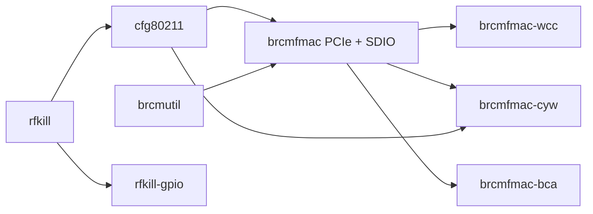

# Módulos Wi-Fi PCIe sem reconstruir o kernel

Em 2026-10-03, o driver Broadcom e suas dependências compilaram como módulos
externos para `7.2.0-iphone6s-dart-serdev1`. Os oito artefatos passaram por
Werror/modpost, ELF AArch64, ABI e dependências; hashes foram recalculados no
Mac. [Evidência selecionada](evidence/n71-wifi-modules.json).

Isso prepara o transporte PCIe/MSGBUF. **Não há Wi-Fi funcionando ainda**:
o host PCI, BARs, interrupções e DART precisam de integração antes de carregar
o driver ou firmware. Nenhum módulo foi instalado ou carregado no aparelho.
Essa etapa não exigiu DFU, PIN ou reinicialização do iPhone.

## Por que o mesmo Image pode ser preservado

A configuração já contém PCI e FW_LOADER incorporados, CFG80211/RFKILL/BRCMUTIL
como módulos e BRCMFMAC com SDIO. A auditoria da fonte fixada encontrou todos
os usos de `CONFIG_BRCMFMAC_PCIE` e `CONFIG_BRCMFMAC_PROTO_MSGBUF` apenas em
`brcmfmac/Makefile`, `bus.h` e `msgbuf.h`. Não há uso em interfaces do kernel
fora desse pacote. O builder exige exatamente essa lista, a configuração e
os hashes do Image/exports preservados.

Os dois recursos são habilitados no Kbuild e por defines que alcançam todas
as unidades do pacote Broadcom copiado. SDIO permanece presente. `.config`,
autoconf do kernel e fonte original não são editados. Isso não é uma licença
para sobrescrever opções de outros drivers: novo escopo ou ABI exige auditoria
e registro próprios.

O [Kbuild documenta a compilação externa](https://docs.kernel.org/kbuild/modules.html)
contra um kernel já construído, com suas configurações e exports. Usamos os
exports reais desse vmlinux e, em sequência, os das dependências. Modpost
permanece fatal para símbolos não resolvidos; não usamos `KBUILD_MODPOST_WARN`.

## Conjunto e dependências



O diagrama mostra dependências de link, não uma sequência autorizada de carga.
Os módulos de fornecedores e rfkill-gpio são produtos do Kbuild preservado;
não implica que todos devam ser usados nessa placa. O match PCI upstream de
14e4:43a3 aponta para WCC e exige classe 02:80. A classe física ainda será
coletada pelo [inventário explícito](N71_LINK_EXPERIMENT.md).

## Reprodução na VM dedicada

Usar a VM ARM64 do [runbook de build](KERNEL-SOURCE-BUILD.md), como usuário
sem privilégios, com as fontes e o output do [bundle](N71_KERNEL_BUNDLE.md).
Não instalar ferramentas no Mac nem executar os módulos na VM. No diretório
da cópia pública do projeto dentro da VM:

```sh
set -eu
umask 077
python3 scripts/build/build-n71-wifi-modules.py \
  --source /home/ubuntu/kernel-n71-bundle-source-20261002 \
  --kernel-output /home/ubuntu/kernel-n71-bundle-build-20261002 \
  --output-dir /home/ubuntu/NOVO-OUTPUT-WIFI
```

O builder recusa saída existente, symlinks, saída dentro da fonte/output,
parent sem ownership ou com escrita de grupo/outros, configuração/hash/ABI
divergentes e usos dos dois símbolos fora do pacote auditado. Copia somente
arquivos rastreados de rfkill, cfg80211 e brcm80211. Compila nessa ordem, com
`ARCH=arm64`, `LOCALVERSION=` explícito, dois jobs e `KCFLAGS=-Werror`.

O gate de espaço desta build de módulos é 1 GiB; o requisito de 8 GiB para
uma build nova de Image permanece no builder original. Não se apagam outputs
anteriores para satisfazer o gate. A saída validada registrada é
`/home/ubuntu/n71-wifi-modules-build-20261003-v2`; o primeiro output foi mantido.

Cada pacote conserva log e Module.symvers. A procedência final registra hashes
de fontes, comandos, módulos e dependências. A validação exige oito módulos,
dependências presentes no conjunto, vermagic exato e símbolos de código
`brcmf_pcie_register` e `brcmf_proto_msgbuf_attach` realmente ligados. O alias
exigido é `pci:v000014E4d000043A3sv*sd*bc02sc80i*`.

A primeira build compilou os pacotes, mas recusou um alias esperado amplo
demais. Confirmamos o filtro de classe na tabela upstream, corrigimos a
validação e executamos a receita completa na saída v2. A tabela e a fonte do
driver não mudaram. Binários e logs ficam em
`runtime/n71-wifi-modules-build-20261003/artifacts/`, privados no Mac.

## Verificação sem aparelho

```sh
python3 -B -m unittest discover -s tests -p test_n71_wifi_modules.py -v
python3 -B tests/run_n71_wifi_modules_mutations.py
```

Oito testes e 13 mutações por asserção passaram no Mac e ARM64. Incluem escopo
das opções, configuração, hashes, ABI, alias e limites de saída/espaço. Na
primeira rodada ARM, a umask criava uma fixture com escrita de grupo e escondia
a mutação do limite da fonte; fixamos modo 700 e repetimos os gates. AST Python
passou; não há type checker Python configurado. O CI executa lint, os testes
e as mutações em Linux/macOS. A compilação ARM64 real está registrada à parte.

## Próximos gates para Wi-Fi real

1. Inventariar classe, BARs brutos e capacidades PCI no próximo boot agrupado.
2. Integrar host PCI com lifetime de alimentação/reset, recursos e cleanup.
   A sondagem de tamanho de BAR escreve configuração: os dados brutos atuais
   não qualificam tamanho ou roteamento.
3. Qualificar IRQ e tradução DART para o endpoint antes de permitir bus-master.
4. Identificar chip/revisão internos e firmware/calibração correspondentes.
5. Carregar o conjunto selecionado, observar interface, scan e associação;
   validar SSH e alimentação sem perder a recuperação.

Preparar adapters e gates offline e atualizar módulos por SSH durante uma
sessão Linux útil. Pedir novo DFU apenas para mudanças que exijam outro boot.
Essas pendências continuam nas issues #9 e #34; nenhuma prova de build fecha
as validações físicas do Wi-Fi ou da alimentação.
