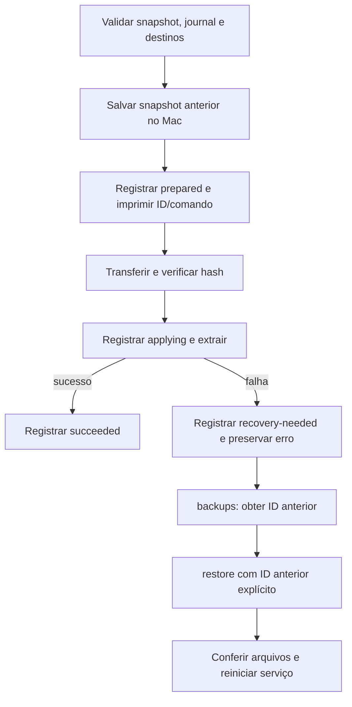

# Recuperação de restauração interrompida — #15

## Contexto

O boot e a restauração em novo boot (#3/#4) passaram; #2 mantém uso prolongado bloqueado. A extração tar atual sobrepõe arquivos diretamente e uma falha pode deixar mistura de versões. A validação de escopo e o snapshot prévio existem, e esta etapa acrescenta um journal explícito antes da aplicação. A falha de limpeza agora é um aviso separado e preserva o erro da extração.

## Arquivos

Fase 1 (até cinco arquivos): `scripts/host/persist.py`, novo `scripts/host/restore_journal.py`, `tests/test_persistence.py`, novo `tests/test_restore_failure_vm.py`, `docs/RECUPERACAO.md`. Fase 2: atualizar PERSISTENCIA/EXECUCAO e evidência sanitizada, revisão e issue.

## Decisão

- Registrar antes de transferir/aplicar o ID do snapshot anterior em journal privado e saída imediata; registrar aplicação, sucesso e necessidade de recuperação. Expor pendências na listagem existente `backups`.
- Recuperar explicitamente por `restore <ID-anterior>`; reclassificar o journal correspondente após aplicação bem-sucedida. Nenhum rollback automático, apagamento de extras ou restauração de identidade SSH.
- Manter extração não transacional com limites explícitos: serviços precisam estar parados/exportados, perda de energia reinicia RAM, mudanças concorrentes e arquivos extras não representam rollback de todo o filesystem.
- Não converter `/root` ou `/srv/data` em links nem exigir cópia dupla completa em RAM. Alternativas: transação por árvore inteira consome RAM e altera diretórios usados por processos; transação arquivo a arquivo ainda exige política para autores concorrentes. Retomar arquitetura transacional somente com contrato de serviços que justifique a mudança.

## Tarefas

- [x] Journal local privado/atômico e publicação do ID anterior antes de mutar arquivos.
- [x] Preservar erro de aplicação quando limpeza remota falha; registrar comando de recuperação.
- [x] Testes reais na VM com BusyBox/Bash em chroot sintético, interrupção de processo e tmpfs de 64KiB causando ENOSPC.
- [x] Conferir conteúdo/modos anteriores recuperados, identidade sintética preservada e journal de recuperação atualizado.
- [x] Documentar caminho de recuperação, RAM insuficiente e consistência de aplicações/bancos.

## Verificação

Testes locais e dois cenários VM; AST Python (sem typechecker configurado), lint nos scripts aplicáveis e diff --check. Mutação que elimina a publicação do ID/journal antes da aplicação deve ser rejeitada. Fixtures e mounts pertencem exclusivamente ao teste e devem ser removidos ao finalizar; VM volta ao estado parado. Não copiar identidades/runtime/snapshots reais para a VM de teste nem executar alterações no iPhone.

## Procedimento de recuperação

Um operador por vez. Antes de backup ou restore, pare os serviços que escrevem em `/root` e `/srv/data`; alternativamente, salve uma exportação consistente do banco em `/srv/data` e faça snapshot dessa exportação. Parar apenas o cliente do banco não garante consistência. O reinício de serviços e a importação do banco são etapas separadas, específicas do serviço.



1. Preserve o ID informado como `Snapshot para recuperação` e o erro original. Em `iphone-linux-tools`, execute `bash scripts/host/iphone-linux.sh backups`. A listagem mostra pendências `prepared`, `applying` ou `recovery-needed`, cada uma com um comando absoluto já protegido para caminhos com espaços.
2. Com Linux acessível e serviços parados, use o comando impresso para restaurar o ID anterior. Substitua o exemplo abaixo pelo ID listado; não use `restore` sem ID, porque ele seleciona o último snapshot manual, que pode ser o que falhou.

```bash
bash scripts/host/iphone-linux.sh restore AAAAMMDDTHHMMSSZ-xxxxxxxx
```

3. A recuperação também salva um novo snapshot do estado parcial antes de aplicar. Após sucesso, o journal cuja referência anterior corresponde ao ID escolhido passa a `recovered`. Confira conteúdo, permissões e a configuração do serviço antes de iniciá-lo.
4. Se falta de RAM/espaço impedir até o novo backup ou upload, preserve os snapshots no Mac. Um novo boot Linux pelo procedimento documentado remove o estado parcial em RAM; restaure explicitamente o ID anterior nessa sessão limpa. O reboot perde alterações ainda não salvas. Não existe restauração enquanto o aparelho está no iOS.

## Limites operacionais

- Recuperação significa sobrepor os arquivos incluídos no snapshot anterior. Arquivos extras continuam presentes, inclusive arquivos novos criados durante a tentativa; não representa retorno exato de toda a árvore. Revise extras específicos do serviço antes de reiniciá-lo. Não há remoção automática nem rollback automático.
- O snapshot prévio e o journal permanecem no Mac. São privados, não criptografados e ignorados pelo Git. Preserve-os enquanto houver pendências. O journal usa escrita temporária, `fsync` e renomeação; isso não converte a extração remota nem o snapshot completo em uma transação resistente a qualquer falha física do Mac.
- Um encerramento abrupto do processo no Mac pode deixar `prepared` ou `applying`; ambos aparecem como pendentes. O estado é conservador: não prova quais arquivos foram aplicados. Journal inválido impede nova restauração antes de operar no telefone; faça uma cópia local e inspecione os registros, sem excluir snapshots para contornar a checagem.
- Falha de metadata após extração informa `Arquivos aplicados, mas atualização do journal falhou`. Falha de limpeza informa aviso e pode deixar um arquivo aleatório `/run/iphone-restore-*.tar.gz` consumindo RAM até o reboot; após extração bem-sucedida esse aviso não invalida os arquivos aplicados.
- A verificação de caminhos pressupõe ausência de autores concorrentes. Não execute dois restauradores ou um serviço que substitua caminhos durante a operação. Identidade SSH, caches, estado de processos e arquivos fora do escopo permanecem excluídos.
- Bancos ativos exigem exportação nativa ou parada consistente antes do snapshot. Um tar de arquivos sendo modificados não é prova de backup recuperável de banco. Nenhum banco foi adicionado nesta etapa.

## Reprodução dos testes

A VM existente já contém Bash, BusyBox estático e Python. Estes testes exigem Linux/root e `IPHONE_RESTORE_VM_TESTS=1`; no macOS são explicitamente ignorados. Não executá-los em um servidor de produção. Só fontes públicas são transferidas; nenhum snapshot ou chave real é usado.

```bash
multipass start iphone6s-build
multipass exec iphone6s-build -- mkdir -p /tmp/iphone6s-restore-validation/scripts/host /tmp/iphone6s-restore-validation/tests
multipass transfer iphone-linux-tools/scripts/host/persist.py iphone-linux-tools/scripts/host/restore_journal.py iphone6s-build:/tmp/iphone6s-restore-validation/scripts/host/
multipass transfer iphone-linux-tools/tests/test_restore_failure_vm.py iphone-linux-tools/tests/run_restore_mutations.py iphone6s-build:/tmp/iphone6s-restore-validation/tests/
multipass exec iphone6s-build -- sudo env IPHONE_RESTORE_VM_TESTS=1 python3 -m unittest discover -s /tmp/iphone6s-restore-validation/tests -p test_restore_failure_vm.py -v
multipass exec iphone6s-build -- sudo env IPHONE_RESTORE_VM_TESTS=1 python3 /tmp/iphone6s-restore-validation/tests/run_restore_mutations.py
```

O fixture cria um chroot próprio com os binários existentes; o transporte SSH é substituído por execução nesse chroot. As funções de snapshot/restore não são simuladas. Um cenário monta tmpfs de 64 KiB somente no `/srv/data` sintético. O outro interrompe o grupo de processos da extração real após o primeiro arquivo mudar e força falha de cleanup. Teardown desmonta o tmpfs e remove os fixtures próprios. O runner de mutações copia somente fontes/teste para diretórios descartáveis, sem alterar os originais.

Após os testes, confirme ausência de fixtures/mounts `iphone-restore-test-*` e `iphone-restore-mutation-*`; remova apenas o diretório público de teste criado acima e devolva a VM ao estado anterior. Nesta execução ela estava parada e voltou a parada. Não pare outras VMs. As fontes transferidas podem ser recriadas a qualquer momento pelos comandos acima.

## Encerramento da etapa — 2026-09-30

Fonte: plano deste documento e [issue #15](https://github.com/djalmajr/iphone6s-linux/issues/15). Modo: encerramento da etapa; backlog geral ainda pendente. O controle do goal nesta rodada informou `blocked`; houve progresso independente em #15, sem alterar esse estado controlado pelo operador.

**Entregue:** journal privado antes do upload, recuperação explícita, erros preservados, limites de atomicidade/DB documentados e teste reproduzível com dados sintéticos. **Arquivos:** dois módulos host, dois testes de persistência/falha, runner de mutações, PERSISTENCIA/EXECUCAO e evidência. **Mudança de escopo:** runner versionado acrescentado para reproduzir as mutações; nenhum novo comportamento no telefone.

| Verificação | Resultado |
|---|---|
| Testes locais | 17 passaram; 2 exclusivos da VM foram ignorados no Mac |
| Dependência real | 2/2 cenários BusyBox 1.36.1 / Ubuntu ARM64 passaram |
| Mutação | Remover journal pré-upload e ignorar erros remotos: ambas rejeitadas |
| Lint | Pyflakes e Flake8 fatal nos Python alterados; diff --check sem erros |
| Tipos | Nenhum typechecker configurado; AST é apenas sintaxe |
| Revisão | Revisão independente estática, ajustes aplicados, sem achado bloqueador restante |
| Docs | Procedimento, limites e [evidência sanitizada](evidence/restore-failure-check.txt) registrados |
| Banco e dependências | Nenhum banco nem pacote instalado |
| Desempenho | Journal exige pequenas escritas locais sincronizadas; restore continua limitado pela RAM |

O fixture inicialmente falhou por perder a permissão de execução do carregador Bash ao copiar bibliotecas. A cópia passou a preservar modos e os dois cenários reais passaram; isso não foi falha do restaurador. Os gates do wrapper/power já aprovados foram reutilizados onde não houve alterações relevantes.

**Riscos:** overlay não transacional, arquivos extras preservados, autores concorrentes sem suporte e dados pós-snapshot perdidos no reboot. A alimentação (#2) segue sem prova de carga sustentada, mantendo #8 dependente. Próximo desenvolvimento: snapshots automáticos e retenção (#5). Merge em main continua aguardando autorização específica.
